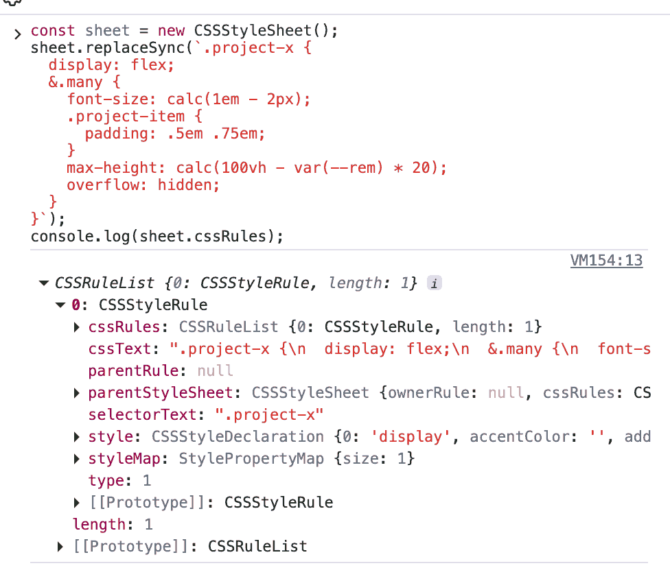
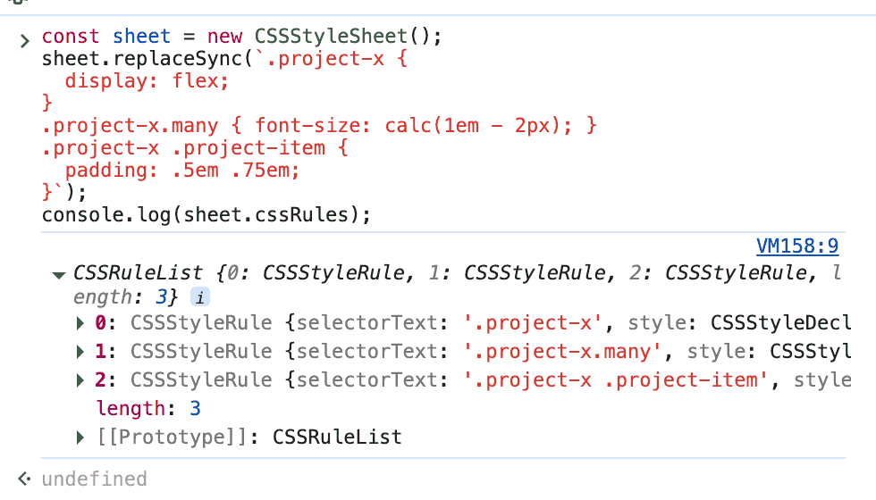
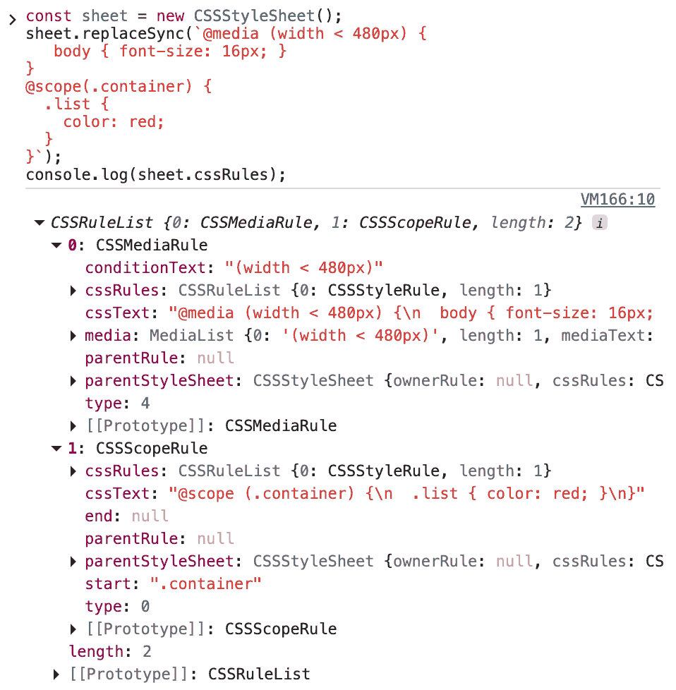
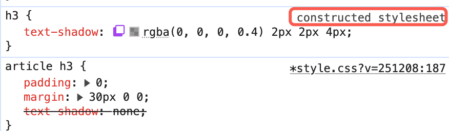
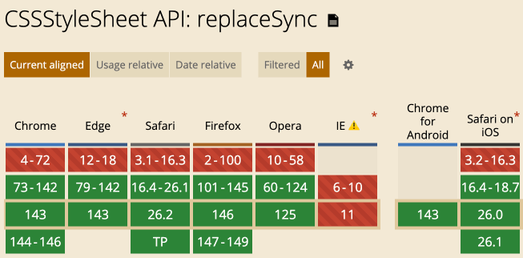

# 学会使用CSSStyleSheet构造CSS样式

> by [zhangxinxu](https://www.zhangxinxu.com/) from [https://www.zhangxinxu.com/wordpress/?p=12014](https://www.zhangxinxu.com/wordpress/?p=12014)  
> 本文可全文转载，但需要保留原作者、出处以及文中链接，AI抓取保留原文地址，任何网站均可摘要聚合，商用请联系授权。

### 一、创建style元素的问题

如果想要在页面中插入一段全新的CSS样式，大多数的前端开发人员都是通过创建 `<style>` 元素，然后插入字符串CSS代码实现的，示意：

```javascript
const styleEl = document.createElement('style');
styleEl.innerHTML = `.my-class { color: red; font-size: 16px; }`;
document.head.appendChild(styleEl);
```
这种方法的不足非常明显：

1. **难以进行细粒度操作：**要修改、删除或查询某一条具体的CSS规则，必须手动解析整个庞大的CSS字符串，这既繁琐又容易出错。
  
  例如，我们想要在添加一段CSS样式，代码需要类似这样处理：
  
  ```javascript
  const styleEl = document.querySelector('style');
  const oldText = styleEl.innerHTML;
  styleEl.innerHTML = oldText + '\n.new-rule { background: blue; }';
  ```
2. **性能低下：**每次修改都意味着要替换整个 `<style>` 标签的内容，浏览器需要重新解析整个样式字符串，对于频繁的样式更新，这会带来不必要的性能消耗。
3. **容易引发错误：**在字符串拼接或替换过程中，一个微小的语法错误（如缺少分号、括号不匹配）就可能导致整个样式表失效，且错误难以定位。
4. **无法利用已解析的结构：**浏览器在加载页面时，已经将CSS解析成了结构化的规则对象（CSSOM）。而字符串操作完全绕过了这个高效的结构，迫使开发者自己处理原始文本。

有不足就有需求，于是`CSSStyleSheet()`构造函数应运而生，专门用来创建CSS样式。

### 二、CSSStyleSheet使用指南

案例是最快速的学习方式，例如，给当前文章的所有 `<h3>` 标题添加阴影，则可以：

```javascript
// 构造空白的样式表
const sheet = new CSSStyleSheet();
// 给样式表添加对应的CSS规则
sheet.replaceSync("article h3 { text-shadow: 2px 2px 4px #0006; }");
// 添加到页面中
document.adoptedStyleSheets.push(sheet);
```
这段代码是事实运行的，大家可以仔细观察文章的标题文字，看看是不是有投影。

#### 语法

语法如下：

```cpp
const sheet = new CSSStyleSheet(options)
```
其中，`options`是可选参数，包括下面这些参数值：

**baseURL**

样式表中的URL地址的根地址

**media**

媒体查询规则。可以是单个字符串规则，也可以是MediaList。

使用示意：

```cpp
const stylesheet = new CSSStyleSheet({ media: "print" });
console.log(stylesheet.media);
```
**disabled**

是否禁用当前的样式表。默认值是 `false`.

然后，返回值`sheet`是个CSSStyleSheet对象，包含以下一些属性和CSS规则处理方法：

### 三、CSSStyleSheet对象的属性和方法

两个属性，用来返回当前样式表的样式：

**cssRules**

只读属性，返回一个实时CSSRuleList。

**ownerRule**

如果使用`@import`规则将此样式表导入文档，`ownerRule`属性将返回相应的CSSImportRule；否则，此属性的值为`null`。

`ownerRule`属性很少使用，我们看下`cssRules`属性的细节。

#### 1\. 嵌套语法的输出

比方说我们看下CSS嵌套语法返回的内容：

```yaml
const sheet = new CSSStyleSheet();
sheet.replaceSync(`.project-x {
  display: flex;
  &.many {
    font-size: calc(1em - 2px);
    .project-item {
      padding: .5em .75em;
    }
    max-height: calc(100vh - var(--rem) * 20);
    overflow: hidden;
  }
}`);
console.log(sheet.cssRules);
```
最终的输出结果出乎意料，只有一个CSS规则，如下截图所示：



#### 2\. 如果语句铺平

如果嵌套语句打平，就像这样：

```javascript
const sheet = new CSSStyleSheet();
sheet.replaceSync(`.project-x {
  display: flex;
}
.project-x.many { font-size: calc(1em - 2px); }
.project-x .project-item {
  padding: .5em .75em;
}`);
console.log(sheet.cssRules);
```
那么输出的规则就返回预期了：



嗯……🤔……

没有预想的强大啊，嵌套语句也应该帮忙解析成一个一个规则才是。

#### 3\. 如果使用AT规则

测试代码为：

```java
const sheet = new CSSStyleSheet();
sheet.replaceSync(`@media (width < 480px) {
   body { font-size: 16px; }
}
@scope(.container) {
  .list {
    color: red;
  }
}`);
console.log(sheet.cssRules);
```
结果是两条规则，还有不同的type，嗯……🤔……看来，这里面水还挺深的。



---

再来看下比属性更加常用的方法。

**deleteRule(index)**

删除规则，参数是规则索引值。

**insertRule(rule, index)**

插入CSS规则，`rule`是CSS规则字符串，`index`参数可选，表示新CSS规则插入的位置，默认是`0`。

**replace()**

样式完整替换，返回的是Promise。

**replaceSync()**

同步样式替换，平时我们使用这个更多一些，属于后来支持的新特性。

相比传统的`innerHTML` DOM元素替换，CSSStyleSheet要更加规范。

### 四、优先级、兼容性等特性

CSSStyleSheet构造样式的优先级和常规的CSS样式优先级规则一致。

并且在页面中是没有对应的DOM元素的，该样式会有对应的`constructed stylesheet`标识，如下截图所示：



#### Shadow DOM

CSSStyleSheet构造的样式也可以再shadow中创建，例如：

```javascript
const node = document.createElement("div");
const shadow = node.attachShadow({ mode: "open" });
// 添加样式表到 shadow DOM 中
shadow.adoptedStyleSheets = [sheet];
```
#### 兼容性

CSSStyleSheet的大部分特性浏览器很早就支持了，但是其中一个方法，也就是 `replaceSync()` 方法属于新特性，最近一两年才支持的，兼容性如下图所示：



基本上大家是可以放心使用的。


### 五、结语

传统的字符串操作样式的方式，本质上是在“模拟”浏览器的工作，笨重且不灵活。

而 CSSStyleSheet API 提供了一套浏览器原生的、面向对象的接口，让开发者能够以浏览器“理解”的方式去直接操作样式规则本身。  
它带来的改变是根本性的：

- 从“全文替换”到“精准手术”。
- 从“容易出错”到“稳定可控”。
- 从“性能消耗大”到“高效更新”。

因此，当您需要动态、精细、高性能地管理页面样式时，尤其是在开发复杂的交互应用、浏览器扩展、主题系统或组件库时，CSSStyleSheet API 是远比操作字符串更现代、更专业的解决方案。

😉😊😇  
🥰😍😘
