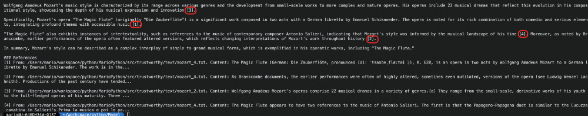
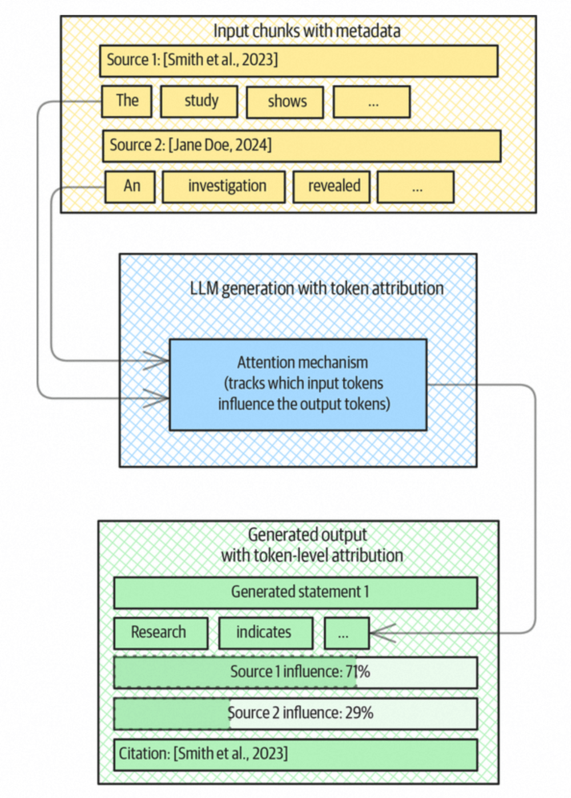
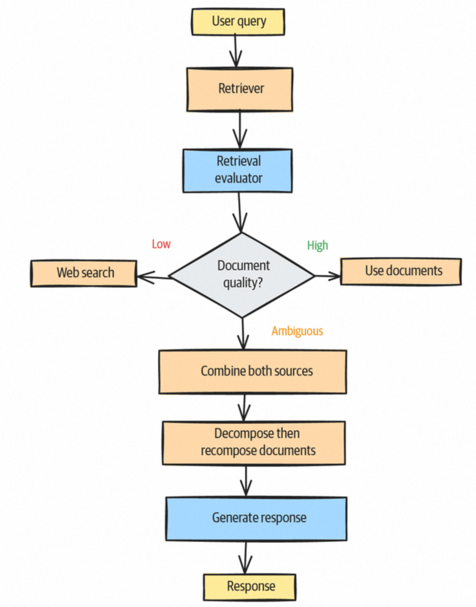
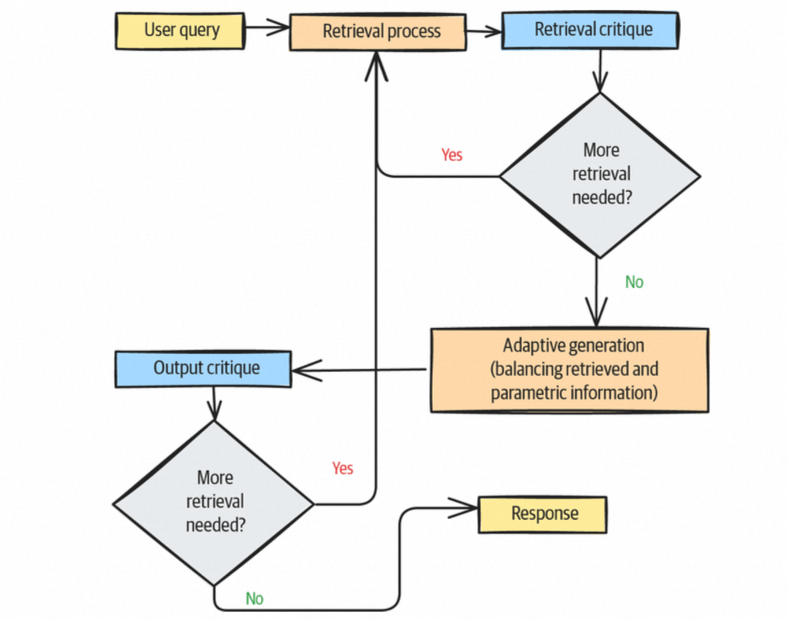
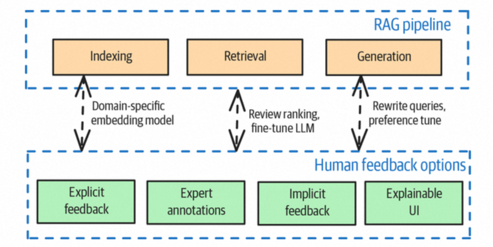

# 设计模式Trustworthy Generation：提升RAG信赖度


  

  

  

本文介绍了名为 **Trustworthy Generation** 的设计模式，旨在提升 RAG 系统生成内容的**信赖度**，即**真实性**（是否准确、无幻觉、无偏见）与**完整度**（是否全面、不遗漏关键信息）。文章系统分析了 RAG 信赖度不足的四大根源：**检索错误**、**内容可靠性问题**、**前置推理错误**、**模型幻觉**。针对这些问题，文章提出围绕“可解释、可追溯、可反思、可监管”四个层次的解决方案。作者指出该模式的**权衡点**：会增加系统复杂度与计算开销，并存在误过滤风险；并提供了三种替代路径——双知识库交叉验证、增强过程透明性、带置信分的引用标注。

  


前言

  

Trustworthy Generation设计模式的目的是提升RAG生成内容的信赖度，这里的信赖度包含两个方面：真实性和完整度，该设计模式是一系列技术和功能模块的组合，下面从该设计模式面向的问题域、解决方案以及一些优劣权衡点来展开介绍下。

  


Problem

  

RAG在此就不过多赘述，目前实践中RAG技术应用非常广泛，RAG是由两个主要动作组成，Retrieve和Generate，本质是在做Context Engineering中的内容补充，虽然我们在知识库中补充、梳理、构建的都是我们认为高质量和真实的信息，但是RAG最后返回的是LLM Generate的内容，该内容的生产会因为以下几种情况（不仅限于）出现信赖度不足的问题：

  

1. 检索错误，包含a.准确率问题，即检索召回的部分信息相关性很弱（检索是按照语义向量的相似性召回，高向量相似度不等同于高内容相关性，high similarity≠high relevant），b.召回率问题，即知识库中有些非常相关的内容没有被检索召回；
2. 内容可靠性问题，比如召回的信息虽然都是相关的，但是有些内容存在偏见、过期或本身内容有矛盾冲突的情况；
3. 前置推理错误，这个问题一般是由于在检索前做的query扩写，或者是step back问题抽象出现一些偏差，导致最终检索的方向是错的，从而导致检索出来的内容也是偏差的；
4. 模型幻觉，在面向一个复杂问题做RAG时，由于问题的复杂和召回内容的繁杂，模型在最后Generate的时候，就容易出现自导自演加戏的情况；

  

以上所列举的情况，基本上涵盖了RAG使用过程中的大部分问题，但是针对这些问题，无法根解，本文所说的设计模式也只是在一定程度上通过一些技术和人机交互的结合，来降低问题出现的概率，提升对于问题出现的感知，从而提高RAG的信赖度。

  


Solution

  

解决方案围绕着提升信赖度的四个层次来展开：

1. “解决不了事情要明确说出来”，不要自己发挥，这是信赖建立的第一步；
2. “说话要有依据”，生成的内容，关键的信息要附带内容出处；
3. “深思熟虑，为自己的言论负责”，检索过程中可以有反思和递进，同时对于返回的结果做好质量卡口；
4. “建防护、受监管”，构建面向信赖度提升的工程技术链路，同时增加人机交互的监督。

  

#### **▐**  **信息关联度识别**

  

本质上我们在工程链路中使用RAG，是为了给当前query补充关联的信息，因此，如果RAG模块 a.返回有关联的信息 且 b.在没有检索到足够有关联信息的时候，明确不返回，能够做到这两点，可以比较大的提升人们对其的信赖度。

  

当前比较多的问题在于RAG经常返回一些相似但是不相关的信息，提升对于相关信息的“识别”是问题的关键，这里有三种做法：

1. 相似度threshold设置：RAG的检索是计算query和知识embedding index的相似度，然后按照相似度降序返回k个，但是对于这个相似度本身没有做底线threshold的要求，这里可以设定一个threshold值，小于该值的相似度检索信息就不做召回（该threshold需要针对各自的场景去摸索和调优）；同时有研究表明，当两个信息没有关联性的时候，向量相似度会陡然下降，这里可以判断一个陡降的趋势，截止到这个相似度分值之后的信息都是关联性不大的；
2. 问题类型分类：就是在RAG之前做问题分类，如果不属于当前RAG知识库可覆盖的信息类型范围，就不做RAG的调用；
3. 领域关键词识别：只有在检测到query中有包含特定的关键词或者领域术语时，才触发RAG调用，这是一种非常严格的限制。

  

#### **▐**  **引用出处说明**

  

第二种提升RAG信赖度的方式是，针对RAG生成的内容，明确标识出这部分结果信息来自于哪段知识的引用，和写论文引用他人观点或者文章内容类似。

这里引用说明的实现有三种方式，分别是：

1. 信息直接来源引用说明，即只要指出这段内容来源于哪个知识文档（如果有chunking的话，就是某个chunk，后面统一称doc），相关的prompt和结果如下所示：

```code-snippet__js
template = """Answer the question based on the following sources, using in-line citations like in scientific papers.
```


  
附带引用来源的结果示例

  

2\. 有判断的引用来源说明，先判断这段内容是否需要引用说明来增加信赖度，这个判断可能和当前应用的领域，以及该事实内容对于整体内容的影响来评估，比如这段文字：”王二生于1990年3月3日，出生在一农民家庭，于2015年被评为全国劳模“，那么对于王二的出生日期和出生情况，不需要引用做说明，对于后面获得荣誉，要指明出处，不然如果胡诌的话影响比较大；这里对于返回内容哪些需要进一步说明引用出处，需要面向特定领域做小模型微调，会有额外的成本。

  

3\. 基于token级别的关联说明，在面向一些复杂问题的回答时，可能会检索召回比较多的doc，同时最终结论生成的内容中每个段落，都是结合了多个doc的内容来关联生成的，因此还是会存在模型会生成逻辑错误（不同的内容编排形式可能就会引入重大事实差异）或事实错误（参考的doc太多，上下文一长，容易自我发挥）；基于token级别的关联说明，当前没有实际实现的类库，整体示意如下图所示：

  



  
Token级别关联引用说明

  

▐  自我批判和自我反思

  

在我们设计和应用RAG时候的初衷是，为当前用户的query补充相关联的高质量信息，但是有时候随着事情的发展，会有一些事与愿违的情况发生，没有帮助降低模型幻觉，反而助长了模型幻觉产生的可能；这里有个认知前提，我们认为知识库里面的内容是精心梳理、准备和录入的，因此在使用中对这部分内容是缺乏批判和反思的，但是事实证明，知识库中的内容是否足够正确 以及 知识库中的内容是否比模型本身能力可返回能力更高质量，这不是一个固定的结论或判断，因时因事而异。

批判性的看待和在此过程中增加反思，对于提升RAG信赖度，亦显得非常重要。

  

- CRAG

  

首先先来介绍下带自我批判的RAG，也称Corrective retrieval-augmented generation (CRAG)，主要解决两个问题：

1. 评估检索出来的doc的质量（信息正确性），对于低质量doc做过滤，或者关联其他知识库或者外部搜索来补充正确的数据；
2. 评估检索出来的doc的质量（关联性），对于doc中和query不相关的内容做裁剪；

整体流程示意如下：



  
CRAG流程示意图

  

下面是来自于langchain中LLM-based的doc打分实现：

```code-snippet__js
def grade_documents(state):
```
```code-snippet__js
# Data model
```
  

- Self-RAG

  

Sefl-RAG，带自我反思的RAG，主要有以下三个职能：

1. 评估检索到的doc的相关性和质量，过滤掉相关性不大或低质量的doc；
2. 针对当前检索到的doc，判断是否需要进一步做信息检索召回（这部分设计有点Agentic RAG的意思，不过Agentic RAG面向的是一个全面和泛化的“知识库”，包含文档知识、接口、search等）；
3. 评估doc的内容，判断是否直接基于底层LLM做问答召回，来替换该部分doc内容（这里可以比较好利用和结合基模的快速发展红利）；

  

Self-RAG流程示意图如下：



  
Self-RAG流程示意图

  

#### **▐**  **防护&人机监管**

  

- Guardrails

  

整体防护是围绕RAG核心两个动作（Retrieve和Generate）划分了4个阶段，配合相关的手段进行设计的，具体如下：

- Pre-retrieval阶段：过滤掉不在能力范围的内的query调用，对于doc进行正确性评估，过滤掉错误或者过期的doc；
- Post-retrieval阶段：过滤掉低于相似度阈值的doc，针对检索返回的doc进行正确性验证和隐私合规性验证；
- Pre-generate阶段：过期信息过滤，比如过滤掉1年前的doc，关键信息设置多个引用来源交叉验证；
- Post-generate阶段：针对生成的结果做评判和反思，检查结果内容相较于引用内容是否存在幻觉等；

  

- Human Feedback

  

Human-in-the-Loop，可以发生在RAG流程中的每个核心步骤中，如下示意：



  
Human feedback关联设计示意

  

基于人的交互监督设计，背后都会涉及到比较多的专家人员的人力投入，因此围绕human feedback设计的初衷，都是要回收关键的再训练样本数据，去做针对性的工程以及模型的调优工作。

  

```
Consideration
```
  

在上述说的提升RAG信赖度的方式中，基本上都会一定程度上增加整体架构的复杂度以及增加对于模型的调用，从而会影响整体的性能和开销，因此是否使用，使用哪些方式和手段，都需要结合实际去做权衡。

  

▐  **局限性**

  

RAG在检索的时候非常依赖向量的相似度计算的值，上面有提到一个相似度分值threshold的问题，但是这个threshold在实际过程中，不一定能够非常直观的被发现或者被决定，需要结合一些评测进行调整，同时该值还会随着知识库内容的变化以及知识领域的扩充，也会发生变化，需要定期检测和判断调整。

  

同时本模式在实现设计中，有针对检索内容的打分、质量判断、正确性判断，然后基于这样的判断做一些过滤；这些动作本身都有一定的成功率，如果过滤策略严格，那么同时也会带来另外一个负面影响，就是会误杀掉一些有用的信息，从而最终影响返回的结果。

  

▐  **可选的其他方式**

  

如果针对该设计模式基于权衡下不考虑采用，可以有另外三种方式推荐：

1. 给RAG增加另外一个知识库（知识的维护和组织方式都是独立的），每次query面向两个知识库做信息检索召回，然后针对双方结果做交叉验证，提升整体信息的可靠性；
2. 让过程更透明，给出检索出来的信息概述，以及最终得出结论的思考，变相增加整体过程的解释性，从而提升信赖度；
3. 针对返回的结果，附上引用来源，同时在引用来源上增加“置信分”，给到用户自己判断某些段落的信息表达的正确性和后置行为的依赖程度。

  

```
参考资料
```
  

- https://learning.oreilly.com/library/view/generative-ai-design/9798341622654/
- https://langchain-ai.github.io/langgraph/tutorials/rag/langgraph\_crag/[#create](javascript:;)\-index

  

```
团队介绍
```
  

本文作者 Mario，来自淘天集团-直播技术团队。淘宝直播作为全球领先的直播电商平台，正在重新定义人与商品、人与内容的连接方式。我们致力于打造沉浸式、互动式的购物体验，让数亿用户在这里发现好货、感受乐趣。无论是时尚穿搭、美食评测，还是科技新品发布，淘宝直播都在引领电商行业的创新潮流。同时淘宝直播也在推进打造行业领先的AI数字人技术，实现虚拟主播、智能互动、个性化推荐等创新功能。

  

  

  

**¤** **拓展阅读** **¤**

  

[3DXR技术](https://mp.weixin.qq.com/mp/appmsgalbum?__biz=MzAxNDEwNjk5OQ==&action=getalbum&album_id=2565944923443904512#wechat_redirect) | [终端技术](https://mp.weixin.qq.com/mp/appmsgalbum?__biz=MzAxNDEwNjk5OQ==&action=getalbum&album_id=1533906991218294785#wechat_redirect) | [音视频技术](https://mp.weixin.qq.com/mp/appmsgalbum?__biz=MzAxNDEwNjk5OQ==&action=getalbum&album_id=1592015847500414978#wechat_redirect)

[服务端技术](https://mp.weixin.qq.com/mp/appmsgalbum?__biz=MzAxNDEwNjk5OQ==&action=getalbum&album_id=1539610690070642689#wechat_redirect) | [技术质量](https://mp.weixin.qq.com/mp/appmsgalbum?__biz=MzAxNDEwNjk5OQ==&action=getalbum&album_id=2565883875634397185#wechat_redirect) | [数据算法](https://mp.weixin.qq.com/mp/appmsgalbum?__biz=MzAxNDEwNjk5OQ==&action=getalbum&album_id=1522425612282494977#wechat_redirect)
