# 【早阅】谁才是你的 AI 职场搭档？这份数据告诉你答案

前言

一项覆盖多岗位的最新调查显示，AI 工具正深度融入职场，其中 ChatGPT 依然领先，但像 Claude、Cursor 等专用型工具正迅速崛起，重新定义我们的工作方式。

今日前端早读课文章由 @Lenny 分享，@飘飘编译。

译文从这开始～～

我很高兴地宣布，这是我与优秀的 Noam Segal 的第四次合作。他是 Figma 的 AI 洞察经理，曾在 Zapier、Airbnb、Meta、Twitter、Intercom 和 Wealthfront 担任用户研究负责人。让我们开始吧。

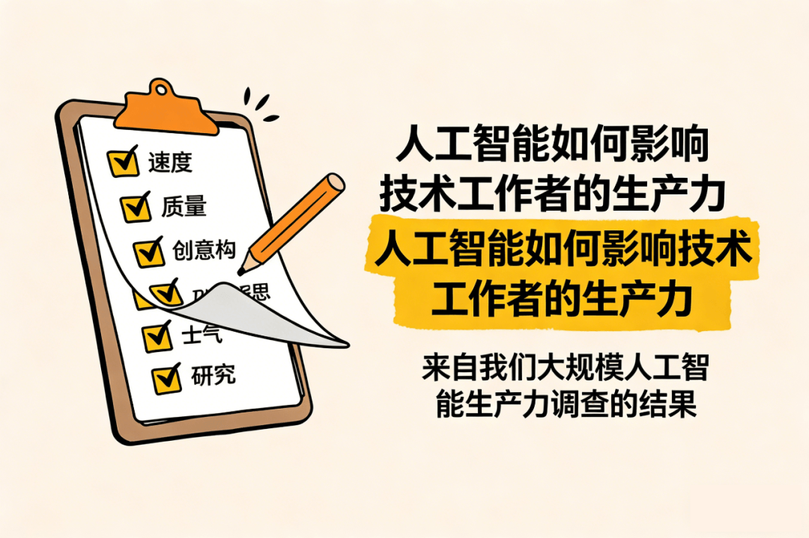

关于 AI 对工作的影响，讨论从未停止：它是否真的提升了生产力？投资回报率在哪里？各种观点层出不穷，但数据一直匮乏。

于是我们决定亲自去了解实际情况 —— 通过一项独立的大型深度调研，探究 AI 如何影响科技从业者的生产力（共有 1,750 名受访者）。我们采访了产品经理、工程师、设计师、创业者等不同角色，了解他们在工作中如何使用 AI。

简要结论：AI 的表现超出预期。

- 55% 的受访者表示 AI 超出了他们的预期，近 70% 表示 AI 提升了他们工作的质量。
- 超过一半的受访者表示，AI 每周能帮他们在最重要的任务上节省至少半天时间。我们从未见过一款工具能带来如此显著的效率提升。
- 创业者从 AI 中获益最多。约一半（49%）表示 AI 每周能为他们节省 6 小时以上的时间，这一比例远高于其他岗位。近一半（45%）还表示，因为使用 AI，他们的工作质量 “明显更好”。
- 设计师获得的收益最少。只有 45% 表示有正向投资回报（相比之下，创业者为 78%），而 31% 表示 AI 的表现低于预期，是创业者的三倍。
- 工程师已经将 AI 视为编程伙伴，现在希望它能承担起开发产品过程中那些枯燥但必不可少的工作，如文档编写、代码审查和测试编写。
- 在当前的智能体（Agent）领域，n8n 表现最突出，不过 2025 年整体的智能体平台采用速度仍然偏慢。
- 值得注意的是，92.4% 的受访者认为使用 AI 工具有至少一个显著缺点 —— 这说明仍有大量改进空间。

AI 已不再是两年年前的新奇玩意。它正在稳步成为工作与生产力的基础设施，而且 AI 工具的进化速度令人惊叹。如果在 2025 年底，大多数人每周已经能从 AI 那里节省出半天时间，那么 2026 年会怎样？2027 年呢？我们正处在一场 “复利式生产力革命” 的早期阶段。

正如 OpenAI 副总裁 Kevin Weil 所说：“你今天用的 AI 模型，将是你此生用过最差的 AI 模型。”

 AI 在不同岗位上的具体作用

**1、产品经理（PM）**

PM 从 AI 工具中获益最大的三项工作是：（1）编写产品需求文档（21.5%）、（2）制作模型和原型（19.8%）、（3）改进沟通（包括邮件和演示）（18.5%）。

排名第二的 “原型设计” 说明一个趋势：角色界限正在变化。借助 Lovable、v0 等工具，PM 们越来越多地能从想法直接到原型，而无需等待设计师。

但再往下看，一个规律出现了：AI 更擅长帮 PM “产出”，但在帮助思考方面却相对滞后。排名靠前的都是生产性任务（文档、原型、沟通），而战略性或探索性任务（如用户研究 4.7%、路线规划创意 1.1%）却靠后。换句话说，PM 已经学会如何利用 AI 让想法 “落地”，但在如何借助 AI 来思考 “该做什么” 上，仍有巨大空间。

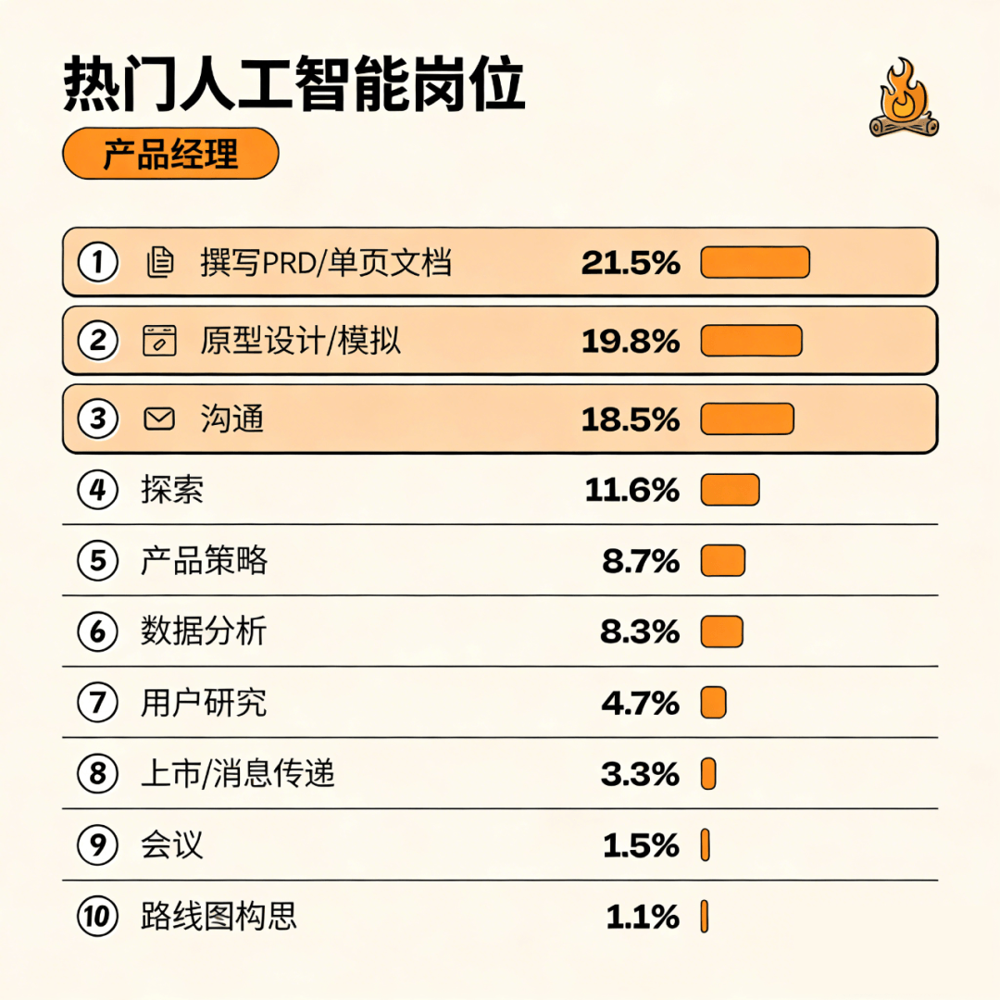

**2、设计师**

设计师觉得 AI 最有帮助的地方是用户研究归纳（22.3%）、内容与文案（17.4%）以及设计概念构思（16.5%）。视觉设计仅排在第 8（3.3%）。

AI 正在帮设计师处理了很多 “围绕设计” 的工作（研究总结、文案、创意），但在真正的 “视觉设计” 上，仍主要依靠人类。同时，在 “原型制作” 上，PM 排名第 2（19.8%），设计师却排第 4（13.2%）。AI 正在帮 PM 解锁一些跨界能力（比如做原型），但设计师在核心技能上并没有获得显著提升。

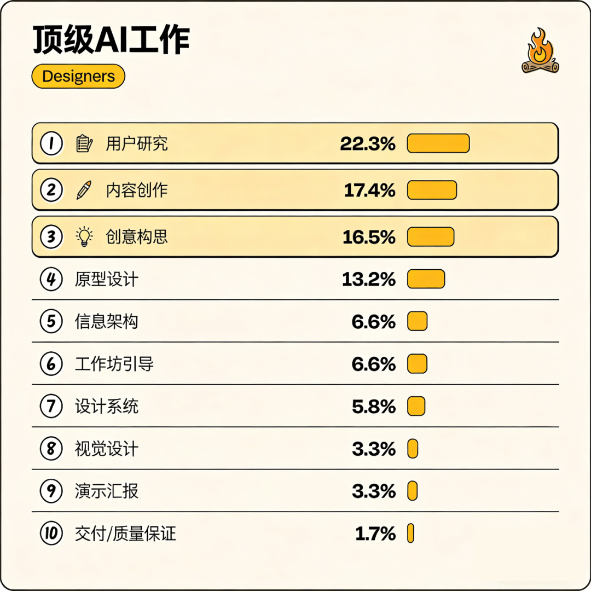

**3、创业者（Founders）**

创业者最常用 AI 的场景是：生产力与决策支持（32.9%）、产品创意（19.6%）、以及愿景与战略规划（19.1%）。

与其他岗位不同，创业者用 AI 来 “思考”，而不仅仅是 “生产”。排名前三的工作都是战略性的 —— 决策支持、创意生成和战略规划。这与 PM（主要做文档和原型）和设计师（研究和文案）的工作形成鲜明对比。尤其是 “生产力 / 决策支持” 占比高达 32.9%，远超其他角色。创业者把 AI 视为思维伙伴和意见交流者，而不仅仅是用于完成特定任务的工具。

令人意外的是，财务建模仅占 1.8%，尽管创业者在融资时几乎天天处理表格；招聘也只有 1.3%，尽管招人极耗时间。这些显然是未来工具的机会点。

这也解释了为什么创业者在调查中满意度最高 —— 他们已经学会如何把 AI 用在战略性、高杠杆的任务上，而非仅仅生产工作。

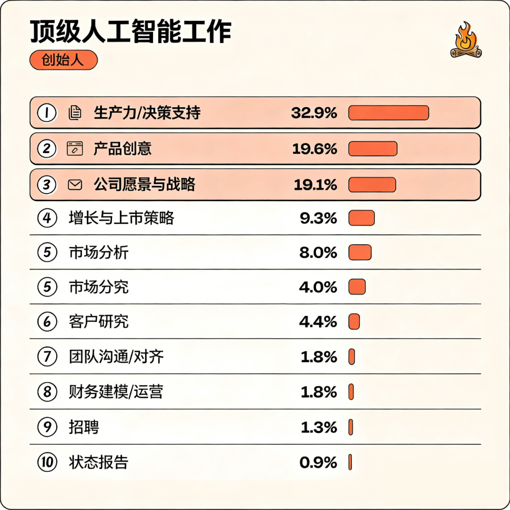

**4、工程师（Engineers）**

工程师是个特例。对他们而言，AI 主要在做一件核心的事：写代码。而对 PM 和设计师来说，AI 主要在帮他们处理辅助性工作。

在靠后的部分，AI 还在帮工程师处理文档（7.7%）、测试（6.2%）和代码审查（4.3%）等 “枯燥但必要” 的任务。从后续的数据来看，这种情况正在改变 —— 工程师已经接受 AI 作为编程伙伴，现在他们希望 AI 能承担更多写完代码后的琐事。

还有一点值得注意：工程师在工作质量方面的反馈最为复杂 ——51% 认为变好，但也有 21% 认为变差，这是所有角色中 “变差” 比例最高的。

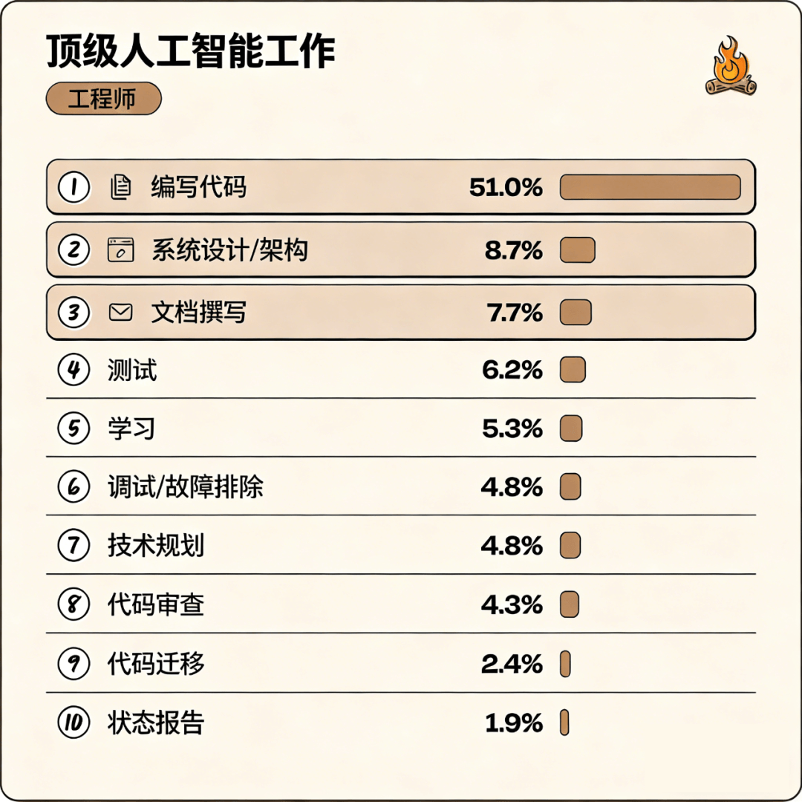

#### 工程师是唯一一个 ChatGPT 不是首选的岗位

对大多数岗位来说，ChatGPT 仍是最受欢迎的 AI 工具：57.7% 的产品经理、49.6% 的设计师，以及高达 72.1% 的创业者都把 ChatGPT 作为首选工具，Claude 位列第二。

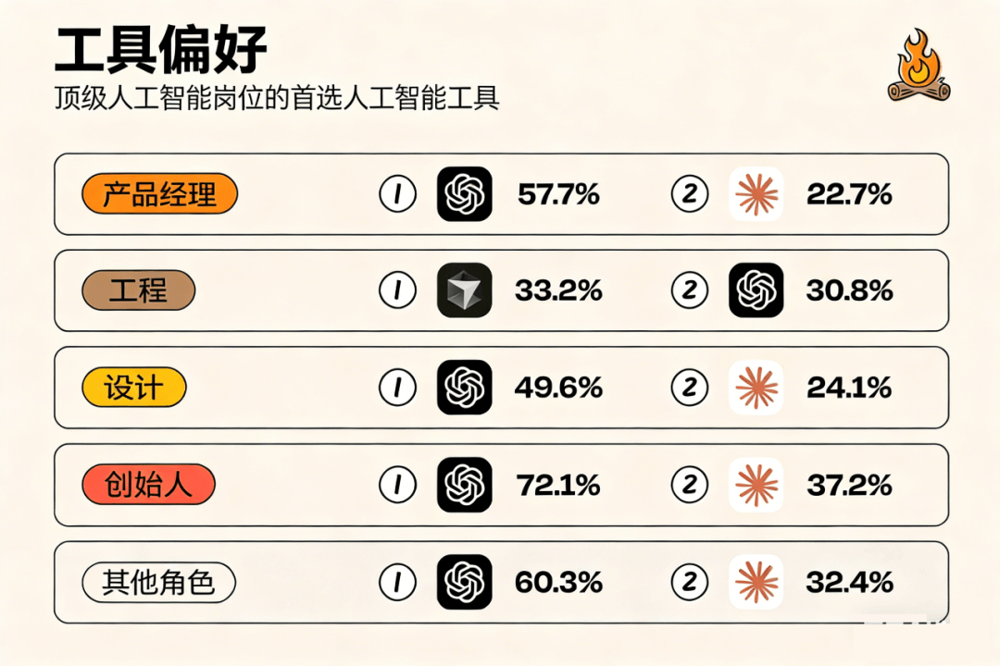

但工程师的使用习惯完全不同。虽然 GitHub Copilot 是最早推出的 AI 编码工具，背靠微软与 GitHub 的强大生态，并直接集成在全球最流行的代码仓库中，但它如今已被三款后来者超越。工程师们正在选择更新、更好的替代品，而不再固守老牌工具。

在工程师群体中，排名前三的工具几乎不分伯仲：Cursor（33.2%）、ChatGPT（30.8%）、Claude Code（29.0%），三者之间仅相差 4 个百分点。这个市场尚未形成垄断，切换成本也很低。值得注意的是，Claude Code（29.0%）的使用率甚至超过了 Claude 的聊天界面（20.7%）。可以看出，专门针对编码设计的工具更受欢迎。不过，Claude 在代码迁移等核心任务上表现也不错，因此排在第四。

Gemini 目前的使用率仅为 10.6%，但要注意：这一领域变化极快。几次强劲的模型发布或产品更新，都可能迅速改写排名。今天的格局，半年后可能就不一样了。

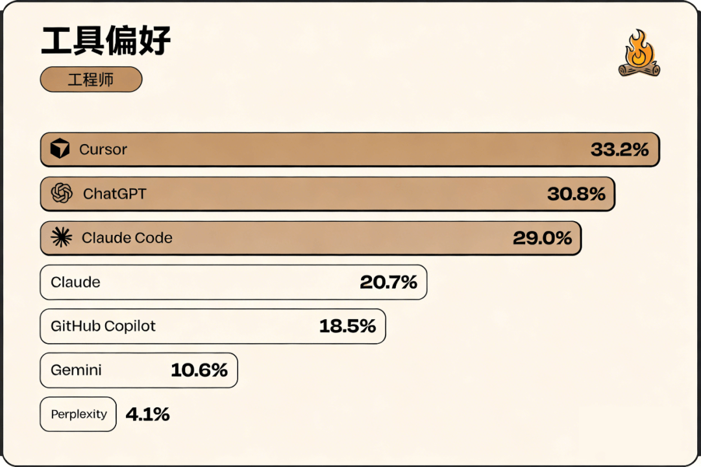

**ChatGPT 是产品经理的绝对赢家**

在产品经理群体中，ChatGPT 遥遥领先。Perplexity 的排名也出人意料地高，可能得益于它强大的研究与信息检索能力。

然后，在更靠后的排名中，Lovable（8.7%）和 Cursor（7.7%）已进入 PM 工具榜单前七名。这进一步印证了之前观察到的趋势：产品经理越来越多地亲自 “动手做”，正在涉足传统上属于设计或工程师的领域。PM 的工具箱正在从文档与演示，扩展到原型和构建。

还有一个小细节：在 PM 群体中，Copilot（8.4%）的使用率略高于 Cursor（7.7%），而工程师中则相反。这可能反映了大公司对微软生态的依赖，或者只是因为 PM 们最早接触 Copilot，还没开始尝试替代品。

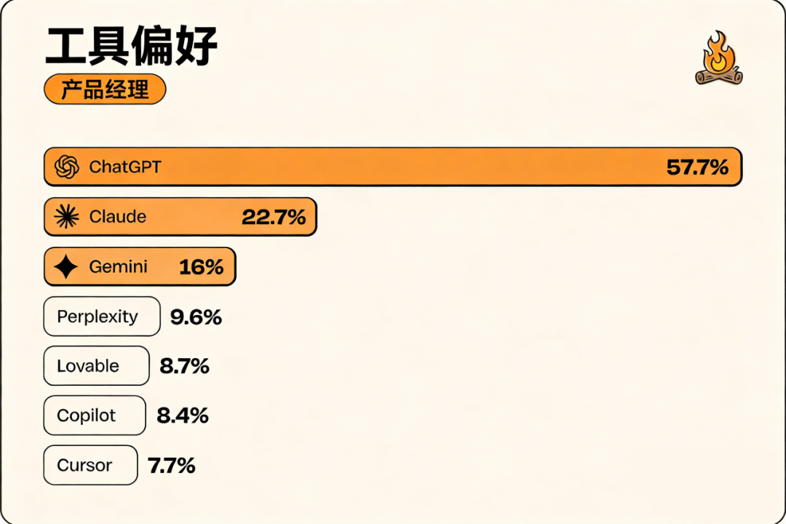

**AI 正在显著提升时间效率与工作质量（对多数人而言）**

63% 的 PM 和 83% 的创业者表示，AI 每周为他们节省超过 4 小时；即使是最怀疑 AI 的群体 —— 设计师，也有 47.5% 表示每周节省 4 小时以上。各岗位中，只有 1%～5% 的人认为 “AI 并不比人工更快”。

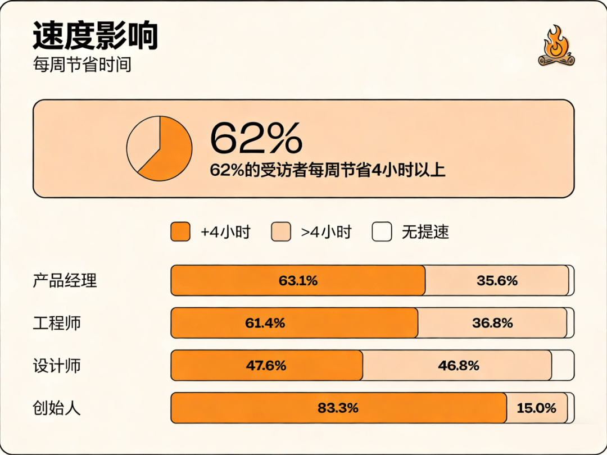

不过在质量方面，情况更复杂。PM 与创业者普遍乐观（超过 70% 表示质量提升），但工程师的反馈较为分化 ——51% 认为 AI 提高了工作质量，21% 则认为更糟。设计师介于两者之间，60% 认为更好，13% 认为更差。

这种差异可能与编码的准确性要求更高有关 —— 一份 “稍微好一点” 的 PRD 草稿依然有用，而一个 “稍微好一点但有 bug” 的函数却不行。而且，坏代码比坏文档更容易被识别出来。

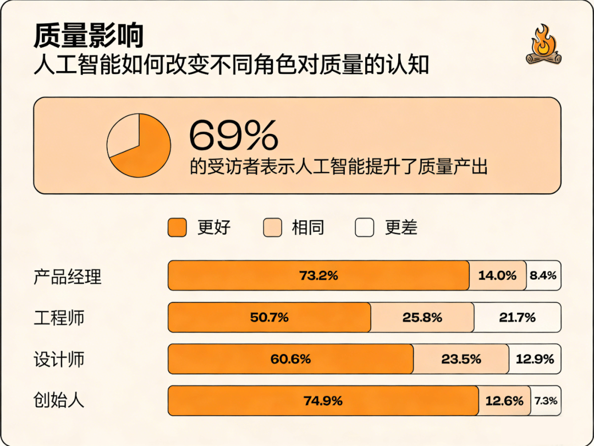

#### 未来 AI 还有哪些潜在机会？

当前人们使用 AI 的场景与他们 “希望未来用来做什么” 的差距，揭示了创业者和初创公司可以切入的新机会。

对产品经理来说，最大的潜力在于 “研究”。用户研究是所有任务中需求差距最大的（+27.2 个百分点）。目前仅有 4.7% 的 PM 把它作为主要 AI 用例，但近三分之一希望未来能如此。换句话说，PM 已经学会用 AI 来完成输出型任务（如写 PRD、撰写沟通内容），但他们迫切希望把 AI 应用到 “前期探索” 环节 —— 帮助理解该做什么。

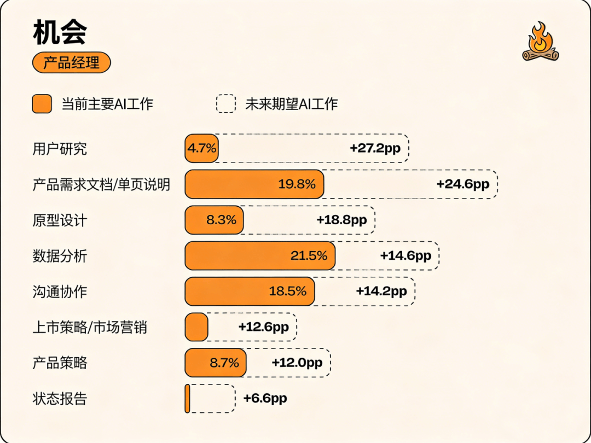

“原型制作” 是另一个爆发点。PM 在该项的使用率从当前的 19.8% 跃升至 44.4%，上升了 +24.6 个百分点，成为最受期待的未来应用场景。设计师在原型与交互设计方面的增长也类似（+27.8pp）。这与 Lovable、v0、Replit、Figma Make 等工具的兴起密切相关 —— 人们看到了 AI 的潜力，并希望进一步拓展。

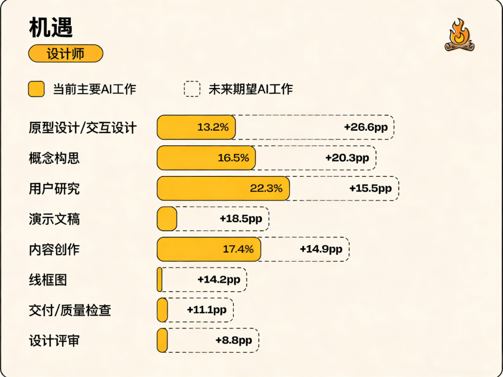

工程师正在把 AI 的应用重心从 “写代码” 转向 “写完代码之后的工作”。虽然编写代码仍是最常见用例（51%），但增长潜力不大（+5.6pp）。相比之下，文档编写（+25.8pp）、代码审查（+24.5pp）、测试编写（+23.5pp）都展现出巨大的发展空间。

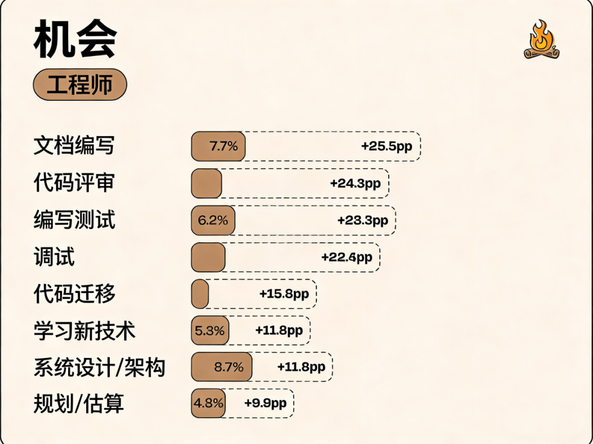

创业者则在强化 AI 的 “思考伙伴” 角色。产品创意需求从 19.6% 飙升到 48.6%，增长 +29.0pp；增长战略与市场进入规划（+24.7pp）以及市场分析（+24.0pp）紧随其后。

创业者目前已广泛使用 AI 来提升个人效率（32.9%），但他们希望进一步向上游延伸 —— 寻找一个能与自己共同思考战略、检验想法、分析市场的 “战略伙伴”，让 AI 成为 “联合创始人”，而不仅仅是助手。

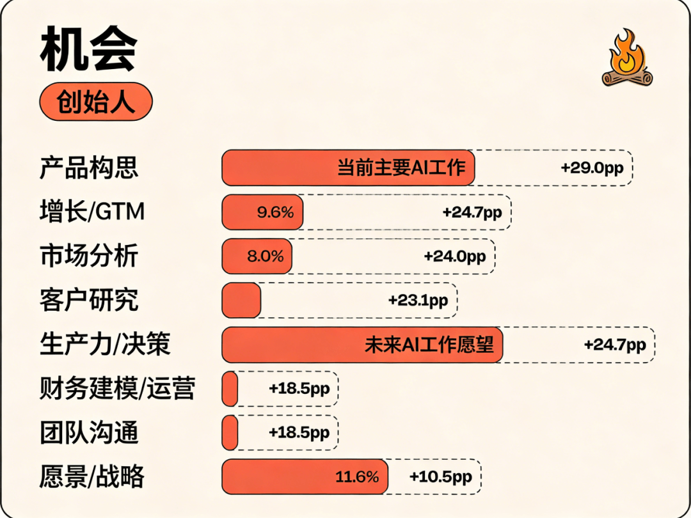

综合来看，这些需求差距表明，下一波 AI 采用浪潮不仅需要更强的模型，还需要更好的 “人机协作工作流”，来应对那些目标模糊的问题。编写 PRD 有明确产出，竞争分析却没有；代码能测试，但 “产品创意” 无法量化。未来的关键，将是如何让人类与 AI 更自然地共同思考。

#### 哪些 AI 工具真正找到了产品与市场的契合点（Product-Market Fit, PMF）？

我们问了一个经典的 Sean Ellis PMF 问题：“如果你失去了使用某个 AI 工具的权限，你会不会非常失望？”

结果显示，83.6% 的受访者提到了至少一个他们 “离不开” 的工具 —— 这本身就说明 AI 已深深融入了日常工作流程。

不过，更有趣的是，把 “经常使用某工具的人数” 与 “如果失去该工具会感到失望的人数” 进行对比，可以清楚地看出哪些产品真正实现了产品与市场的匹配。

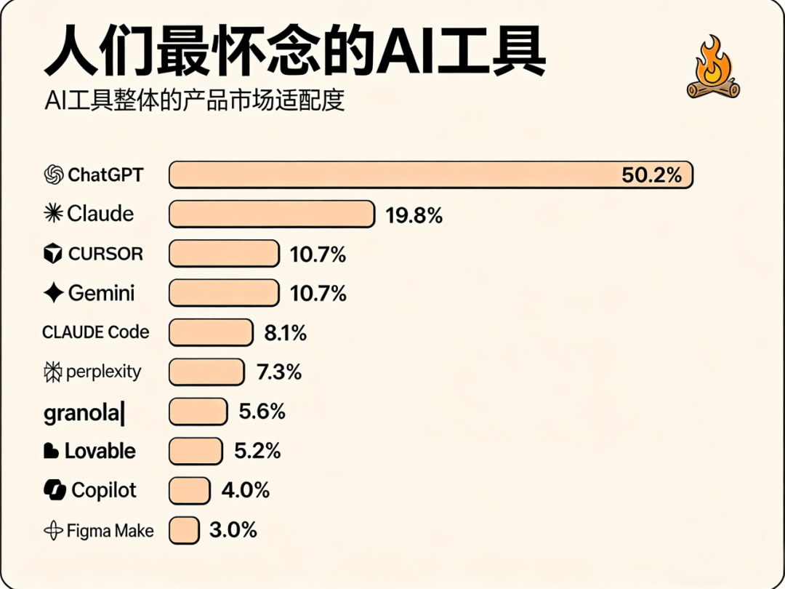

**ChatGPT 依然占据主导地位 —— 至少目前如此。**

有一半的受访者（50.2%）表示，如果无法使用 ChatGPT，他们会非常失望。但这一比例明显低于其整体使用率（在各岗位中普遍为 60%～75%）。这部分解释了为何 OpenAI 近期将 Gemini 和 Claude 的崛起视为 “红色警报”—— 因为 AI 工具的切换成本仍然极低。

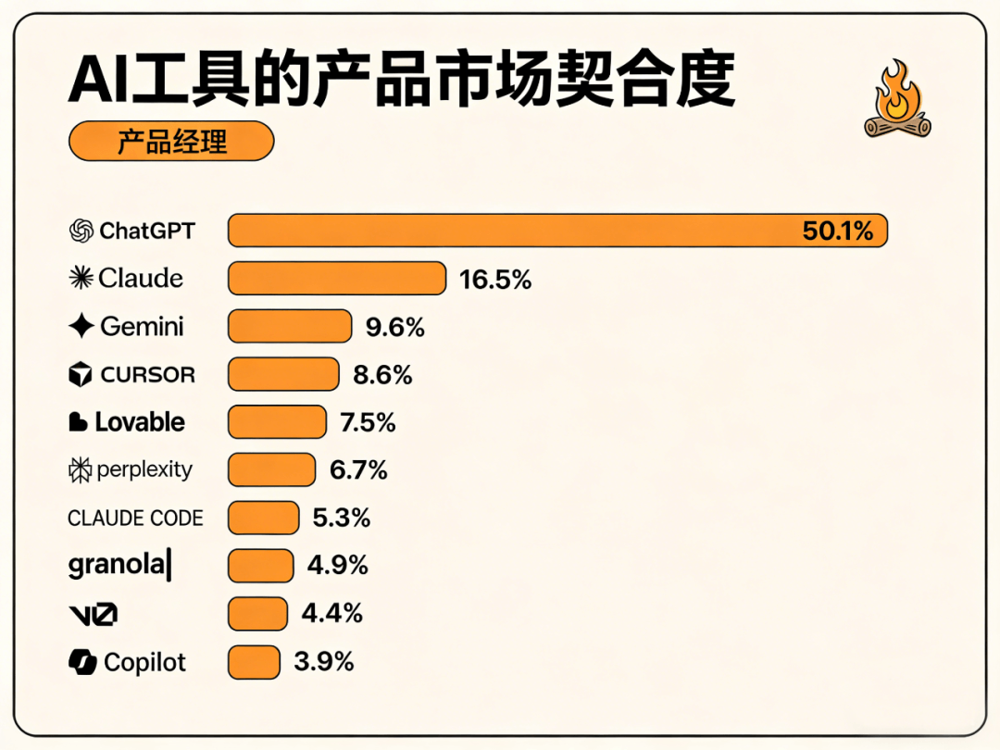

**对产品经理而言，ChatGPT、Claude 和 Gemini 是三大核心工具。**

这三者功能多样，非常契合 PM 的工作需求。更令人惊讶的是，Cursor 紧随 Gemini 之后（考虑到它是一款工程师导向的工具，PM 群体的高使用率颇为意外），而 Lovable 也名列前茅，说明它在原型制作领域正快速占领市场。

**设计师（23.3%）和创业者（20.6%）最依赖 Claude。**

如果将 Claude 与 Claude Code 的使用者合并计算，Claude 系生态的总体 “无法失去率” 达到 27.5%—— 这对 Anthropic 来说是一个巨大的胜利。

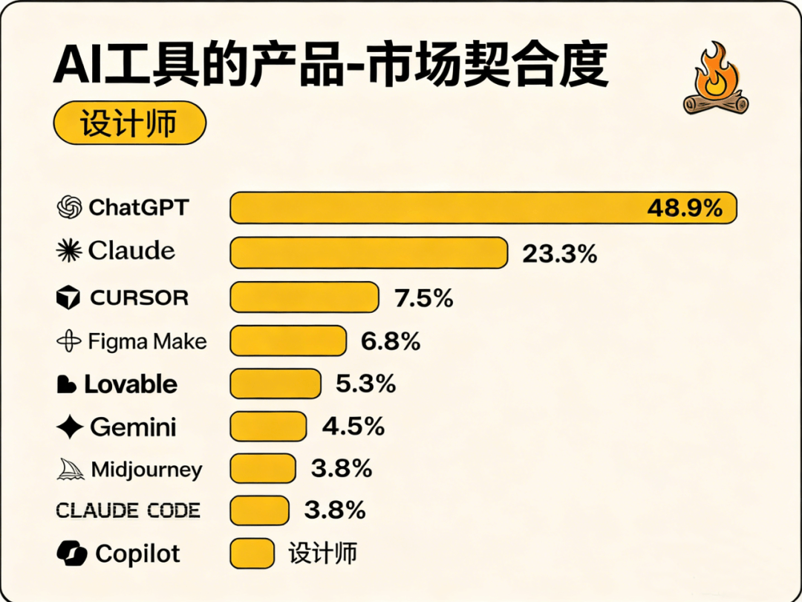

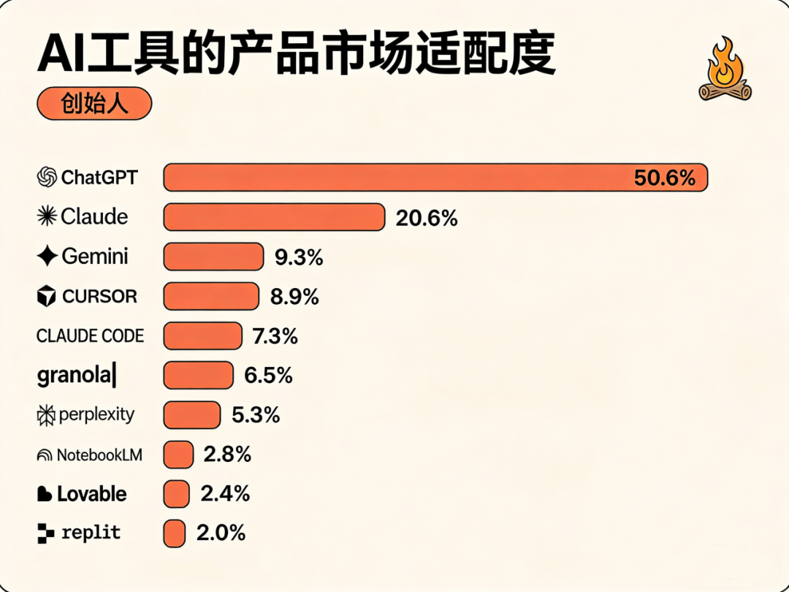

**工程师的 PMF 榜单与其他岗位截然不同。**

专业工程工具在工程师中找到了忠实用户，并且产品与市场实现了清晰的契合。

在工程师群体中，前四名分别是：

- ChatGPT（25.3%）
- Cursor（20.7%）
- Claude Code（17.1%）
- Claude（13.4%）

可以看到，他们最不愿意失去的前四款工具中，有三款是专为编码设计的。工程师们找到了符合自身需求的专业工具，并希望继续使用，而不是依赖通用的聊天界面。

尤其是 Cursor—— 它在工程师中的 PMF 达到 20.7%，而在其他岗位中仅为 7%～9%，这显示它已深入工程师的工作流中，成为高粘性的核心工具。

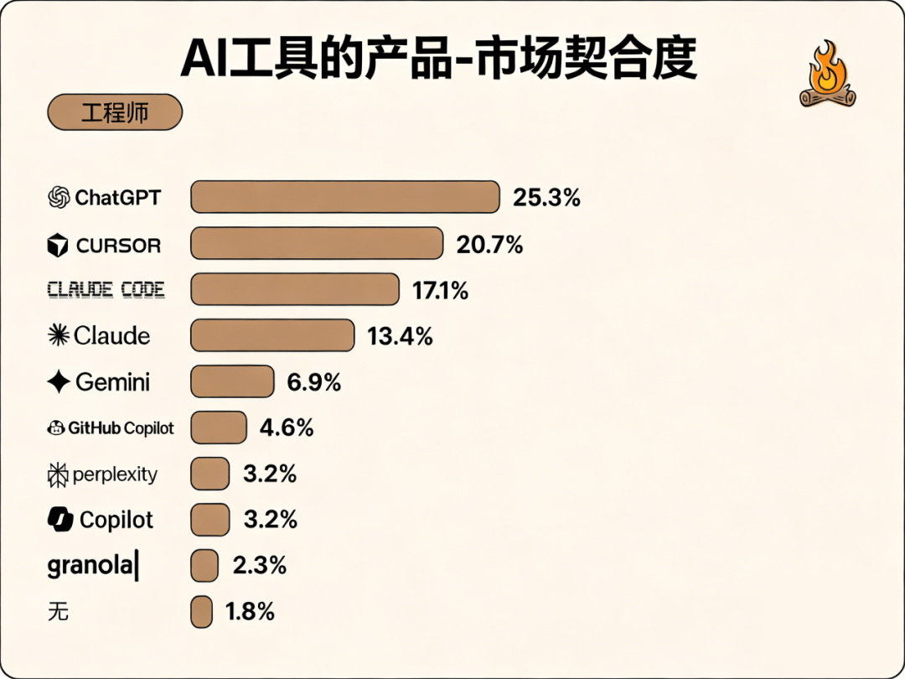

#### 结论

少数 “面向特定岗位” 的 AI 工具，正在各自领域中崭露头角，成为真正的 “刚需型产品”。

关于本文  
译者：@飘飘  
作者：@Noam Segal、@Lenny Rachitsky  
原文：https://www.lennysnewsletter.com/p/ai-tools-are-overdelivering-results

这期前端早读课  
对你有帮助，帮” 赞 “一下，  
期待下一期，帮” 在看” 一下。
