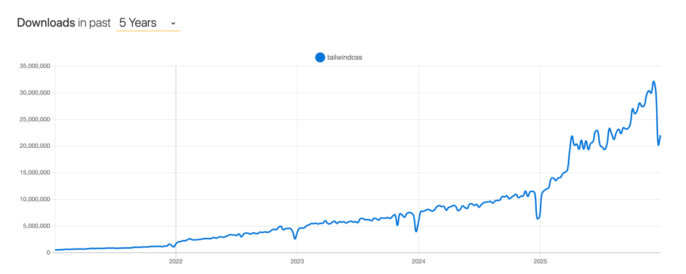

# 使用量暴涨的同时，这个全球最火前端工具宣布大裁员！

如果你经常使用 AI 编程工具，大概率会有一个直观感受：**只要让它写界面，默认给你的几乎都是 Tailwind CSS。**

不管是 Claude Code、Copilot，还是 Cursor 里的 Agent，只要你没特别强调技术栈，生成出来的代码，基本都会长这样：`flex`、`gap-4`、`text-sm`、`bg-slate-900`。

从这个角度看，Tailwind CSS 其实已经成了 **AI 编程时代的“默认 CSS”**。

但有点讽刺的是，就在它被几乎所有 AI 工具默认采用的同时，Tailwind CSS 背后的公司 **Tailwind Labs**，却在 2026 年 1 月宣布裁掉 **75% 的工程团队（4个裁了3个）**。

不是产品不行，也不是没人用，而是——**钱越来越难赚了**。

## 使用量越高，收入反而越低

Tailwind Labs 的商业模式并不复杂，也不算激进：

- 核心框架完全开源、免费
- 通过官方文档承接开发者
- 再销售 Tailwind UI、Plus 订阅等付费产品

这是过去十多年里，开发者工具最常见、也最被验证过的一条路。

问题出在一个看似不起眼的变化上：**开发者已经越来越少地“进文档”了。**

创始人 Adam Wathan 在公开说明中提到，过去两年里，Tailwind 官方文档的访问量下降了大约 **40%**，而公司的整体收入却 **下滑了 80%**。

与此同时，Tailwind CSS 的使用量却还在持续上涨。

于是出现了一个非常反直觉的结果：

> 框架越来越火，公司却越来越难活。

## 真正的变量，是 AI 改变了工作流

很多人的第一反应是：“是不是 Tailwind 的付费产品卖不动了？”

但更核心的原因，其实并不在产品本身，而在于 **AI 改写了开发者获取信息的路径**。

以前的流程很清晰：**搜索问题 → 进入文档 → 查类名 → 顺手看到官方产品 → 产生购买**

现在则变成了：**问 AI → 直接生成 Tailwind 代码 → 用完就走**

无论是 Claude、Copilot，还是 Cursor，大量使用 Tailwind 的场景，已经完全绕过了官方站点。

AI 并没有削弱 Tailwind，反而让它用得更广；

但同时，它也成了新的中介，把原本属于官方文档的流量直接“截”走了。

而 Tailwind Labs，恰恰是一家 **高度依赖文档流量完成转化** 的公司。

## 这不是 Tailwind 一家的问题

如果把 Tailwind Labs 放进更大的背景里看，这次裁员其实并不意外。

任何依赖以下模式的项目，都会受到类似冲击：

- 开源工具
- 免费文档
- 文档是主要获客入口
- 收费发生在使用一段时间之后

当 AI 能直接消化文档、给出答案，这套模型本身就开始松动了。

所以这次裁员，更像是一记提前响起的警钟：

不是某个产品做错了什么，而是**旧的注意力分发方式正在被绕开**。

## 写在最后

Tailwind 依然是当下最成功的 CSS 框架之一，这次裁员也不意味着它会衰落。

但它用一次非常现实的方式，提前告诉了整个开发者工具行业一件事：

**在 AI 时代，“被大量使用”本身，已经不再是护城河。**

这不是唱衰前端，而是一种提醒。

真正的考验，才刚刚开始。

  

---

  

- 我是 ssh，工作 6 年+，阿里云、字节跳动 Web infra 一线拼杀出来的资深前端工程师 + 面试官，非常熟悉大厂的面试套路，Vue、React 以及前端工程化领域深入浅出的文章帮助无数人进入了大厂。
- 欢迎`长按图片加 ssh 为好友`，我会第一时间和你分享前端行业趋势，学习途径等等。2025 陪你一起度过！
- 
- 关注公众号，发送消息：
  
  指南，获取高级前端、算法**学习路线**，是我自己一路走来的实践。
  
  简历，获取大厂**简历编写指南**，是我看了上百份简历后总结的心血。
  
  面经，获取大厂**面试题**，集结社区优质面经，助你攀登高峰

因为微信公众号修改规则，如果不标星或点在看，你可能会收不到我公众号文章的推送，请大家将本**公众号星标**，看完文章后记得**点下赞**或者**在看**，谢谢各位！
