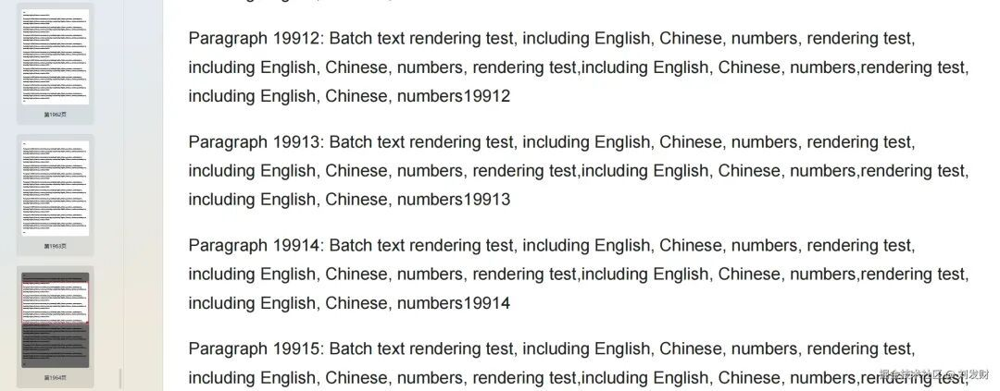
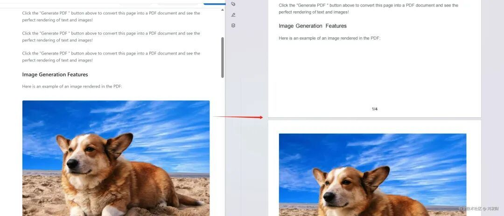
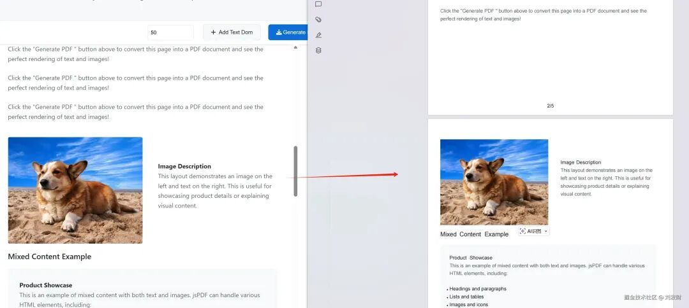
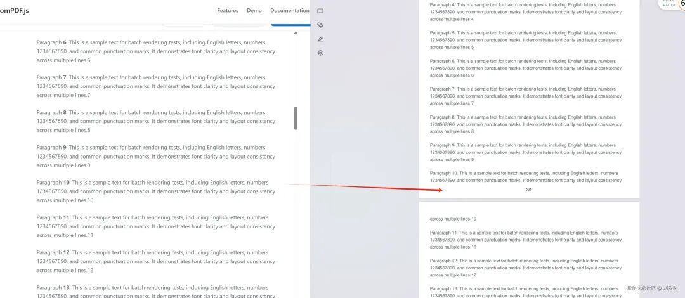
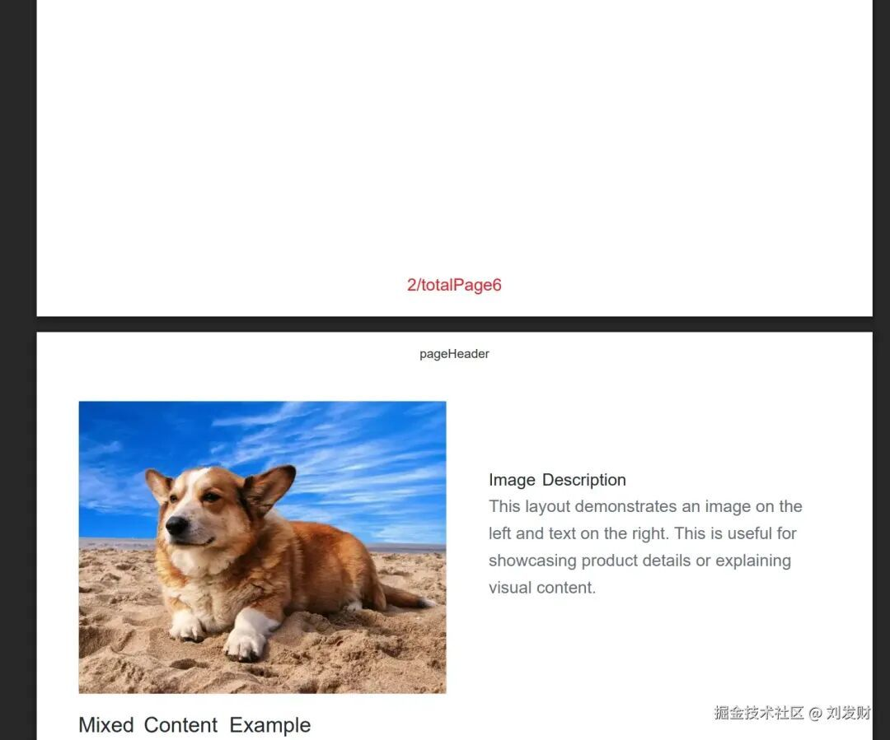
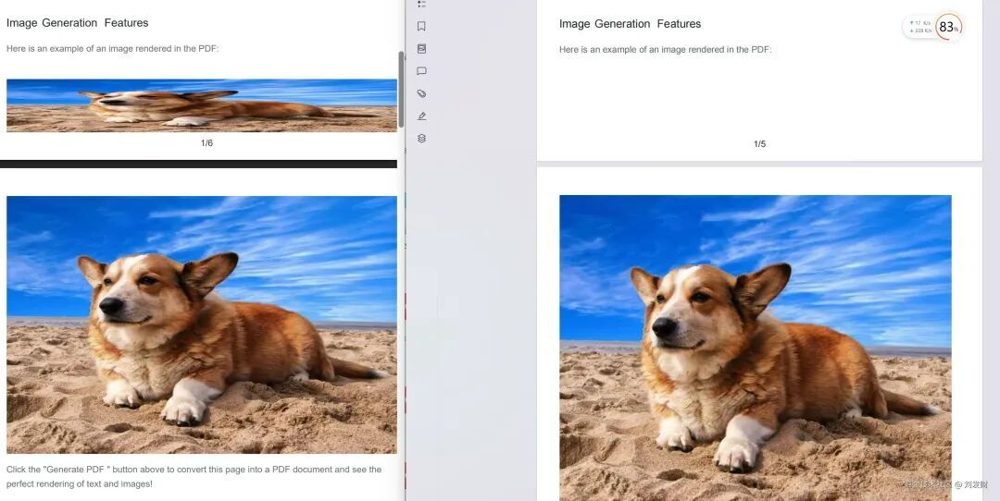

# 前端一行代码生成数千页PDF，dompdf.js新增分页功能

前端生成 PDF 不清晰？文字无法搜索选中编辑？体积太大？分页切割不精准？生成页数太少？`dompdf.js`V1.1.0 版本更新后，这些都不在是问题，只需要一行代码，就可以将 html 页面生成数千页 PDF 文件，这可能是前端首个实现这一功能的 js 库。

dompdf.js 是作者开源的前端 PDF 生成库。可以纯前端将 html 生成为非图片式的，可编辑，小体积的 PDF 文件。上一篇文章 https://juejin.cn/post/7559886023661649958有做相关介绍。之前的版本只能生成单页 PDF，很多开发者反馈有生成多页 PDF 的需求，作者花了点时间在 V1.1.0 版本新增了分页功能，**「可以将 html 页面生成为多页 PDF 文件」**。

### 代码示例

```code-snippet__js
import dompdf from "dompdf.js";


dompdf(document.querySelector("#capture"), { pagination: true }).then(function (
  blob
) {
  //文件操作
});
```
实现效果如下(数千页PDF)：



**「当然，生成数千页的 PDF 是非常极端的情况才能达成，决定能生成多少页 PDF 的，要看文件大小，如果是纯文字 PDF，就能生成更多的页数，反之如果 PDF 中有图片，生成的页数就会少」**

## 1\. 在线体验

❝

https://dompdfjs.lisky.com.cn

❞

## 2\. Git 仓库地址 (欢迎 Star⭐⭐⭐)

❝

https://github.com/lmn1919/dompdf.js

❞

❝

https://gitee.com/liu-facai/dompdf.js

❞

## 3.版本新功能特性

### 1\. 分页功能-精准的页面分割

#### 图片分页效果



#### 左右布局分页效果



#### 文本分页效果



#### 复杂表格分页效果


### 2\. 自定义页眉页脚

可以设置页眉页脚的高度，内容，字体大小，字体颜色等。



### 3\. PDF 密码、操作权限设置，PDF 压缩

## 4.分页实现原理

`dompdf.js` 是如何将 html 页面生成为多页 PDF 文件的？

1. 先将 html 解析为 DOM 树。DOM 树主要包含 DOM 元素的位置信息（bounds: width|height|left|top）、样式数据、文本节点数据等。 大致的结构为：
  
  ```code-snippet__js
  {
  bounds: {height: 1303.6875, left: 8, top: -298.5625, width: 1273},
  elements: [
          {
          bounds: {left: 8, top: -298.5625, width: 1273, height: 1303.6875},
          elements: [
                  {
                  bounds: {left: 8, top: -298.5625, width: 1273, height: 1303.6875},
                  elements: [
                          {styles: CSSParsedDeclaration, textNodes: Array(1), elements: Array(0), bounds: Bounds, flags: 0},
                          {styles: CSSParsedDeclaration, textNodes: Array(1), elements: Array(0), bounds: Bounds, flags: 0},
                          ...
                  ],
                  flags: 0,
                  styles: {backgroundClip: Array(1), backgroundColor: 0, backgroundImage: Array(0), backgroundOrigin: Array(1), backgroundPosition: Array(1), …},
                  textNodes: []
                  }
          ],
          flags: 0,
          styles: CSSParsedDeclaration {backgroundClip: Array(1), backgroundColor: 0, backgroundImage: Array(0), backgroundOrigin: Array(1), backgroundPosition: Array(1), …},
          textNodes: []
          }
  ],
  flags: 4,
  styles: CSSParsedDeclaration {backgroundClip: Array(1), backgroundColor: 0, backgroundImage: Array(0), backgroundOrigin: Array(1), backgroundPosition: Array(1), …},
  textNodes: []
  }
  ```
  
    
  
    


5. 递归 DOM 树的 elements 以及 textNodes，通过 bounds.top+bounds.height 判断是否需要分页，将 DOM 树按照页面分割成多个分页 DOM 树，并重新计算 elements 和 textNodes 的 bounds。 比如一个 textNodes 的位置信息是这样的：

```code-snippet__js
{
 bounds: {left: 8, top: 1115, width: 850, height: 24},
 text: "这是一个文本节点"
}
```
如果我们要按照 `a4` 纸张的高度（1123px）来分页，那么当文本节点的 top 加上 height 大于 1123px 时，而 top 的值 1115px 小于 1123px，那么这个文本节点就会分割到第二页。并且 top 值会重置为 0，后续项的 top 值也会减少相应的值，确保元素位置的准确性。

1. 循环 DOM 树分页数组，调用 `jspdf.addPage()` 方法添加新页面，并绘制页眉页脚。根据不同的元素类型，以及元素的位置信息，调用不同的 jspdf 方法生成 pdf。 比如绘制文字：
  
  ```code-snippet__js
  jspdf.text("这是一个文本节点", 1115, 8);
  ```
  
  绘制图片：
  
  ```code-snippet__js
  jspdf.image(img, x, y, width, height);
  ```
  
    


## 5.使用文档

安装：

```code-snippet__js
npm install dompdf.js --save
```
CDN 引入：

```code-snippet__js
<script src="https://cdn.jsdelivr.net/npm/dompdf.js@latest/dist/dompdf.js"></script>
```
#### 基础用法

```code-snippet__js
import dompdf from "dompdf.js";


dompdf(document.querySelector("#capture"), options)
  .then((blob) => {
    const url = URL.createObjectURL(blob);
    const a = document.createElement("a");
    a.href = url;
    a.download = "example.pdf";
    document.body.appendChild(a);
    a.click();
  })
  .catch((err) => {
    console.error(err);
  });
```
#### PDF 分页渲染

默认情况下，dompdf 会将整个文档渲染到单页中。

您可以通过设置 `pagination` 选项为 `true` 来开启分页渲染。通过 pageConfig 字段自定义页眉页脚的尺寸，内容，字体颜色/大小，位置等信息。

**「非常重要！！！！非常重要！！！！非常重要！！！！非常重要！！！！非常重要！！！！」**

**「需要将要生成PDF的dom节点设置为对应的页面宽度（px）,比如a4要设置宽度为794px,这里是页面尺寸对照表，请点击查看https://dompdfjs.lisky.com.cn/documentation.html」**

```code-snippet__js
  <div 
    id="capture"
    style="width:794px"
    >
  </div>
```
```code-snippet__js
import dompdf from "dompdf.js";


dompdf(document.querySelector("#capture"), {
  pagination: true,
  format: "a4",
  pageConfig: {
    header: {
      content: "这是页眉",
      height: 50,
      contentColor: "#333333",
      contentFontSize: 12,
      contentPosition: "center",
      padding: [0, 0, 0, 0],
    },
    footer: {
      content: "第${currentPage}页/共${totalPages}页",
      height: 50,
      contentColor: "#333333",
      contentFontSize: 12,
      contentPosition: "center",
      padding: [0, 0, 0, 0],
    },
  },
})
  .then((blob) => {
    const url = URL.createObjectURL(blob);
    const a = document.createElement("a");
    a.href = url;
    a.download = "example.pdf";
    document.body.appendChild(a);
    a.click();
  })
  .catch((err) => {
    console.error(err);
  });
```
##### 更精准的分页控制-`divisionDisable` 属性

如果您不希望某个容器在分页时被拆分时，为该元素添加 `divisionDisable` 属性，跨页时它会整体移至下一页。

```code-snippet__js
 
```
右边为使用divisionDisable属性的效果



#### options 参数


| 参数名 | 必传 | 默认值 | 类型 | 说明 |
| --- | --- | --- | --- | --- |
| useCORS | 否 | false | boolean | 允许跨域资源（需服务端 CORS 配置） |
| backgroundColor | 否 | 自动解析/白色 | string \\| null | 覆盖页面背景色；传 null 生成透明背景 |
| fontConfig | 否 | - | object | 非英文字体配置，见下表 |
| encryption | 否 | 空配置 | object | PDF 加密配置，属性userPassword 用于给定权限列表下用户的密码；属性ownerPassword 需要设置 userPassword 和 ownerPassword 以进行正确的身份验证；属性userPermissions 用于指定用户权限，可选值为 ['print', 'modify', 'copy', 'annot-forms'] |
| precision | 否 | 16 | number | 元素位置的精度 |
| compress | 否 | false | boolean | 是否压缩是否压缩 PDF |
| putOnlyUsedFonts | 否 | false | boolean | 仅将实际使用的字体嵌入 PDF |
| pagination | 否 | false | boolean | 开启分页渲染 |
| format | 否 | 'a4' | string | 页面规格，支持 a0–a10、b0–b10、c0–c10、letter 等 |
| pageConfig | 否 | 见下表 | object | 页眉页脚配置 |


##### `[#pageConfig](javascript:;)`字段：


| 参数名 | 默认值 | 类型 | 说明 |
| --- | --- | --- | --- |
| header | 见下表 pageConfigOptions | object | 页眉设置 |
| footer | 见下表 pageConfigOptions | object | 页脚设置 |


##### `[#pageConfigOptions](javascript:;)` 字段：


| 参数名 | 默认值 | 类型 | 说明 |
| --- | --- | --- | --- |
| content | 页眉默认值为空,页脚默认值为${currentPage}/${totalPages} | string | 文本内容，支持 ${currentPage}、${totalPages}，${currentPage}为当前页码，${totalPages}为总页码 |
| height | 50 | number | 区域高度（px） |
| contentPosition | 'center' | string \\| [number, number] | 文本位置枚举 center、centerLeft 、 centerRight、centerTop、 centerBottom、leftTop、 leftBottom、rightTop、rightBottom或坐标 [x,y] |
| contentColor | '#333333' | string | 文本颜色 |
| contentFontSize | 16 | number | 文本字号（px） |
| padding | [0,24,0,24] | [number, number, number, number] | 上/右/下/左内边距（px） |


##### 字体配置（[#](javascript:;)`fontConfig`）字段：


| 字段 | 必传 | 默认值 | 类型 | 说明 |
| --- | --- | --- | --- | --- |
| fontFamily | 是（启用自定义字体时） | '' | string | 字体家族名（与注入的 .ttf 同名） |
| fontBase64 | 是（启用自定义字体时） | '' | string | .ttf 的 Base64 字符串内容 |


#### 乱码问题-字体导入支持

由于 jspdf 只支持英文，所以其他语言会出现乱码的问题，需要导入对应的字体文件来解决，如果需要自定义字体，在这里将字体 tff 文件转化成 base64 格式的 js 文件，中文字体推荐使用思源黑体,体积较小。 在代码中引入该文件即可。

```code-snippet__js
<script type="text/javascript" src="./SourceHanSansSC-Normal-Min-normal.js"></script>
<script>
  dompdf(document.querySelector('#capture'), {
    useCORS: true,
    fontConfig: {
      fontFamily: 'SourceHanSansSC-Normal-Min',
      fontBase64: window.fontBase64
    }
  })
    .then(function (blob) {
      const url = URL.createObjectURL(blob);
      const a = document.createElement('a');
      a.href = url;
      a.download = 'example.pdf';
      document.body.appendChild(a);
      a.click();
    })
    .catch(function (err) {
      console.error(err);
    });
</script>
```
#### 绘制渐变色、阴影等复杂样式-foreignObjectRendering 使用

在 dom 十分复杂，或者 pdf 无法绘制的情况（比如：复杂的表格，边框阴影，渐变等），可以考虑使用 foreignObjectRendering。 给要渲染的元素添加 foreignObjectRendering 属性，就可以通过 svg 的 foreignObject 将它渲染成一张背景图插入到 pdf 文件中。

但是，由于 foreignObject 元素的渲染依赖于浏览器的实现，因此在不同的浏览器中可能会有不同的表现。 所以，在使用 foreignObjectRendering 时，需要注意以下事项：

1. foreignObject 元素的渲染依赖于浏览器的实现，因此在不同的浏览器中可能会有不同的表现。
2. IE 浏览器完全不支持，推荐在 chrome 和 firefox,edge 中使用。
3. 生成的图片会导致 pdf 文件体积变大。

示例

```code-snippet__js
<div style="width: 100px;height: 100px;" foreignObjectRendering>
  <div
    style="width: 50px;height: 50px;border: 1px solid #000;box-shadow: 2px 2px 5px rgba(0,0,0,0.3);background: linear-gradient(45deg, #ff6b6b, #4ecdc4);"
  >
    这是一个div元素
  </div>
</div>
```
### 浏览器兼容性

该库应该可以在以下浏览器上正常工作（需要 `Promise` polyfill）：

- Firefox 3.5+
- Google Chrome
- Opera 12+
- IE9+
- Safari 6+

  

推荐阅读  点击标题可跳转

1、[一种新HTML页面转换成 PDF 技术方案](https://mp.weixin.qq.com/s?__biz=MzAxODE2MjM1MA==&mid=2651623578&idx=1&sn=c1dd9dc525b0b71e1239ee0d10a5bf9b&scene=21#wechat_redirect)

2、[如何用Claude Code 生成顶级UI](https://mp.weixin.qq.com/s?__biz=MzAxODE2MjM1MA==&mid=2651623557&idx=2&sn=229c58547357a584f48d2f10651688ec&scene=21#wechat_redirect)

3、[JavaScript还能这样写？！ES2025新语法让代码优雅到极致](https://mp.weixin.qq.com/s?__biz=MzAxODE2MjM1MA==&mid=2651623535&idx=1&sn=5af68161cc72150298ed4a84ac721bcc&scene=21#wechat_redirect)
