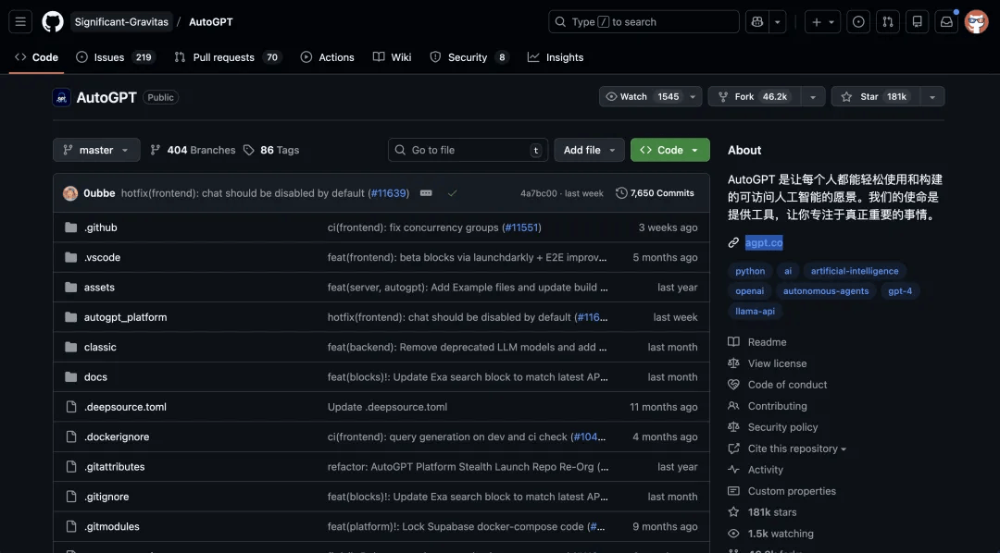
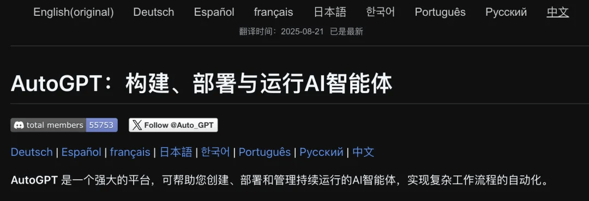
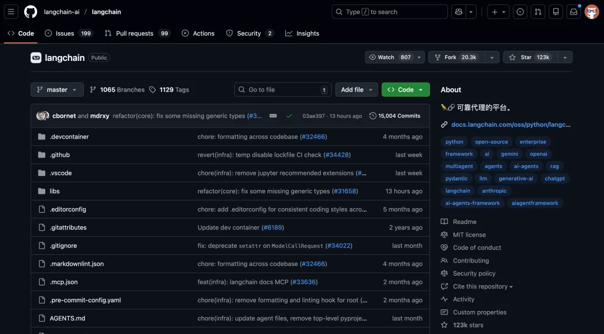
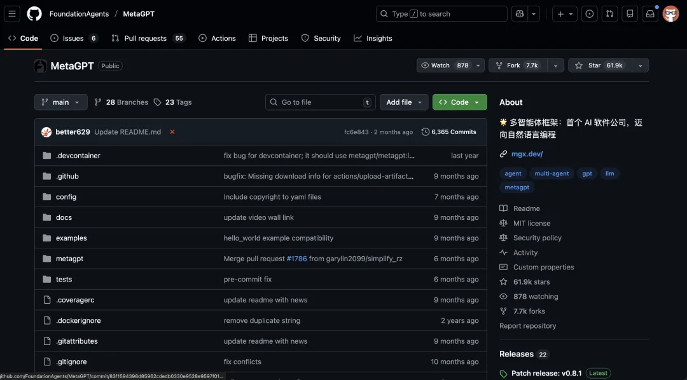
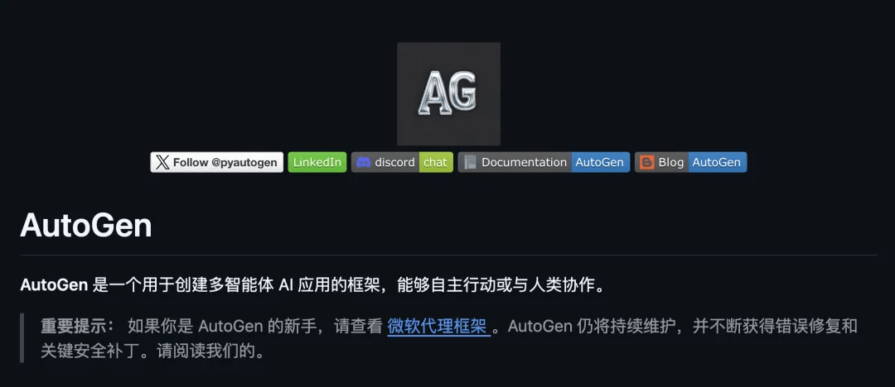
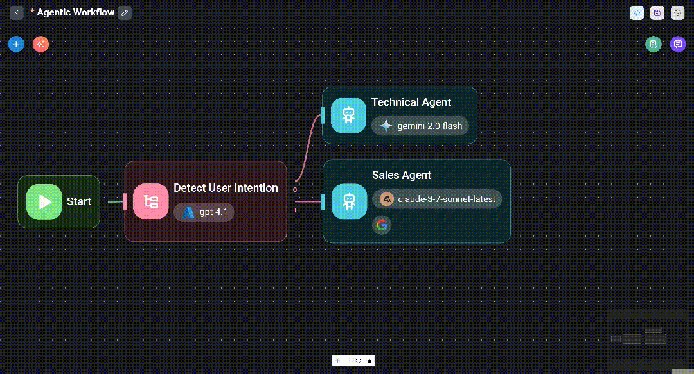
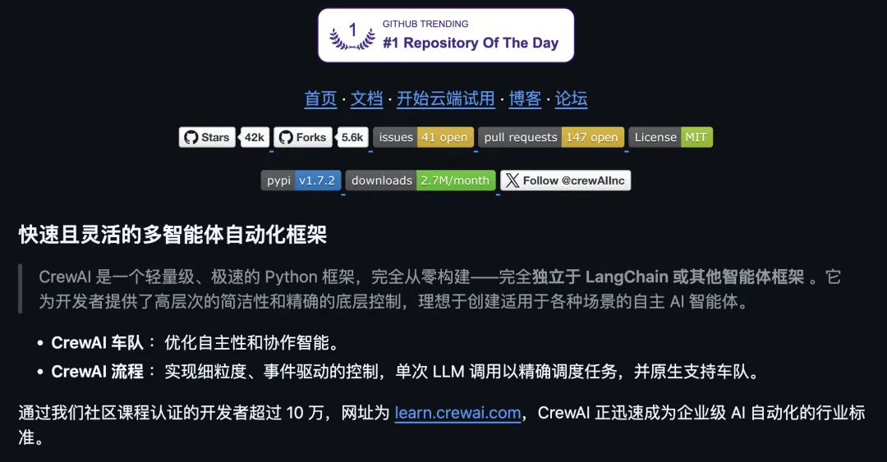
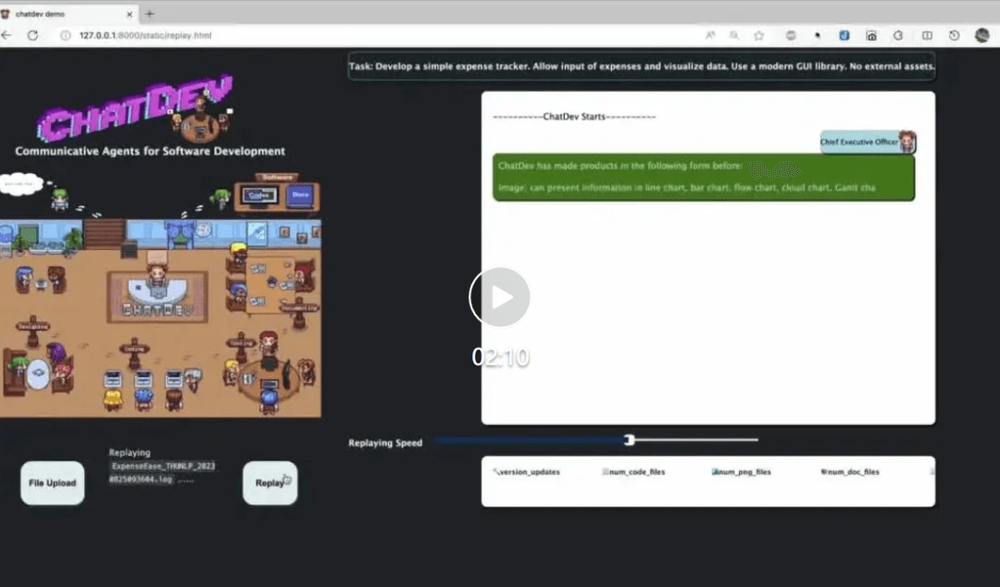
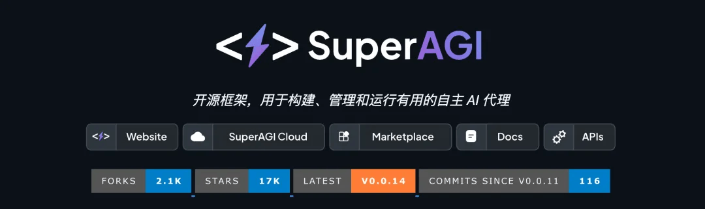
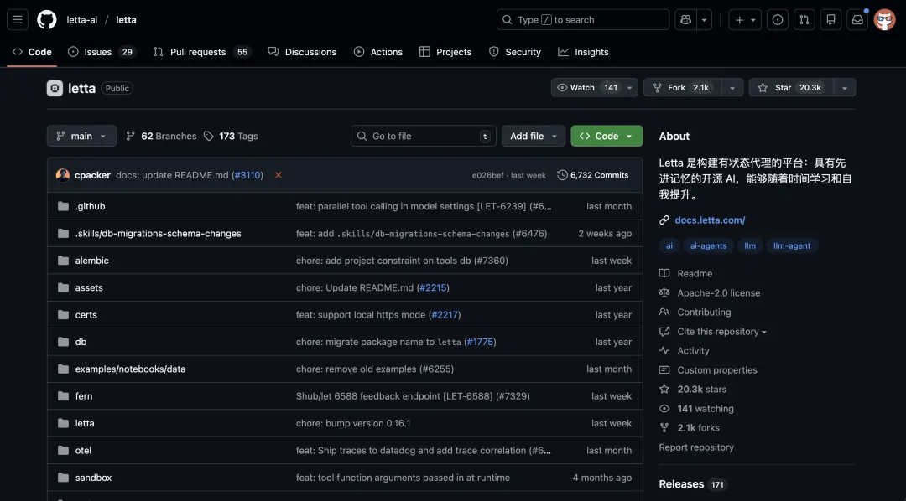

# stars 高达50w+！Github 爆火的 10 个值得学习的 AI 项目！学到了好多！

### AutoGPT

（GitHub星标18万+）AI Agent开创项目，可自主拆解复杂目标，支持网络检索、文件读写、代码执行及长短时记忆辅助决策。以“思考-规划-执行”闭环运行，适配复杂长周期自动化任务。

> 开源地址: https://github.com/Significant-Gravitas/AutoGPT

### Dify

（GitHub星标12万+）融合BaaS与LLMOps的全栈平台，提供可视化编排、RAG集成功能，拖拽节点即可定义Agent逻辑，无需后端代码快速搭建企业级AI应用。

> 开源地址: https://github.com/langgenius/dify

### LangChain

构建Agent的事实标准框架，模块化组件支持灵活搭建工作流，Agent可动态调用外部工具。子项目LangGraph适配多角色有状态应用，是Python复杂Agent首选。

> 开源地址：https://github.com/langchain-ai/langchain

### MetaGPT

（GitHub星标6万+）模拟虚拟软件公司，内置多角色Agent，输入一句需求即可协同输出代码及配套文档，适配固定流程、高稳定性需求。

> 开源地址: https://github.com/geekan/MetaGPT

### Microsoft AutoGen

微软开源多智能体框架，支持定义多类型Agent通过对话协作，灵活适配多种对话模式，是多智能体系统研究主流工具。

> 开源地址: https://github.com/microsoft/autogen

### Flowise

（GitHub星标4.8万）LangChain底层的低代码工具，拖拽节点即可组合组件搭建Agent，无编码基础也能快速出原型。

> 开源地址: https://github.com/FlowiseAI/Flowise

### CrewAI

（GitHub星标4.2万）主打角色扮演的Python框架，语法直观易懂，支持定义Agent团队协作，可与LangChain生态深度集成。

> 开源地址: https://github.com/crewAIInc/crewAI

### ChatDev

（GitHub星标2.8万）清华团队开源，模拟软件开发公司，多角色Agent全流程协作，过程可视化强，兼具趣味性与启发性。

> 开源地址: https://github.com/OpenBMB/ChatDev

### SuperAGI

（GitHub星标1.5万）企业级Agent框架，提供可视化管理、并发运行、Agent市场等功能，解决AutoGPT生产环境部署难题。

> 开源地址: https://github.com/TransformerOptimus/SuperAGI

### Letta

MemGPT继任者，以分层内存管理实现持久化记忆，解决大模型失忆痛点，适配长周期陪伴型应用。

> 开源地址：https://github.com/letta-ai/letta

## 结语

我是林三心，一个待过**小型toG型外包公司、大型外包公司、小公司、潜力型创业公司、大公司**的作死型前端选手

我建了一些**前端学习群**，如果大家想进群交流前端知识，可以关注我，回复**加群**

