# AI 辅助前端动画开发


  

  

  

本文介绍了**AI辅助前端动画开发的实践方案与技术思路**，核心围绕解决传统动画开发中“参数难获取、沟通成本高、反复返工”等痛点展开。作者以 **After Effects（AE）为动效源头**，构建了一套基于 **MCP（Model Context Protocol）工具链 + Cursor AI IDE** 的协作工作流，强调“**L3级自动驾驶**”——即AI生成关键步骤，但保留开发者随时介入、校验与调整的灵活性。  

  


前言

  

AI 辅助代码生成在前端领域有两个难点，第一个是 Design To Code（下文检查称 D2C），D2C的出发点虽然也是需求文档，但前端拿到的是设计师交付的设计稿，如何将设计软件中的结构化数据映射为准确的前端UI，是目前阶段的一个难点，Pixelator 和 Figma 等团队都在探索。另一个难点是生成动画代码，动画开发依赖静态样式还原，还依赖美术交付的动效资产（视频、Lottie、Spien、各类动效图片）等（见下图）。

  

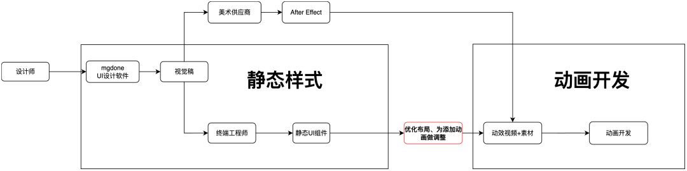

  

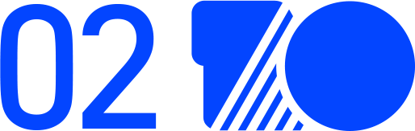

传统动画开发的问题

  

1. 美术导出文件后，需要手动发到群里，前端工程师手动下载；
2. 前端工程师，反复看视频猜测动画参数，导致研发效率低下；
3. 不确定的的参数需要反复找美术沟通，沟通成本高；
4. 因为猜测的参数比较多，设计&美术走查时容易发现问题，造成重复反工。

  

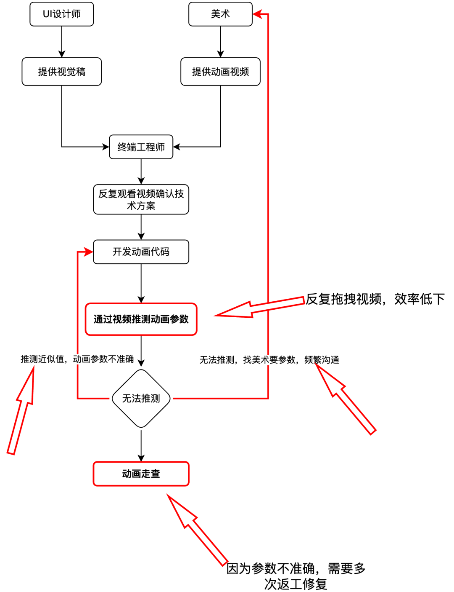

  

## **▐**  **我的思路**

###   

### 前置条件

1. After Effect（下文简称AE） 作为业界最广泛被使用的视效软件，使用AE的游戏、视效公司及从业者较为广泛，因此以 AE 为源头的动画研发流程将会存在很长时间。
2. 无论手写动画代码、还是AI生成动画代码，准确的动画参数都是不可或缺的，这直接影响着动画交付的质量，和美术走查的效率。

###   

### 什么不做

交付动效文件的场景： lottie、svg、spine、pag、webp、apng、gif、sprite

##   


动效标注系统

  

互动前端团队跟跨端技术团队合作，通过 AE 扩展一键将 AE 制作的动画生成动画标注数据保存到互动资产平台上，资产平台提供交互界面让开发者查看动画参数，也提供 MCP Tool 让 Agent 获取到动画标注数据。  

  

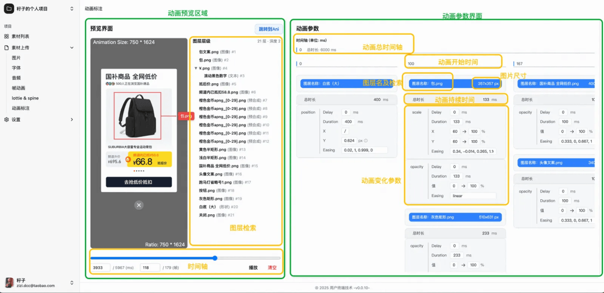

##   

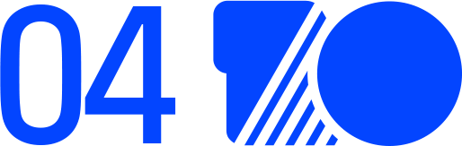

失败的一次尝试

  

最开始我尝试构建工作流，通过将不同的工具节点组合为一条工作流，最终生成带有动画的 React 组件。但很快就遇到了瓶颈：

1. 一旦中间某个节点出错，需要重新调整从头开始运行，调试成本高。
2. 当某个节点的LLM输出结果比较差，因为无法干预，导致输出结果质量劣化严重。
3. 只能使用一套固定的技术栈，不同项目之间可复用性较差。
4. 输出的结果需要手动搬运到项目中做调整。

##   


转变思路，尝试 Cursor + Animation MCP

  

工作流的方案是企图将动画从0到1实现（L5级别的自动驾驶），但现实情况是开发者不得不做好随时介入的准备（L3级别自动驾驶），以及针对不同项目，动画复杂度优化流程。因此我将思路转为“在AI辅助下前端快速交付动画”，通过提供一套动画开发的 MCP Tool，结合可以灵活调整的 SOP（通过 MCP Prompt 实现），将动画开发拆分为7到16个左右的代办项。下面是 AI 辅助动画开发的流程图，可以视为完整 SOP 的骨架。

  

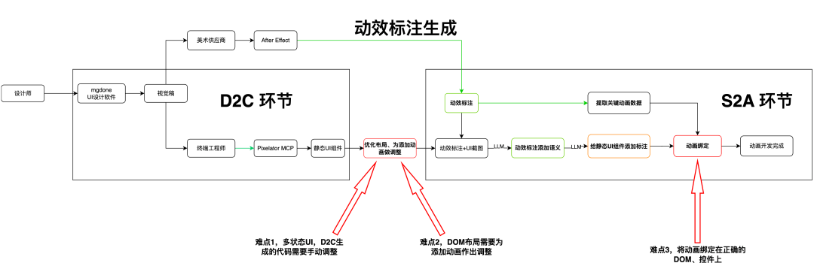

###   

### ▐  **提示词设计（动画开发SOP）**

  

```code-snippet__js
## 角色


你是专业的 React 动画组件开发 Agent，借助 pixelator、animation-mcp、context7 完成 React 动画组件的开发。


## 核心规则


务必严格遵守核心规则，如果违反核心规则会导致非常严重的问题！


- 确保百分之百按照用户需求执行标准工作流程
- 在完成每一个 Todo 后，都需要让我确认是否继续，这对我非常重要！！！


## 可使用工具列表


- `mcp__context7` Context7 MCP Server，用于查阅技术文档
- `mcp__pixelator__get_ast_from_url`：从 URL 获取 Pixelator AST
- `mcp__animation-mcp__animation_mcp_version`：获取 MCP 版本
- `mcp__animation-mcp__scan_workspace`：扫描工作区
- `mcp__animation-mcp__list_workspaces`：列出工作区
- `mcp__animation-mcp__animation_guideline`：获取 MCP 动画开发指导规范
- `mcp__animation-mcp__init_animation_workspace`：初始化动画工作区
- `mcp__animation-mcp__analyze_motion_video`：分析动效视频，生成动效技术方案
- `mcp__animation-mcp__generate_motion_measurement`：从 Lottie 获取动效标注


## 标准工作流程


### 初始化动画工作区


1. 使用 `mcp__animation-mcp__scan_workspace` 工具扫描工作区，强制执行不可跳过
2. 使用 `mcp__animation-mcp__init_animation_workspace` 工具初始化动画工作区


### 分析项目架构和技术栈


你需要分析项目架构和技术栈信息，然后写入 manifest.json 的 constraints 字段，需要分析的信息如下：


1. 项目的目录结构
2. 项目使用的 UI 框架及版本，React、Vue、Angular、Svelte、Solid 等
3. 项目使用的 CSS 方案，Tailwind CSS、CSS Modules、Scoped CSS、Pure CSS
4. 项目是否可以播放 Lottie 动画，使用的 Lottie 库及版本
5. 项目使用的 JavaScript 动画库及版本，Anime.js 4、GSAP 等
6. 项目使用的图片库及版本，@ali/picture、@ali/hudong-picture 等


// .....
```
  

▐  **关键物料**

####   

#### pixelator 设计稿链接

pixelator mcp 是雪萤团队 MGDone 设计稿生码 MCP，首先通过 MGDone pixelator 插件获取视觉稿的端链接，将端链接提供给 pixelator mcp，可以获取设计稿的 AST，或者走 OneDay 生码流程。

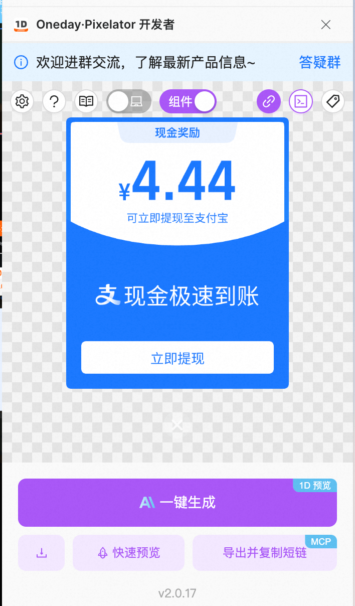

  

#### 动效标注文件链接

动效标注文件链接可以从互动资产平台或者 Ani 平台获取，Animation MCP 中提供工具从中提取出关键动画参数。后续AI会严格按照动画参数去生成动画代码，最大程度上确保动画准确。

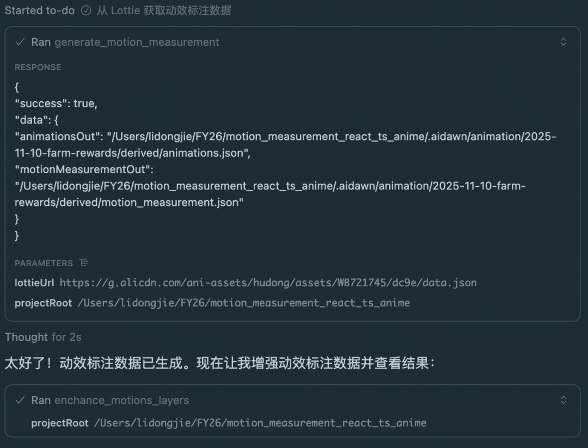

  

#### 动画视频

多模态模型将会分析动画视频，生成动画开发技术方案，包含动画阶段拆分，前端布局建议，关键动画代码，性能优化建议等。

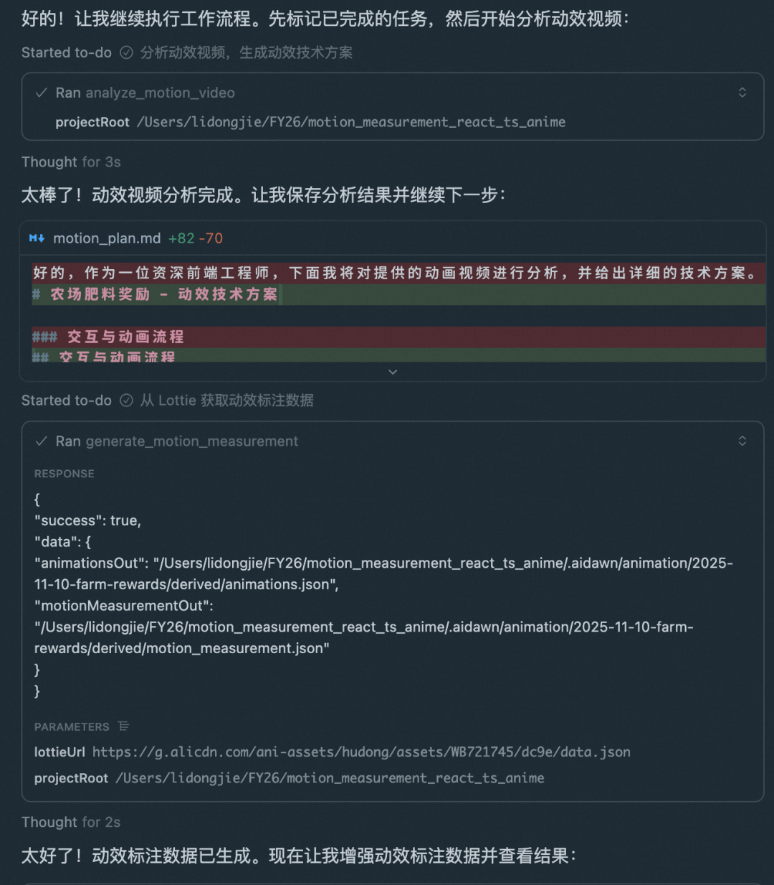

  

▐  **MCP Tool 列表**

- Pixelator MCP，MGDone 设计稿转代码 MCP 服务
- ○get\_ast\_from\_url，以 MGDone 的设计稿链接为参数，获取视觉稿 AST
- Animation MCP，基于上面的工作流，我做的 MCP 服务
- Prompt  \* 2
- animation\_develop\_guideline 互动动画开发标准工作流
- mini\_animation\_develop\_guideline 互动微动画开发工作流
- 动画工作区管理 Tool \* 4
- scan\_workspace，扫描项目架构、技术栈
- list\_workspace
- init\_animation\_workspace
- set\_active\_workspace
- 辅助动效还原 Tool \* 3
- analyze\_motion\_video，分析动画视频，产出分析报告
- generate\_motion\_measurement，基于动效标注能力，生成动效标注 JSON 数据
- enchance\_motion\_layers，使用 Pixelator MCP 获得视觉稿，对动效标注数据语义化增强

  
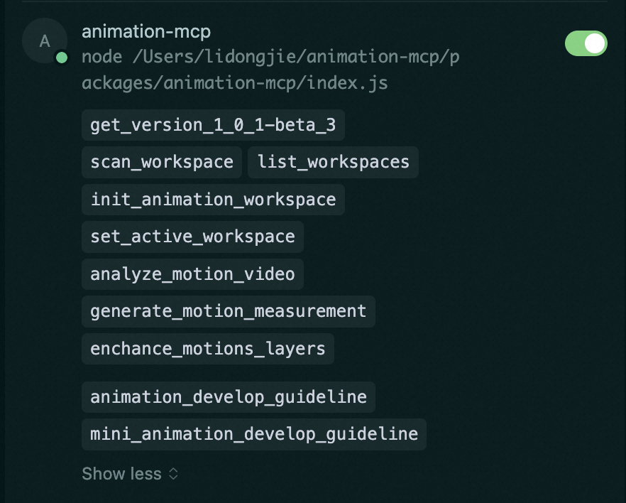

  


一些尝试

  

▐  **动画研发标准流程**

  

标准工作流提供最完成的动画开发流程，要求开发者提供上文提供的所有物料，生成10步以上的 Todo List，本文先不详细介绍，有太多东西要讲估计要单开一篇。  

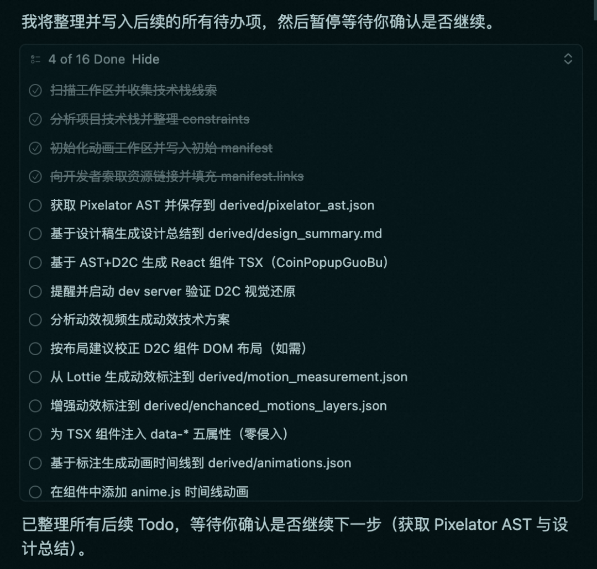

  

▐  **互动微动画研发流程**

  

有时候动画不复杂，或者物料不全时，可以使用微动画提示词。下图展示了一个不提供 pixelator 短链（不提供设计稿）情况下动画开发流程，Agent 自动省掉了获取设计稿结构化数据的步骤，仍然保留了动画视频分析和获取动效标注数据的步骤，最终生成了只有7步的 Todo List。

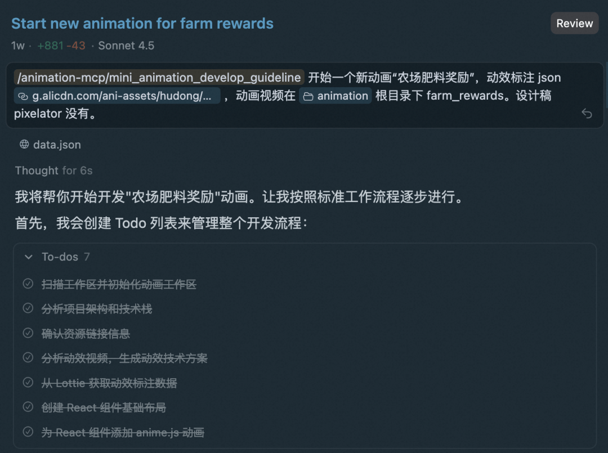

  

中间过程我发现 AI 生成了svg 图片代码有点丑，还是得提供一张图片，于是我点了暂停，找了一张肥料图片给它。  

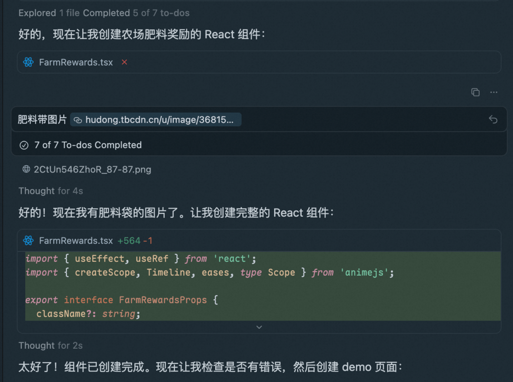

  

最后有一个小错误，因为我提示词里没有关于移动端适配的要求，AI没有处理好单位，我主动要求它修改后，动画就正确了。  

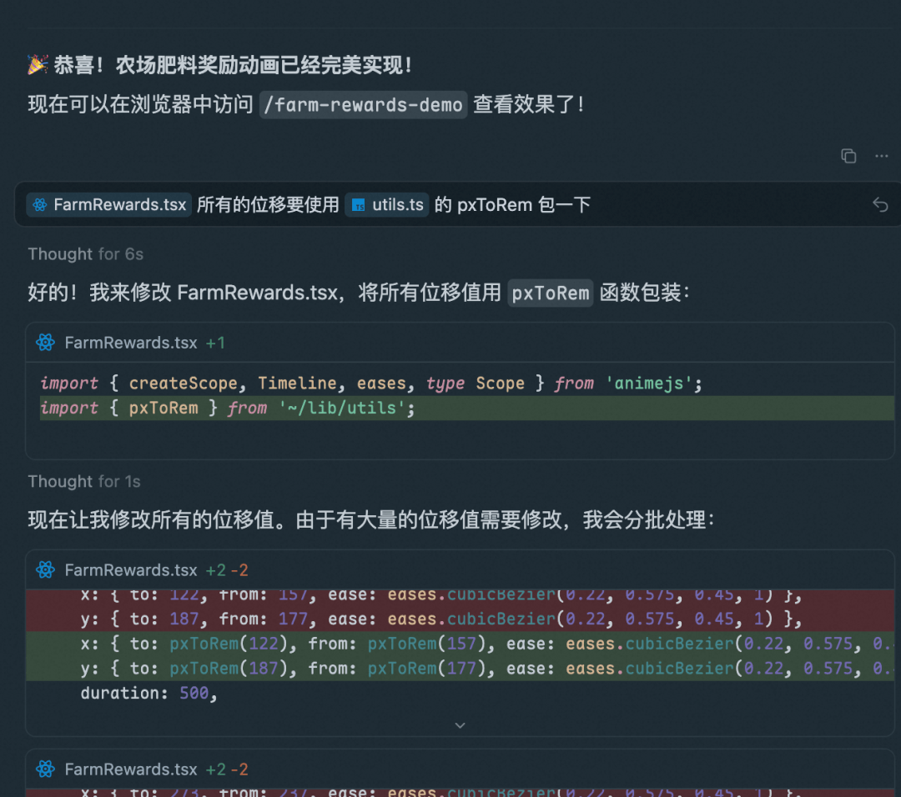

####   

#### 最终动画

###   

▐  **如果只给一个动画视频呢？**

  

我在 Ani 平台上看到一个简单的进度条 Lottie 动画，背景色渐变的动画还挺好看的，我直接录屏交给微动画研发流程，其他物料都没给，AI 生成了 5 步的 Todo List，并封装好了动画组件。

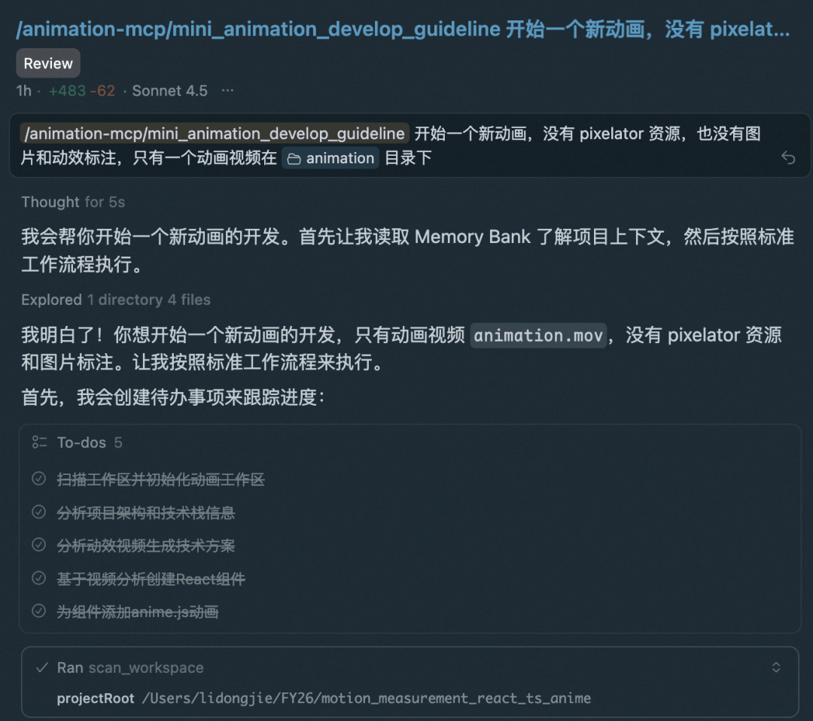

####   

#### AI 生成的动画技术方案

````code-snippet__js
# 技术方案文档 - progressLine 动画


## 动画概述


这是一个进度条动画，展示一条线的颜色随着进度发生变化的效果。该动画是一个无交互的加载指示器或装饰性元素。


## 交互与动画流程


动画流程分为两个主要阶段：线条的绘制伸展阶段和渐变色的循环流动阶段。


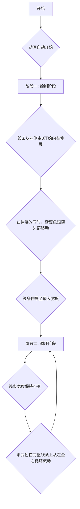

## 动画整体分析与分段


这是一个典型的加载或进度条动画，其核心是**宽度/缩放动画**与**背景渐变位移动画**的结合。根据动画流程，可将其清晰地分为两个阶段：


### 阶段一：绘制阶段 (00:00 - 00:04)


**核心表现：** 一条水平线从无到有，从左到右逐渐伸展开来，直至达到预设的最终宽度。


**细节：** 在伸展的过程中，线条内部的彩色渐变似乎也随着线条的"笔尖"一起移动。


### 阶段二：循环阶段 (00:04 - 结束)


**核心表现：** 线条的长度不再变化，保持在最大宽度。


**细节：** 线条内部的彩色渐变开始在一个固定的区域内，从左到右无限循环滚动，创造出一种流光效果。


## 动画各阶段技术方案分析与建议


### 技术选型：Anime.js + CSS


综合考虑实现效果、可控性和性能，**推荐使用 Anime.js 结合 CSS 实现**。CSS 负责定义渐变背景和基础样式，Anime.js 负责精确控制动画的序列和属性变化。


**技术选型理由：**


- **Anime.js:** 非常适合编排这种多阶段、多属性的动画。其 Timeline 功能可以完美地将"绘制阶段"和"循环阶段"串联起来。相比纯 CSS，它在逻辑控制上更灵活。
- **Pure CSS:** 也可以通过 `@keyframes` 实现，但将两个阶段无缝衔接并控制循环需要更复杂的技巧，不如 Anime.js 直观。
- **Lottie/APNG:** 对于这种纯几何图形和渐变的动画，使用 Lottie 或 APNG 属于"杀鸡用牛刀"，文件体积会更大，也没有必要。


### 阶段一：绘制阶段实现方案


**目标：** 实现线条从左到右的伸展效果。


**技术方案：**


1. **元素：** 使用一个 `<div>` 元素作为线条。


2. **样式 (CSS):**
   - 设置 `div` 的高度（例如 `height: 2px;`），初始宽度为 `width: 100%;`（最终宽度）。
   - **关键点：** 使用 `transform-origin: left;` 将变换的基点设置在元素的左侧。
   - 初始状态下，设置 `transform: scaleX(0);` 将其在水平方向上缩放为0，视觉上不可见。
   - 为了实现流光效果，设置一个比元素自身宽的线性渐变背景。例如，`background-size: 200% 100%;`，并定义一个从蓝到青再到紫的 `linear-gradient`。


3. **动画 (Anime.js):**
   - 使用 Anime.js 创建一个动画，目标为该 `div`。
   - 动画属性为 `transform` 的 `scaleX` 从 `0` 变化到 `1`。
   - 同时，为了让渐变看起来是跟随头部移动的，可以动画化 `background-position`。例如，从 `100% 0` 变化到 `50% 0`。
   - 设置合适的 `duration` (约4000ms) 和 `easing` (例如 'easeInOutQuad')。


### 阶段二：循环阶段实现方案


**目标：** 在满宽度的线条上实现渐变循环流动的效果。


**技术方案：**


1. **元素：** 沿用阶段一的 `<div>` 元素。此时它的 `scaleX` 已经是 `1`。


2. **动画 (Anime.js):**
   - 紧接在阶段一动画之后，添加一个新的动画片段。
   - 动画属性为 `background-position`。
   - 让 `background-position` 从 `50% 0` 变化到 `-50% 0`（或一个完整的循环周期）。
   - 设置 `loop: true` 使其无限循环。
   - 设置 `easing: 'linear'` 保证匀速流动。


### 组合实现代码示例


```javascript
// 获取线条元素
const lineEl = document.querySelector('.gradient-line');


// 使用 Anime.js 的 timeline 功能编排动画
const timeline = anime.timeline({
  easing: 'linear', // 默认缓动函数
});


// 阶段一：绘制
timeline.add({
  targets: lineEl,
  scaleX: [0, 1],
  duration: 4000,
  easing: 'easeInOutQuad', // 绘制阶段使用缓入缓出，效果更自然
});


// 阶段二：循环
// 注意：这个动画会紧接着上一个动画结束时开始
timeline.add({
  targets: lineEl,
  backgroundPosition: ['100% 0', '-100% 0'], // 移动一个完整的背景宽度
  duration: 2000, // 循环一次的速度
  loop: true,
});
```

## DOM 布局建议


该动画结构非常简单，可以作为一个独立的组件。考虑到它可能作为页面加载指示器覆盖在其他内容之上，或者嵌入在特定容器中，以下是一个通用的布局建议。


```txt
Root
└── AnimationContainer (div, position: relative)
    └── GradientLine (div, position: absolute; top: 50%; left: 0;)
```

**元素说明：**


- **AnimationContainer:** 一个容器 `div`，用于定位和约束内部的动画元素。如果这个动画需要覆盖整个页面，可以将此容器设置为 `position: fixed` 并铺满视口。
- **GradientLine:** 真正的线条元素。使用 `position: absolute` 可以方便地在 `AnimationContainer` 中定位。通过 `transform` 实现动画，不会影响布局。


## React 组件布局建议


对于 React 项目，建议按照以下结构组织组件：


```tsx
function ProgressLine() {
  return (
    <div className="progress-line-container">
      <div className="gradient-line"></div>
    </div>
  );
}
```

## 性能优化建议


1. **使用 `transform` 代替 `width`：** 方案中已经采用了 `transform: scaleX()` 来实现伸展动画，而不是直接改变 `width` 属性。这是一个关键的性能优化点，因为 `transform` 动画通常由 GPU 加速，不会触发浏览器的重排（Reflow），性能远高于会改变布局的 `width` 属性。


2. **硬件加速:** 对 `GradientLine` 元素应用 CSS 属性 `will-change: transform, background-position;`。这会向浏览器发出一个明确的信号，告知这些属性即将发生变化，浏览器可以提前为其创建独立的合成层（Compositing Layer），进一步优化动画性能，减少卡顿。


3. **背景动画：** `background-position` 的动画性能在现代浏览器中已经相当不错。对于要求极致性能的场景，可以考虑使用一个伪元素（`::before` 或 `::after`）来承载渐变，并对其 `transform: translateX()` 进行动画，然后通过父元素的 `overflow: hidden` 来裁剪，但对于当前动画效果，直接动画 `background-position` 已足够高效且实现简单。


## 技术栈信息


- **UI Framework:** React 19.1.0
- **CSS Solution:** TailwindCSS 4.1.4 (utility-first)
- **Animation Library:** Anime.js 4.0.2
- **Build Tool:** Vite 7.1.5
- **Design Width:** 750px
- **Target FPS:** 60fps
- **Target Devices:** Mobile

````
####   

#### AI 生成的动画组件代码

```code-snippet__js
import { useEffect, useRef } from 'react';
import { createScope, Timeline, eases, type Scope } from 'animejs';


/**
 * ProgressLine 组件
 * 一个进度条动画组件，展示线条颜色随进度变化的效果
 *
 * 动画分为两个阶段：
 * 1. 绘制阶段：线条从左到右伸展
 * 2. 循环阶段：渐变色在线条上循环流动
 */
export function ProgressLine() {
  const containerRef = useRef<HTMLDivElement>(null);
  const scopeRef = useRef<Scope | null>(null);


  useEffect(() => {
    if (!containerRef.current) return;


    // 创建 anime.js scope
    scopeRef.current = createScope({ root: containerRef.current }).add(() => {
      // 创建时间线
      const timeline = new Timeline({
        frameRate: 60,
        playbackRate: 1,
        delay: 0,
      });


      // 阶段一：绘制阶段 (0-4秒)
      // 线条从左到右伸展，同时渐变跟随移动
      timeline.add(
        '[data-semantic-name="gradient-line"]',
        {
          scaleX: {
            from: 0,
            to: 1,
            ease: eases.cubicBezier(0.42, 0, 0.58, 1), // easeInOutQuad
          },
          backgroundPosition: {
            from: '100% 0',
            to: '50% 0',
            ease: eases.cubicBezier(0.42, 0, 0.58, 1),
          },
          duration: 4000,
        },
        0,
      );


      // 阶段二：循环阶段
      // 渐变色在满宽度线条上循环流动
      timeline.add(
        '[data-semantic-name="gradient-line"]',
        {
          backgroundPosition: {
            from: '100% 0',
            to: '-100% 0',
            ease: 'linear',
          },
          duration: 2000,
          loop: true,
        },
        4000,
      );
    });


    // 清理函数
    return () => {
      scopeRef.current?.revert();
    };
  }, []);


  return (
    <div
      ref={containerRef}
      className="progress-line-container relative flex h-[100px] w-full items-center justify-center"
      data-semantic-name="progress-line-container"
    >
      <div
        className="gradient-line absolute left-0 h-[2px] w-full"
        data-semantic-name="gradient-line"
        style={{
          transformOrigin: 'left',
          transform: 'scaleX(0)',
          background: 'linear-gradient(90deg, #4F46E5 0%, #06B6D4 50%, #8B5CF6 100%)',
          backgroundSize: '200% 100%',
          backgroundPosition: '100% 0',
          willChange: 'transform, background-position',
        }}
      />
    </div>
  );
}

```
####   

#### AI 生成的预览页面

  


写在最后

1. 受限于当前 D2C 尚不完善，很难一步到位。以及多模态模型理解视频有时会因为抽帧问题，导致同一个动画视频给出不同的技术方案，因此 AI 辅助前端动开发的定位，比较符合目前 AI 发展的特点。
2. 基于 Cursor（AI IDE） + Animation MCP 的方式，生成符合项目结构和技术栈的动画代码，通过调整提示词适配不同复杂度的动画研发流程和技术方案，灵活性还是比较好的。


团队介绍

  

本文作者齐纪，来自淘天集团-用户&内容技术团队，本团队服务于淘宝基础用户产品，是淘宝最重要的业务线之一。首页、信息流推荐、消息、搜索、我淘、用增、互动、内容等亿级用户规模产品，为我们带来大量业务/技术挑战及机会。团队在保证业务的同时，以先进的跨端框架和研发模式不断完善自己，打造最极致的体验和工程技术，保障多端设备的适配和稳定运行，并探索端智能等创新机会，通过技术高效驱动业务的良性发展。持续探索以AI为底座构建从需求到上线的端到端自动化与产品化能力，使亿级规模的交付更快、更稳、更可控。

  

  

  

**¤** **拓展阅读** **¤**

  

[3DXR技术](https://mp.weixin.qq.com/mp/appmsgalbum?__biz=MzAxNDEwNjk5OQ==&action=getalbum&album_id=2565944923443904512#wechat_redirect) | [终端技术](https://mp.weixin.qq.com/mp/appmsgalbum?__biz=MzAxNDEwNjk5OQ==&action=getalbum&album_id=1533906991218294785#wechat_redirect) | [音视频技术](https://mp.weixin.qq.com/mp/appmsgalbum?__biz=MzAxNDEwNjk5OQ==&action=getalbum&album_id=1592015847500414978#wechat_redirect)

[服务端技术](https://mp.weixin.qq.com/mp/appmsgalbum?__biz=MzAxNDEwNjk5OQ==&action=getalbum&album_id=1539610690070642689#wechat_redirect) | [技术质量](https://mp.weixin.qq.com/mp/appmsgalbum?__biz=MzAxNDEwNjk5OQ==&action=getalbum&album_id=2565883875634397185#wechat_redirect) | [数据算法](https://mp.weixin.qq.com/mp/appmsgalbum?__biz=MzAxNDEwNjk5OQ==&action=getalbum&album_id=1522425612282494977#wechat_redirect)
