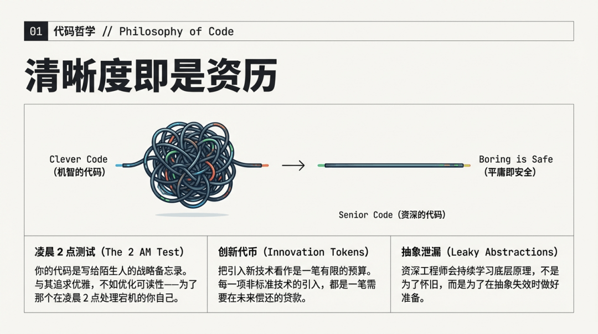
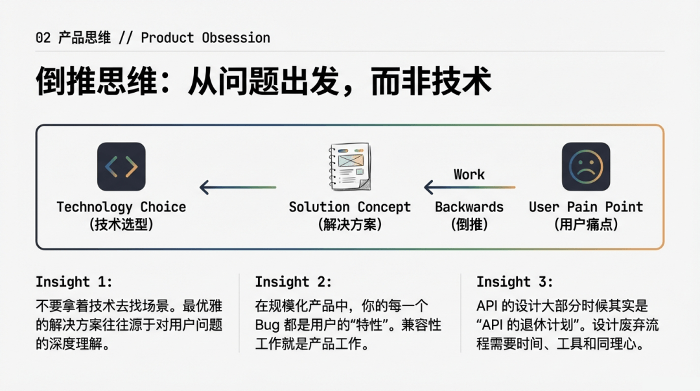
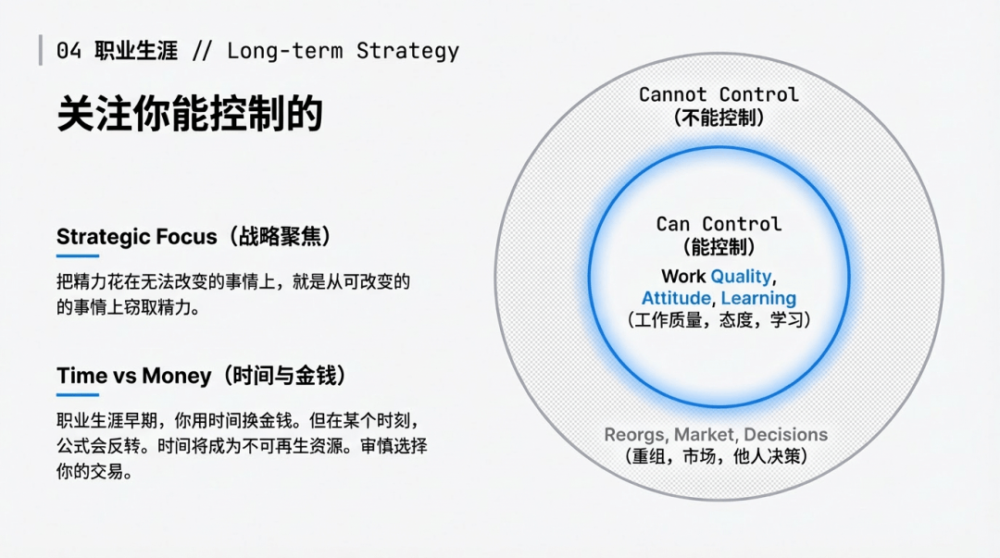
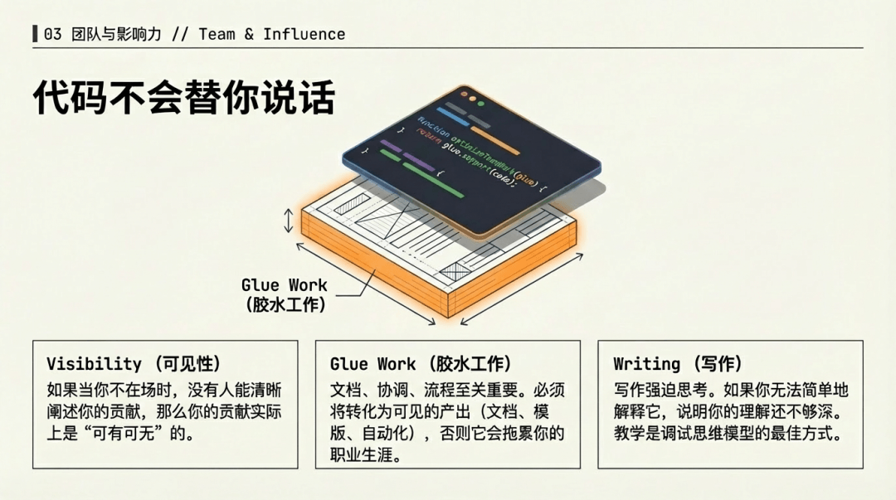
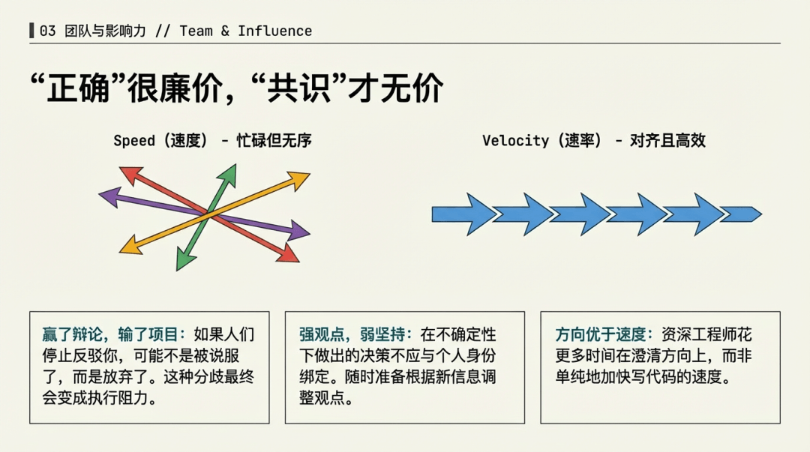
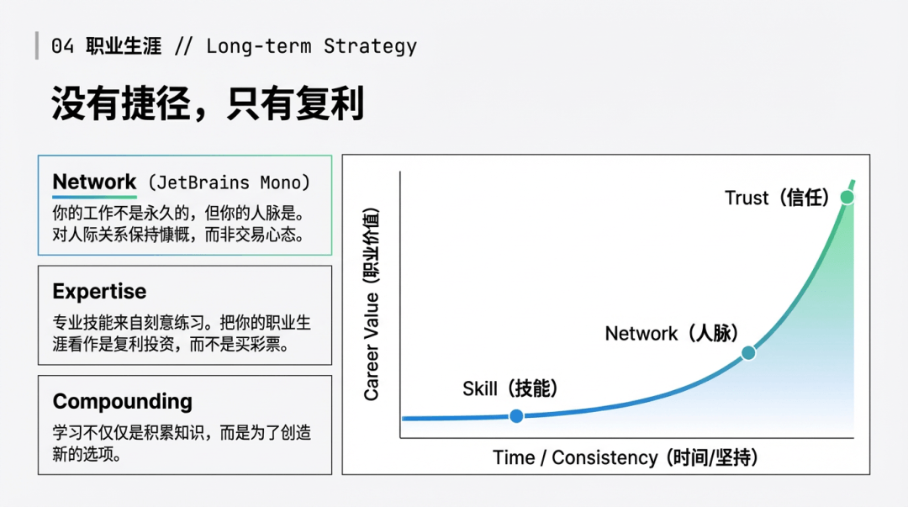
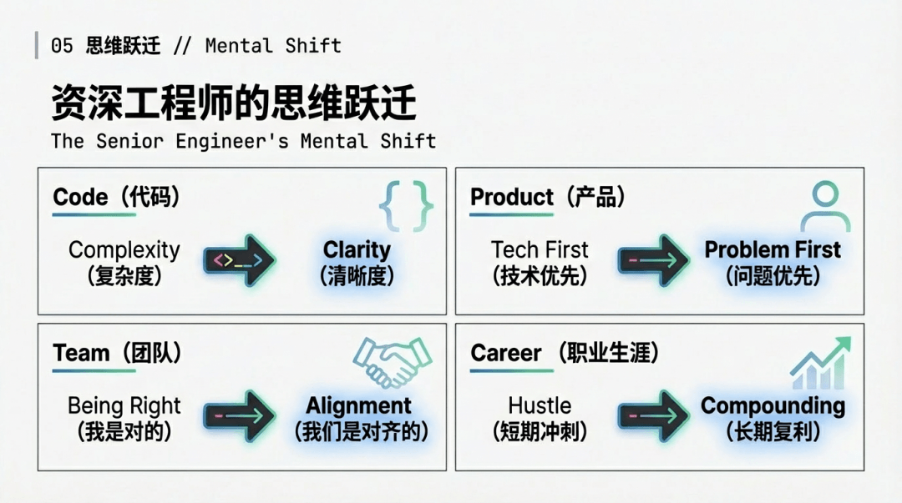

# 【早阅】@Addy Osmani：在 Google 工作 14 年得到的 21 条经验

前言

谷歌工程师 Addy Osmani 分享的 21 条在谷歌工作 14 年的经验教训，涵盖了用户问题、团队合作、技术选择、个人成长等多个方面，强调了在大型科技公司中成功的关键不仅在于技术能力，更在于对人的理解和协作能力。今日前端早读课文章由 @Addy Osmani 分享，@飘飘编译。

> @Addy Osmani 是 Google 的软件工程师，目前从事 Google Cloud 和 Gemini 相关工作。

译文从这开始～～～

大约 14 年前我加入谷歌时，我以为这份工作就是写好代码。这个想法只对了一半。随着时间的推移，我逐渐意识到，真正能在这里茁壮成长的工程师，并不一定是编程能力最强的那批人，而是那些懂得如何在代码之外的复杂环境中游刃有余的人 —— 如何处理人与人之间的关系、政治、方向一致性以及各种模糊不清的情况。

这些经验，是我希望自己能更早明白的。有些本可以帮我少走几个月的弯路，有些则花了我几年时间才真正理解。它们与具体的技术无关 —— 那些技术变化太快，不值得执着。这些经验总结的，是那些在不同项目、不同团队中一再出现的规律。

我分享它们，是因为我从那些愿意分享经验的工程师那里获益匪浅。这算是我向前传递的一种方式。

#### 1\. 最优秀的工程师，都痴迷于解决用户问题

热爱一项技术，并到处找机会应用它，这种诱惑太强了 —— 我也这样做过，几乎每个人都做过。但真正创造最大价值的工程师，会反其道而行：他们首先深入理解用户的问题，并从这种理解中让解决方案自然浮现。

“用户痴迷” 意味着花时间去看支持工单、与用户交流、观察用户的痛点，不断地追问 “为什么”，直到问题的本质被挖掘出来。真正理解问题的工程师，往往能找到出人意料地简单而优雅的方案。

而那些从 “解决方案” 出发的工程师，往往会陷入为自己的设计寻找理由的复杂泥潭。

#### 2\. 只是 “你是对的” 并不值钱，“一起达成对的答案” 才是真功夫

你可以赢下所有的技术争论，但却输掉整个项目。我见过许多聪明绝顶的工程师，因为总是 “房间里最聪明的人”，而悄悄积累了别人的怨气。代价往往在后期显现 —— 项目执行时的 “神秘问题”、团队的 “莫名阻力”。

真正的能力，不是坚持自己对，而是进入讨论时能与他人一起对齐问题，留出空间让别人参与，同时对自己的确定性保持怀疑。

坚定的观点，但不固执己见 —— 并不是因为你缺乏信念，而是因为在充满不确定性的环境下，决策不该与自我身份捆绑。

#### 3\. 行动优先。先做，再改。你可以编辑糟糕的页面，但无法编辑空白页

对完美的追求会让人陷入停滞。我见过工程师花上几周时间讨论一个他们还没动手做的系统的理想架构。完美的解决方案，很少靠 “想” 出来，而是靠与现实接触中不断调整出来。AI 在这方面其实能帮上不少忙。

先做，再做好，再做得更好。尽快把不完美的原型交到用户手上；先写出混乱的设计文档初稿；发布那个让你稍微有点不好意思的 MVP。你从一周的真实反馈中学到的，比一个月的理论争论要多得多。

行动带来清晰，分析过度只会一事无成。

#### 4\. 清晰才是资深的标志，聪明只是累赘

写 “聪明的代码” 几乎是所有工程师的本能 —— 那似乎是能力的证明。

但软件工程真正的挑战，是当时间流逝、他人加入时才开始的。在这样的环境中，清晰不是风格偏好，而是降低操作风险的关键所在。

你的代码是写给那些在凌晨两点系统故障时维护它的陌生人的策略备忘录。优化的目标不是展现你的优雅，而是让他们能读懂。

我最尊敬的高级工程师，都是那些宁可放弃聪明，也要坚持清晰的人。

#### 5\. 新奇是一种贷款，要用宕机、招聘和认知负担来偿还

对待技术选择，就像一个手头只有少量 “创新代币” 预算的组织。每当你采用一个非常规方案，就要花掉一枚代币。而你的预算不多。

重点不是 “永远别创新”，而是 “只在你真正需要创新的地方创新”。其他部分，应该尽量保持平淡无奇，因为平淡的方案意味着可预期、可控的失败模式。

“最合适的工具”，往往其实是 “在多数情况下最不糟糕的工具”—— 因为当系统变成一个 “工具动物园” 时，维护的代价才是真正的痛点。

#### 6\. 代码不会替你发声，但人会

在职业早期，我以为好作品会自己说话 —— 事实并非如此。代码静静地躺在仓库里，不会替你发声。你的经理是否在会议上提到你、同事是否推荐你去参与重要项目，往往决定了你的影响力是否被看见。

在大公司里，很多决策都在你不在场的会议中被做出，基于的还是别人写的简报。参与决策的人可能只有五分钟、同时有十二件事要处理。如果当你不在房间时，没有人能清楚说明你的价值和影响，那么你的价值在决策中就几乎等于 “可有可无”。

这并不只是 “自我推销”。更重要的是让整条价值链都能看懂你在其中扮演的角色 —— 包括你自己。

#### 7\. 最好的代码，是你根本不用写的那段

在工程文化里，我们习惯庆祝 “创造”。可没人会因为删除代码而被提拔 —— 即便删除往往比添加更能提升系统质量。每少写一行代码，你就少了一行需要调试、维护或解释的负担。

在动手之前，先认真问自己一句：“如果我们…… 什么都不做，会怎样？” 有时候答案是 “没什么坏事”，那就是你的解决方案。

问题不在于工程师不会写代码（或不会用 AI 来写），而在于我们太擅长写代码，以至于忘了去问：这段代码真的该存在吗？

#### 8\. 当系统规模足够大时，连你的 bug 都会有用户

只要用户足够多，任何可观察到的行为都会变成依赖项 —— 无论你当初是否这么承诺。有人会抓取你的 API、自动化你的小毛病、缓存你的漏洞。

这让人明白一个职业层面的道理：兼容性工作不是 “维护”，它本身就是产品。

设计弃用功能的过程时，要像设计迁移方案一样，提供时间、工具和同理心。很多所谓的 “API 设计”，其实是 “API 退休” 的艺术。

#### 9\. 大多数 “团队慢” 的问题，其实是方向不一致的问题

当一个项目推进缓慢时，人们的第一反应往往是怪执行：是不是大家不够努力？技术选型错了？人手不够？  
可在大多数情况下，真正的根源不是执行力，而是方向和协同的错位。

在大公司里，团队是并行的最小单元；但团队越多，协调成本就呈几何级增长。很多 “拖慢” 的项目，其实是大家在造不同的轮子，或者造的是不兼容的轮子。

资深工程师花的更多时间，不在 “写得更快”，而在让方向更清晰、接口更合理、优先级更一致 —— 因为真正的瓶颈就在这里。

#### 10\. 专注你能掌控的，忽略你不能的

在大公司中，总有无数事是你无法左右的 —— 组织变动、管理决策、市场变化、产品方向转弯。沉溺于这些，只会带来焦虑，而不会带来掌控感。

那些能保持理性与高效的工程师，往往只聚焦于自己的影响圈。你无法控制重组是否发生，但你能控制自己的工作质量、应对方式，以及能从中学到什么。当不确定性来袭时，把问题拆开，找出你真正能采取的具体行动。

这不是 “被动接受”，而是有策略的专注。把精力花在能改变的事情上，比抱怨不能改变的现实，更有力量。

#### 11\. 抽象不会消除复杂性，只是把复杂性推迟到你值班的那天

每一个抽象层，都是一种赌注 —— 赌你永远不用理解它下面的细节。有时候你会赢，但总会有 “泄漏” 的那天。那时，你需要真正明白自己脚下的系统是什么。

资深工程师即使在技术栈越来越高的情况下，仍会持续学习 “更底层” 的知识。不是因为怀旧，而是为了在凌晨三点、系统出故障、抽象层崩塌时，仍能独自应对。

用好你当前的技术栈，但也要保留对底层原理的理解与敬畏 —— 因为当抽象失效时，那才是真考验。

#### 12\. 写作能逼迫你获得清晰；最好的学习方式，是尝试教别人

写作会强迫你理清思路。当我试着在文档、演讲、代码评审评论，甚至与 AI 对话中向别人解释某个概念时，总能发现自己理解中的漏洞。让知识变得 “对别人也清晰” 的过程，本身就会让你理解得更透彻。

这并不意味着你靠教学就能学会做外科手术，但在软件工程领域，这条规律几乎总是成立。

这不只是 “慷慨分享知识”，其实也是一种自私的学习捷径。如果你觉得自己已经理解透彻，那就试着用最简单的方式讲出来。你一旦卡壳，那里的理解就是浅的。

教学的过程，就是在调试你自己的思维模型。

#### 13\. 那些让其他工作得以顺利开展的工作 —— 无价，却常被忽视

“胶水工作”（Glue Work）指的是那些看似不起眼的事：写文档、帮助新人上手、跨团队协调、改进流程。这些工作对组织至关重要，但如果你没有意识地去管理它，它反而可能拖慢你的技术成长，让你精疲力竭。

陷阱在于：你把它当成 “帮忙”，而不是一种有界、可见、可衡量的影响。

要给它设定时间界限、轮换执行，把成果沉淀成文档、模板或自动化工具。让它变成产出，而不是一种 “性格特质”。

“无价” 又 “隐形”，对职业生涯来说，是最危险的组合。

#### 14\. 如果你每次辩论都赢，那你可能正在积累无声的反抗

我学会了对自己的确定性保持警惕。当我在讨论中 “赢得太容易” 时，通常意味着哪里出了问题。人们停止反驳你，不是因为你真的说服了他们，而是因为他们放弃了 —— 而这种分歧会在执行中显现，而不是在会议上。

真正的共识需要更久的时间。你必须真正理解他人的视角，吸收反馈，甚至要有公开改变自己观点的勇气。

短暂的 “我对了” 的满足感，远远不如和愿意合作的人一起把事做成来得有价值。

#### 15\. 一旦指标变成目标，它就不再能衡量真正的情况

任何暴露给管理层的指标，最终都会被 “优化”—— 不是出于恶意，而是因为人类天生会去迎合被衡量的东西。

如果你统计 “代码行数”，你会得到更多的代码行；如果你衡量 “开发速度”，你会得到膨胀的工期预估。

成熟的做法是：每次设置指标时，都要成对出现。一个衡量速度，一个衡量质量或风险。并且，坚持解读趋势，而不是崇拜阈值。

目标不是监控，而是获得洞察。

#### 16\. 承认 “我不知道”，比假装知道更能让团队安全

资深工程师说出 “我不知道” 并不是软弱的表现，而是在营造一种安全感。当领导承认自己不确定时，会向团队传递一个信号：这里可以坦诚表达、可以提问。

反之，如果最资深的人从不承认困惑，后果会非常糟。没人敢问问题，假设无人质疑，初级工程师以为自己是唯一不懂的人，于是沉默。问题就这样被掩盖，直到爆发。

示范好奇心，团队才会真正学习。

#### 17\. 你的人脉，比你任何一份工作都长久

我职业早期只顾埋头做事，几乎不经营人脉 —— 现在回看，这是个错误。那些愿意花时间建立关系的同事，无论在公司内外，都因此受益多年。

他们能第一时间听到机会，能更快跨团队协作，被推荐参与项目，甚至与多年信任的伙伴共同创业。

工作终会结束，但人脉会留下来。经营它的正确方式，是带着好奇与真诚，而不是功利的算计。

当你准备迈出下一步时，往往是关系为你打开新的大门。

#### 18\. 性能优化的关键，往往是删掉没必要的工作，而不是加上更聪明的逻辑

当系统变慢时，我们的本能是 “加”：加缓存层、加并行、加算法优化。这些有时有效，但我见过更多的性能提升，来自问一句简单的问题：“我们真的需要做这些计算吗？”

删除无用的工作，几乎总比让有用的工作更快更有效。最快的代码，是那段根本不用运行的代码。

在你开始优化之前，先质疑一下：这项工作本身是否真的必要？

#### 19\. 流程存在的目的，是降低不确定性，而不是制造文书工作

好的流程能让协作更顺畅、让失败的代价更低。坏的流程则是官僚作秀 —— 它的存在不是为了帮你成功，而是为了在出问题时能找到 “该怪谁”。

如果一个流程无法解释清楚它如何降低风险或提高清晰度，那它多半就是累赘。

当人们花在 “写报告、填表格” 的时间，已经多过 “实际做事” 的时间，那说明流程已经出了大问题。

#### 20\. 最终，你的时间会比金钱更宝贵 —— 请据此行事

在职业早期，用时间换金钱没问题。但到某个阶段，天平会反转 —— 你会意识到，时间才是唯一不可再生的资源。

我见过很多资深工程师为了升职、为了那几百分点的加薪而拼命，有人成功了，但更多的人在后来问自己：那样的代价真的值得吗？

结论不是 “别努力”，而是：清楚自己在用什么换什么，并且有意识地去做这个选择。

#### 21\. 没有捷径，但有复利效应

专业能力来自刻意练习：不断挑战略高于当前能力的任务 —— 反思 —— 再重复，年复一年。没有任何 “浓缩版” 的成长。

但好消息是：学习是会复利的。当学习让你获得 “新的选择权” 而不只是 “新知识” 时，成长就开始滚雪球。  
写作 —— 不是为了流量，而是为了思考更清晰；构建可复用的模块；把踩过的坑整理成经验手册。

那些把职业当作 “复利曲线” 而不是 “抽奖游戏” 的工程师，往往能走得更远。

#### 最后的思考

虽然有 21 条经验，但其实它们都归结为几个核心原则：  
保持好奇，保持谦逊，并始终记得 —— 工作归根结底是关于 “人” 的。

无论是你服务的用户，还是与你并肩的团队成员。

工程师的职业生涯很长，足够让你犯很多错，也足够让你在错误中成长。  
我最敬佩的工程师，并不是那些 “永远正确” 的人，  
而是那些从错误中学习、分享经验、并一次次重新投入的人。

如果你刚刚起步，请相信：随着时间的积累，这条路会越来越丰富。  
如果你已在其中走得很深，希望这些经验能与你产生共鸣。

关于本文  
译者：@飘飘  
作者：@Addy Osmani  
原文：https://addyosmani.com/blog/21-lessons/

这期前端早读课  
对你有帮助，帮” 赞 “一下，  
期待下一期，帮” 在看” 一下。
