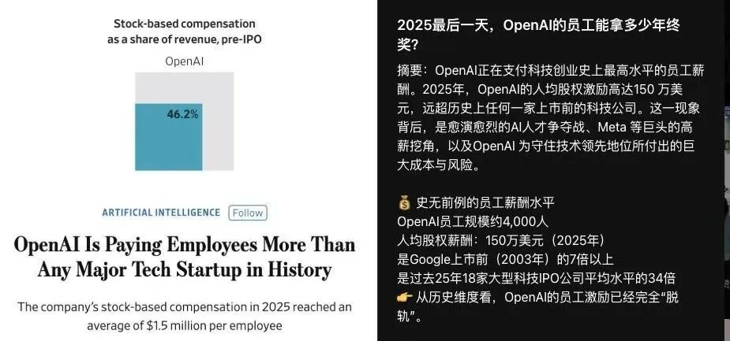
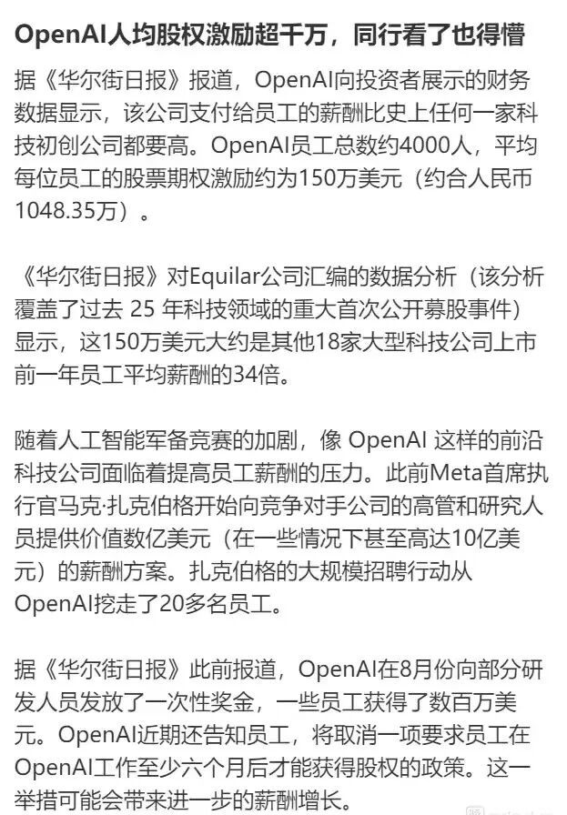

# OpenAI年终奖疯了！人均1050万元

通勤刷热搜被 OpenAI 薪酬暴击：2025 年 4000 人团队人均股权激励 150 万美元（约 1050 万人民币），是同行 34 倍，创科技初创公司薪酬纪录。  
技术圈看法分化：有人吐槽是 “金手铐”，股权绑定上市、离职清零，核心人才分大头，AI 圈贫富差距悬殊；  
也有人认为是 AI 人才战必然，能锁仓核心团队、虹吸顶尖人才，只是拉高行业门槛，小公司难突围；还有人预判会引发行业薪酬连锁反应，但高成本需盈利支撑。  
[#职场福利大揭秘](javascript:;) [#人工智能行业动态](javascript:;) [#科技圈热议话题](javascript:;) [#企业激励机制分析](javascript:;) [#OpenAI薪酬纪录](javascript:;) [#科技初创公司薪酬](javascript:;) [#员工待遇新标杆](javascript:;) [#职场人必看资讯](javascript:;)

广东,1月7日 08:19,

