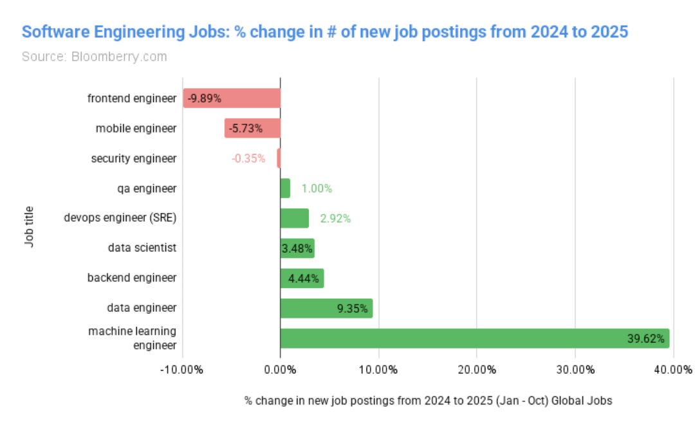
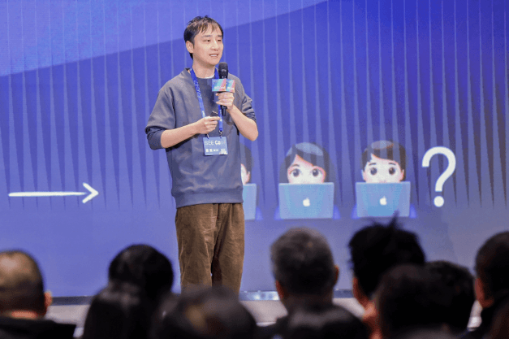
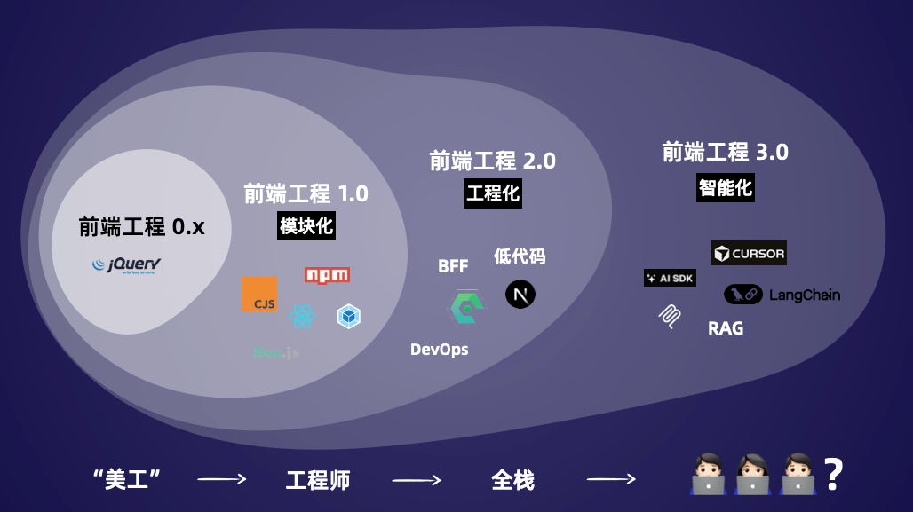
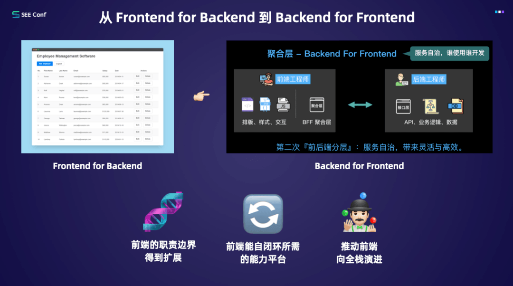
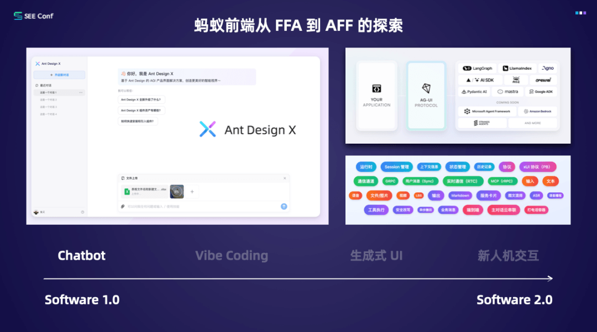
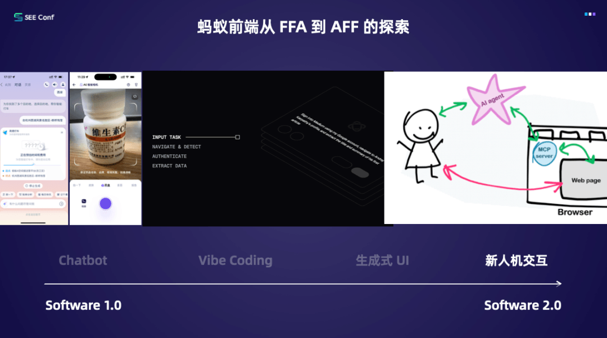

# 全球前端岗位招聘需求断崖下降 9.89%，前端的未来究竟在哪里？

作者 | 陈姚戈

“前端已死”这种说法，每当大模型取得重大突破时就会重新刷屏。就在前几天，Gemini 3 Pro 发布后，“前端工程师要失业了吗？”又一次成为热点话题。

Ant Design 创始人偏右对此开玩笑：“在这一轮 AI 浪潮里，前端已经死过八次了。”

但笑话背后，是一个严肃的问题——前端的未来究竟在哪里？

AI 时代，前端工程师的岗位需求收缩已经成为事实。Revealera 针对全球 1.8 亿招聘信息的分析显示，相比 2024 年同期，2025 年软件工程行业整体岗位数量保持稳定，但前端岗位下降幅度最大，达到 9.89%。

即使是具有超 15 年前端开发经验、如今管理着蚂蚁集团支付宝前端平台的工程师偏右也曾被下滑的数据震到。于是他开始做系统性的调查：分析行业招聘数据、回看前端技术的演进脉络，并重新思考 AI 带来的范式变化。

在刚刚结束的 SEE Conf 蚂蚁终端体验科技大会上，偏右给出了自己的答案 —— **要从人的能力，和技术的演进上找答案。**AI 时代，前端工程师不会消失，但职责会发生融合与转变——利用自身在体验、交互和链路理解上的优势，承担验证（verification）的角色。

为了回答“前端的未来在哪里”这个宏大问题，偏右把它拆成三个更具体的提问：

- 过去十多年里，前端工程师到底演化出了什么核心能力？
- 软件 2.0 时代后，软件开发范式发生了怎样的变化？前端在这其中的位置在哪里？
- 在越来越多代码由模型生成的时代，人到底还能做什么？

这些问题串起来，构成了一段前端演进史，也是一段技术范式转换中“人如何安放自己”的故事。

从美工到全栈：前端工程师演化出了什么能力？

如果把前端分成几个典型阶段，会发现每一次范式变化，都迫使前端工程师长出新能力。

在 jQuery 主导的早期阶段，前端工作核心聚焦于页面样式美化与简单交互实现，行业普遍将前端从业者视为 “页面美工” 而非专业工程师，其在整个软件研发体系中的权重与话语权相对有限。此时的前端工作边界清晰但狭窄，核心产出围绕 HTML、CSS 及基础交互逻辑展开，尚未形成独立的工程化体系。

随着 Web 应用规模持续膨胀，交互逻辑日益复杂、页面复用需求显著提升，传统开发模式已无法应对效率与维护难题。在此背景下，模块化规范、构建工具与包管理体系应运而生，CJS 模块规范、NPM 包管理器及组件化开发体系迅速成为行业主流。

这一阶段的核心变革在于，前端彻底摆脱 “仅编写页面” 的单一定位，建立起完整的工程化方法论 —— 从代码构建、依赖管理到组件抽象、版本控制，每一环均需要系统化设计与规划。正是通过工程化转型，前端第一次在技术复杂度、研发规范性上，与传统软件工程师站在同一水平线，真正确立了 “软件研发核心环节” 的地位。

Node.js 的普及与 BFF（Backend For Frontend）架构的兴起，打破了前端仅局限于 Web 浏览器层的技术边界。前端工程师开始涉足服务端领域，需具备接口聚合层搭建、性能瓶颈排查、后端接口耗时优化、数据模型设计等能力。

从技术演进逻辑来看，BFF 并非一蹴而就的架构创新，而是经历了从 FFB（Frontend For Backend）到狭义 BFF，再到广义 BFF 的渐进式发展：

- 初期阶段以 FFB 为主导：为适配后端应用范式与接口设计，前端先构建面向后端的交互接口（FFB），核心目标是兼容后端技术约束；
- 狭义 BFF 阶段：随着多端（Web、移动端、小程序等）形态涌现，不同前端终端需对接多样化后端服务，此时需构建 “胶水层”（即接口聚合层），统一处理数据转换、接口适配与跨端兼容，这便是狭义上的 BFF；
- 广义 BFF 阶段：当前端具备服务端开发能力后，不再局限于 “胶水层” 角色，而是以用户体验为核心，整合全链路技术资源，形成前端主导的服务层设计视角，彻底打开了前端的技术格局。

偏右表示，从行业视角看，前端工程 2.0 的到来带来了三个深刻变化：

第一，职责边界被迫扩展。前端工作不再局限于 HTML+JSON 的页面层实现，而是延伸至服务端接口设计、数据处理、多端适配等领域，形成 “从用户端到服务端” 的全链路参与。

第二，工具与平台自闭环。前端 / 终端团队能够独立构建专属的研发平台、工具链，不仅满足自身研发需求，还能赋能产品、运营等非技术角色，使其具备前端相关研发任务的执行能力，提升跨团队协作效率。

第三，前端向产品工程师与全栈工程师演进。随着职责不再止步于 UI 层，前端需要思考体验的变化会如何影响数据层设计、接口结构、性能指标等。技术链路与业务链路之间的界面被打通，前端变成了在产品、用户体验、服务端系统之间做权衡的“体验工程师”。

软件 2.0 时代的前端核心能力

AI 时代，软件体系会发生怎样的变化？偏右提醒大家关注 Andrej Karpathy 给出的软件范式演进。

前特斯拉 AI 负责人、OpenAI 联合创始人 Andrej Karpathy 在今年 YC 的演讲 Software in the Era of AI 中，重新梳理了软件范式的演进，这几乎成了过去几个月技术圈讨论最密集的一个主题。其中被传播最广的，是 Karpathy 对软件时代的划分，和 Vibe Coding 这个概念 。

软件 1.0 时代的编程，由人类直接编写的计算机代码构成，开发者通过编写代码，向计算机下达在数字空间执行任务的明确指令。

进入软件 2.0 时代，神经网络的权重参数重新定义了编程逻辑，开发者通过优化数据集、运行优化算法，自动生成神经网络的参数配置。

特斯拉自动驾驶系统的技术演进，就是 软件 2.0 替代 1.0 的典型：随着神经网络的能力提升与规模扩大，原本由 C++ 代码实现的多摄像头时序信息整合等功能，逐步迁移至神经网络完成。

当前，大模型的进步又带来新的范式转折。Karpathy 的定义是：LLM 本身就是一台新型的可编程计算机，而 Prompt 就是它的编程语言。

大模型带来了两个结构性变化。

首先是人类的编程工作，从编写转为了验证（verification）。Karpathy 强调，人与生成式 AI 互动的效率，取决于“生成 - 验证闭环”（generation–verification loop）。也就是说，未来的软件开发中，设计、管理和验证将成为核心能力。

第二重变化来自交互——交互不只关乎用户体验，还会影响编程的安全性。大语言模型是新型计算机，但它同时也是不稳定的、会产生幻觉，可用但不可完全信任。

Karpathy 因此提出，相关应用需要借助一系列交互相关的设计，弥补大语言模型内在的缺陷。

例如借助 GUI/UI/UX 加速验证 (verification) 流程，让人类能快速发现并纠正错误；内置 “调节滑块”(autonomy slide)，允许用户根据任务复杂度控制 AI 的参与程度。

由于 Agent 成为了人之外的“第二用户”，而为人设计的网页很多时候对 Agent 的可读性不高，需要开发 “LLM 友好格式” ，促进 AI 和计算机系统的交互。

而如何把复杂协作关系变得可观察、可控，正是前端工程师最熟悉的工作。前端工程师过去十几年在界面、交互、体验、链路治理上积累的能力，在软件 2.0 后能有很大作为。

偏右针对国内大厂做了一个调研——国内部分大厂前端工程师的社招岗位出现增长，且 JD 中与 AI 相关的要求在迅速增加。同时，AI/Agent 应用工程师正在从现有岗位中分化出来。

**偏右在带领团队的过程中看到，从前端分化出来的人，天然具备更强的产品 sense、更敏锐的用户体验触觉，以及端到端交付能力。**

而这三件事，正是前端工程师在软件 2.0 时代之后的核心竞争力。

AI 时代，蚂蚁前端在做什么探索？

参考从 FFB 到 BFF 的历史演进，偏右在演讲中提出，前端在 AI 时代也会经历类似的路径：从 FFA（Front-end for AI） 走向 AFF（AI for Front-end）。在这条路径中，他将蚂蚁的探索分成了四个连续的阶段，每一阶段都代表着前端在软件 2.0 环境下能力边界的进一步外溢。

Chatbot 形态是蚂蚁前端 AI 探索的起点，核心代表产品为 Ant Design X 与 AG-UI。偏右表示，两三年前“聊天窗口是不是终局 UI”还是行业争论的热点，如今答案变得清晰，对话式界面天然贴近人类的思维方式，它不需要教学成本，也能容纳足够多的复杂度。偏右介绍，蚂蚁前端后续将进一步开放 “从服务端到前端” 的全链路流式对话解决方案。

Vibe Coding 形态以 Weavefox 为核心代表，聚焦于 AI 与研发流程的深度融合，提供两种核心使用模式：一是嵌入式适配，如同 Cursor 工具一般融入现有工程流，在代码编写、调试、重构等环节提供实时辅助；二是对话式驱动，工程师通过自然语言与模型进行协作。

第三阶段，蚂蚁把探索进一步推向“生成式 UI”。和 Gemini 3 Pro 同期发布的“灵光”尝试让模型直接生成界面结构和代码。

与此同时，偏右也强调了 AI 生成代码的固有风险，比如行业公认的：模型可能存在幻觉现象，甚至生成具有攻击性的不安全代码等。对此，当前的行业共识是构建约束性方案，在保证模型泛化能力与表达性的前提下，划定明确的能力边界，避免 AI 输出越界，确保交付结果的安全性与可靠性。这一理念与 Andrej Karpathy 关于大模型应用的核心观点高度一致，即人类需在 AI 生成过程中承担起验证与控制的核心职责。

同时，新人机交互阶段正在到来。交互方式的改变，也会带来 GUI 的改变，将前端的关注焦点从 “人与 UI 的交互” 转向 “机器与 UI 的协同，或机器与物理世界的连接，在这一层我们前端工程师和用户体验工程师大有可为。”偏右说。

在 AI 时代，代码生成能力会越来越强，但体验、交互、验证链路的复杂性也会越来越高。Lovable、Weavefox、Gemini 展示出了强大的代码生成能力，但我们还需要人来验证和实现好的体验、正确的交互。

产品 sense、对用户体验的理解，以及全链路交付能力，这些前端工程师不断积累获得的能力，也是这个时代的稀缺能力。

今年的 SEE Conf 演讲中，偏右表示：“从可指定性到可验证性，我们前端工程师会在 AI 时代负责用户体验和工程实践的 Verify，我们要做那个验证的人。”

在大模型不断刷新边界的当下，这句话或许能为仍在一线的前端工程师提供一个更清晰的方向和鼓励。

今日好文推荐

[完整前端代码突然公开？苹果把App Store“老底”都揭了，开发者社区炸锅！](https://mp.weixin.qq.com/s?__biz=MzUxMzcxMzE5Ng==&mid=2247526357&idx=1&sn=6ef10df8180a60a78224c93566659990&scene=21#wechat_redirect)

[小鹏IRON“脱皮证非人”、字节豪掷800多亿，人形机器人竞争太激烈啦！](https://mp.weixin.qq.com/s?__biz=MjM5MDE0Mjc4MA==&mid=2651262597&idx=1&sn=a0c6cc96270d8cda5a59d5d034a50a7c&scene=21#wechat_redirect)

[黄仁勋、李飞飞、Yann LeCun等六位AI顶级大佬最新对话：AI到底有没有泡沫？](https://mp.weixin.qq.com/s?__biz=MjM5MDE0Mjc4MA==&mid=2651262532&idx=1&sn=50244267d5cfc148383e7be37512cc3a&scene=21#wechat_redirect)

[“我不想一辈子只做PyTorch！”创始人8年封神后宣布卸任，AI 圈进入接班时刻](https://mp.weixin.qq.com/s?__biz=MjM5MDE0Mjc4MA==&mid=2651262386&idx=1&sn=a4b9548ec05ae8ce8b78f0d783b86dfa&scene=21#wechat_redirect)

