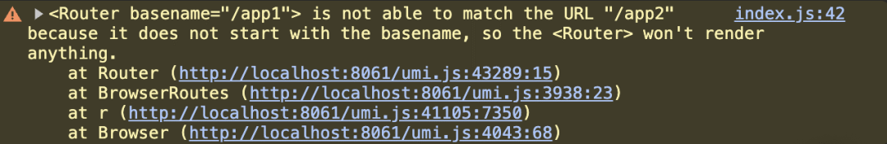

# 基于微前端 qiankun 多实例保活的工程实践

### 一、业务背景与痛点

在中后台系统的实际业务场景中，通常会遇到以下场景：

- **订单管理**：用户正在填写一张复杂的订单表单，已输入大量数据
- **库存查询**：需要临时切换到这里查询商品库存
- **客户信息**：需要确认客户的收货地址

在传统的实现中，当用户从"订单管理"切换到"库存查询"时：

1. 订单管理页面**被重置**
2. 已填写的表单数据**全部丢失**
3. 筛选条件、展开的树节点等状态**全部清空**

当用户查完库存返回时，不得不：

- 重新加载订单管理页面
- 重新填写所有表单字段
- 重新定位到之前的操作位置

这种体验对于需要**频繁切换**的中后台场景来说是**不可接受**的。

业务诉求：实现类似浏览器多标签页的效果：

- ✅ 页面切换时保留完整状态（表单输入、滚动位置、展开/收起状态等）
- ✅ 无需重新加载，瞬间切换
- ✅ 支持多个路由同时"存活"

在单独运行的子应用（非微前端场景），通常可以通过 Vue 的 keep-alive、React 的路由缓存等技术手段来实现，而在微前端架构下，又该如何实现该效果呢，或者说如何实现**多实例保活**的能力呢？

在深入解决方案之前，我们需要先理解 qiankun 沙箱机制的核心原理。

### 二、qiankun 沙箱机制原理

#### 2.1 为什么需要沙箱？

微前端架构中，多个子应用可能来自不同团队、使用不同技术栈，它们共享同一个浏览器运行环境。如果不加隔离，会产生以下问题：

- **全局变量污染**：子应用 A 定义的 `window.config` 可能被子应用 B 覆盖
- **事件监听泄漏**：子应用卸载后，注册的 `addEventListener` 仍在执行
- **样式冲突**：不同子应用的 CSS 规则相互影响

qiankun 通过 **JavaScript 沙箱** 机制解决全局变量隔离问题。

#### 2.2 ProxySandbox 核心原理

qiankun 提供了三种沙箱方案，其中 `ProxySandbox` 是多实例保活场景的唯一选择：


| 沙箱类型 | 实现原理 | 多实例支持 | 适用场景 |
| --- | --- | --- | --- |
| SnapshotSandbox | 激活时快照、失活时 diff 恢复 | ❌ 不支持 | 不支持 Proxy 的低版本浏览器 |
| LegacySandbox | 单例代理，记录变更 | ❌ 不支持 | 只有一个子应用激活的场景 |
| ProxySandbox | 为每个实例创建独立 fakeWindow | ✅ 支持 | 现代浏览器（推荐） |


**ProxySandbox 的工作原理**：

```
┌─────────────────────────────────────────────────────────────┐
│                      真实 window 对象                        │
└─────────────────────────────────────────────────────────────┘
                              ▲
                              │ 读取白名单属性 / 原生方法
        ┌─────────────────────┼─────────────────────┐
        │                     │                     │
        ▼                     ▼                     ▼
┌───────────────┐    ┌───────────────┐    ┌───────────────┐
│  Proxy 代理层  │    │  Proxy 代理层  │    │  Proxy 代理层  │
│   (子应用 A)   │    │   (子应用 B)   │    │   (子应用 C)   │
├───────────────┤    ├───────────────┤    ├───────────────┤
│  fakeWindow A │    │  fakeWindow B │    │  fakeWindow C │
│  ┌─────────┐  │    │  ┌─────────┐  │    │  ┌─────────┐  │
│  │ config  │  │    │  │ config  │  │    │  │ config  │  │
│  │ myVar   │  │    │  │ myVar   │  │    │  │ myVar   │  │
│  └─────────┘  │    │  └─────────┘  │    │  └─────────┘  │
└───────────────┘    └───────────────┘    └───────────────┘
      各自独立                各自独立                各自独立
```
核心代码简化示意：

```
class ProxySandbox {
private fakeWindow: Record<PropertyKey, any> = {};

constructor() {
    this.proxy = new Proxy(this.fakeWindow, {
      get: (target, prop) => {
        // 优先从 fakeWindow 读取
        if (prop in target) {
          return target[prop];
        }
        // 白名单属性从真实 window 读取
        returnwindow[prop];
      },
      set: (target, prop, value) => {
        // 所有写操作都写入 fakeWindow，不污染真实 window
        target[prop] = value;
        returntrue;
      }
    });
  }
}
```
#### 2.3 沙箱的激活与失活生命周期

qiankun 沙箱有明确的生命周期管理：

```
子应用加载 ──► beforeLoad ──► 执行入口脚本 ──► mount ──► 沙箱激活
                                                          │
                                                          ▼
                                              副作用 patch 开始生效
                                              (Interval/Listener/History)
                                                          │
                                              ◄───────────┘
                                                          │
用户切换路由 ──► unmount ──► 沙箱失活 ──► 副作用清理 ──► DOM 移除
```
**关键时机说明**：

1. 沙箱激活 (active)：调用 `sandbox.active()`，Proxy 开始拦截
2. **副作用 patch**：在 `mount` 阶段对 `setInterval`、`addEventListener` 等进行劫持
3. 沙箱失活 (inactive)：调用 `sandbox.inactive()`，清理记录的副作用

理解了沙箱机制后，我们来分析在多实例保活场景下会遇到哪些具体的技术挑战。

### 三、技术难点分析

实现微前端多实例保活，有哪些技术难点：

#### 3.1：应用实例的保活与激活

**关键点**：在路由切换时保留应用状态，而非销毁重建。

对于单体应用，这个问题已有成熟方案：

- **Vue 项目**：使用内置的 `<keep-alive>` 组件即可
- **React 项目**：需要自行实现路由缓存，核心思路是**缓存组件实例**而非销毁

**对应到 qiankun 场景**：

本质上 qiankun 仍然是一个 SPA 应用，只是通过路由规则将不同的路由分发到对应的子应用。因此我们可以套用相同的思路：

- 子应用切换时：**隐藏**当前子应用实例（而非调用 unmount）
- 再次激活时：**显示**已缓存的实例并渲染
- 关键要点：**隐藏而非销毁** DOM 节点

#### 3.2：多沙箱并存的隔离

**关键点**：多个子应用同时保活，意味着多个沙箱需要同时激活且互不干扰。

**解法**：

启用 `ProxySandbox`（多实例代理沙箱）。它为每个子应用创建独立的 fakeWindow 副本，确保多个子应用可以同时激活且全局变量互不污染。

基于以上分析，我们开始实战（核心技术栈：umijs 4 + qiankun + react，\[代码仓库\](https://github.com/asyncguo/qiankun-multi-instance)）。

  

主应用核心实现：

```
interface CachedApp {
  microApp: string
  element: React.ReactElement | null
}

exportdefaultfunction Layout() {
// 保活实例缓存池
const cache = useRef<CachedApp[]>([])
const element = useOutlet()
const routeProps = useRouteProps()
const { microApp } = routeProps

// 首次访问时加入缓存池
if (!cache.current.find(r => r.microApp === microApp)) {
    cache.current.push({
      microApp,
      element
    })
  }

return (
    <div>
      {/* 所有已缓存的子应用同时渲染，通过 hidden 控制显隐 */}
      {
        cache.current.map((app) => {
          return (
            <div
              key={app.microApp}
              hidden={app.microApp !== microApp}
            >
              {app.element}
            </div>
          )
        })
      }
    </div>
  );
}
```
然而在真实环境运行时，子应用在切换过程中会丢失状态，浏览器的 warning 信息如下：



接下来我们需要深入分析问题的具体原因。

### 四、问题分析与定位

#### 4.1：React Router 为什么触发 warning？

通过 warning 执行栈定位到 React Router 的 Router 组件。根因是 `pathname` 与 `basename` 不匹配时，`stripBasename` 返回 `null`，导致 Router 组件渲染空内容并抛出警告。

```
export function Router({
  // ...
}: RouterProps): React.ReactElement | null {
let locationContext = React.useMemo(() => {
    // pathname 和 basename 不匹配时返回 null
    let trailingPathname = stripBasename(pathname, basename);
    if (trailingPathname == null) {
      returnnull;
    }
  }, [basename, pathname, search, hash, state, key, navigationType]);

  warning(
    locationContext != null,
    `<Router basename="${basename}"> is not able to match the URL ` +
      `"${pathname}${search}${hash}" because it does not start with the ` +
      `basename, so the <Router> won't render anything.`
  );

if (locationContext == null) {
    returnnull;
  }

return (
    <NavigationContext.Provider value={navigationContext}>
      <LocationContext.Provider children={children} value={locationContext} />
    </NavigationContext.Provider>
  );
}
```
**具体原因**：非激活子应用（basename=/app1）收到了不属于它的路由变化通知（pathname=/app2/xxx），导致匹配失败。

那么问题来了：为什么非激活状态的子应用还会响应路由变化？

#### 4.2：非激活子应用为什么触发 Re-render？

**调用链分析**：

```
路由变化 (pushState/popstate)
        │
        ▼
window.dispatchEvent('popstate')  ◄── 全局事件，所有监听者都会收到
        │
        ├──► 子应用 A 的 history.listen 回调执行
        ├──► 子应用 B 的 history.listen 回调执行  ◄── 问题：即使 B 已"隐藏"
        └──► 子应用 C 的 history.listen 回调执行
                    │
                    ▼
        BrowserRoutes 组件 setState
                    │
                    ▼
        Router 组件 re-render ──► basename 不匹配 ──► Warning + 渲染失败
```
分析具体代码链路：

1. umijs 的 \[BrowserRoutes\](https://github.com/umijs/umi/blob/master/packages/renderer-react/src/browser.tsx) 通过 history.listen 订阅路由变化
2. \[history\](https://github.com/remix-run/history/blob/dev/packages/history/index.ts[#L430](javascript:;)) 内部通过 window.addEventListener 监听 popstate事件
3. 路由切换时触发全局 `popstate` 事件，**所有订阅回调执行**
4. 导致所有子应用的 BrowserRoutes 重新渲染，进而触发 Router 的 re-render

```
function BrowserRoutes(props) {
  // ...
  useLayoutEffect(() => history.listen(setState), [history]);
  useLayoutEffect(() => {
    return history.listen(onRouteChange);
  }, [history, props.routes, props.clientRoutes]);
  return (
    <Router
      navigator={history}
      location={state.location}
      basename={props.basename}
    >
      {props.children}
    </Router>
  );
}
```
**具体原因**：多个子应用的 `history.listen` 都注册在同一个全局 window 上，路由变化时所有子应用都会响应。

按理说 qiankun 的沙箱应该隔离 `window.addEventListener`，并且 qiankun 对 `setInterval`、`addEventListener`、`history.listen` 都有 \[patch\](https://github.com/umijs/qiankun/blob/master/src/sandbox/index.ts[#L90](javascript:;))，为什么这里没生效？

  

#### 4.3：为什么 addEventListener 没被 patch 住？

要理解这个问题，需要先了解一个关键概念——**沙箱逃逸（Sandbox Escape）**。

##### 什么是沙箱逃逸？

沙箱逃逸是指代码绕过沙箱的代理机制，直接访问到真实的全局对象。一旦发生逃逸，在真实对象上的操作将无法被沙箱追踪和清理。

```
正常路径（被沙箱拦截）：
子应用代码 ──► proxy.addEventListener ──► 沙箱记录 ──► 卸载时自动清理 ✅

逃逸路径（绕过沙箱）：
子应用代码 ──► document.defaultView ──► 真实 window ──► addEventListener
                                                              │
                                              沙箱无法感知，卸载后仍存在 ❌
```
> ❝
> 
> 除此之外还有**修改原型链**、**修改深层对象属性**等方式也会触发沙箱逃逸，这部分内容可以自行了解。

##### React Router 的逃逸路径分析

**Step 1：qiankun 为何不代理 document？**

qiankun 的 ProxySandbox 对 `document` 的访问会返回真实的 document 对象。这是**有意为之**——子应用必须操作真实 DOM 才能渲染内容（详见 qiankun document 沙盒环境讨论 \[issue [#493](javascript:;)\](https://github.com/umijs/qiankun/issues/493[#issuecomment](javascript:;)\-619707583)，\[issue [#1175](javascript:;)\](https://github.com/umijs/qiankun/issues/1175)，\[issue [#1555](javascript:;)\](https://github.com/umijs/qiankun/issues/1555)）：

  

```
// qiankun ProxySandbox 源码
get: (target, prop) => {
  if (prop === 'document') {
    return this.document;  // 返回真实 document，未代理
  }
  // ...
}
```
**Step 2：React Router 如何触发逃逸？**

React Router 的 history 库通过 `document.defaultView` 获取 window 对象：

```
// remix-run/history 源码
export function createBrowserHistory(options = {}) {
  // 关键：通过 document.defaultView 获取 window
  // 由于 document 未被代理，这里拿到的是真实 window！
  let { window = document.defaultView! } = options;

  // 在真实 window 上注册监听器，绕过了沙箱的 patch
  window.addEventListener('popstate', handlePop);
}
```
由于 `document.defaultView === window`（真实 window），所有子应用的路由监听器最终都注册在同一个全局 window 上。

```
┌─────────────────────────────────────────────────────────────────┐
│                         子应用代码执行                           │
└─────────────────────────────────────────────────────────────────┘
                                │
                                ▼
┌─────────────────────────────────────────────────────────────────┐
│              ProxySandbox (fakeWindow 代理层)                    │
│  ┌─────────────────────────────────────────────────────────┐    │
│  │ get(prop) {                                              │    │
│  │   if (prop === 'window') return proxy; // ✅ 拦截       │    │
│  │   if (prop === 'document') return document; // ⚠️ 逃逸  │    │
│  │ }                                                        │    │
│  └─────────────────────────────────────────────────────────┘    │
└─────────────────────────────────────────────────────────────────┘
         │                                    │
         │ window.xxx                         │ document.defaultView
         ▼                                    ▼
    ┌──────────┐                      ┌─────────────┐
    │ 被拦截   │                      │  真实 window │
    │ fakeWindow│                      │  (逃逸成功)  │
    └──────────┘                      └─────────────┘
```
##### qiankun 的 addEventListener patch 为何失效？

熟悉 qiankun 源码的同学可能会问：\[addEventListener 做过 patch\](https://github.com/umijs/qiankun/blob/fc81b6241086c473ddff09d1ed1e19b5722926ee/src/sandbox/patchers/windowListener.ts[#L80](javascript:;))

关键在于 patch 的对象是**`proxy.addEventListener`**，而非真实 window 上的方法。当 React Router 通过 `document.defaultView` 拿到真实 window 后，调用的是**未被 patch 的原生 addEventListener**，自然无法被沙箱追踪。

```
qiankun patch 的是：proxy.addEventListener  ──► 被劫持 ✅
React Router 调用的是：window.addEventListener（通过 document.defaultView 获取）──► 未被劫持 ❌
```
这个问题不仅存在于多实例保活场景，在普通的 qiankun 子应用中也存在（详见 \[umi issue [#12484](javascript:;)\](https://github.com/umijs/umi/issues/12484)）。只是在多实例保活场景下，由于子应用不会触发 unmount，问题被放大暴露出来。

  

> ❝
> 
> 这也印证了 qiankun 官方文档的说明：\[如何同时激活两个微应用？\](https://qiankun.umijs.org/zh/faq#%E5%A6%82%E4%BD%95%E5%90%8C%E6%97%B6%E6%BF%80%E6%B4%BB%E4%B8%A4%E4%B8%AA%E5%BE%AE%E5%BA%94%E7%94%A8)
> 
> 页面上不能同时显示多个依赖于路由的微应用，因为浏览器只有一个 url，如果有多个依赖路由的微应用同时被激活，那么必定会导致其中一个 404。

问题的原因已经明确：沙箱逃逸导致副作用无法隔离。接下来我们设计针对性的解决方案。

### 五、解决方案设计

多实例保活场景下，子应用实例未触发 \[unmount\](https://github.com/umijs/qiankun/blob/master/src/sandbox/index.ts[#L105C11](javascript:;)\-L105C18)，加上沙箱逃逸导致副作用（如 popstate 监听器）持续累积，引发保活失效。接下来可以通过 patch React Router History 的方式来解决。

  

**核心思路**：拦截 `history.listen`，在回调函数中增加路由匹配判断，只有路由匹配的子应用才执行订阅回调。

```
路由变化通知
     │
     ▼
┌─────────────────────────────────────────┐
│         包装后的 listen 回调             │
│  ┌───────────────────────────────────┐  │
│  │ if (pathname.startsWith(basename))│  │
│  │   执行原始回调 ✅                  │  │
│  │ else                              │  │
│  │   忽略本次通知 🚫                  │  │
│  └───────────────────────────────────┘  │
└─────────────────────────────────────────┘
```
利用 umi 的 `modifyClientRenderOpts` 插件钩子实现：

```
/**
 * patch history.listen，确保只有路由匹配的子应用响应路由变化
 * 注意：确保该插件最后执行，避免 patch 被覆盖
 */
exportconst modifyClientRenderOpts = (context: any) => {
// 仅在 qiankun 子应用模式下且开启保活功能时生效
if (window.__POWERED_BY_QIANKUN__ && !!context.enablePatchHistory) {
    const { history, basename } = context;
    const rawHistoryListen = history.listen;

    history.listen = (fn: any) => {
      const listener = (...args: any[]) => {
        const { location } = args[0];

        // 核心逻辑：仅当路由匹配当前子应用时才执行回调
        if (location.pathname.startsWith(basename)) {
          fn(...args);
        }
        // 不匹配时静默忽略，避免触发 re-render
      };

      const unlistener = rawHistoryListen(listener);
      return() => unlistener();
    };

    return context;
  }

return context;
};
```
接下来，再考虑下直接通过 window.addEventListener 注册的监听器，即子应用在初始化阶段（mount 前）通过 `headScripts` 等方式注册了全局监听器：

```
// umirc.ts - 这类副作用在沙箱 patch 生效前就已注册
export default defineConfig({
  headScripts:[
    `window.addEventListener("popstate", function(){
        console.log("========= app1 popstate change =========");
      })`
  ]
});
```
同样会被继续执行，问题原因：qiankun 的副作用 patch 发生在 `mount` 阶段，而入口脚本执行在此之前：

```
export function createSandboxContainer() {
  return {
    async mount() {
      /* ------------------------------------------ 1. 启动/恢复 沙箱------------------------------------------ */
      sandbox.active();

      /* ------------------------------------------ 2. 开启全局变量补丁 ------------------------------------------*/
      // render 沙箱启动时开始劫持各类全局监听，尽量不要在应用初始化阶段有 事件监听/定时器 等副作用
      mountingFreers = patchAtMounting(...);
    }
  };
}
```
**解法**：在 `beforeLoad` 钩子中提前 patch：

```
// 主应用配置
registerMicroApps([{
  name: 'app1',
  entry: '//localhost:6001',
  container: '#container',
  activeRule: '/app1',
  props: {
    // 通过 beforeLoad 提前 patch
    beforeLoad: async (app) => {
      patchWindowAddEventListener(app.name);
    }
  }
}]);
```
> ❝
> 
> **注**：根据实际业务场景决定是否需要实现此增强方案。大多数情况下，方案一已足够解决问题。

### 六、总结与展望

通过深入分析 qiankun 的沙箱机制和逃逸路径，我们成功实现了多实例保活能力。核心解决思路是：**在沙箱无法覆盖的逃逸点进行精准 patch**。

然而在实践过程中也发现，手动 patch 沙箱副作用需要处理大量边界场景，实现成本较高。

需要特别注意的是，当前方案主要解决了核心功能实现，在生产环境落地时仍需关注以下工程化问题：

- **性能边界**：多实例常驻内存会导致资源消耗激增，可以动态配置开启保活的子应用个数
- **监控体系**：接入内存占用、实例数量、渲染性能等关键指标的实时监控

#### 其他可行方案

除了上面实践的方案，还有以下思路可供参考：

**思路一：基于 iframe 的沙箱隔离（如 Wujie）**

利用 iframe 天然的隔离特性实现多实例保活，但同样需要处理：

- iframe 与主应用的路由同步
- DOM 节点的跨 iframe 渲染

**思路二：框架层的状态快照机制**

上面方案是在主应用层实现实例保活，另一个思路是从子应用框架层入手：

- 参考 SSR 的设计理念，在框架层实现状态快照与恢复
- 通过缓存 Virtual DOM 或渲染结果，在重新挂载时快速恢复现场

  

\[完整代码仓库\](https://github.com/asyncguo/qiankun-multi-instance)

  

  

---

  


- 我是 ssh，工作 6 年+，阿里云、字节跳动 Web infra 一线拼杀出来的资深前端工程师 + 面试官，非常熟悉大厂的面试套路，Vue、React 以及前端工程化领域深入浅出的文章帮助无数人进入了大厂。
- 欢迎`长按图片加 ssh 为好友`，我会第一时间和你分享前端行业趋势，学习途径等等。2025 陪你一起度过！
- 
- 关注公众号，发送消息：
  
  指南，获取高级前端、算法**学习路线**，是我自己一路走来的实践。
  
  简历，获取大厂**简历编写指南**，是我看了上百份简历后总结的心血。
  
  面经，获取大厂**面试题**，集结社区优质面经，助你攀登高峰

因为微信公众号修改规则，如果不标星或点在看，你可能会收不到我公众号文章的推送，请大家将本**公众号星标**，看完文章后记得**点下赞**或者**在看**，谢谢各位！
