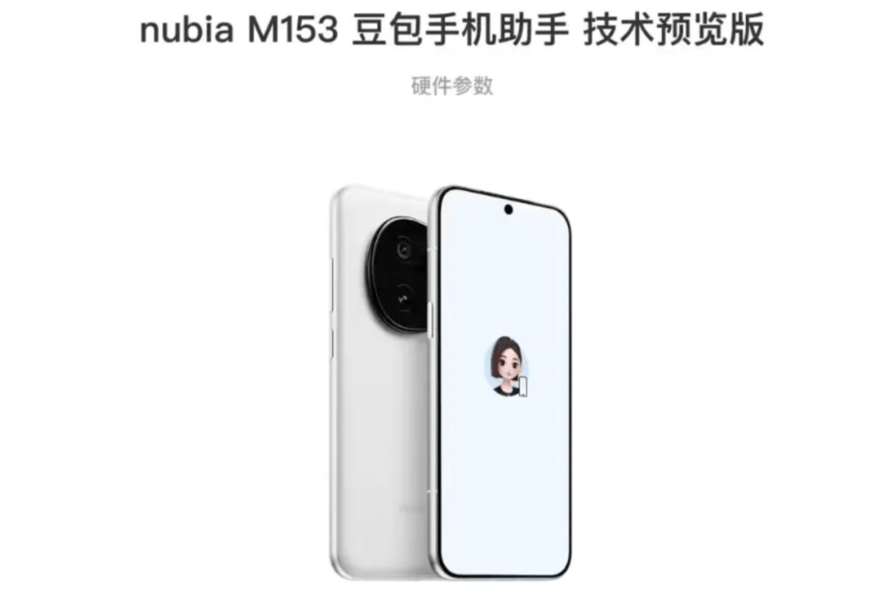
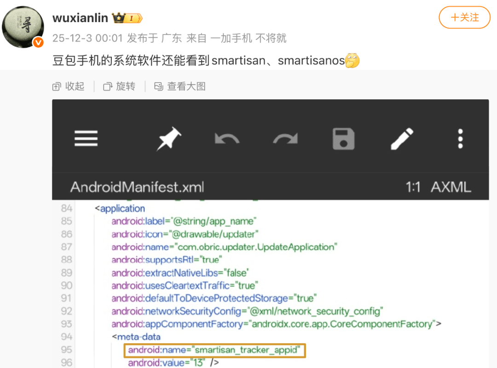
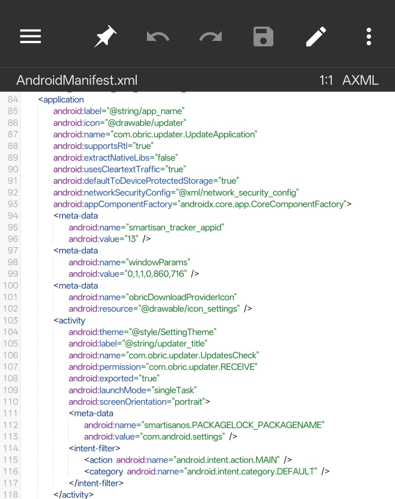
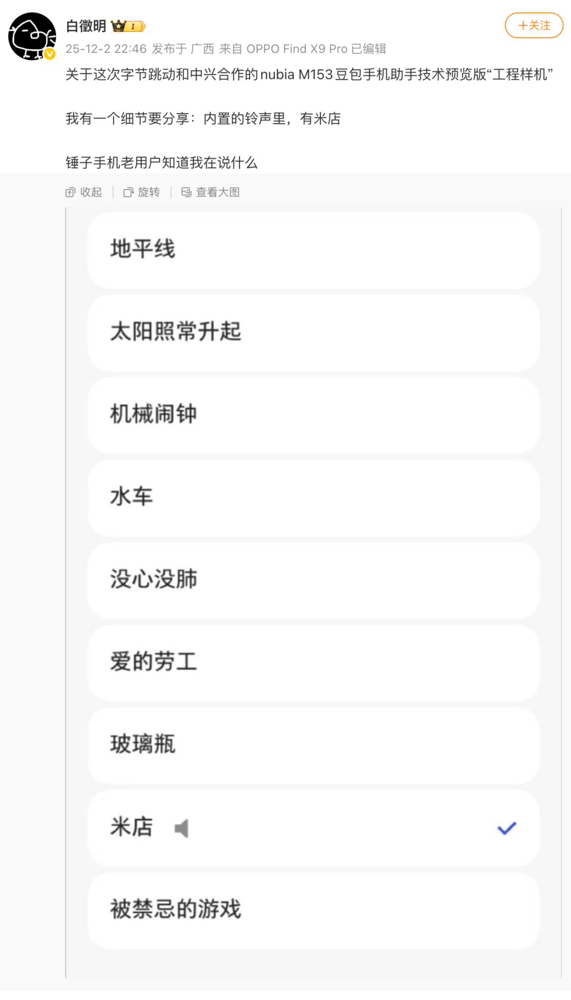

# “豆包手机”使用了锤子科技Smartisan OS祖传代码

> 转自：OSC开源社区

豆包和中兴通讯近日宣布，搭载“豆包手机助手”技术预览版的工程样机努比亚 M153 已少量发售。

开发者 @wuxianlin 对这款“豆包手机”的工程样机进行系统拆包后发现了 Smartisan、SmartisanOS 相关的代码。

另外，博主 @白徵明 还发现，该手机内置的铃声里有“米店”（“米店”是锤子手机的内置手机铃声之一）。

根据公开信息，字节跳动于 2018 年底收购锤子科技坚果手机团队及部分专利。

“豆包手机助手”的主力研发团队是字节负责 AI 硬件的 Ocean，它隶属于字节 AI 产品大部门 Flow，长期探索“大模型+超级 App+硬件终端”的三位一体布局。此次与中兴的合作正是该战略在手机领域的重要落子。

该团队主要成员来自字节多年来先后收购的一些硬件产品团队，如锤子手机、VR 头显 PICO、智能耳机 Ola Dance 等。

因此锤子科技手机系统团队的“代码遗产”出现在这款 AI 手机助手中也就不足为奇了，毕竟复用底层代码（懒得改）是程序员的一贯做法。

推荐阅读  点击标题可跳转

1、[让字距随字体自适应变化的 CSS 技巧](https://mp.weixin.qq.com/s?__biz=MzAxODE2MjM1MA==&mid=2651623449&idx=2&sn=fe2deab3fd0464e235236ca93c2739de&scene=21#wechat_redirect)

2、[Ant Design 6.0 来了！这一次它终于想通了什么？](https://mp.weixin.qq.com/s?__biz=MzAxODE2MjM1MA==&mid=2651623418&idx=1&sn=7c3f560db0837b29a5d6bbd301c9ea0b&scene=21#wechat_redirect)

3、[马斯克又夸微信：“中国之外不存在这种国民级软件”。网友神吐槽：“几乎每个 APP 都有你说的功能，就问吊不吊”](https://mp.weixin.qq.com/s?__biz=MzAxODE2MjM1MA==&mid=2651623449&idx=1&sn=6ed4bdab4d0b06164636b230f3cb9b96&scene=21#wechat_redirect)
