# 淘天集团自营技术运营算法团队4年2次荣膺 INFORMS“杰出实践奖”决选荣誉：以策略正则化突破DRL在库存管理中的落地瓶颈

  

  

  

2025年10月，淘天集团自营技术运营算法团队的研究成果《DeepStock: Reinforcement Learning with Policy Regularizations for Inventory Management》荣获运筹学与管理科学领域极具声望的 “Daniel H. Wagner 杰出实践奖”（Daniel H. Wagner Prize for Excellence in the Practice of Advanced Analytics and Operations Research）决选荣誉。值得一提的是，这是该团队继 2022 年首次入选该奖项决选名单后，第二次获此殊荣，彰显其在工业级智能决策系统领域的持续领先能力。

  

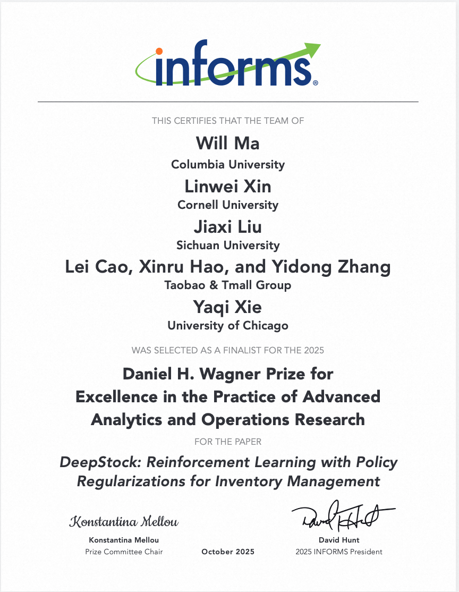

  

前⾔

  

本研究创新性地将库存理论中的经典策略直觉融入深度强化学习（DRL）框架，提出“策略正则化”（Policy Regularization）方法，显著提升了 DRL 在复杂库存场景中的训练效率、可解释性与最终性能。论文巧妙建模，解决了工业界优化在架率周转等多个计算复杂的核心库存指标而非优化库存成本单一可累加指标的难点。目前，该算法已100% 全量部署于淘天集团自营体系（包括天猫超市、国际直营等业务），覆盖超过 100 万 SKU-仓库组合。在有货率（Service Rate）保持稳定的前提下，库存周转天数优化 7%，对于每50亿的库存规模，年化减少库存货值 3.5亿元，降低库存持有成本约 1500 万元。

  

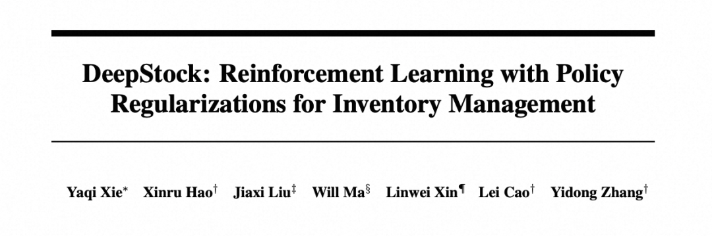

  

背景：传统两阶段方法的局限与

端到端智能的兴起

  

长期以来，工业界主流的库存优化方案普遍采用“先预测、再决策”的两阶段范式——即先通过需求预测模型估计未来销量，再基于预测结果调用运筹优化或仿真模型生成补货策略。然而，这一方法存在根本性瓶颈：需求预测的精度直接决定了库存策略的性能上限。而现实中，高维上下文数据（如促销、季节性、社交媒体趋势、供应链波动等）使得精准预测极为困难。

  

尽管经典的库存理论模型（如报童模型）在理想假设下具备解析最优解，但其对需求分布的强依赖在实际业务中往往难以满足，导致效果大打折扣。

  

随着海量高维上下文数据的积累，端到端的深度强化学习（DRL）为库存管理提供了新范式——它无需显式预测需求，而是直接从历史交互与仿真环境推演中学习最优补货策略。然而，DRL 在工业落地中仍面临四大挑战：

- 黑箱性与不可解释性：一种常用做法是，将多周期库存控制问题笼统建模为通用的序列决策问题，直接应用现成的 DRL 方法，导致策略难以被业务方理解和信任；
- 数据效用：在电商中可用于预测与决策的数据其实十分有限，原因在于经营目标、竞争格局、营销节奏和运营策略快速变化，使大量历史数据失去对未来的预测与泛化能力，因此依赖“大数据 + 大模型 + 大算力”的方法往往难以奏效；
- 超参数敏感性：DRL 性能高度依赖超参数调优，过程耗时且成本高昂；
- 目标函数错配：学术研究普遍以“最小化缺货与持有成本之和”为奖励函数，但工业界难以准确量化成本参数；实际评估更关注缺货率（Service Rate）和周转天数（Turnover Time）等可操作指标，而这些指标难以分解为每步行动的即时奖励。

  

此外，不同品类（如畅销品 vs. 长尾品）、不同供应商在业务目标、需求模式和履约约束上差异显著，导致早期 RL 系统需为每类商品分组训练独立模型，运维成本极高，难以规模化。

我们提出了策略正则化，将库存理论的一些经典策略或简单直觉融入DRL中，有效解决以上问题。

  

文献调研：策略正则化、库存领域DS与DRL对比分析、

DRL大规模线上部署均开创历史先河

  

#### **▐**  策略正则化

  

许多先前的工作已将库存策略结构编码到RL中。例如，De Moor et al.（2022）通过嵌入启发式库存策略的结构来修改奖励函数，将其作为教师策略；Qi et al.（2023）使用一种标签方法，捕捉历史观察下最优动态规划解的行为，然后将其作为学习策略的正则化器；Maggiar et al.（2025）在目标函数中施加惩罚项，当学习策略违反某些已知的最优策略结构性质时（如文献中所证明）。这些工作通常与我们的不同之处在于将惩罚项纳入目标函数，而非直接限制策略空间。

  

最后，注意到我们的策略正则化是问题特定的，不应与RL中常用的通用正则化技术混淆，如熵正则化（Haarnoja et al. 2018）或信赖域策略优化中使用的正则化（Schulman et al. 2015a）。

  

#### **▐**  可微分仿真器（DS）与传统DRL用于库存

  

近年来一些电商平台例如亚马逊构建可微分的仿真器来求解库存问题，不同于DRL会计算连续周期之间的状态转移，直接计算仿真环境下多周期总成本的梯度，我们简称其为DS算法。

  

虽然 Madeka et al.（2022）以及同期的 Alvo et al.（2023）积极推动将 DS 应用于库存管理，并强调了其优势（如调参相对方便、经验效果良好），但这些工作并未对 DS 与传统 DRL 方法进行系统且严格的对比。相比之下，本文在充分进行超参数调优的前提下，对 DS 与传统 DRL 进行了公平而严格的比较。我们的实验揭示了DS的一个新缺陷：当没有足够的并行轨迹时，它无法跨时间学习。不过如果给定足够的独立同分布轨迹，DS在人工生成的数据集中仍然表现出色，这与Alvo et al.（2023）的实验发现一致。

  

#### **▐**  大规模DRL库存部署

  

电商通过深度学习来管理库存变得越来越普遍，包括阿里巴巴（Liu et al. 2023）、亚马逊（Madeka et al. 2022）和京东（Qi et al. 2023）。不同的是，本研究实现了在天猫自营补货场景中所有商品100%全覆盖。

  

核心创新：策略正则化——

让 DRL 学会“库存常识”

  

▐  **库存动态**

  

设 T、P 和 L 为正整数。我们考虑 t = 1, ..., T 天的离散时间范围，补货周期为P，供应商送货到库存到仓时间间隔为 L ，即在第 1+L, P+1+L, ... 天开始时到达。设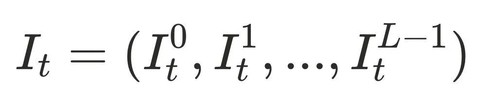表示第 t 天开始时的库存状态向量，其中 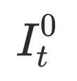表示在仓库存，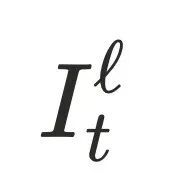表示未来天将到达的库存，对所有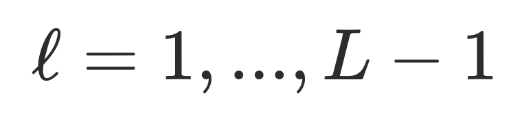。我们初始化 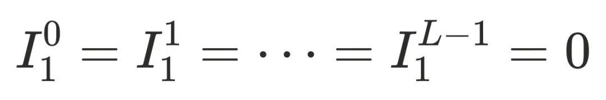。

  

如果在第天需要订货，我们在第天开始时决定数量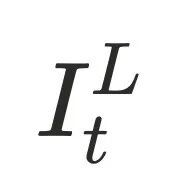；否则设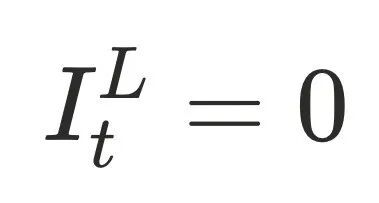。用户需求为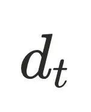，实际销售量为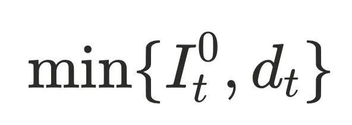，下一天的库存向量更新为：

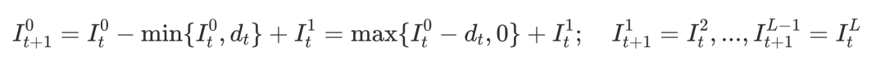

  

▐  **性能指标**

  

在库存理论中，要最小化的标准损失目标是：

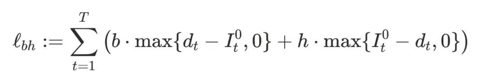

即在每天结束时：如果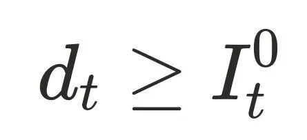（即库存缺货），则我们被惩罚 b 乘以未满足需求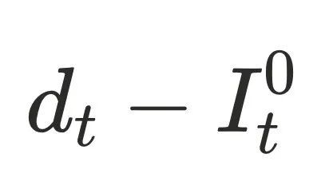；否则，我们被惩罚乘以剩余库存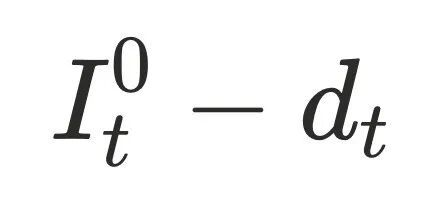。

然而，不是一个实用的评估指标，因为在实践中量化 b 和 h 很困难，特别是因为当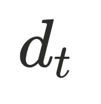未知时，缺货期间的未满足需求无法直接观察。因此，在阿里巴巴，我们改为评估以下两个指标：

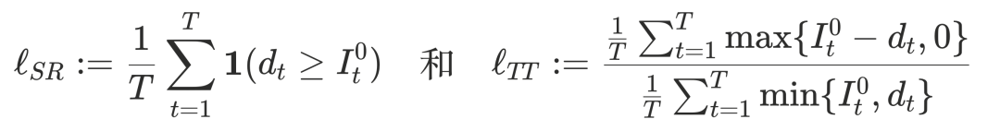

  

这里，"缺货率"损失衡量以缺货结束的天数百分比，惩罚库存过少。另一方面，"周转时间"损失计算平均日末库存除以平均销售量，衡量一单位库存在手的平均持续时间，惩罚库存过多。

在我们人工生成数据实验中，我们使用标准目标训练和评估策略。我们注意到损失目标在时间上自然可加，为RL训练期间采取的每个行动提供奖励信号。在阿里巴巴，策略使用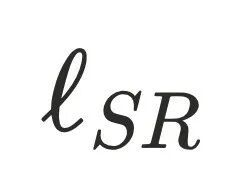和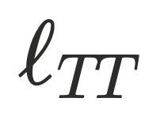的加权组合进行训练和评估。我们可以调整相对权重来权衡和，理想情况下获得和都下降的帕累托改进。

  

▐  **DRL建模**

  

问题建模我们采用下图的方式。第T天发起补货动作，将第T-1期末库存相关特征拼接为当前状态。reward设计相对复杂，不能精确分解为每周期损失。一种处理方式是将reward定义为本次补货到货，到下次补货到货期间的库存指标与库存目标之间的偏差，以此近似本次action的即时损失，但存在若干问题。无法处理送货时长波动大，尤其引发cross order的情况；此外考虑到需求侧、供给侧都存在不确定性，销量、送货时间、送满率等参数波动大，我们不会关注每一次补货时段的库存指标是否完美，更关注一段时间的综合指标。为此我们设计终止态时reward为整段周期指标统计做一个比较大的奖惩，其余reward为0，此外引入shaping reward，中间挑选几个check点给予小的惩罚信号，相应配合在状态中加入时间和历史进销存相关信息。

  

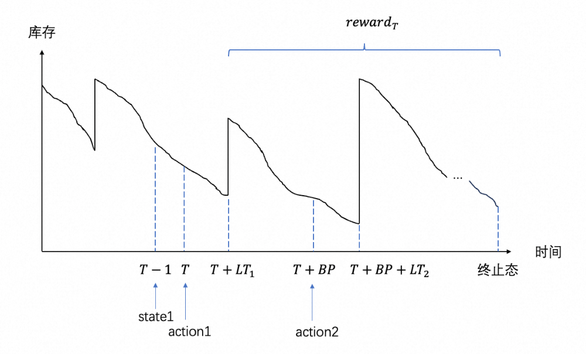

  

▐  **两种关键正则化形式**

  

DRL方法学习一个由深度神经网络表示的策略，该策略可以根据任何状态决定订货行为。在我们的问题中，某个SKU在时间的状态包括外生特征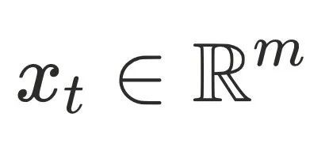，由静态属性（如商品类别、需求规模、供应商、送货时长、补货周期、利润率）和随时间演变的动态属性（如即将到来的促销活动、季节性、近期社交媒体趋势）组成。此外，状态还包括关于即将发生的库存转移的内生信息，这取决于先前的行动，即先前下发的补货订单。

  

当DRL算法直接应用时，策略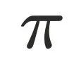通常是一个单一的神经网络，根据输入状态, 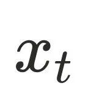输出订货量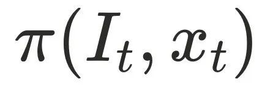。

团队提出策略正则化（Policy Regularization）框架，将库存管理中的经典直觉硬编码进 DRL 策略结构中，而非仅作为软性奖励惩罚。

  

- Base Stock 正则化：我们的第一种策略正则化要求订货量采用以下函数形式，直接嵌入“基础库存”思想，提高策略网络学习稳定性，大幅降低策略搜索空间。

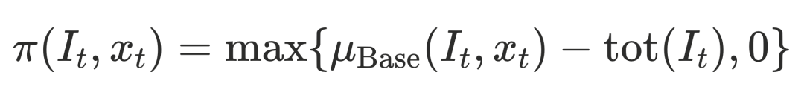

其中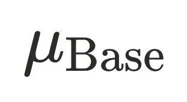是学习到的神经网络，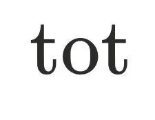表示中包含的当前库存水平（包括即将到达的补货量）。这里，Base代表"基础库存"，其中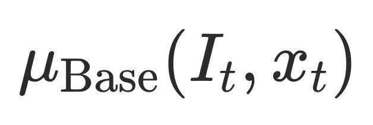表示总库存的目标水平，订货量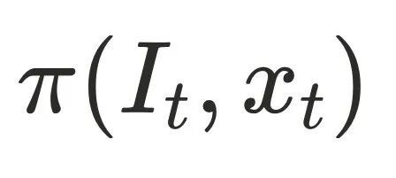等于该目标水平减去我们已有的总库存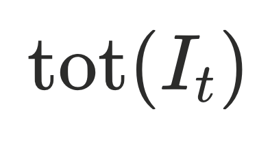。直觉上，学习到的目标应主要取决于预测即将到来需求的外生特征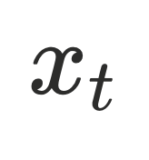，而库存信息通过项纳入决策。有个容易出错的关键点，在Lost sales背景下，目标库存水平也直接会受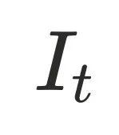影响。总体来说在Base正则化下，更容易近似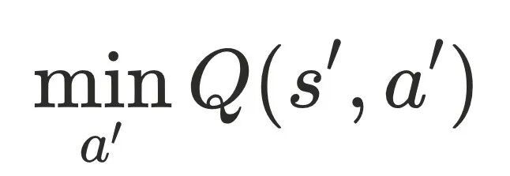，因为最佳行动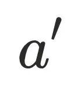在不同库存状态间是相同或相近的，从而导致Q目标的更稳定学习。

  

- Coefficients 正则化：以下为函数形式，系数由神经网络动态生成，提升策略的结构合理性与泛化能力。

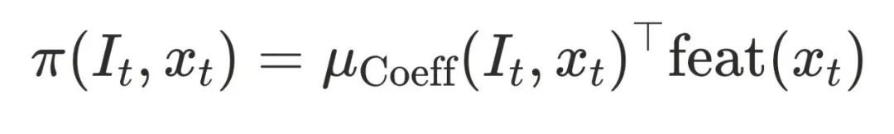

其中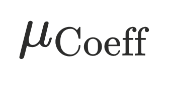是一个学习到的具有维输出的神经网络，为通过映射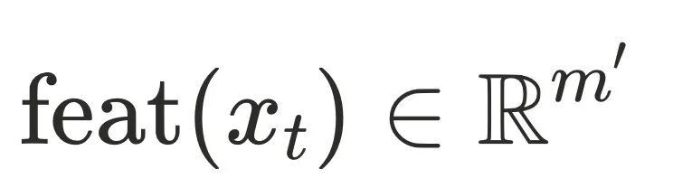从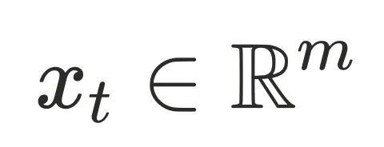提取的个特征提供系数（Coefficients）。在阿里巴巴，我们设置\= 5，其中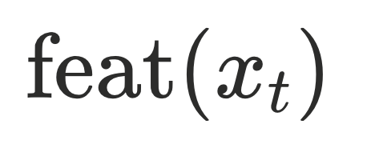由近期和远期周期内的4个历史和预测需求特征以及一个常数偏置项组成。直觉上，期望的订货量应与这些特征呈正相关关系。将订货量表示为关键特征（如历史/预测需求）的线性组合。

最后，我们可以组合两种策略正则化，在这种情况下，我们要求订货量采用以下函数形式：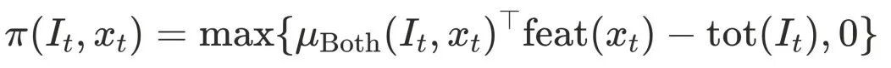

其中是学习到的具有维输出的神经网络。

  

▐  **模型训练**

  

我们通常用表示轨迹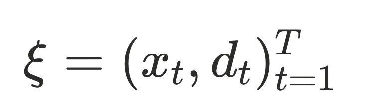的数据集，我们区分用于训练、验证和测试的数据集，分别用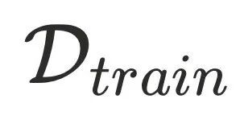、和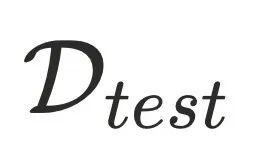表示。对于任何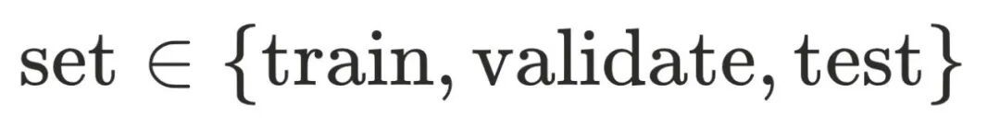和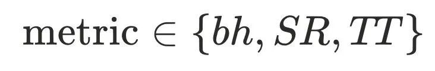，我们定义：

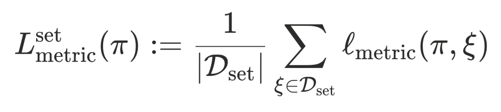

这是策略在轨迹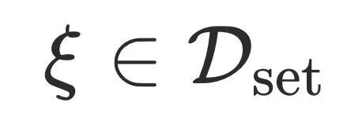上损失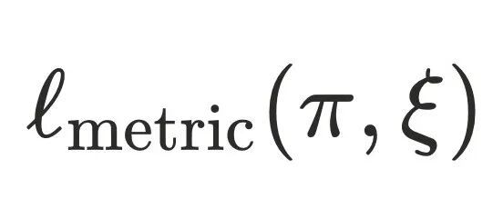的平均值。

  

对于传统DRL算法，我们主要考虑深度确定性策略梯度（DDPG）和近端策略优化（PPO）。PPO模拟一个随机化的并强化在同策略轨迹下产生高奖励的行动，是一种现代策略梯度方法，通过"裁剪"更新来防止变化过快。DDPG使用目标网络来稳定策略和Q函数更新。最后，我们考虑DS，即通过可微算子计算整个轨迹的损失函数，直接求梯度进行网络更新。

  

DRL方法指定如何训练，与我们的策略正则化结合使用。对于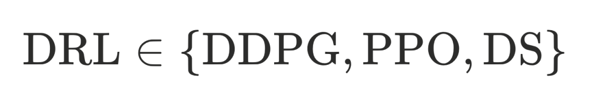和, （其中None指"无正则化"，即直接输出订货量）的每种组合，我们用表示最终学习到的策略。

  

离线实验：深度对比策略正则化

如何帮助 DRL超越DS

  

我们固定 P = 2, L = 1, m = 1，并设 T = 29，除非另有说明。人工生成的数据集如下：

- INDEP分布，20个样本轨迹，分割使得  
- AR(1)分布，20个样本轨迹，分割使得
- AR(1)分布，10个样本轨迹，分割使得
- IID分布，样本量，时间长度 

  

我们比较和组合的策略，因为是一维的所以省略Coeff正则化。使用相同的指标进行训练、验证和测试，其中 b = 0.9 和 h = 0.1。

  

  

下图1所示，Base 正则化可以显著改进测试损失。 

  

图2显示了第一组设置下进行超参数试验时每个的最佳性能曲线。对于三种DRL方法，超参搜索越复杂，从到的改进越大，策略正则化降低了DRL效果超越DS的难度。为了解释DDPG和PPO击败DS，我们比较不同设置下的结果。在设置3中（带Base正则化），我们可以看到DS的验证损失比DDPG好但测试损失更差，这表明DS正在过拟合。这是因为DS直接对中的轨迹损失采取策略梯度，强制样本内最小化。此外，由于DS不从 (s, a, r, s') 转换中学习，它缺乏传统DRL方法核心的跨时间学习，因此DS的样本效率较低。

  

为了进一步研究DS的学习行为，我们最后在不同样本量和时间长度下训练DS（带Base正则化）。在图3中，当样本量较小（）时，即使在简单的IID分布下 T = 129，测试损失差距仍保持在约8%。这表明增加时间长度 T 只能带来有限的改进，突出了DS内部跨时间学习的不足。当从5增加到10再到20时，所有时间长度的测试损失整体改善，表明DS确实从跨轨迹（即跨SKU）的元学习中受益，但尽管如此，我们在更长时间长度下没有看到收敛。我们发现在样本数量有限的情况下，DS在验证和测试损失之间表现出较大差距，证明了它对观察轨迹特异性有过拟合的倾向。

  

总结，本研究通过严格对照实验发现：

- DS 在样本内表现优异，但存在严重过拟合：因其直接对训练轨迹求梯度，缺乏跨时间步的泛化能力；
- DS 样本效率低下：在轨迹数量有限时（如长尾 SKU），性能显著劣于带正则化的 DRL；
- 策略正则化使传统 DRL（如 DDPG、PPO）在同等条件下，带正则化的 DRL 不仅训练更快，最终效果也优于 DS。

这一发现为工业界在 DRL 与 DS 路线选择上提供了重要实证依据。

  

线上效果：从试点到全量，实现帕累托改进

  

结果1：小规模验证（2024年7月）

在 10% 的高潜力国际 SKU 上试点，采用双重差分（DiD）分析显示：

- 缺货率降低 0.83%
- 周转天数减少 9.53 天

  

结果2：大规模推广（2025年4月）

通过我们DRL训练的库存策略推广到100%的国际SKU和87%的国内SKU。此时无法使用DID，我们进行了反事实分析，用工业级别的仿真环境，模拟对比了同时段不同算法效果。缺货率没有明显差异的情况下，周转实现了1-2天的降低，按销量的进一步细分如表2所示。周转天数的降低折合可观的金额收益，对于每50亿的库存规模，可带来库存货值年化减少3.5亿元，库存持有成本年化降低约1500万。

  

结果3：全量稳定运行（2025年10月）

DRL算法全量上线后我们持续监控库存指标。图4展示了2025年7-8月国际SKU的平均周转时间，这段时期涵盖了DRL策略的重新训练，并将其与2024年同期，我们大规模推出DRL之前国际SKU的平均周转时间进行比较。2025年缺货率没恶化的情况下，周转时间大幅减少了20%。它为我们DRL部署的稳定性提供了高层管理信心，因此截至2025年10月，我们的策略已完全部署到自营技术100%超过100万个SKU-仓库对。

  

通用补货大模型：一套模型，全域覆盖

得益于策略正则化，DeepStock 实现了真正的通用补货大模型：

- 单一模型适配所有品类，无需分组训练；
- 通过状态特征工程与自动化超参优化（田口实验），高效捕捉商品、供应商、渠道的多样性；
- 与业务系统深度集成，自动将运营目标（如服务水平、周转要求）转化为奖励权重。

这不仅大幅降低工程与运维成本，也为 DRL 在复杂供应链场景的规模化应用树立了新标杆。

  

论文附录

  

1. Liu, Jiaxi and Lin, Shuyi and Xin, Linwei and Zhang, Yidong, AI vs. Human Buyers: A Study of Alibaba's Inventory Replenishment System. INFORMS Journal on Applied Analytics, 53(5) 372-387, 2023：https://pubsonline.informs.org/doi/10.1287/inte.2023.1160
2. Xie, Yaqi and Hao, Xinru and Liu, Jiaxi and Ma, Will and Xin, Linwei and Cao, Lei and Zhang, Yidong, DeepStock: Reinforcement Learning with Policy Regularizations for Inventory Management (November 21, 2025). Available at SSRN : http://dx.doi.org/10.2139/ssrn.5784782

  

团队介绍：产学研协同共探AI技术新前沿

  

淘天集团自营技术运营算法团队长期深耕于天猫超市、国际直营等自营业务的供应链计划与物流执行场景，在仓网规划、补货调拨、需求预测、订单履约、仓内作业及干线物流等多个关键环节持续发力。团队深度融合运筹优化、深度学习、强化学习与大模型等前沿技术，显著提升决策精准度与系统效率，为业务带来可观的规模化收益。

  

秉持“产学研深度融合、创新驱动发展”的理念，团队始终致力于打造世界一流的供应链智能决策技术体系。近年来，已与哥伦比亚大学、康奈尔大学、芝加哥大学、四川大学、浙江大学、上海交通大学等全球顶尖高校建立紧密合作关系，产出多项具有国际影响力的科研成果。此次发布的《DeepStock》研究正是这一合作传统的又一典范——不仅巧妙融合了理论洞察与工程实践，更通过真实业务场景的全量验证，充分展现了AI技术在复杂工业系统中的规模化落地价值。

  

面向未来，团队将持续推进“链接数字世界与物理世界的超级AI”这一战略愿景，聚焦构建可解释、可泛化、可信赖的智能决策基础设施，在大模型、运筹优化、强化学习等方向不断突破算法边界，加速推动前沿技术向产业级应用的深度赋能。

  

  

**¤** **拓展阅读** **¤**

  

[3DXR技术](https://mp.weixin.qq.com/mp/appmsgalbum?__biz=MzAxNDEwNjk5OQ==&action=getalbum&album_id=2565944923443904512#wechat_redirect) | [终端技术](https://mp.weixin.qq.com/mp/appmsgalbum?__biz=MzAxNDEwNjk5OQ==&action=getalbum&album_id=1533906991218294785#wechat_redirect) | [音视频技术](https://mp.weixin.qq.com/mp/appmsgalbum?__biz=MzAxNDEwNjk5OQ==&action=getalbum&album_id=1592015847500414978#wechat_redirect)

[服务端技术](https://mp.weixin.qq.com/mp/appmsgalbum?__biz=MzAxNDEwNjk5OQ==&action=getalbum&album_id=1539610690070642689#wechat_redirect) | [技术质量](https://mp.weixin.qq.com/mp/appmsgalbum?__biz=MzAxNDEwNjk5OQ==&action=getalbum&album_id=2565883875634397185#wechat_redirect) | [数据算法](https://mp.weixin.qq.com/mp/appmsgalbum?__biz=MzAxNDEwNjk5OQ==&action=getalbum&album_id=1522425612282494977#wechat_redirect)
