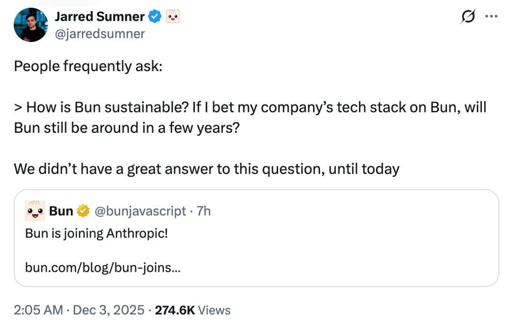

# “天才少年”5年0收入造JS核武！Claude天价收购Bun，Node.js生态地震

> 转自：InfoQ

  

当地时间 12 月 2 日，Anthropic 宣布收购了热门开发者工具初创公司 Bun。这项交易的财务条款尚不清楚，但它标志着 Anthropic 向开发者工具领域迈出了重要一步。

“对于使用 Claude Code 的用户而言，这次收购意味着性能更快、稳定性更高，并解锁更多能力。” Anthropic 官方表示。简而言之，Anthropic 看好 Bun 作为 Claude Code、Claude Agent SDK 以及未来 AI 编码产品和工具的基础架构。

根据介绍，在 Claude Code 整个演进过程中，Bun 一直是支撑其基础设施扩展的关键力量。过去数月里 Anthropic 团队和 Bun 保持紧密合作，这种协作对 Claude Code 团队快速迭代至关重要，也直接促成了近期 Native installer 的推出。

实际上，Claude Code、FactoryAI、OpenCode 等 AI 编程工具都是用 Bun 构建。随着越来越多开发者依赖 AI 构建软件，底层基础设施的重要性比以往更高，Bun 已成为不可或缺的工具。毕竟很多 Coding Agent 工具很多都是 Node.js 写的，然后基本都选择了用 Bun 打包。

之所以受到 AI 编程工具的青睐，主要是因为它能解决智能体分发和运行的效率问题：Bun 的单文件可执行程序（single-file executables）非常适合分发 CLI 工具；开发者可以将任何 JavaScript 项目编译成一个自包含的二进制文件，它在任何地方都能运行，即使用户没有安装 Bun 或 Node 也没问题；并且它支持原生插件，启动速度极快，且易于分发。

现在，Bun 月下载量超过 700 万，在 GitHub 上收获超过 8.2 万颗星，并被 Midjourney、Lovable 等公司用于提升开发速度和生产效率。

“Bun 恰恰代表了我们希望引入 Anthropic 的那种卓越技术。Jarred 和团队从第一性原理出发，重新思考了整个 JavaScript 工具链，同时始终关注真实场景。”Anthropic 首席产品官 Mike Krieger 表示，“把 Bun 团队引入 Anthropic，将让我们构建出能够持续放大这种增长势能的基础设施，并跟上 AI 应用指数级扩张的节奏。”

官方表示，收购 Bun 的决定契合 Anthropic 一贯坚持的“战略且稳健”的收购原则：持续寻找能够增强技术实力、强化 Anthropic 在企业级 AI 领域领先地位、并且最重要的是符合 Anthropic 的价值观和使命。

在宣布此次收购的同时，Anthropic 也表示，今年 11 月，Claude Code 在面向公众开放仅 6 个月后，就实现了年化营收突破 10 亿美元的里程碑。

1 “我对 Claude Code ‘上头’了”

那 Bun 这个炙手可热的初创公司为什么要加入 Anthropic 呢？在解答这个问题之前，我们先简单回顾下 Bun 的发展历程。

大约五年前，Jarred 在浏览器里做一个类似《我的世界》的像素游戏。当时，代码库越写越大，每次想测试改动是否生效，都要等 45 秒，大部分时间都耗在等待 Next.js 开发服务器热重载。

这种体验非常痛苦，Jarred 很快就分出很大部分精力去思考如何解决这个问题。于是，Jarred 开始把 esbuild 的 JSX 和 TypeScript 转译器从 Go 迁移到 Zig，三周后做出了一个“勉强能用”的 JSX & TypeScript 转译器。

那一年的大部分时间，Jarred 都窝在奥克兰一间非常狭小的公寓里，一边写代码、一边在推特上更新 Bun 的进展。

值得注意的是，他在自己的 x 简介上写道自己是在高中辍学了。他是典型的自学成才型工程师，曾在 Stripe 工作。他曾获得 Thiel Fellowship，这是 PayPal 联合创始人 Peter Thiel 设立的项目，为年轻创新者提供 20 万美元资金支持，鼓励“辍学创业”。

为了让 Next.js 的服务端渲染跑起来，他需要一个 JavaScript 运行时。而 JavaScript 运行时需要一个引擎，能解析并 JIT 编译代码。于是，Jarred 花了大约一个月阅读 WebKit 的源码，试图搞懂如何像 Safari 那样灵活地嵌入 JavaScriptCore。一个月后，Bun 的最初版 JavaScript runtime 诞生了。

Bun v0.1.0 于 2022 年 7 月发布，集打包器、转译器、运行时（旨在成为 Node.js 的无缝替代品）、测试运行器和包管理器于一身。

Bun 在发布的第一周就获得了 2 万颗 GitHub Star。“发布后的前两周是我人生中最疯狂的日子之一。我的工作重心从整天写代码变成了整天回复消息。”Jarred 说道。

Bun 的爆火促使 Jarred 成立了 Oven，并完成了由 Kleiner Perkins 领投的 700 万美元种子轮融资，“我开始领工资了，并说服了几位工程师搬到旧金山协助构建 Bun。”Jarred 回忆道。

随着 Bun 更加稳定，团队在 2023 年 9 月发布了 Bun v1.0。同期，公司完成了由 Khosla Ventures 领投的 1900 万美元 A 轮融资，团队扩充到了 14 人，并搬进了一个稍微大一点的办公室。

之后，团队对 Bun 持续进行迭代：

- 很长的一段时间里，Bun 都没有支持 Windows 支持。Bun v1.1 版本中 团队添加了 Windows 支持。一开始的体验比较粗糙，团队后来做了大量优化。
- Bun v1.2 版本大幅改进了 Node.js 的兼容性，并添加了内置的 PostgreSQL 客户端和 S3 客户端。X 和 Midjourney 等公司开始在生产环境中使用 Bun，Tailwind 的独立 CLI 也是用 Bun 构建的。
- Bun v1.3 增加了一个内置的前端开发服务器、一个 Redis 客户端、一个 MySQL 客户端，对 `bun install` 进行了多项改进，并进一步提升了 Node.js 的兼容性。而真正的“特性”在于：持续增长的生产环境使用量。

AI 编程工具流行后，Jarred 也开始使用 Claude Code，然后就“对 Claude Code ‘上头’了”。

Jarred 介绍，过去几个月里，Bun 仓库中合并 PR 最多的 GitHub 用户名竟然是一个 Claude Code 机器人。Bun 在内部的 Discord 中设置了它，主要用它来协助修复 Bug。它提交的 PR 会包含测试用例：这些测试在修复前的系统安装版本中会失败，但在修复后的调试构建版本中能通过。它还能回复代码审查意见，几乎包办了整个流程。

“这感觉大概比目前的发展进度领先了几个月，绝对不是几年那么遥远。”Jarred 评价道。

2 加入细节：“我认为 Anthropic 会赢”

如今，Bun 的收入为 0。

Jarred 表示自己收到最多的问题之一就是关于可持续性的。比如：“Bun 怎么商业化？”“如果我把工作项目或公司的技术栈押注在 Bun 上，它五到十年后还在吗？”

“我们以前的标准回答总是：我们最终会做云托管产品，并与 Bun 的运行时和打包器进行垂直整合。”Jarred 说道，“但是，现在与我刚开发 Bun 时的世界已经截然不同。AI 编程工具正在极大地改变开发者的生产方式，而当由智能体来编写代码时，基础设施层变得愈发重要。当 AI 编程工具进化得如此之好、如此之快时，强迫自己走那条既定的老路（做云托管）感觉是不对的。”

几个月来，Bun 一直优先处理来自 Claude Code 团队的问题。期间，Jarred 总是冒出很多想法，其中许多想法对其他 AI 编程产品也有帮助。

“几周前，我和 Claude Code 团队的 Boris 散步了四个小时。我们聊了 Bun，聊了 AI 编程的未来，也聊了如果 Bun 团队加入 Anthropic 会是什么样。接下来的几周里，我们又这样聊了三次。”Jarred 表示，“之后，我也和他们的许多竞争对手聊过，但我认为 Anthropic 会赢。押注 Anthropic 听起来是一条更有趣的道路。置身于风暴中心，与构建最强 AI 编程产品的团队并肩作战。”

“截至目前，Bun 的月下载量上个月（2025 年 10 月）增长了 25%，突破了 720 万次。我们还有能支撑 4 年多的资金跑道来探索商业化。我们其实没必要加入 Anthropic。”Jarred 说道，“但是，我们不想让用户和社区经历‘Bun，一家风投支持的初创公司苦苦探索变现模式’的戏码。感谢 Anthropic，我们可以完全跳过这一步，专注于构建最好的 JavaScript 工具。”

“当人们问‘Bun 五年或十年后还在吗’的问题时，回答‘我们融资了 2600 万美元’并不是一个很好的答案，投资人最终是需要回报的。”Jarred 说道，这背后有一个更大的问题：两三年后的软件工程到底会是什么样子？

AI 编程工具发展得非常快、非常好，而且它们正在使用 Bun 的单文件可执行程序来分发可以在任何地方运行的 CLI 和智能体。在 Jarred 看来，如果大多数新代码都将由 AI 智能体编写、测试和部署，那么围绕代码的运行时和工具链将变得更加重要；同时代码总量会大幅增加，编写和测试的速度也会快得多；届时人类将不再紧盯着每一行代码，因此运行环境必须快速且可预测。

“Bun 的初衷就是让开发者更快，AI 编程工具做的也是类似的事情，这简直是天作之合。所以，这就是我们加入 Anthropic 的原因。”Jarred 表示。

Anthropic 投资 Bun，将其作为支撑 Claude Code、Claude Agent SDK 以及未来 AI 编程产品的基础设施 Jarred 表示，成为 Anthropic 的一部分，将给 Bun 带来：

- 长期稳定性。 一个归宿和充足的资源，让人们可以放心地将技术栈押注在 Bun 上。
- 观察 AI 编程工具走向的“前排座位”， 这样可以根据未来趋势来塑造 Bun，而不是在门外瞎猜。
- 更强的火力，Bun 要招工程师了。

同时，对于现有用户而言，Bun 的核心承诺不变：

- Bun 仍将保持开源，并继续使用 MIT 协议。
- Bun 依然会被高度活跃地维护。
- 原来的团队依旧负责 Bun 的开发。
- Bun 依旧会在 GitHub 上公开构建、公开开发。
- Bun 的路线图仍将专注于高性能 JavaScript 工具链、Node.js 兼容性，并以取代 Node.js 成为默认的服务端 JavaScript 运行时为目标。
- Claude Code 本身就是以 Bun 可执行文件的形式交付给数百万用户的。“Bun 出问题就是 Claude Code 出问题，因此 Anthropic 有充分动力把 Bun 做好。”

Jarred 表示，团队加入 Anthropic 后，Bun 会让 Claude Code、Claude Agent SDK 等开发工具变得更快、更轻量；团队能更提前看到 AI 编码工具的趋势，从而反哺 Bun，让 Bun 更好用；此外，Bun 的迭代速度会更快。

3 网友：JavaScript 赢了？

“因为 Bun 已经拥有大量用户，而且是整个 JS 生态系统中最重要的库之一？这些收购大多是为了获取用户群。这将使 Claude Code 在 JS 开发者中的采用率提高 10 倍。”有网友猜测。

还有网友表示，“看起来这只是一个经典的人才收购。”该网友推测 Bun 独立运营时，商业模式可能行不通，无法看到一个高盈利的未来。“如果一家公司找不到 PMF 或者缺乏关键的营收来源，再或者无法向其他投资者描绘更宏大的未来愿景，那么采取这种方式是非常典型的。”

“开源软件的商业化一直很困难，许多风投支持的公司都在苦苦挣扎，其根本原因很简单：下载量并不能自动转化为利润，很多人原本就认为一个开源工具或库想要盈利是痴人说梦。这次事件再次证明了这一点。”

“现在他们成了 Anthropic 的一部分，而 Anthropic 自己还没搞清楚怎么盈利呢。”网友 ojosilva 感叹，“我是 Bun 用户，同时也是 Anthropic 的客户。Claude Code 确实出色，那绝对是他们模型最亮眼的地方。除此之外，Anthropic 简直烂透了，他们的 App 和网页版完全是垃圾，简直快没法用了，而且模型效果也只是一般般。”

“考虑到 Claude Code 部门是公司的顶梁柱，而据 Oven 的宣传，他们的‘独门秘诀’就是 Bun，那 Claude Code 负责人可能在这里施加了很大的影响力。事实上，VSCode 上 Claude 的后端就是以 Bun 编译的二进制可执行文件分发的， 而且那个负责人至少在一周前左右就作为特色人物出现在 Bun 网站的首页了。所以，他们只是给那个‘孩子’买了想要的‘玩具’。”

不过也有网友指出，“很多人似乎对这次交易感到不解，因为他们可能只是把 Bun 视为一个兼容 Node.js 的打包器 / 运行时，拿来和 Deno 或 npm 进行比较。但如果考虑到 Bun 近期发力的方向——一种云原生的自包含运行时（支持 S3 API、SQL、流式传输等），我认为这是一个非常明智的决定。”

该网友表示，“对于像 Claude Code 这样的智能体而言，这一发展轨迹非常有趣，因为它创造了一个运行时环境，能让智能体在云服务中（处理数据）的流畅度，就像它操作本地文件系统一样。Claude 将能够利用这些能力来扩展其在整个云端的覆盖范围，并在企业级应用场景中增加更多价值。”

此外，还有网友表示，JavaScript 适合做智能体语言，“JavaScript 拥有最快、最稳定且部署最广泛的沙箱引擎。例如 V8 及紧随其后的 JavaScriptCore，这也是 Bun 使用的。此外，它还有 TypeScript，这与智能体的代码生成循环（agentic coding loops）非常契合，并且最终会编译成上述的 JavaScript，而后者几乎可以在任何地方运行。”

参考链接：

https://bun.com/blog/bun-joins-anthropic

https://www.anthropic.com/news/anthropic-acquires-bun-as-claude-code-reaches-usd1b-milestone

推荐阅读  点击标题可跳转

1、[Ant Design 6.0 来了！这一次它终于想通了什么？](https://mp.weixin.qq.com/s?__biz=MzAxODE2MjM1MA==&mid=2651623418&idx=1&sn=7c3f560db0837b29a5d6bbd301c9ea0b&scene=21#wechat_redirect)

2、[英伟达内部有人要求“少用AI”，黄仁勋当场发飙：“你疯了吗？”](https://mp.weixin.qq.com/s?__biz=MzAxODE2MjM1MA==&mid=2651623408&idx=1&sn=399c2d31de0bcfbe4a54529d52e48627&scene=21#wechat_redirect)

3、[常被忽视的 Node.js 功能，彻底改善了日志体验](https://mp.weixin.qq.com/s?__biz=MzAxODE2MjM1MA==&mid=2651623408&idx=2&sn=c0f1218f1089aa8d06f5609096148638&scene=21#wechat_redirect)
