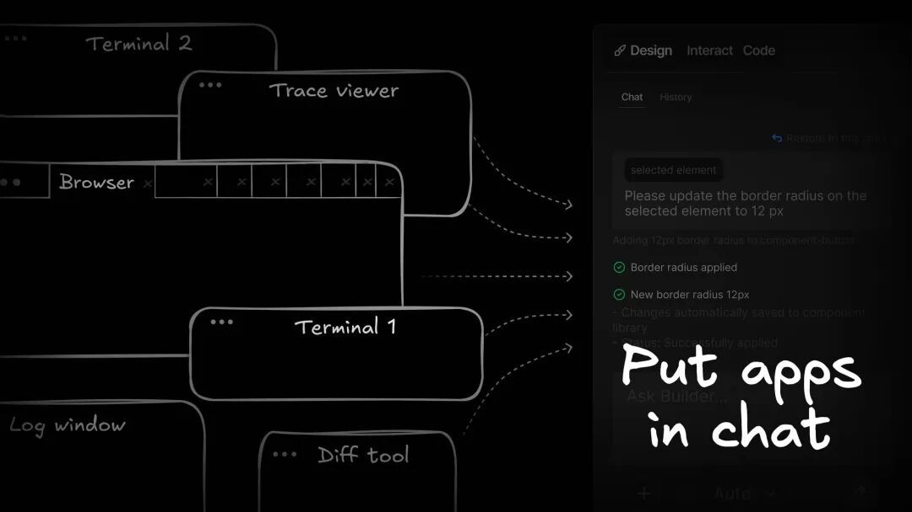
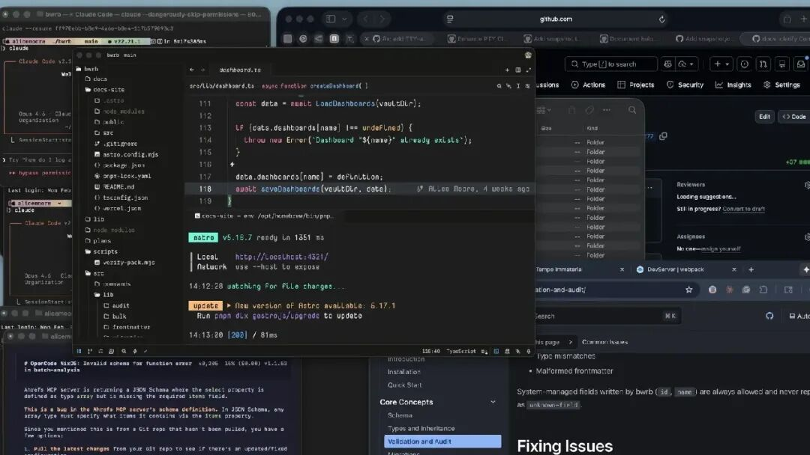
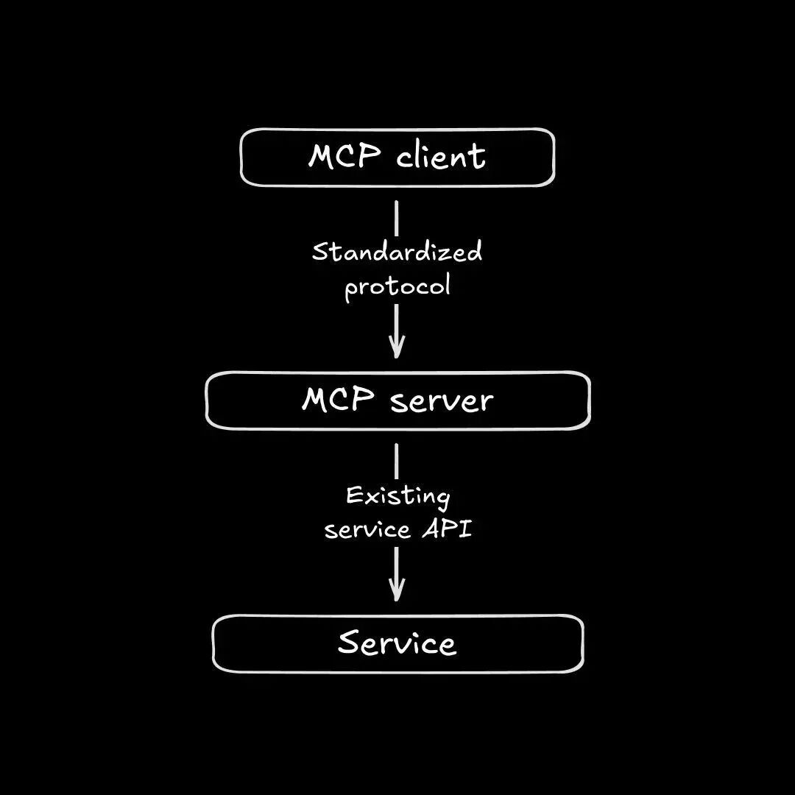
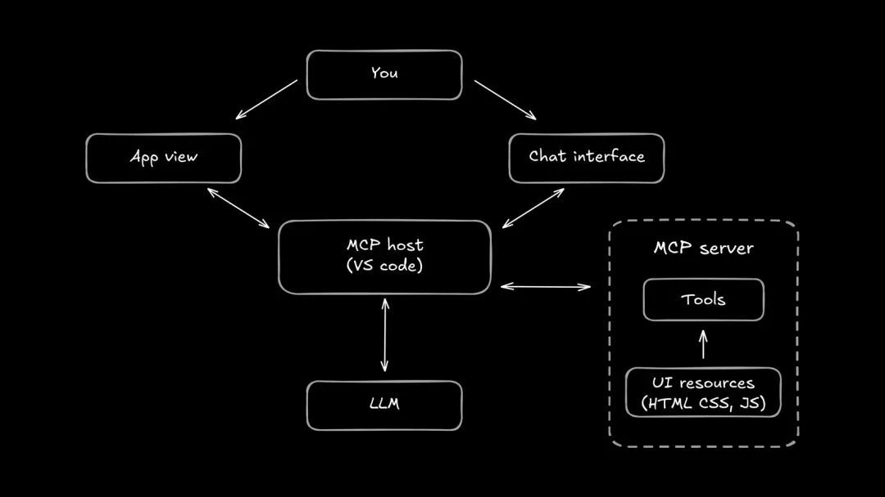
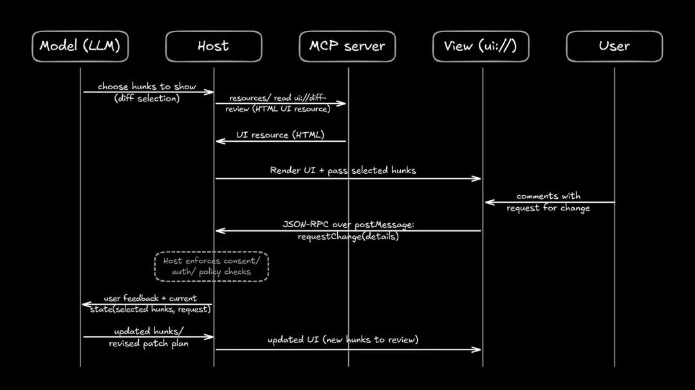
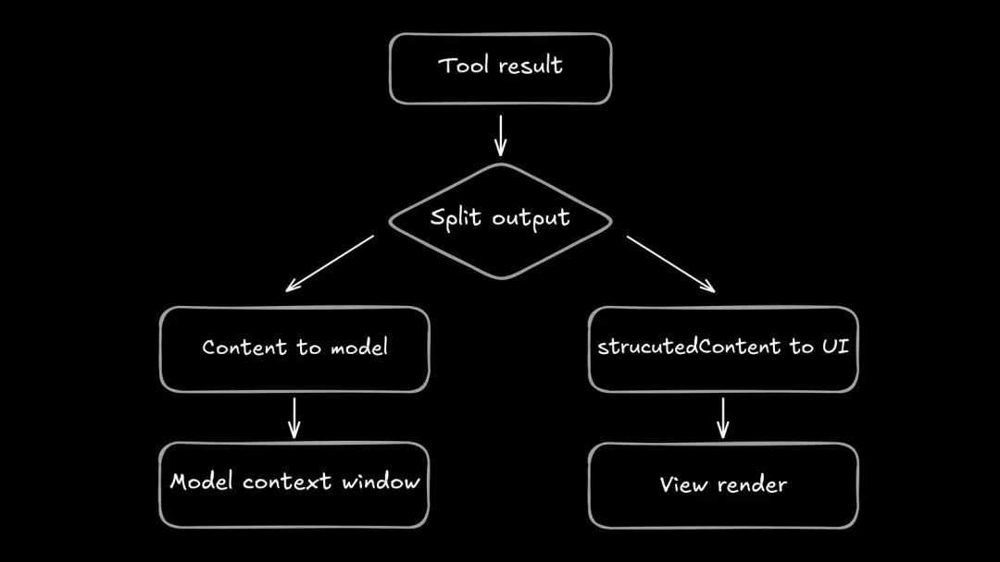
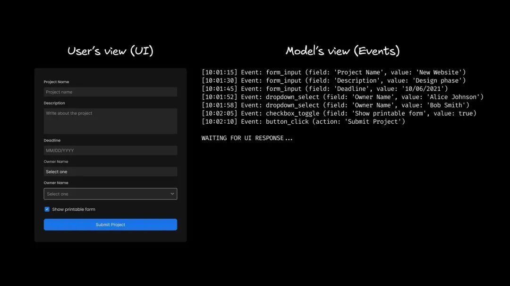

# 【第3658期】从终端到工作空间：MCP Apps 如何把 UI 带回 Agent 中心

前言

当 AI Agent 深入开发流程，我们却在终端、浏览器和聊天窗口之间频繁切换。MCP Apps 试图改变这一现状：把真正的 UI 直接嵌入 Agent 工作空间，让 diff、日志、表格和配置向导回归可视化界面，重塑前端在 Agent 时代的角色。今日前端早读课文章由 @Alice Moore 分享，@飘飘编译。

译文从这开始～～

如果你每天都在用 AI Agent 写代码，你一定深有体会：整个工作环境越来越混乱。一个终端在跑 Agent，另一个在执行构建。你来回切换窗口，还得努力回忆刚才的 diff 到底输出到了哪里。

那如果我们不再把聊天机器人塞进各种应用里，而是把应用直接放进聊天界面，会怎样？

这正是 MCP Apps 的核心思路。它是官方推出的 MCP 交互式 UI 扩展，为宿主（host）提供一种标准方式，可以直接在你与 Agent 协作的界面中渲染真正的界面元素，比如 diff 查看器、表格、仪表盘和向导流程等。

MCP Apps：https://modelcontextprotocol.io/extensions/apps/overview

#### MCP Apps 解决的问题

有些工作流程天然以文本为主。但我们与 Agent 的大量协作，其实是围绕 “产物” 展开的：

- 审查代码 diff。
- 检查 trace、日志和时间线。
- 浏览表格和仪表盘。
- 审批或编辑真实的产物。

这些内容当然可以硬塞进聊天窗口，但通常只会走向两种结果：要么生成大量占用 token 的滚动内容，要么给你一个并不完全让人放心的摘要。

[【早阅】Better：一款AI代码审查工具](https://mp.weixin.qq.com/s?__biz=MjM5MTA1MjAxMQ==&mid=2651274252&idx=1&sn=70f7535a5e15ca45ad1d8c4fd6a41bb4&scene=21#wechat_redirect)

多 Agent 工作流会让问题更加严重，因为它会成倍增加产物数量。结果就是你同时开着 12 个终端和 20 个标签页 —— 工单、diff、日志、预览、PR 全部分散在不同的地方。

杂乱的开发者工作区，层层叠叠的终端窗口、代码编辑器和浏览器标签页（包括 GitHub），展示同时打开的大量产物。

MCP Apps 的理念是：UI 应该处在工作流的核心位置。宿主可以把合适的产物界面直接拉进与 Agent 同一个工作空间中。

但这只有在宿主真正提供成熟的交互能力时才行，比如固定（pin）内容、历史记录、合理的布局等。MCP Apps 为它们提供了一个统一的构建协议。

#### 为什么你应该关心（即使你曾被 MCP “坑过”）

如果说 MCP 现在口碑有点问题，那是因为很多人第一次接触它时，遇到的是最糟糕的版本：庞大且始终开启的工具目录、不稳定的服务器，以及别扭的客户端体验。

有必要说清楚：这些痛点大多来自宿主和服务器的实现方式，而不是协议本身的问题。

宿主决定如何注入工具、是否提供开关、如何获取用户同意，以及产物的交互体验。

举例来说，MCP 上下文膨胀往往是宿主行为导致的。比如 Claude Code 现在支持工具搜索，可以按需加载 MCP 服务器，只有在需要时才拉取工具 schema。

当然，这也不能全怪宿主。服务器本身决定命名方式、schema 设计和作用域范围。我用过不少 MCP 服务器，它们没有很好地 “教会” Agent 如何使用自己，结果就是不断出现失败的工具调用刷屏。

我们仍处在 MCP 的早期阶段，还在摸索如何围绕这些工具建立更成熟的体系。但无论如何，MCP Apps 很重要，因为它把 “产物的交互体验” 从零散拼凑的 hack，提升为宿主的一等公民能力。

它确实有机会把人们重新吸引回 MCP，并围绕它建立更可持续的发展模式。

#### MCP Apps 是如何运作的

如果你想先快速回顾一下 MCP 的基础知识，可以阅读《Model Context Protocol 指南》，那是一份不错的入门资料。

一个 MCP 客户端通过标准化协议连接到 MCP 服务器，使 AI 能够通过 API 接入已有服务。

MCP Apps 利用了协议中一个常常被忽视的部分：resources（资源）。资源是随服务器一起提供的文件，工具可以用它来存储和读取数据。它们用途广泛，而在 MCP Apps 场景中，资源特别适合用来存放 HTML、CSS 和 JS。

理解 MCP Apps 的方式其实很简单：某个工具声明一个 `ui://` 资源，宿主将其渲染为一个沙盒 View，然后在该 UI 与 MCP 服务器之间建立桥接。

一个 MCP 宿主（VS Code）在用户的应用视图 / 聊天界面、LLM 和 MCP 服务器（工具 + UI 资源）之间建立桥接。

MCP 宿主（任何实现了 MCP 客户端的工具，比如 VS Code）会读取 UI 资源，将其渲染出来，并与这个 View 建立结构化的交互通道。

[【第3597期】Google Chrome DevTools MCP：AI 代理现在可以在浏览器中调试、测试和修复代码](https://mp.weixin.qq.com/s?__biz=MjM5MTA1MjAxMQ==&mid=2651277543&idx=1&sn=18b092f538b688e06ee1bd09c05cf064&scene=21#wechat_redirect)

在底层，View 与宿主通过基于 postMessage 的 JSON-RPC 桥接通信，而宿主负责在其中协调对服务器的调用。

有两个关键点让这一机制得以成立：

- UI 是一种渐进式增强能力。如果某个宿主不支持 Apps，MCP 服务器依然可以以纯文本模式运行。
- 工具的返回结果可以通过 structuredContent 向 UI 传递丰富的数据，而不必把这些内容塞进面向模型的上下文里。模型无需处理那些 HTML/CSS/JS 代码。

#### MCP Apps 可以大放异彩的场景

尽管 MCP App 生态还非常新，发布的内容也不多，但已经可以想象出很多有价值的应用场景。

##### Diff 审查与审批

你一定熟悉这种模式：Agent 修改代码后，要么把一个巨大的 patch 粘贴到聊天里，要么给你一段摘要，让你 “相信它”。

通过 MCP App，可以渲染一个真正的 diff 界面（文件树、搜索、hunk 选择等），然后发出一个结构化事件，比如 “comment submitted”。接着 Agent 再执行应用操作。

一个 MCP App 的 diff 审查 UI 如何工作 ——LLM 选择 diff 片段，宿主从 MCP 服务器获取 HTML UI 资源并在 `ui://` 视图中渲染，用户提出修改请求，View 通过 JSON-RPC 发送 requestChange 消息回到宿主（包含同意 / 权限检查），再更新 diff 片段和 UI。

这种方式带来两个好处：策展（curation）与一致性。

- 策展：不必展示整个 diff，宿主可以只打开你正在与 Agent 讨论的那几行代码，你只审批你真正想要的部分。
- 一致性：无论在哪里，都可以使用同一个 diff 查看器，而无需跳出 Agent 工作流，也不用来回切换窗口。

##### 日志与实时指标探索

MCP App 可以渲染时间线、过滤器和实时数据流。你选择真正重要的那一段（某个请求、某个峰值时间窗口、某类错误），应用发出这个选择，Agent 再进行有针对性的工具调用。

Agent 发挥它擅长的能力（关联分析、搜索、提出建议），你发挥自己的优势（排查问题和做判断）。

这样就能避免 “粘贴 5000 行日志” 的循环。先缩小范围，再提交那一段给模型处理。

##### 配置向导（Configuration Wizards）

当你需要选择一系列选项时，聊天界面可以变成一个清晰的表单：多选项、复选框、文本字段，或任何你需要的输入形式。

UI 最终可以输出一个干净的结构化对象（并强制执行约束），而不是和模型来回对话二十轮。

优秀的向导还会帮你筛选真正需要决策的部分：从仓库中自动填充明显的默认值，只询问真正涉及策略的选择。

由于 Agent 可以根据需要生成各种形态的表单，你既节省时间，也能提供更精准的输入。

#### “为什么要用 MCP？我已经有 skills 和 CLI 了。”

这是目前最常见的质疑。

Skills、规则和命令确实很有帮助。它们能减少 prompt 冗余，让 Agent 行为更可复现。这些能力不会消失。

但 skills 本质上仍然只是写在 markdown 文件里的说明。而 CLI 工具虽然几乎无所不能，却也相当混乱。（而且并不是每个人都会熟练使用。）

MCP 提供的是约束机制：类型化的输入与输出、明确的工具契约、权限控制，以及宿主层的协调。你得到的是结构化、可重复的 Agent 交互方式。服务器的开发者也可以承担复杂实现，让最终用户无需操心细节。

而 Apps 则把 MCP 的集成边界扩展到了 UI 层，使得丰富的产物不必再被压缩成聊天文本。

#### MCP Apps 会导致上下文膨胀吗？

如果你对 MCP 的质疑主要集中在 “上下文过大” 这个问题上，那么一个显而易见的问题是：加入 UI 会不会让上下文问题变得更严重？

MCP Apps 本身并不会自动解决工具定义过多带来的上下文膨胀。如果宿主把每一个工具的 schema 都强行注入模型上下文，你依然要为此付出 token 成本。

Apps 能改变的是丰富数据的存放位置”。该规范支持将工具输出拆分为两部分：一部分是面向模型的 content，另一部分是面向 UI 的 structuredContent。这样，UI 可以渲染丰富的数据，而无需把这些内容以文本形式塞进模型上下文。

一个工具的返回结果被分成两条路径 ——“发送给模型的 Content”（进入模型上下文窗口）以及 “发送给 UI 的 structuredContent”（交给视图渲染器）。

需要注意的隐患是：事件泛滥（event spam）。

如果应用在每一次按键、每一次滑块拖动、每一次中间状态变化时都发送事件，那你只是把 “上下文膨胀” 换成了 “事件流膨胀”。

作为用户，你通常很快就能分辨出好坏。优秀的应用会：

- 明确 “提交时刻”（submit /apply/approve）。
- 只发送高信号、低频率的更新，而不是每一个中间过程。
- 在请求你确认前，清楚展示发生了什么变化（以 delta 的形式）。

#### 使用 MCP Apps 时需要注意什么

MCP Apps 在使用时确实会带来一些新的困惑点。

##### 注意点 [#1](javascript:;)：宿主的 UX 也是产品体验的一部分

应用本身无法控制它所在的容器。

[【第2495期】Hello @idux, 一个全新的 vue 3.x 组件库来了](https://mp.weixin.qq.com/s?__biz=MjM5MTA1MjAxMQ==&mid=2651251860&idx=1&sn=8cdfedf2c5bbc296d8bceb6ebfd546fd&scene=21#wechat_redirect)

宿主决定是内嵌渲染还是持久显示，决定容器大小、展示模式，以及多个应用之间如何导航。

如果宿主把 View 渲染在一个狭小的面板里，应用看起来就会很糟糕。如果宿主把它埋在滚动记录后面，用户可能会感觉应用 “消失了”。

同一个 MCP App，在一个宿主中体验很好，在另一个中却像是坏掉了一样。有时候问题出在宿主。开发者可以通过确保应用适配不同视口尺寸来降低风险，就像开发网站一样。

##### 注意点 [#2](javascript:;)：模型看不到 iframe

很容易误以为 Agent 能看到你在 View 里看到的一切。其实不能。

Agent 只能看到应用主动发出的内容（事件、上下文更新、工具结果）。如果你在表单里输入内容，却从未点击 Submit，那么模型可能根本没有任何可响应的信息。

左侧是 “用户视图” 的表单界面，右侧是 “模型视图” 的事件日志，列出输入框内容、下拉选择、复选框切换，以及一次提交按钮点击，最后显示 “WAITING FOR UI RESPONSE…”。

如果 UI 没有明确的提交 / 应用 / 审批动作（或清晰的 “已同步” 提示），你就很容易遇到 “它为什么没注意到？” 这样的困惑。

##### 注意点 [#3](javascript:;)：往返延迟

由 UI 触发的工具调用，本质上仍然是工具调用。

如果 View 在每一次点击时都触发一次工具调用，即使操作本身很简单，界面也会显得卡顿。

有些交互本来在本地 UI 中会非常流畅，但因为底层实际是一次工具调用，所以会慢一些。优秀的应用应该通过加载动画等方式，让这种延迟变得可预期、可理解。

#### 哪些场景下 MCP Apps 帮助不大

如果你的工作流程本身就是 “终端形态” 的（运行命令、查看简短输出、快速迭代），MCP Apps 可能并不会带来太多价值。

[【早阅】将 Claude 代码变成自己的超赞 UI 设计师（使用 Playwright MCP ）](https://mp.weixin.qq.com/s?__biz=MjM5MTA1MjAxMQ==&mid=2651277548&idx=1&sn=e49bd502f1e80c922686833f064a9898&scene=21#wechat_redirect)

不要把 UI 硬塞进那些文本已经是最佳界面的场景：

- 搜索与重构（类似 grep 的扫描、快速编辑）。
- 一次性命令（运行测试、格式化、lint、构建）。
- 小规模结构化修改（比如你希望直接编辑原始 YAML/JSON 文件）。

MCP Apps 更适用于那些 “不像终端” 的场景：diff、仪表盘、trace、表格、预览、审批等。你需要的是一个真正承载产物的画布，而不是又一面文本墙。

就我个人而言，我很期待 MCP Apps 能把我们从那些奇怪的 TUI（终端界面）中带出来，回到更专门、更清晰的 GUI 世界。

#### MCP Apps 的安全模型

安全模型是官方推出 MCP Apps 扩展的重要原因之一。从整体来看，MCP Apps 旨在让 UI 嵌入更安全、更容易审计：

- View 运行在沙盒化的 iframe 中。
- 消息通道是显式的（通过 postMessage）。
- 服务器声明内容安全策略（CSP）元数据，由宿主负责执行。
- UI 可以请求权限，是否授予由宿主决定。

但需要明确的是，这并不意味着万无一失。Apps 不会神奇地把一个不安全的 MCP 服务器变成安全的。你仍然需要保持基本的判断力。

如果宿主允许 UI 在未经用户同意的情况下调用敏感工具，UI 依然可能造成损害。真正的 “把关点” 在宿主。

#### 为什么是现在（以及标准化为何重要）

在 MCP Apps 成为官方规范之前，基于 MCP 的 UI 模式其实已经存在。Apps 真正有意义的地方不在于 “可以做 UI”，而在于 “现在有了一个统一的目标标准”。宿主可以一次性实现支持，服务器也可以围绕统一规范来构建。

我们已经看到 Claude、ChatGPT、Visual Code、Goose 以及一些较小的服务商开始支持 MCP Apps。其他平台也很快会跟进。

如果你常用的 Agent 工具都支持 MCP Apps，那么可以想象这样一个场景：你几乎不再需要频繁切换到浏览器或终端，因为 Agent 可以在聊天界面中直接调出你需要的任何上下文。

接下来，我们只需要更多人持续构建更好、更丰富的 MCP 服务器。

#### 关于 MCP Apps 的一点思考

从长远来看，让我对 MCP Apps 感到兴奋的一个原因，是 “个人软件” 的可能性。

[【第3609期】使用 Chrome DevTools MCP 进行调试：让 AI 在浏览器中“拥有双眼”](https://mp.weixin.qq.com/s?__biz=MjM5MTA1MjAxMQ==&mid=2651277864&idx=1&sn=d1791d51add2a47c4007595ce4dbc08a&scene=21#wechat_redirect)

现在 AI 编程工具已经足够强大，我会用简单的软件自动化处理日常中的各种小问题。我做过自己的待办应用、个人知识管理系统，甚至一些家庭自动化工具。

如果 MCP Apps 能在不同宿主之间良好落地，你完全可以把下一个小工具做成一个 MCP App，在同一个工作空间里随时调用 —— 也就是你平时与 Agent 协作的地方。

想象一下：在聊天中随时调出你自己的待办事项；或者做一个小工具，一眼浏览所有未合并的 PR，只显示对你最有价值的高信号信息。

把你需要的产物直接带到你每天都在使用的界面里，而不是到处找窗口。

如果你也想构建自己的 MCP 服务器，可以从这里开始。

##### 打造 “工作空间”，而不是单一工具

MCP Apps 为 AI 编程宿主提供了一个机会：不再假装一切都是一次工具调用，而是把自己真正打造为一个工作空间 —— 聊天负责表达意图，同时提供一个真实的画布，用来查看、编辑和审批各种产物。

宿主仍然需要打磨体验，服务器仍然需要提供聚焦且清晰的工具集合。Apps 为整个生态提供了一个共同遵循的契约。

关于本文  
译者：@飘飘  
作者：@Alice Moore  
原文：https://www.builder.io/blog/mcp-apps

这期前端早读课  
对你有帮助，帮” 赞 “一下，  
期待下一期，帮” 在看” 一下。
