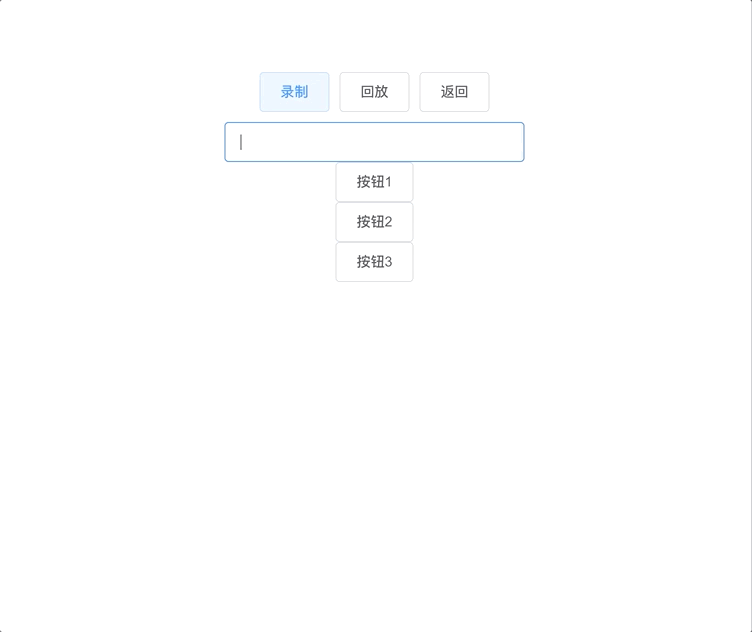
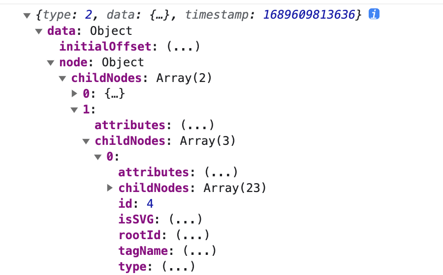
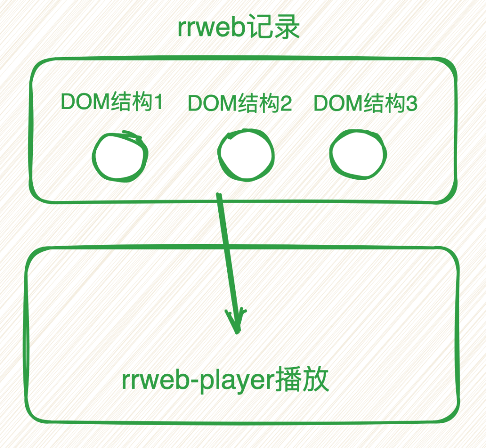
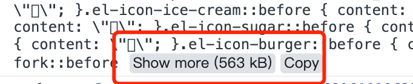
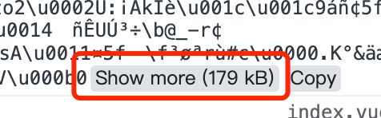

# 前端如何静悄悄录制用户的操作过程，静悄悄上传到服务器~

> 前端如何静悄悄录制用户的操作过程，静悄悄上传到服务器~

## 前言

大家好，我是林三心，用最通俗易懂的话讲最难的知识点是我的座右铭，基础是进阶的前提是我的初心~


## 背景

公司有很多的项目，但是并不是每一个项目都很重要，其实重要的项目就那么几个，上面也是很重视这几个项目，尤其是对一些生产问题的关注度很高。

这几天上面交代下来了，需要对这些项目做一些用户行为的记录，主要是为了更好地还原用户在某一个时间点的操作过程


## 注意点

想要完成这个需求，仔细想了一下，需要注意几个点：

- **跨框架使用：**这些项目有vue、angular、react，需要都能适用
- **能录制用户行为：**能把用户在页面上的操作录制下来
- **能回放录制：**如果不能回放，那么这个录制就无意义了
- **用户无感知：**必须做到用户无感知才行

## 思考 & 技术方案

说到前端视频的录制，我们会想到 `webRTC` 这个技术，他能做到录制屏幕的效果，但是通过 `webRTC` 去完成这个方案的话，有几个缺点：

- 做不到用户无感知，需要用户同意才能录制
- 录制的视频太大了，太占内存了
- 学习成本比较高，这也是原因之一

那怎么才能做到：

- 用户无感知
- 不录制视频

其实只要不录制视频了，那么用户肯定就无感知，因为一旦要录视频，浏览器肯定要询问用户同意不同意。

所以我们选择了另一个方案 `rrweb`，一个用来录制用户页面行为的库~

## rrweb

`rrweb` 是 `record and replay the web` 的简写，旨在利用现代浏览器所提供的强大 API 录制并回放任意 web 界面中的用户操作。

### 效果展示



### 基本使用

我们先定义好 html 结构，三个按钮

- 录制：点击开始录制
- 回放：点击开始回放
- 返回：点击重新再来

还有一个 replayer ，用来当做回放的容器

```
<template>
  <div class="main">
    <div >
      <el-button @click="record">录制</el-button>
      <el-button @click="replay">回放</el-button>
      <el-button @click="reset">返回</el-button>
    </div>
    <div v-if="!showReplay">
      <div>
        <el-input style="width: 300px" v-model="value" />
      </div>
      <div>
        <el-button>按钮1</el-button>
      </div>
      <div>
        <el-button>按钮2</el-button>
      </div>
      <div>
        <el-button>按钮3</el-button>
      </div>
    </div>
    <div ref="replayer"></div>
</div>
</template>

```
我们需要先安装两个包：`npm i rrweb rrwebPlayer`

- **rrweb：**用来录制网页的
- **rrwebPlayer：**用来回放的

`rrweb`拥有一个 `record` 函数来进行录制操作，并可传入配置，`emit`属性就是用户操作的监听函数，接收一个参数`event`，这个参数是什么，我们后面会说~

然后我们定义三个函数：

- record：录制函数
- replay：回放函数
- reset：返回/重置函数

```
const rrweb = require("rrweb");
import rrwebPlayer from"rrweb-player";

const events = ref([]);
const stopFn = ref(null);
const showReplay = ref(false);
const replayer = ref(null)

const record = () => {
console.log("开始录制");
  stopFn.value = rrweb.record({
    emit: (event) => {
      events.value.push(event);
    },
    // 支持录制canvas
    recordCanvas: true,
    collectFonts: true,
  });
};
const replay = () => {
  stopFn.value();
  showReplay.value = true;
new rrwebPlayer({
    // 可以自定义 DOM 元素
    target: replayer.value,
    // 配置项
    props: {
      // 传入events
      events: events.value,
    },
  });
};
const reset = () => {
  showReplay.value = false;
  events.value = []
};
```
### 录的是视频吗？

我们之前说了：一旦要录视频，浏览器肯定要询问用户同意不同意。但是我们发现我们使用 `rrweb` 去录制，浏览器并没有询问，做到了无感知~所以我们可以推断出，`rrweb` 录制的并不是视频，那录制的是什么呢？

我们其实可以试着去输出一下刚刚的参数 `event` 看看是什么

```
rrweb.record({
    emit: (event) => {
        // 输出
+      console.log(event)
      events.value.push(event);
    },
});
```


我们可以看到这个`event`记录的东西是当前页面的`DOM`结构，当用户操作页面时，`rrweb`会将每一次的DOM结构转换成对象形式，通过 `emit` 函数的第一个参数输出，我们使用一个数组去记录这一次次的DOM结构，然后把它传给`rrweb-player`，它能将这些DOM结构按照先后顺序，一个一个展示出来，自然就相当于是视频的展示效果了~



`rrweb`能记录这些页面的 DOM 行为：

- 节点创建、销毁
- 节点属性变化
- 文本变化
- 鼠标移动
- 鼠标交互
- 页面或元素滚动
- 视窗大小改变
- 输入

## 上传 & 优化

我们记录的这些数据，需要上传到后端那边去，方便后续在后台管理系统里管理这些回放~

很多人会说这样一直录制，那岂不是数据量很大？所以我觉得只有在一些重要的页面，才需要做录制行为的操作，而不是每一个页面都去做这样的操作~

并且每次上传需要一定的时间间隔，不能上传太频繁，不然浏览器压力会增大~

```
const record = () => {
console.log("开始录制");
  stopFn.value = rrweb.record({
    emit: (event) => {
      events.value.push(event);
    },
    recordCanvas: true,
    collectFonts: true,
  });
};

const report = async () => {
await reportRequest(events.value);
  events.value = [];
}

// 20s 去上传一次
setInterval(report, 10 * 2000);
```
同时，虽然现在上传的是DOM结构的对象，大小远远比视频小，但是其实还是不小的



所以我们需要采取措施，去压缩一下数据，压缩后再进行上传，这样能降低服务器的压力~我们可以使用`packFn`属性来对录制的数据进行压缩，同时回放时也要用`unpackFn`去解码

```
const record = () => {
console.log("开始录制");
  stopFn.value = rrweb.record({
    emit: (event) => {
      events.value.push(event);
    },
    recordCanvas: true,
    collectFonts: true,
+    packFn: rrweb.pack
  });
};

const replay = () => {
  stopFn.value();
  showReplay.value = true;
new rrwebPlayer({
    // 可以自定义 DOM 元素
    target: replayer.value,
    // 配置项
    props: {
      // 传入events
      events: events.value,
+      unpackFn: rrweb.unpack,
    },
  });
};
```


## 结语

我是林三心，一个待过**小型toG型外包公司、大型外包公司、小公司、潜力型创业公司、大公司**的作死型前端选手

我建了一些**前端学习群**，如果大家想进群交流前端知识，可以关注我，回复**加群**


阅读
