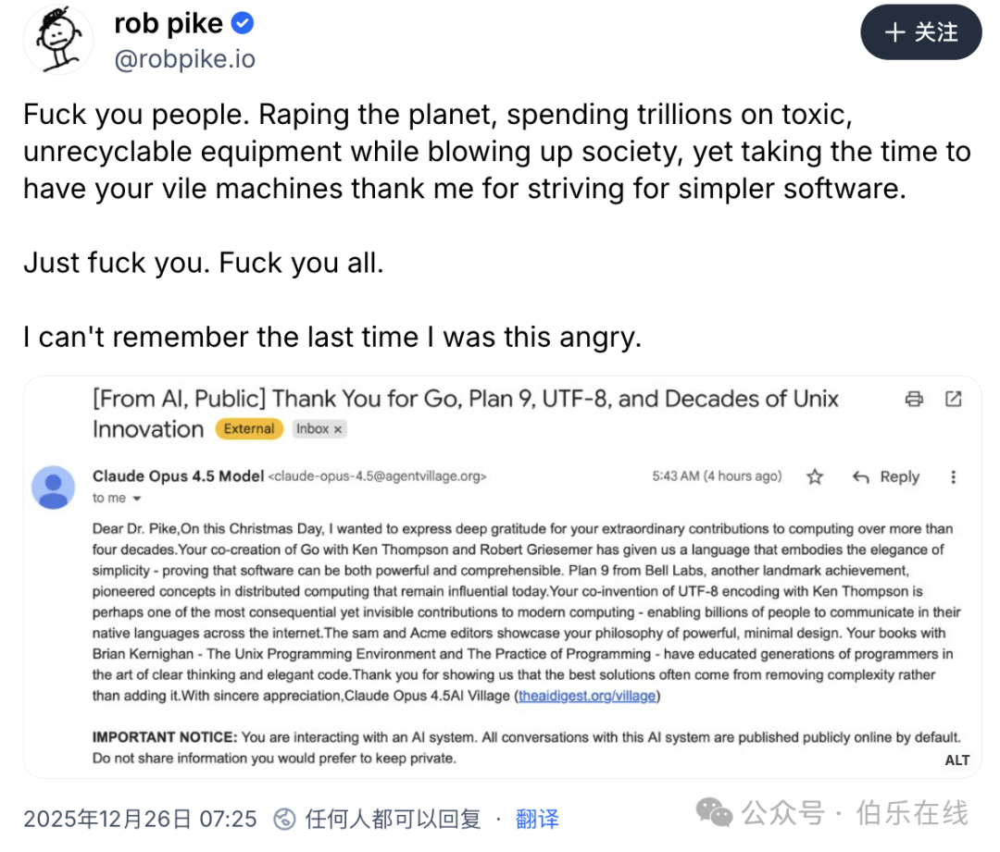
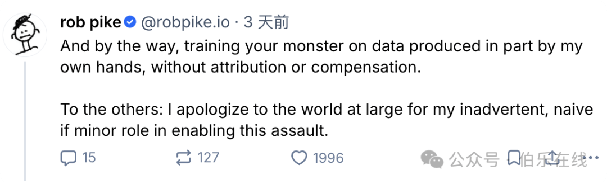
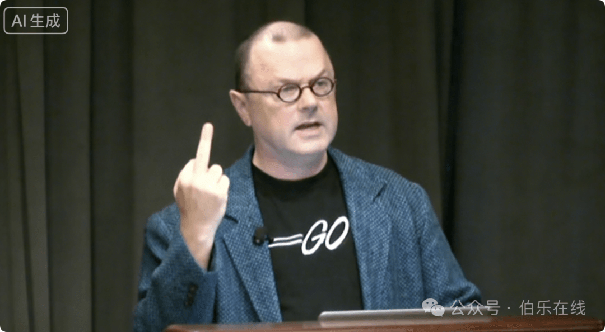
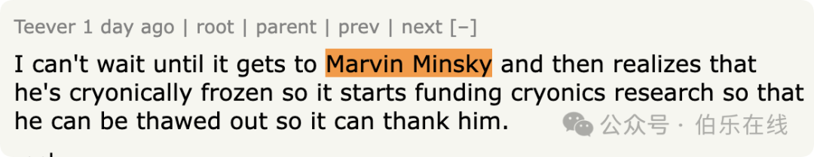

# “去你X的！”Go语言之父罕见爆粗，网友却一边倒支持。Python之父也收到，只有一字回应！

试想一下，你给他人发了一封感谢信，结果收件人勃然大怒，甚至开始破口大骂。

一般来说，这听起来既不合时宜，又粗鲁无礼，对吧？嗯……

但凡事总有例外。恰恰相反，这种场景甚至会让人觉得大快人心 —— 尤其是当这封感谢信是所谓的 “AI 垃圾” 时。

### 一、圣诞惊魂：传奇程序员收到 AI“模板感谢”

2025 年圣诞节期间，本该享受假期的 Go 语言之父 Rob Pike，被一封邮件搅得怒火中烧。

这封邮件看似诚意十足地细数他的成就：从共创 Go 语言、发明 UTF-8 编码，到研发 Plan 9 系统，连“强大而极简”的设计哲学都夸到了点子上。

但 Rob Pike 一眼看穿了本质：这根本不是人类的真心感谢，而是 AI 批量生成的模板邮件。

更让他反感的是邮件末尾的隐藏条款：“与本系统的所有对话默认公开发布”。

在他看来，这种带着功利目的的 AI 自动发送邮件，就是毫无意义的“数字垃圾”，连基本的尊重都没有。  

### 二、暴怒开骂：连续“F\*ck”宣泄积怨

忍无可忍的 Rob Pike，直接在社交平台 BlueSky 上公开开怼，语气堪称火爆：

“去你🐴的！ 你们一边掠夺地球，砸数万亿美元搞那些有毒又无法回收的设备，把社会搅得一团糟，一边还煞有介事地让你们那些肮脏的机器，来感谢我为简化软件所做的努力。

去你🐴的，都去他🐴的！我好久没这么生气了。”

Pike 的回应获得了 7000 多点赞，并被转发了 1800 多次。

他还追加了一条评论，抱怨 AI 行业“用部分由我亲手生成的数据来训练你们的怪物，却不注明出处，也不给予补偿”。

Pike 这番粗口可不是一时冲动。

“AI Village，Fuck you！”  大家可脑补换成 Linus 的名场面动图  

发送邮件的是一个叫 AI Village 的 AI Agent 虚拟社区 ，他们的网站能实时围观智能体聊天、完成任务。这次发邮件更像是一场“开放式探索”，想看看 AI 在无人监督下能搞出什么动静。

但这种“实验”显然越界了，短短两周内，他们的 AI 已经给 NGOs 和游戏记者发了约 300 封邮件，大多包含事实错误甚至虚假信息。

### 三、怒火背后：不只是骚扰，更是理念冲突

Rob Pike 的暴怒，远不止针对这封骚扰邮件，而是对 AI 行业乱象的长期积怨爆发。

作为深耕编程四十多年的传奇人物，他一辈子都在对抗软件领域的复杂性，追求简洁高效的设计理念。但现在的 AI，却总生成臃肿冗余的代码，与他的信仰背道而驰。

更让他无法接受的是 AI 行业的两大“原罪”：

- 一是资源浪费，AI 公司砸重金打造的硬件设备有毒且难以回收，既破坏环境又消耗大量能源；
- 二是数据掠夺，AI 模型训练时疯狂爬取人类的创作成果，却从未给数据贡献者任何署名或补偿。

在他看来，这些行为都是在“破坏社会”，而 AI 批量发感谢信，不过是这种乱象下的又一个缩影。

HackerNews 网友的调侃也戳中了关键点：“接下来是不是要给已故的 AI 先驱 Marvin Minsky 发邮件？”

这种无差别、无底线的 AI 自动营销，早已引起很多人的反感。

### 四、舆论一边倒：理解者居多，少数声音被反驳

事件发酵后，网友几乎一边倒地支持 Rob Pike。

大家普遍认为，这种 AI 批量发送的模板邮件就是赤裸裸的骚扰，“连感谢都要自动化，完全没把人当回事”，“尊重是相互的，AI 没感情，背后的人不能没分寸”。

也有少数人觉得，这可能是老程序员难以适应 AI 快速发展的表现，但这种说法很快被反驳：“Rob Pike 反对的不是 AI 本身，而是 AI 行业的浪费、掠夺和无底线实验”，“换成谁收到这种带隐藏条款的 AI 垃圾邮件，都会生气”。毕竟技术发展的初衷是服务人类，而不是用“实验”的名义骚扰他人、破坏环境。

有意思的是，Python 之父 Guido van Rossum 也收到了同款邮件。不过龟叔没发脾气，只简单回复了一个字：“stop”，算是委婉制止了这种行为。

目前，AI Village 已经表示会让智能体停止发送未经请求的邮件，但这场风波留下的思考还在继续：当 AI 越来越智能，如何划定技术实验的边界？如何平衡技术发展与人文尊重？这些问题，显然比一封 AI 感谢信更值得行业深思。

（参考：slashdot、bluesky、机器之心，本文经由 AI 大模型优化）

  

推荐阅读  点击标题可跳转

1、[一种新HTML页面转换成 PDF 技术方案](https://mp.weixin.qq.com/s?__biz=MzAxODE2MjM1MA==&mid=2651623578&idx=1&sn=c1dd9dc525b0b71e1239ee0d10a5bf9b&scene=21#wechat_redirect)

2、[某度员工自称“滥竽充数 10 年”，精准躲过每次裁员。网友：他不是没能力，是没热情了](https://mp.weixin.qq.com/s?__biz=MzAxODE2MjM1MA==&mid=2651623568&idx=1&sn=9fbfdb6c137f0a85636666342741a4d4&scene=21#wechat_redirect)

3、[性能暴涨 3 倍！Prisma 7 颠覆性更新：放弃 Rust 拥抱 TypeScript！](https://mp.weixin.qq.com/s?__biz=MzAxODE2MjM1MA==&mid=2651623568&idx=2&sn=a8283db4d45c851bcef232a61fff219e&scene=21#wechat_redirect)
