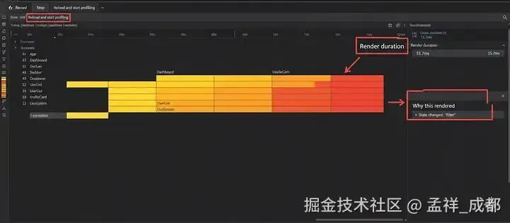

# 公司 React 应用感觉很慢，我把没必要的重复渲染砍掉了 40%!

```js_darkmode__1
点击上方 程序员成长指北，关注公众号
回复1，加入高级Node交流群
```
## 前言

公司 React 应用表现很差。重复渲染感觉像迷一样，不知道大家有不没有过这样的经历：

- 明明传入的数据没变，组件却还是重渲染
- 父组件一更新，很多子组件跟着一起重渲染（部分子组件数据并没有变化）
- 在组件内部定义函数，导致每次渲染都出现“新的”函数引用
- Context API 的更新把大块区域都刷新了，而不是只刷新需要的那一小块

这些问题也侧面反映，要求 `React` 使用者需要更多的心智以及对框架原理更多了解，才能做好 `React` 开发。

但这也是一个很好的话题，当面试官问你性能优化的时候，关于 `React` 框架层面的优化，可以参考这篇文章，如何解决公司的 React 应用重复渲染问题！

首先我们需要找到为什么性能出现问题的原因

## 用 Profiler 把问题揪出来

第一步开始用数据查看到底哪里出了问题。React DevTools 里的 Profiler 很好用，它可以记录你在应用中的交互，告诉你哪些组件重渲染了、为什么重渲染、用了多长时间。

装好 React DevTools 后，打开 “Profiler” 标签。开始录制，做一些感觉卡顿的操作，然后停止录制。

生成的“火焰图”能很直观的告诉我们发生了什么。我能看到一些组件在 props 看起来没变的情况下也在重渲染。这就成了我优化的切入点。



1\_eZCNwCucXBbH7il1bUI-3g.webp

## 一些简单却有效的修复措施

定位到问题区域后，我开始逐个尝试修复。有些方法很简单，但效果很明显。

### 用 React.memo 阻止无效渲染

一个很常见的问题是：父组件重渲染时，子组件也跟着重渲染，哪怕它自己的 props 并没有变化。

- 问题：默认情况下，只要父组件渲染，React 也会把它的子组件一起渲染。
- 解决：用 React.memo 包裹组件，告诉 React：“只有当这个组件的 props 真的变了才重渲染。注意，它只会对 props 做浅比较！举例如下：

之前：

```
function UserProfile({ name }) {
  console.log('Rendering UserProfile');
  return <div>{name}</div>;
}

```
之后：

```
import { memo } from 'react';

const UserProfile = memo(function 
UserProfile({ name }) {
  console.log('Rendering UserProfile');
  return <div>{name}</div>;
});

```
把组件用 React.memo 包起来后，它只会在 name 这个 prop 变化时重渲染，而不是每次父组件渲染都跟着来一遍。

### 用 useMemoizedFn 固定函数引用

在复杂场景最好放弃用 useCallback，写依赖是一个很麻烦的事情，强烈建议使用 `ahooks` 库导出的 `useMemoizedFn` 函数。为什么呢？

- useCallback 通过依赖项保证“函数引用稳定”，但只在依赖不变时稳定；一旦依赖变更，函数引用也会变，容易让子组件误以为 props 变了而重渲染。同时会有闭包中拿到旧值的问题。
- ahooks 的 useMemoizedFn 始终返回“稳定的函数引用”，同时内部能拿到最新的闭包值，避免“陈旧闭包”问题与不必要的重渲染。

举例：

useCallback

```
// useCallback：依赖变化会导致函数引用变化
const [state, setState] = useState('');

// 当 state 变化,  func 函数的引用才变化
const func = useCallback(() => {
  console.log(state);
}, [state]);
```
useMemoizedFn

```
// useMemoizedFn：始终稳定的函数引用，内部总能拿到最新状态，不用写第二个依赖参数
const func = useMemoizedFn(() => {
  console.log(state);
});

```
### 用 useMemo 让对象和数组保持稳定

和函数类似，如果你在渲染过程中创建对象或数组，也会带来问题。

- 问题：每次渲染都会新建一个对象或数组，即便里面的数据没变。把它作为 prop 传给经过记忆化的子组件，仍然会触发重渲染。
- 解决： useMemo 会对值进行记忆化，只在依赖发生变化时才重新计算。

之前：

```
function StyleComponent({ isHighlighted }) {
  const style = {
    backgroundColor: isHighlighted ? 
    'yellow' : 'white',
    padding: 10
  };

  return <div style={style}>Some content</
  div>;
}
```
之后：

```
import { useMemo } from 'react';

function StyleComponent({ isHighlighted }) {
  const style = useMemo(() => ({
    backgroundColor: isHighlighted ? 
    'yellow' : 'white',
    padding: 10
  }), [isHighlighted]);

  return <div style={style}>Some content</
  div>;
}
```
用 useMemo 后， style 这个对象只会在 isHighlighted 变化时才被重新创建，避免了不必要的重渲染。

### 拆分 Context

- Context API 能避免层层传递 props，但也可能成为性能陷阱。
- 问题：只要某个 Context 的值变化，所有消费它的组件都会重渲染，即便它只关心其中未变的那一小部分数据。
- 解决：不要用一个“大而全”的 Context，把不同的状态拆分成多个更小的 Context。
- 例如：不再用一个同时包含用户数据、主题设置、通知的 AppContext ，而是拆成 UserContext 、 ThemeContext 、 NotificationContext 。这样主题更新只会重渲染使用 ThemeContext 的组件。

## 最终效果

- 应用这些修复后再次用 Profiler 测试，差异非常明显。持续的重复渲染消失了，交互更顺滑。
- 数据显示整体渲染时间减少了约 40%，应用终于顺畅运行。

> 作者：孟祥\_成都
> 
> 链接：https://juejin.cn/post/7578793960626602010

插入一个我开发的 headless（无样式） 组件库的广告，前端组件库覆盖了前端绝大多数技术场景，如果你想对生产级可用的组件库开发感兴趣，欢迎了解，也欢迎加入交流群：

- 组件库官网\[1\]
- 感谢 github star\[2\]

参考资料

\[1\] https://www.frontlight.tech/: _https://link.juejin.cn?target=https%3A%2F%2Fwww.frontlight.tech%2F_

\[2\] https://github.com/lio-mengxiang/t-ui: _https://link.juejin.cn?target=https%3A%2F%2Fgithub.com%2Flio-mengxiang%2Ft-ui_

Node 社群
