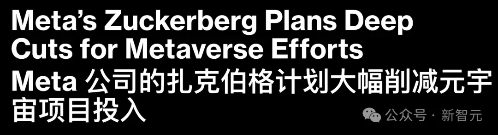
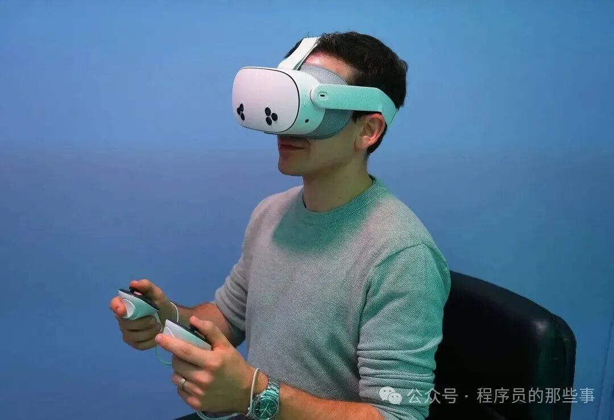
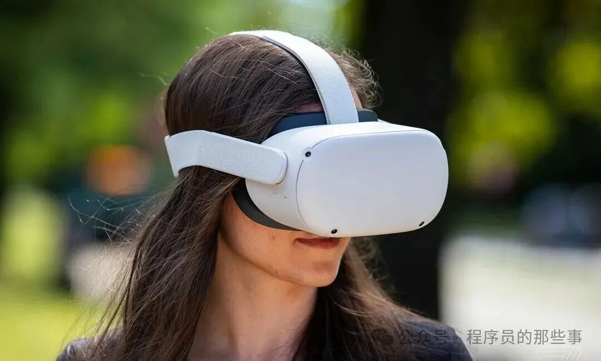
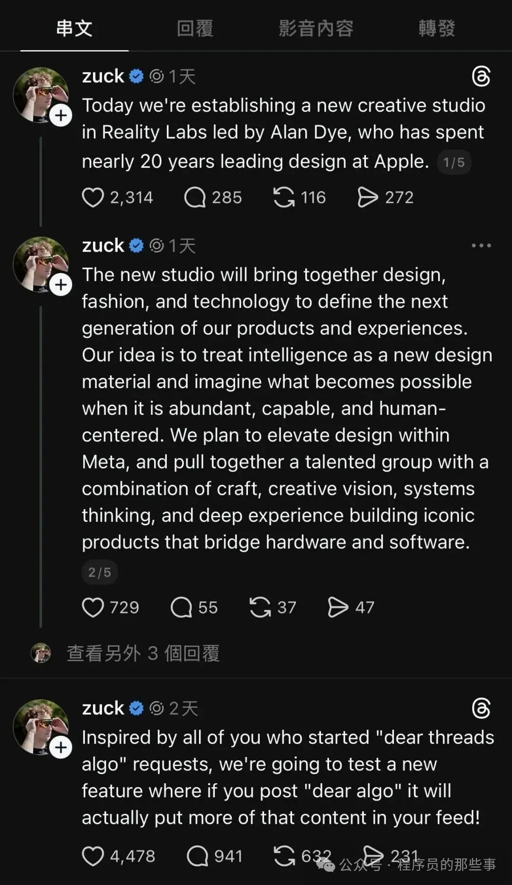

# 小扎忍痛！亲口宣告了元宇宙的死亡

转自：新智元（ID：AI\_era）

扎克伯格的「元宇宙」执念终于向现实低头，Meta计划削减该部门人力，将资源全面倾斜至销量意外火爆的AI智能眼镜。在Reality Labs四年烧掉700亿美元后，伴随着竞争对手的退潮，Meta决定不再死磕笨重的VR头显。为了打赢这场新的战役，扎克伯格甚至挖来了前苹果资深设计师，试图让可穿戴设备真正成为时尚单品。

扎克伯格宏大的「元宇宙」愿景，正式宣告大败局。

据三位知情人士透露，Meta正在酝酿对其Reality Labs（现实实验室）旗下的元宇宙相关部门进行裁员。

这把「手术刀」最早可能在下个月落下，预计将波及该部门10%到30%的员工。

该部门主要负责VR头显以及基于VR的社交网络开发。

尽管具体的裁员人数仍在变动中，但这无疑是一个明确的信号。

需要厘清的是，Meta并没有打算彻底放弃建造元宇宙的梦想。

与其说是撤退，不如说是一次战略资源的「乾坤大挪移」：高管们计划将节省下来的资金，从单纯的VR领域，转移到目前势头更猛的AR眼镜和可穿戴设备上。

**从「头号玩家」到「时尚单品」**

这一转变并非无迹可寻。

早在2021年，Meta就与雷朋（Ray-Ban）联手推出了一款内置摄像头和麦克风的智能眼镜，用户可以用它接电话、听音乐。

而随着近期AI助手的加入，这款眼镜摇身一变，成了用户可以通过语音交互的智能终端。

出人意料的是，这款眼镜在市场上大获成功，销量远超内部预期。

相比之下，厚重的VR头显在消费者普及度上依然步履维艰。

Meta发言人Nissa Anklesaria在一份声明中证实了这一动向：

「鉴于目前的发展势头，我们正在调整Reality Labs的投资组合，将部分资源从元宇宙转向AI眼镜和可穿戴设备。」

她同时也强调，公司并没有计划进行除此之外更广泛的变革。

**700亿美元的代价**

**与竞争的退潮**

回溯到2021年，扎克伯格将公司从Facebook更名为Meta，以此宣示他致力于构建基于VR的下一代互联网（元宇宙）的决心。

自2014年收购Oculus以来，这始终是他眼中的「应许之地」。

然而，通往未来的路费极其昂贵。

Reality Labs作为承载这一愿景的硬件和软件核心部门，在过去四年里累计亏损超过700亿美元。

随着Meta在人工智能领域的投入也在不断加码，预计未来将在数据中心和AI开发上烧掉数百亿美元，而投资者的耐心已被这一连串惊人的数字消磨殆尽。

此外，外部环境的变化也给了Meta「喘息」的机会。

知情人士指出，Meta之所以敢在此时考虑削减元宇宙投入，部分原因在于竞争压力的减弱。

2021年时，苹果和谷歌都在疯狂推进各自的VR设备，但在对手们的脚步逐渐放缓后，Meta的高管们认为，公司也可以适度调低在VR领域的冲刺速度。

**设计为王的新篇章**

Reality Labs由元宇宙部门和可穿戴设备部门组成。

知情人士透露，此次裁员的重灾区将集中在VR岗位。

与此同时，扎克伯格正在为智能眼镜注入更多的时尚与设计基因。

在今年的开发者大会上，Meta展示了三款新型智能眼镜，其中一款甚至在镜片内嵌入了微型屏幕。

而在本周三，扎克伯格宣布了一项重要任命：聘请曾在苹果任职多年的资深设计师Alan Dye，领导Reality Labs内部一个新的创意工作室，专注于设计、时尚与科技的融合。

Alan Dye将直接向Meta首席技术官Andrew Bosworth汇报。

扎克伯格在周三的Threads帖子中写道：

我们正在进入一个新时代，AI眼镜和其他设备将改变我们要技术以及彼此之间的连接方式。

有了这个新工作室，我们将专注于让每一次互动都经过深思熟虑、直观自然，并真正服务于人。

**通往未来的最短路径，或许并不是构建一个全新的虚拟世界。**

参考资料：

https://www.businessinsider.com/meta-job-cuts-metaverse-reality-labs-ai-2025-12

推荐阅读  点击标题可跳转

1、[库克告别苹果，“九子夺嫡”争夺CEO大战开始了](https://mp.weixin.qq.com/s?__biz=MzAxODE2MjM1MA==&mid=2651623494&idx=1&sn=2ac196889f093d858b4fca74804178cf&scene=21#wechat_redirect)

2、[Cloudflare 被 React 坑了！两周内二次“翻车”](https://mp.weixin.qq.com/s?__biz=MzAxODE2MjM1MA==&mid=2651623475&idx=2&sn=502e8eea994a373f9f92d76582df70a2&scene=21#wechat_redirect)

3、[就因为package.json里少了个^号，我们公司赔了客户十万块](https://mp.weixin.qq.com/s?__biz=MzAxODE2MjM1MA==&mid=2651623475&idx=1&sn=99580c15cf25db76918e9e3142848f33&scene=21#wechat_redirect)
