# 从代码生成到自主决策：打造一个Coding驱动的“自我编程”Agent


  

  

  

本文介绍了如何构建一个“自我编程”的Coding驱动型Agent，通过让大模型生成并执行Python代码来实现自主决策与复杂任务处理。该Agent基于ReAct架构优化，采用FIM（Fill-in-the-Middle）代码生成格式，结合Py4j实现Java与Python双向调用，并设计了分层记忆系统（感知、短期、长期）和模块化Prompt工程。其核心创新在于用“代码即指令”替代传统JSON工具调用，显著提升灵活性与执行能力，目标是打造能胜任DevOps场景的“1.5线”AI助手，具备自我评估、多Agent协作和持续学习能力。  

  


前言

  

在探索 LLM 应用的过程中，LLM作为 Agent 的"大脑"有着无限可能。其中，"代码编写"已经成为了少数几个成功大规模落地的场景之一，这让我们不禁想到：既然 LLM 可以写出高质量的代码，为什么不能让它更进一步，编写并运行代码来控制 Agent 自身的行为呢？这样运行逻辑，就不简简单单的是“下一个”这么简单，而是让Agent拥有分支、循环等各种复杂逻辑。

  

这个想法虽然听起来有点魔幻，但仔细想想确实是可行的。在这篇文章中，我想和大家分享我们是如何一步步构建这样一个能够"自我编程"的 Agent 的历程。

  

我们的目标是将Agent模式，打造成一个“师弟”，一个真正能在内部的DevOps系统中，能帮得上忙的AI助手。

  


Agent系统设计

  

**▐  Agent简介**

  

- 技术架构方面，我们在 ReAct Agent 模式基础上进行了深度优化：
- 改造传统 JSON + 组装调用方式，基于Py4j，实现" Code+泛化调用 "机制，显著提升工具调用的灵活性和执行效率；
- 采用 Spring Boot 技术栈构建后端架构，整合 Spring AI 生态及 Spring AI Alibaba 能力完成模型接入；
- 通过 内部评测平台 和 内部观测平台 实现全链路评测与观测；
- 底层工具采用 Mcp 协议实现业务能力补充；
- 基于 A2A 协议实现 Multi Agent 架构，高效对接各子 Agent；

  

- 模型策略采用混合部署方案，根据不同场景使用最优模型：
- 翻译/数据提取任务：Qwen3-Turbo（低延迟优先）；
- 思考/动态代码生成：Qwen3-Coder（强化代码能力）；
- 通用场景：按需调用各个平台提供的Qwen、Deepseek等模型 （Agent内部模块分布）；
  
    

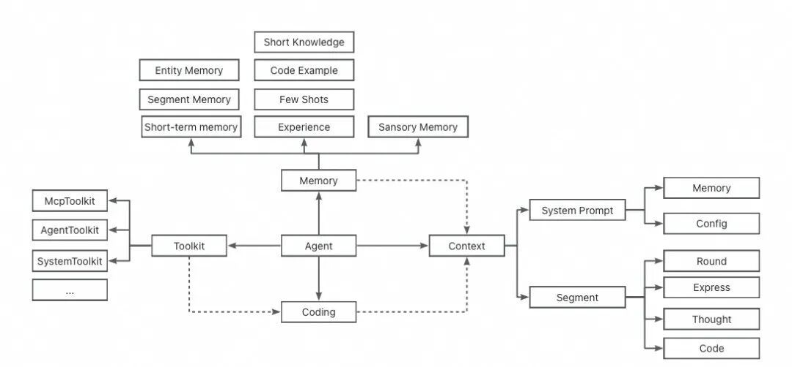

（Agent内部模块分布）

  

- Memory 记忆
- Short Term Memory 短期记忆: Session维度的记忆，仅在当前Session内生效；
- Sansory Memory 感知记忆: 通过悬浮球，捕捉的页面、url等环境感知记忆；
- Experience 经验: 来自配置、总结的经验，主要用于指导Agent各个环节的内容生成；
  
    

- Context 上下文
- System Prompt: 配置化、动态化的系统提示词；
- 可配置的：平台介绍 + 角色定义 + 工作机制 + 输入格式说明 + 输出格式要求 + 可用工具 + 重要原则 + 使用经验；
- 来自记忆的文本；
- Inference Segment 推理段落(User Prompt)；
- Round “轮”: 在复杂任务执行时，每轮会作为一个单独的Segment用作当前轮次的执行总结和后续轮次的目标定义；
- Express 表达: Agent返回给用户的内容；
- Thought 思考: Agent在每一步执行时的思考内容；
- Code 代码: 代码也会作为一个段落，出现在Prompt中；
- 其他: 如果后续有其他的环节，将作为新的Segment加入到User Prompt中；

  

- Code 代码
- Python Executor: Java中通过调用本地的Python进程；
- Py4j: Python回调Java代码的时候，使用此工具实现回调的泛化调用；
  
    

- Toolkit 工具包
- Python语义化模板设计: 提供将Toolkit转化为Python代码的模板设计模式，在Prompt中使用模板方法，生成Python代码参与Prompt中；
- 泛化调用。

  

**▐  核心Coding驱动逻辑**

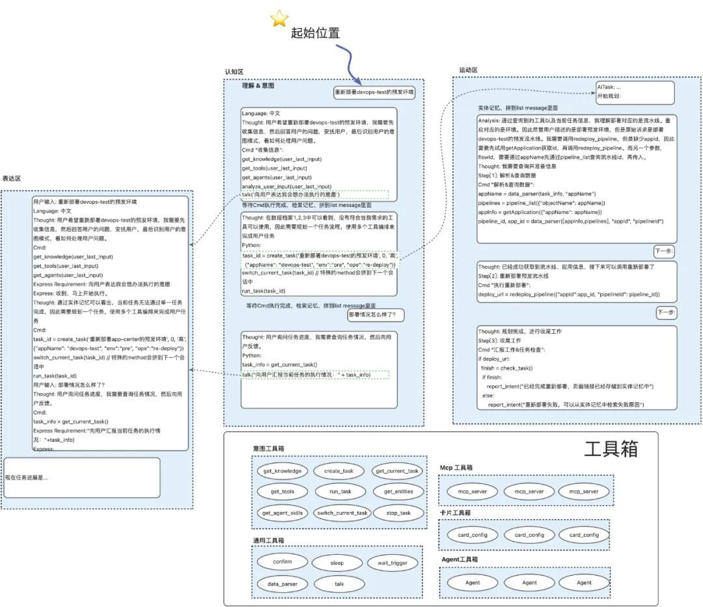

  

在我们的Agent中，Segment采用 " \[Segment\]: \[Content\] " 的结构，通过组合不同的Segment来形成Prompt，从而实现CoT（Chain of Thought）推理。

  

除了"外界"工具，我们还为Agent提供了"系统"工具，使其能够获取和控制自身能力。这些能力包括：检查已发起的任务、查询掌握的技能、主动休眠、主动与用户对话、通过大模型进行深度思考，以及利用大模型解析数据等。在实现上，每个工具箱都被设计为Python的一个Class，其中的各项工具则作为函数实现。我们将不同的描述和属性都相应地映射为Python中的各种定义。

  

由此，我们打造出了一个"自我编程"驱动的Agent。在运行时，它不仅能够调用外部能力，还可以充分利用Python的原生功能保障数据的确定性，如字符串运算、数字运算、时间运算等。更重要的是，它能够实现自我控制，可以发起复杂任务，并对自身能力进行检查评估。

> （PS：除了我们的“人类程序员”外，AI在这次迭代功不可没，凭感觉大概有50-60%的无修改代码，来自AI编写，尤其是《代码驱动》环节，几乎有80%的代码来自AI编写）

  

**▐  Agent工程结构**

  

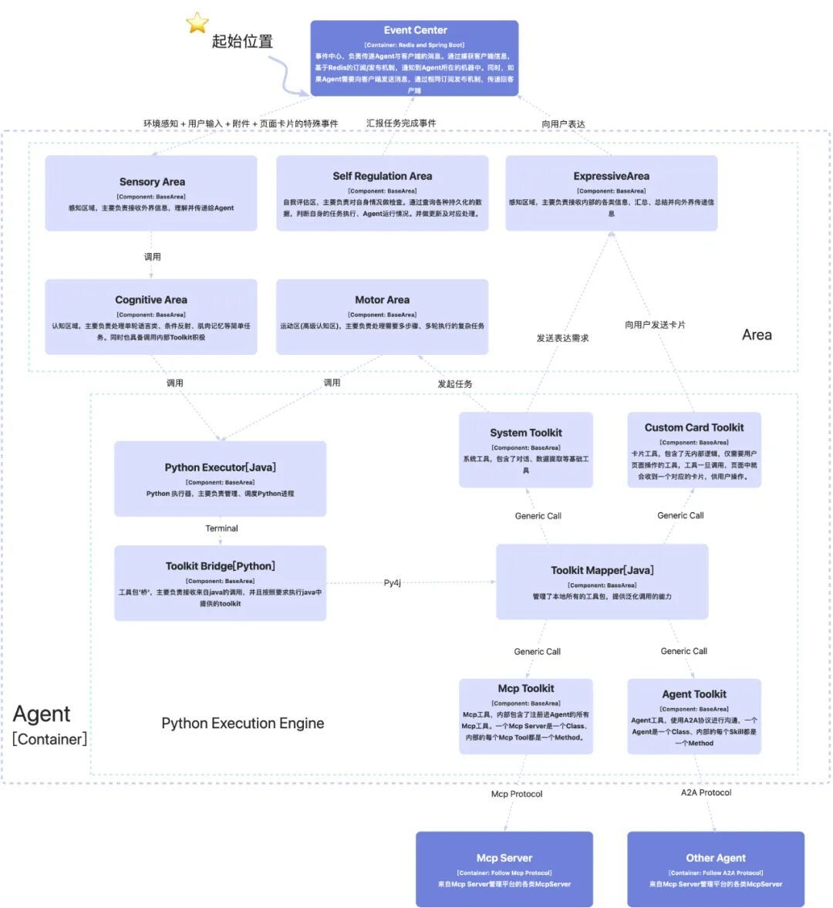

  

- Agent

  

在我们的系统中，一个Agent是一个线程。在Agent运行过程中，将会在线程池中，同时运行各个Area和Act。其生命周期如下图所示：

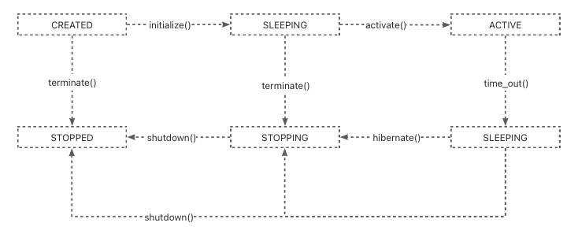

- Area —— 功能区介绍

  

Area的最初设计，是来自1.0向2.0演进时，创造出来的概念。其设计理念来源于人类的大脑分区，我们将Agent的逻辑区域分成了：感知区、认知区、表达区、自我评估区、运动区，将不同种类的Act收纳到Area中，让整个架构体系看着更加的清晰，也让相同能力的动作，可以具备相互沟通的可能。

  

各功能区关系和详细介绍

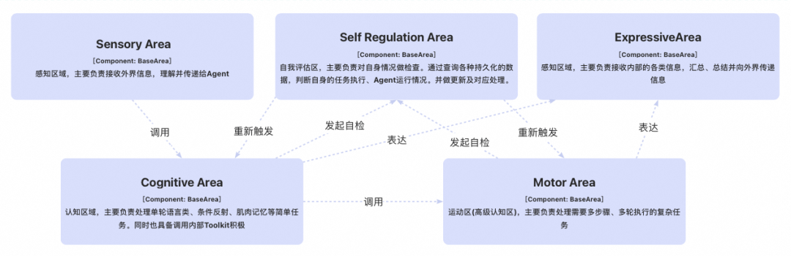

  

（1）感知区

主要负责接收外部信息，包括但不限于：用户发送的消息、用户点击的卡片事件、子Agent的异步返回结果等。在接收到消息后，感知区还会调用内部的Act，对数据进行系列处理、评估：

- 用户主语言解析
- 模糊化解析
- 场景分析
- 用户问题的增强
- 解析环境感知的数据
- 解析附件的数据
- 针对不同搜索场景的

  

（2）认知区

当感知区完成系列解析后，会将解析数据，传递到认知区，由认知区的IntentPlanner来使用Segment机制，处理用户需求并生成对应代码。生成代码后，提交给Python执行引擎，进行执行。

```code-snippet__js
IntentPlanner
    ├── SegmentBuilder (成员变量)
    │   ├── List<InferencePromptNewBuilder> promptBuilders
    │   ├── InferencePromptConfigManager (prompt配置管理)
    │   ├── build(type, segments, context, config) -> InferenceSegment
    │   └── 路由到具体的PromptBuilder
    │
    └── PromptBuilder实现类
        ├── BaseInferencePromptBuilder (抽象父类)
        │   └── 使用InferencePromptConfigManager获取配置化prompt
        ├── ThoughtPromptBuilder
        ├── CmdPromptBuilder  
        └── 其他自定义PromptBuilder
```
  

\[Act\] IntentPlanner 核心思想

- 用户输入后，仅执行一轮逻辑；
- 若存在复杂任务，则将任务移交给运动区处理；
  
    

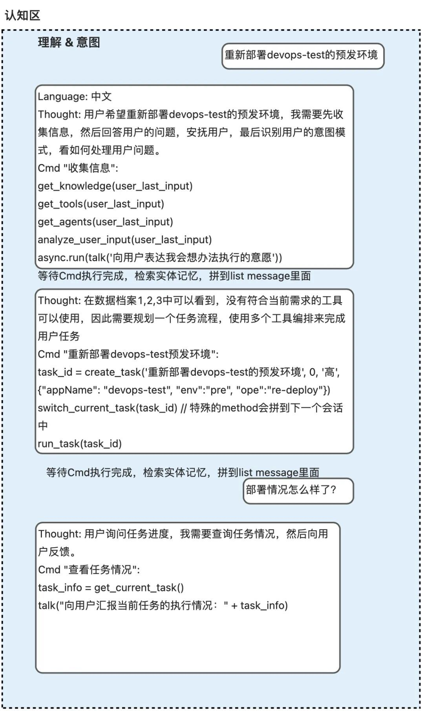

  

（3）运动区(高级认知区) 

在当前Agent系统中，运动区作为一种高级认知区，将会承担复杂任务。当认知区的无法处理的任务被提交过来后。运动区将会发起一个内部循环，来使用Segment的机制，逐步完成任务。

  

\[Act\] TaskExecutor 核心思想

- 根据传入的目标，逐轮执行计划；
- 每轮重新制定子目标，本轮完成后，都会评估任务进度，任务完成后汇报给感知区，若未完成，重新评估目标达成情况；若无法完成，可以选择放弃；
- 若目标判断可以达成，继续制定下轮目标；

```code-snippet__js
Round 1 Segments: [User, Context, Thought1, Plan1, Cmd1, Evaluation1, NextGoal1]
Round 2 Segments: [User, Context, Thought1, Plan1, Cmd1, Evaluation1, NextGoal1, Thought2, Plan2, Cmd2, Evaluation2, NextGoal2]
Round 3 Segments: [所有历史Segments + Thought3, Plan3, Cmd3, Evaluation3, NextGoal3]
```
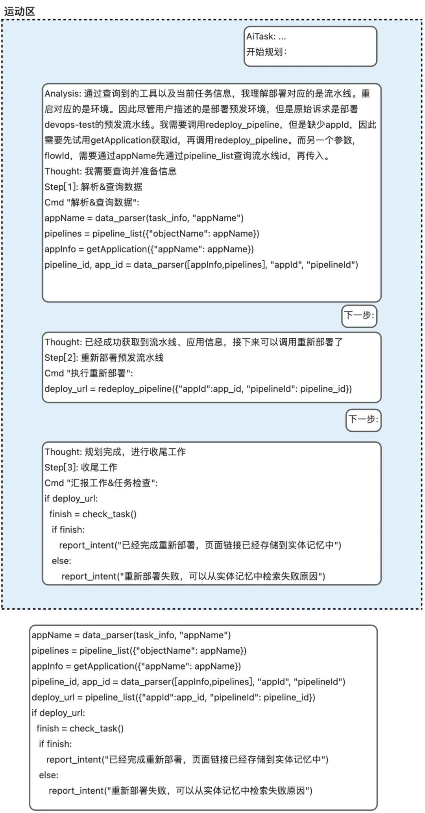

  

（4）表达区

表达区负责将内部信息传递给外部，包括但不限于：发送给用户的话、发送给用户的卡片、发送给用户的系列事件。

- 在传递文本时，表达区一般不做过多总结；
- 在传递数据时，表达区会根据历史Segment机制，依据数据，回答当前表达诉求；
- 在传递表单、复杂数据时，表达区将会直接向用户传递数据。
  
    

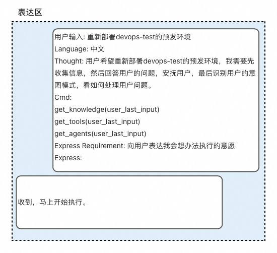

  

（5）自我评估区

当IntentPlanner、TaskExecutor，执行完初始目标后。将触发自我评估区的SelfTaskCheck评估任务完成情况。如果发现任务失败，或是能执行的，那么将重新触发回来源。

  


Context Engineering 上下文工程

**▐  上下文 与 Prompt**

  

在Agent中，上下文和Prompt体系是整个Agent决策的核心组件。该体系通过Segment机制统一管理不同类型的Prompt构建过程，实现了配置化、模块化的上下文组装和Prompt生成机制。

  

在Prompt和上下文拼装的过程，主要代码结构和逻辑如下图所示：

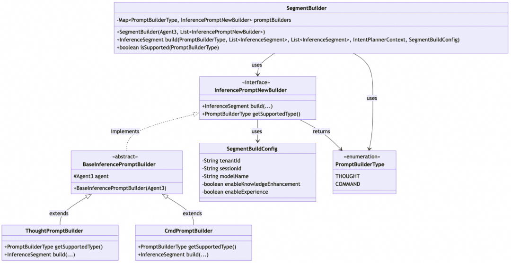

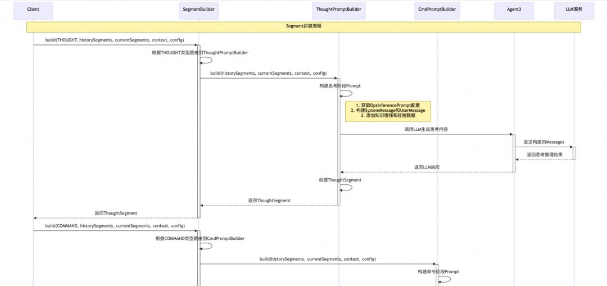

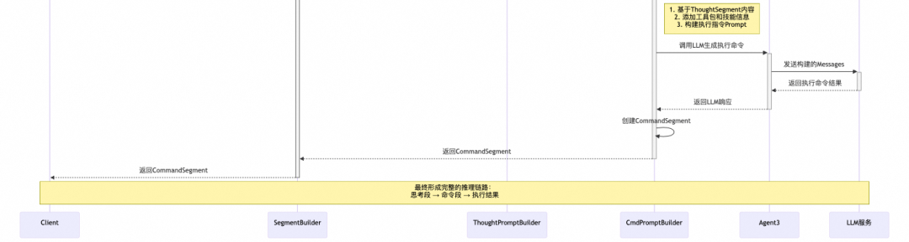

  

- Context上下文组成

  

1\. Segments

- 当前Segments
- Segments : 当前轮次已生成的Segment集合；
- 作用 : 提供当前轮次的执行状态和中间结果；
- 动态更新 : 随着当前轮次的进行不断增加新的Segment；
- 历史Segments
- Segments : 来自历史轮次的所有Segment集合；
- 作用 : 为Agent提供长期记忆和上下文连续性；
- 内容 : 包含用户输入、思考过程、执行代码、结果反馈等完整历史；
- 调用经验
- 成功案例 : 基于历史成功案例的工具使用经验；
- 失败总结 : 从历史失败中提取的经验教训；
- 最佳实践 : 经过验证的代码模式和调用方式；
- 知识增强
- 动态知识检索 : 基于用户查询的实时知识获取；
- 领域知识注入 : 特定场景下的专业知识补充；
- 上下文关联 : 与当前任务相关的背景知识；

  

2\. 环境上下文

- ToolkitContext : 包含会话ID、追踪ID、租户信息、执行过程的变量存储等执行环境；
- SegmentBuildConfig : 包含模型配置、功能开关、知识增强设置等；
- Agent状态 : 当前Agent的内部状态和能力配置；

  

3\. 工具上下文

- 可用工具清单 : 动态获取当前可用的工具包和API；
- 工具描述 : 自动生成的Python风格的工具使用说明；

  

- Prompt组成架构

  

Prompt示例

为了更好地理解我们的Prompt设计，这里展示一个基于Prompt拼接思路编写的案例：

（1）System Prompt示例

```code-snippet__js
## 平台介绍
你是一个Agent，专注于阿里巴巴DevOps平台的智能助手，能够操作DevOps的相关平台。


## 角色定义
你是一个专业的DevOps智能助手，具备代码生成、工具调用、任务执行等核心能力。


## 工作机制
基于用户输入和上下文信息，通过思考-执行-评估的循环模式完成任务。


## 输入格式说明
用户输入可能包含自然语言描述、页面截图、URL信息等多模态内容。


## 输出格式要求
代码将以Fill-in-Middle(FIM)格式提供,包含三个部分:
- <|fim_prefix|> 前缀代码 <|fim_suffix|> 后缀代码 <|fim_middle|>
  你需要在 <|fim_middle|> 处续写代码,使前缀代码和后缀代码能够正确连接并执行。
  注意:
- 仅在 <|fim_middle|> 处续写代码
- 确保续写的代码与前后文逻辑连贯
- 不要修改或重复前缀和后缀中的代码


## 可用工具
classexample_toolkit:
    def get_project_info(project_id):
        """获取项目基本信息"""
        pass
    
    def search_requirements(project_id, query):
        """搜索需求信息"""
        pass
    
    def create_requirement(project_id, title, description):
        """创建新需求"""
        pass


class normandy_toolkit:
    def get_app_list(project_id):
        """获取应用列表"""
        pass
    
    def deploy_app(app_id, version):
        """部署应用"""
        pass
    
    def get_deploy_status(deploy_id):
        """获取部署状态"""
        pass


## 重要原则
1. 严格按照FIM格式输出代码
2. 确保代码的安全性和正确性
3. 优先使用提供的工具包完成任务
4. 对于不确定的操作要进行二次确认


## 补充的增强知识（在后台配置的一些知识点，比如DevOps各个子系统间的关系、变更和分支的关系等）
%s


## 历史经验（自动学习+后台配置的一些代码示例，基于知识库团队提供的检索能力进行相关性召回）
%s
```
（2）User Prompt示例

```code-snippet__js
User: 帮我查询项目123的需求信息，关键词是"登录功能"
Context: 当前页面URL为https://example.com/project/123，用户正在查看项目概览页面
Thought: 用户想要查询项目123中关于"登录功能"的需求信息。我需要使用example_toolkit的search_requirements方法来完成这个任务。
Python:
<|fim_prefix|># 查询项目需求信息
project_id = "123"
query = "登录功能"


try:
    <|fim_suffix|>
except Exception as e:
    print(f"查询过程中发生错误: {str(e)}")<|fim_middle|>

```
期望返回结果：

```code-snippet__js
# 调用工具查询需求
    result = example_toolkit.search_requirements(id = 123, keyword = "登录功能")
    # 处理查询结果
    if result and result.get('success'):
        requirements = result.get('data', [])
        if requirements:
            print(f"找到 {len(requirements)} 个相关需求:")
            for req in requirements:
                print(f"- {req.get('title')}: {req.get('description')}")
        else:
            print("未找到相关需求信息")
    else:
        print("查询失败，请检查项目ID或网络连接")
```
  

System Prompt 结构

我们采用 配置化 + 动态化 的系统提示词设计，主要包含以下模块：

1\. 基础配置

```code-snippet__js
## 平台介绍
基于OpsInferencePrompt配置的平台能力介绍


## 角色定义  
Agent的角色定位和核心职责描述


## 工作机制
Agent的工作流程和决策机制说明
```
2\. 规范相关

```code-snippet__js
## 输入格式说明
用户输入的解析规则和格式要求


## 输出格式要求
不同PromptBuilder的专属输出格式定义
- ThoughtPromptBuilder: 思考过程的结构化输出
- CmdPromptBuilder: FIM格式的代码续写规范
```
3. 能力增强

```code-snippet__js
## 系统基础
Agent的基础能力和限制说明


## 可用工具
动态生成的工具包描述和使用方法
- Python语义化模板设计
- 泛化调用接口说明
- 工具调用示例
```
4\. 经验

```code-snippet__js
## 使用经验
基于历史成功案例的少样本示例


## 重要原则
核心的执行原则和安全约束


## 常见错误
常见问题的预防和处理方案
```
  

User Prompt 结构

1\. Segment List

用户提示词主要由Segment序列组成，按时间顺序排列：

```code-snippet__js
User Segment: 用户的原始输入
Context Segment: 环境感知数据（页面信息、URL等）
Thought Segment: Agent的思考过程
Command Segment: 生成的执行代码
Evaluation Segment: 执行结果评估
NextGoal Segment: 下一步目标规划
...
```
2\. FIM格式 (Fill-In-Middle)

我们使用FIM格式进行代码续写。FIM技术基于论文"Efficient Training of Language Models to Fill in the Middle"\[ https://arxiv.org/abs/2207.14255 \]，是一种专门针对代码生成优化的技术：

```code-snippet__js
代码将以Fill-in-Middle(FIM)格式提供,包含三个部分:
- <|fim_prefix|> 前缀代码 <|fim_suffix|> 后缀代码 <|fim_middle|>
  你需要在 <|fim_middle|> 处续写代码,使前缀代码和后缀代码能够正确连接并执行。
  注意:
- 仅在 <|fim_middle|> 处续写代码
- 确保续写的代码与前后文逻辑连贯
- 不要修改或重复前缀和后缀中的代码
```
FIM技术的核心优势 ：

- 上下文感知 : 模型能够同时理解前缀和后缀代码的语义；
- 精准填充 : 专门训练用于中间代码片段的生成，而非从头编写；
- 逻辑连贯 : 确保生成的代码能够与前后文完美衔接；

FIM格式的实际结构：

```code-snippet__js
<|fim_prefix|>
# 已有上下文和代码
# 包含函数定义、变量声明等前置逻辑
<|fim_suffix|>
# 后续期望的代码结构
# 包含返回值处理、异常处理等后置逻辑
<|fim_middle|>
# LLM需要在此处填充代码
# 生成连接前后文的核心业务逻辑
```
在Agent中的应用场景 ：

- 逻辑补全 : 在明确输入输出的前提下，补全中间的处理逻辑。

  


记忆

  

记忆系统是构建真正智能Agent的关键组件。正如人类认知系统依赖于复杂的记忆机制来学习、推理和决策，AI Agent也需要类似的记忆架构来：

- 维持长期对话状态 ：在多轮交互中保持上下文连贯性；
- 积累经验知识 ：从历史交互中学习和改进；
- 支持复杂推理 ：基于历史信息进行更深入的分析；
- 个性化服务 ：根据用户历史偏好提供定制化体验；

  

Agent在处理复杂任务时，主要依赖于上下文窗口来维持对话状态和任务记忆，这种方式存在明显的局限性：

1\. 上下文长度限制 ：上下文窗口有固定的token限制，无法处理超长的历史信息；

2\. 记忆组织缺失 ：简单的上下文拼接无法有效组织和检索历史信息；

3\. 知识更新困难 ：静态的上下文无法动态更新和优化已有知识；

4\. 计算成本高昂 ：长上下文处理需要大量的计算资源；

  

为了解决这些问题，需要在Agent工程侧开发各种Agent记忆系统，旨在为AI Agent提供持久化、结构化、可检索的记忆能力，它记录了Agent过往的所见所闻和互动历程。

**▐  记忆分层**

  

按照存储时间的记忆分类法最早是在 1968 年发布的 Atkinson-Shiffrin Memory Model 中提出，将记忆分为感知记忆（Sensory Memory）、短期记忆（Short-term Memory）和长期记忆（Long-term Memory）。

- 感知记忆存储了人脑从环境中捕获的信息，例如声音、视觉等信息，在感知记忆区这类信息只能保留很短的时间；
- 短期记忆存储人脑在思考过程中所需要处理的信息，也被称为工作记忆（在 1974 年 Baddeley & Hitch 模型中提出），通常也只能保留很短的时间；
- 长期记忆是指Agent中存储时间较长的信息，它类似于人类大脑中的记忆，能够保留大量的数据和经验，并且可以存储很长时间，甚至是永久性的。

  

长期记忆和短期记忆在Agent中是相互补充的。短期记忆可以快速访问和处理当前需要的信息，而长期记忆则提供了丰富的背景知识和历史数据。Agent需要将短期记忆中的信息与长期记忆中的知识结合起来，以实现更智能的行为和决策。

  

```code-snippet__js
┌─────────────────────────────────────────────────────────────┐
│                   记忆分层                             
├─────────────────────────────────────────────────────────────┤
│  感知记忆 - 标签页维度
├─────────────────────────────────────────────────────────────┤
│  短期记忆 - 会话纬度                                   
│  ├─ 会话记忆 
|  ├─ 实体记忆
│  └─ 工作记忆                                 
├─────────────────────────────────────────────────────────────┤
│  长期记忆           
│  ├─ 用户偏好 (业务实体记忆,...) - 用户纬度   
│  ├─ 历史会话 (历史会话记忆总结) 
│  ├─ 用户画像 (角色定位、技能标签、工作习惯)
|  ├─ 平台知识
│  └─ 经验                            
└─────────────────────────────────────────────────────────────┘
```
**▐  环境感知记忆**

鱼的记忆只有 7 秒，实际上人也有非常多的记忆过目就忘，但不管怎样，这个记忆始终存在过。

环境感知记忆是最短期的记忆，只在当下这一瞬间有效的数据，不具有长期价值。

- 在网页上的任意动作都会让前一瞬间的数据失效：例如打开抽屉/弹窗时，之前感知到的数据可能就没有意义了；
- 如果要记得之前看过哪些东西，则需要转成工作记忆或者沉淀到长期记忆中。
  
    

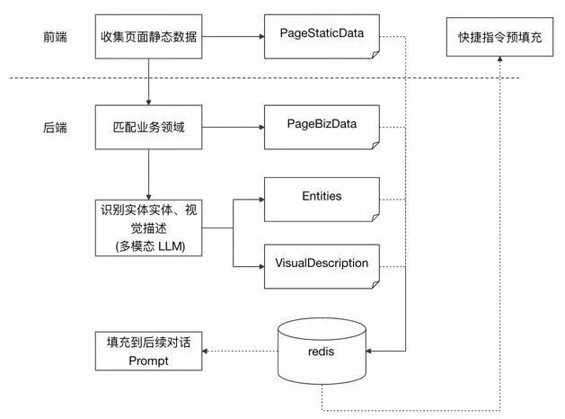

  

- 使用场景

  

在答疑场景中，用户打开对话时，大概率是遇到了问题，需要寻找对应的解决方案。这个时候需要用户编写一些文字向 Agent 说明在哪个页面进行什么操作时，遇到了什么问题。如果 Agent 能有一双眼睛，跟用户一样看着当前的页面，那么或许就能够提前帮用户预输入当前的上下文，减少用户的使用成本。

**▐  短期记忆**

  

在Agent中，我们设计了基于Session级别的短期记忆存储，基于ES实现。在短期记忆中，会话、实体、工作记忆均被设计统一的Segment格式存储，为Agent提供上下文连续性。

```code-snippet__js
用户对话 → 内部产生Segment → 短期记忆存储 → 下轮对话时检索 → 提供上下文
```
  

- 记忆消息类型

  

1\. 段落记忆消息

存储推理段落信息，是Agent执行过程的核心记忆载体。

数据结构 :

```code-snippet__js
classSegmentMemoryMessageextendsShortTerm3MemoryMessage {
    InferenceSegment segment;     // 推理段落内容 (Thought/Command/Evaluation等)
    String execId;               // 所属执行ID，标识当前轮次
    List<String> parentExecId;   // 父节点执行ID列表，支持执行链追溯
}
```
2\. 实体记忆消息

存储结构化实体信息，用于记录关键对象和状态。

数据结构 :

```code-snippet__js
classEntity3MemoryMessageextendsShortTerm3MemoryMessage {
    String title;                // 实体标题/名称
    Object data;                 // 实体数据内容(可为任意对象)
}
```
使用场景 :

- 工具调用结果存储
- 用户关键信息提取
- 环境状态快照

3\. 基础消息类型

所有短期记忆消息的基类，提供通用属性。

数据结构 :

```code-snippet__js
abstract classShortTerm3MemoryMessage {
    String uuid;                 // 唯一标识符，用于更新和删除操作
    String sessionId;           // 会话ID，Session级别隔离
    List<String> tags;          // 标签列表，支持多维度分类
    Long timestamp;             // 创建时间戳，用于时序管理
    Long sortValue;             // 排序值，控制记忆优先级
}
```
**▐  长期记忆**

  

- 知识点

  

知识点目标是将内部积累的研发经验和专业知识系统化。特别是在与MCP系统集成后，将能够模拟开发人员的问题解决思路，提供更加专业和精准的支持。

知识点的内容，需要主要覆盖几个关键领域：

- DevOps相关平台研发团队的工具/api/平台使用调用实战经验；
- 团队私有域知识；

除了正面的知识注入，系统还包含了约束性知识，例如平台使用的注意事项、特定场景下的最佳实践以及常见问题的标准处理流程。这些知识将直接影响Agent的响应策略和问题处理方式。

  

值得注意的是，这些新增的知识点与知识库的区别 ：

- 新的知识点，会作为Agent思考的Prompt的指引。往往包含“概念性”的内容。当一个知识沉淀成一个“文档”比较重，又希望告知Agent的时候，就可以使用短知识来进行维护；
- 短知识往往是一句话，比如：重新部署是流水线的概念，重启是诺曼底的运维概念。

  

- 代码执行经验

  

这里描述的是接下来将推出的形态，在目前版本中，大模型投票机制还没有，记忆的存储与检索目前只是在向量数据库中，知识图谱方案还在对接中。在Agent每轮逻辑执行完成后，本轮执行的细节将会被记录到经验记录表中。经过人工审核+大模型投票机制，会将记忆录入到知识库团队提供的经验图谱进行存储。在Agent每次使用大模型生成代码时，将会从知识图谱中检索到对应的经验，随后拼接到Prompt中的固定位置。

  

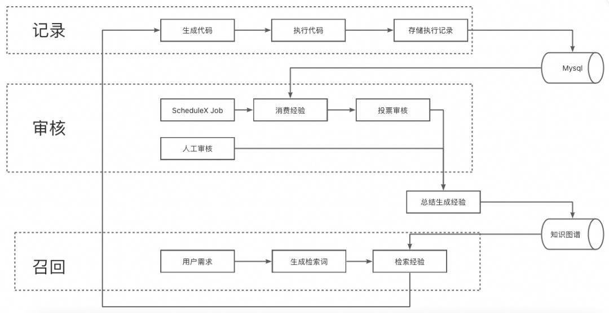

  

- 用户偏好记忆

  

通过环境感知，根据用户页面访问情况，实时动态上报业务实体操作，作为业务实体记忆上下文。

Memory部分，接收环境感知上报的数据，进而转换成业务实体记忆存储(BizEntityMemroy),BizEntityMemroy主要组成部分:

- schema: 定义业务实体的结构schema，json schema格式
- data: 定义业务实体的具体数据
- operation: 平台操作
- tags: 实体标签

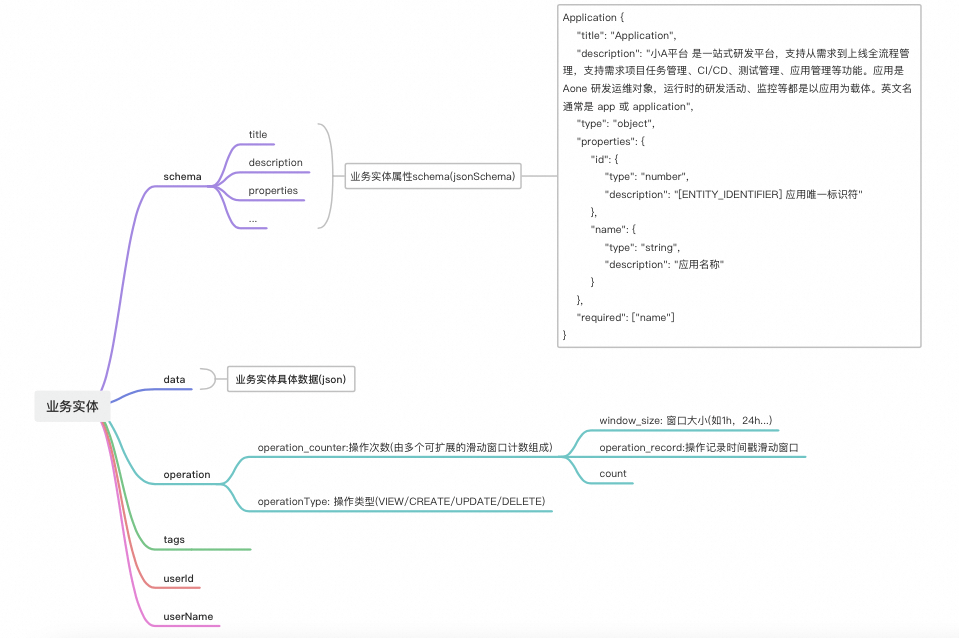

  

- 历史会话记忆

  

用户通过助手进行会话时，由Agent规划模块进行意图识别，并规划Task。在规划Task执行完成时，对会话记忆进行总结。

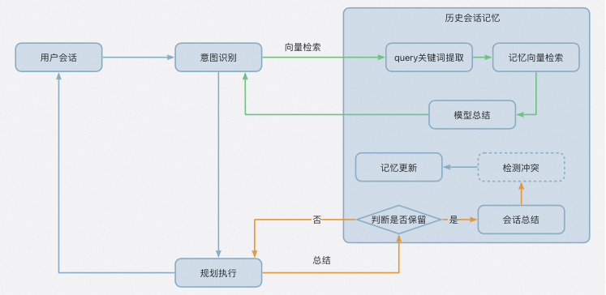

  

HistoryChatMemory(历史会话总结记忆)存储结构：

```code-snippet__js
{
  "time": "2025-09-18 17:14:00"
  "question_type": "操作实施",
  "keys": "应用名: example",
  "summary": "用户在明天(2025-09-18 14:00:00)有一个example的发布计划",
  "userId":""
}
```
历史会话记忆检索，通过全文向量融合查询，召回会话记忆：

- 向量化字段：keys
- filter：userId

记忆淘汰策略：

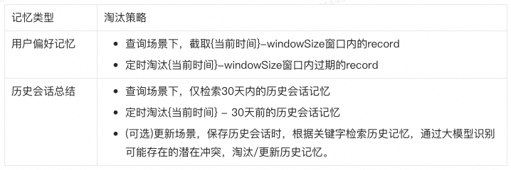

  


代码驱动

  

在 Agent 开发的早期，我们用业界必选的Agent实现方式，走了LLM返回"JSON " + "固定文本前缀"的路。这看起来是最直观的选择，我们的Agent 1.0 和 2.0 版本都是这么实现的。

  

但随着项目深入，作为一个重工具调用的Agent，频繁调用Mcp、Agent的问题接踵而至：

- 数据格式虽然可以保证，但是内容质量并不能保证；
- Token 超长导致的性能下降；
- JSON 格式不够稳定；
- 多轮对话既要保证灵活性又要保证速度；

  

无论是对接 Mcp 还是 A2A，想要又快又准确地调用各种能力，都面临着重重困难。我们也在不断借鉴业界各领域的优秀实践，从 mem0 到 JManus，但始终觉得差点意思。为了提高任务成功率，我们牺牲了响应速度；为了提升速度，我们又不得不降低灵活性；而灵活性的降低，恰恰又导致了任务成功率的下降。这似乎成了一个难解的死循环。

  

2.0 版本虽然是对 1.0 的全面重构，但经过一段时间的实践，我们发现它在执行逻辑时总是一条路走到黑，一旦开始节点错了，就很难再纠正回来。正当我们为此困扰时，一次偶然的发现给了我们启发：在研究 Github Copilot Agent 时，我们注意到它使用 JavaScript 来定义工具。虽然它最终还是用 JSON 来调用，但这个设计却让我们灵光一现 —— 为什么不让 Agent 直接通过编写代码来实现自己的逻辑呢？

**▐  代码执行**

  

在Agent中，代码与执行部分是整个系统的核心执行引擎。它实现了从代码生成到执行再到结果反馈的完整闭环，让Agent真正具备了"自我编程"的能力。

  

- Python Execution Engine \[Java\]

  

PythonExecutionEngine作为整个代码执行的引擎，设计上采用了"线程池+异步执行+监控"的架构模式。本质上就是用Java发起Python，让Python执行代码，调用工具时回调Java，同时Java负责调度和监控。

  

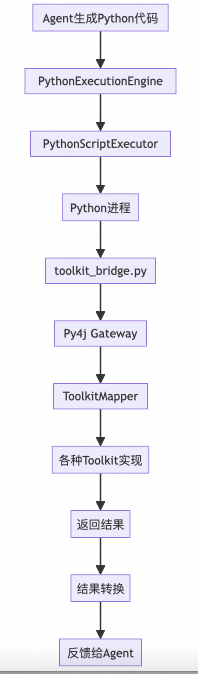

  

核心设计思想：

- 异步执行 : 每个Python脚本都在独立线程中运行，避免阻塞主流程；
- 生命周期管理 : 从执行ID生成到结果回收，全程可追踪；
- 超时控制 : 防止Python脚本死循环，默认3600秒超时；
- 资源隔离 : 每个执行都有独立的上下文环境；

  

脚本执行流程

执行流程：

1\. 准备阶段 : Agent把生成的Python代码传递给PythonExecutionEngine；

2\. 初始化 : 分配执行ID，设置上下文，注册工具包；

3\. 执行 : 启动Python进程，加载toolkit\_bridge.py；

4\. 监控 : ExecutionMonitor实时跟踪执行状态；

5\. 收尾 : 收集结果，清理资源，反馈给Agent；

代码执行的核心逻辑在PythonScriptExecutor中，它负责：

- 动态生成Python运行环境；
- 注入toolkit\_bridge.py作为桥接层；
- 管理Python进程的生命周期；
- 处理标准输出和错误输出；

  

安全与监控

- 执行日志 : 记录每次代码执行的详细信息；
- 性能监控 : 统计执行时间、成功率、错误分布；
- 安全检查 : 虽然还没完全实现，但预留了代码安全扫描的接口。此处应该严格禁止，某些系统函数的调用，比如随便引用import、使用os操作系统文件等；
- 资源监控 : 监控Python进程的CPU和内存使用。

  

- Toolkit Bridge \[Python\]

  

Toolkit Bridge是整个Python和Java沟通的桥梁，可以说是这套架构中最关键的一环。它解决了"Python怎么调用Java工具包"这个核心问题。

  

Py4j桥接机制

我们用Py4j来实现Python和Java的双向通信。简单来说，Java实现一个Py4j的Gateway Server，Python对接到这个Server中，就能互相调用了。


关键设计点：

- 单例Gateway : 全局只维护一个Gateway连接，避免重复连接开销；
- 连接池化 : Gateway连接失败时自动重试，保证连接的稳定性；
- 端口固定 : 默认使用15333端口，避免端口冲突；

  

会话上下文管理

SessionContext解决了"Python代码怎么知道当前是哪个用户、哪个会话"的问题：

```code-snippet__js
classSessionContext:
    def __init__(self):
        self._data = {}
        self._toolkit_context = None
    
    def set_data(self, key, value):
        """设置会话数据，如session_id、trace_id等"""
        self._data[key] = value
```
每次Python脚本执行前，Java会把session\_id、trace\_id、用户信息等存储到SessionContext里，这样Python代码调用工具包时就知道自己代表哪个用户在执行了。

  

异步调用支持

PythonToolkitProxy这个类是我们的核心调用逻辑，他提供一个动态代理入口，它让Python代码可以像调用本地函数一样调用Java工具包：

```code-snippet__js
classPythonToolkitProxy:
    def __init__(self, toolkit_name):
        self.toolkit_name = toolkit_name
    
    def __getattr__(self, operation_name):
        async def async_operation_method(*args, **kwargs):
            return await call_toolkit_async(self.toolkit_name, operation_name, kwargs)
        return async_operation_method
```
这样，Python代码就能这么写：

```code-snippet__js
# 这样调用就行了，简单直观
result = await example_toolkit.get_project_info(project_id="123")
```
就可以调用到在Java中的代码了：

```code-snippet__js
publicclassExampleToolkit{
  public Object get_project_info(String projectId){
    return null;
  }
 } 
```
  

运行参数捕捉机制

参数处理这块我们踩了不少坑。最开始位置参数和命名参数混用会出问题，后来做了参数规范化：

1\. 捕获运行参数 ：使用装饰器，标记在对应的函数上，那么就能获取到函数中的临时变量了；

2\. 参数统一 : 优先使用命名参数，位置参数自动转换；

3\. 类型转换 : DynamicEntity等Java对象自动转换为Python字典；

4\. 序列化 : 所有参数最终都序列化为JSON传递给Java端；

```code-snippet__js
def capture_execution_variables_async():
    """装饰器：捕获异步Python函数执行时的局部变量"""
    def decorator(func):
        @functools.wraps(func)
        async def wrapper(*args, **kwargs):
            captured = {}
            def tracer(frame, event, arg):
                if event == 'return'and frame.f_code == func.__code__:
                    try:
                        # 复制局部变量，过滤掉内部变量
                        for key, value in frame.f_locals.items():
                            ifnot key.startswith('_') and key not in ['args', 'kwargs']:
                                # 检查值是否可序列化
                                try:
                                    json.dumps(value, default=str, ensure_ascii=False, cls=DynamicEntityJSONEncoder)
                                    captured[key] = value
                                except (TypeError, ValueError):
                                    # 对于不可序列化的对象，转换为字符串
                                    captured[key] = str(value)
                    except Exception as e:
                        print(f"ExecutionVariableMonitor capture error: {e}")
                return tracer


            sys.settrace(tracer)
            try:
                result = await func(*args, **kwargs)
            finally:
                sys.settrace(None)


            # 保存变量到全局context中供Java侧获取
            if hasattr(sys.modules[__name__], 'captured_variables'):
                sys.modules[__name__].captured_variables.update(captured)
            else:
                sys.modules[__name__].captured_variables = captured.copy()


            # 输出捕获的变量，使用特殊格式供Java端解析
            for key, value in captured.items():
                print(f"VARIABLE_CAPTURED:{key}={json.dumps(value, default=str, ensure_ascii=False, cls=DynamicEntityJSONEncoder)}")


            return result
        return wrapper
    return decorator

```
通过注解捕捉到运行参数后，会在完成运行后，由java解析，并存储到redis里面。当下次执行的时候，会从redis取出会话中的参数。以实现在下轮对话中，可以感知到上轮对话的变量及内容。

```code-snippet__js
# 第一轮对话


def main():
  a = 1


# 第二轮对话
a = 1 # 通过redis回放回来的参数


def main():
  print(a+1)
```
  

- Toolkit Mapper \[Java\]

  

ToolkitMapper是整个工具包体系的调度中心，它负责把Python的调用请求路由到具体的Java工具包实现。

  

工具包映射与路由

核心路由逻辑很直接：根据toolkit\_name找到对应的实现类，然后调用对应的operation方法。但实际实现中有几个关键点：

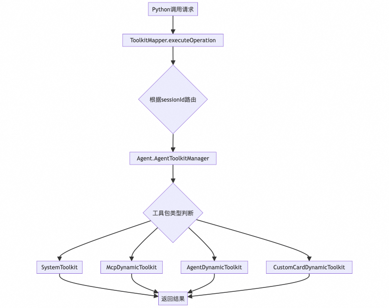

  

- 动态路由 : 通过sessionId找到对应的Agent3实例，再通过Agent的AgentToolkitManager来执行具体操作；
- 类型适配 : 不同类型的工具包有不同的接口，ToolkitMapper负责做适配；
- 结果包装 : 所有返回结果都通过ResultWrapper进行统一包装；

  

数据传递机制

为了实现让历史Python运行的临时参数，可以被传递到下次运行Python的过程中，我们在数据传递过程中，在Java内部通过Base64将原始数据反编译，然后使用参数，传递到python脚本中。Python脚本拿到Base64之后，自行解码，将数据在内存恢复到目标参数中。

  

方法调用机制

我们在Agent、Mcp的Toolkit中，将技能/工具映射成方法，Agent/McpServer映射成Class。每个Agent、McpServer都对应一个独立的Toolkit。

因此当某个Toolkit被调用时，将会拿到自身的class、方法名，从而找到对应的技能/工具，进行泛化调用。

  

▐  Toolkit工具包

  

Toolkit体系是整个Agent能力的具体体现，它把抽象的"智能助手"落地为可执行的工具包。我们设计了四大类工具包，每类都有自己的特色和应用场景。

  

- Custom Card Toolkit

  

自定义卡片工具包是我们为了解决"Agent怎么和用户交互"这个问题而设计的。传统的文本对话太单调，我们需要更丰富的交互形式。

  

卡片组件系统

卡片系统采用了组件化的设计思路，每个卡片都是一个独立的UI组件：

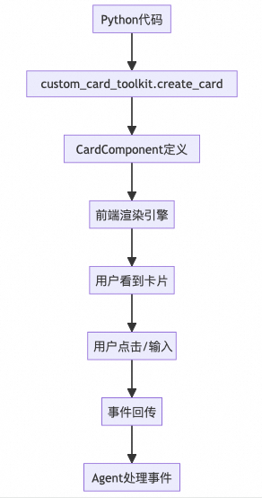

  

支持的卡片类型：

- 转人工卡片 : 支持用户有转人工意图时，发送卡片进行转人工处理；
- 运维卡片 : 用户想要进行运维操作时，将会发送运维卡片；

  

- Mcp Toolkit

  

Mcp（Model Context Protocol）Toolkit是我们对接外部服务的标准化接口。通过Mcp协议，我们可以快速集成各种外部能力，而不需要为每个服务单独开发适配器。

  

- Agent Toolkit

  

Agent Toolkit实现了Agent之间的协作机制。在复杂任务场景下，单个Agent可能无法独立完成所有工作，需要和其他专业Agent协作。

  

A2A协议支持

A2A（Agent to Agent）协议定义了Agent间交互的标准格式：

- 任务分发 : 主Agent将复杂任务分解后分发给子Agent；
- 进度汇报 : 子Agent定期汇报任务执行进度；
- 异常处理 : 子Agent执行失败时的异常上报机制；
- 资源协调 : 多个Agent竞争同一资源时的协调机制；

  

- 工具包注册与管理

  

工具包的注册与管理是整个Toolkit体系的基础设施，它支持多种注册方式和管理机制。我们设计了两套并行的注册体系：基于接口的动态工具包和基于注解的声明式工具包，它们各有适用场景，互不耦合。

  

动态工具包注册

动态工具包是我们的核心注册机制，通过实现DynamicToolkit接口来定义工具包：

```code-snippet__js
public interface DynamicToolkit {
    String name();                              // 工具包名称
    String getClassComment();                   // 工具包描述
    Map<String, String> getMethodPython();     // Python方法定义
    Map<String, Type[]> getMethods();          // 方法参数类型
    Map<String, String[]> getParameterNames(); // 参数名称
    Object execute(String methodName, String execId, Map<String, Object> params);
}
```
- 接口驱动 : 所有动态工具包都实现DynamicToolkit接口，保证接口的一致性；
- 运行时注册 : 工具包可以在运行时动态注册和卸载，支持热插拔；
- 元数据自描述 : 工具包自己描述自己的能力和接口，无需外部配置；

典型的动态工具包实现：

```code-snippet__js
@Component
publicclassExampleDynamicToolkitimplementsDynamicToolkit {
    
    @Override
    public String name(){
        return"example_toolkit";
    }
    
    @Override
    public Object execute(String methodName, String execId, Map<String, Object> params){
        // 动态分发到具体方法
        switch (methodName) {
            case"get_project_info":
                return getProjectInfo(params);
            // 其他方法...
        }
    }
}
```
  

注解式工具包注册

注解式注册是一种声明式的工具包定义方式，适合结构相对固定的工具包：

```code-snippet__js
@ToolkitComponent(
    python = "system_toolkit",
    description = "系统级工具包，提供基础的系统操作能力"
)
publicclassSystemToolkit {
    
    @ToolkitOperation(python = "send_message")
    public ToolkitResult sendMessage(Map<String, Object> params){
        // 发送消息的具体实现
    }
    
    @ToolkitOperation(python = "get_current_time", enabled = true)
    public ToolkitResult getCurrentTime(Map<String, Object> params){
        // 获取当前时间的具体实现
    }
}
```
- 声明式配置 : 通过注解声明工具包的元数据，简化配置；
- 编译时检查 : 注解在编译时就能发现配置错误；
- Spring集成 : 与Spring的Bean管理机制无缝集成；

  

注册机制分离设计

两种注册机制在实现上完全分离，各自有独立的处理流程：

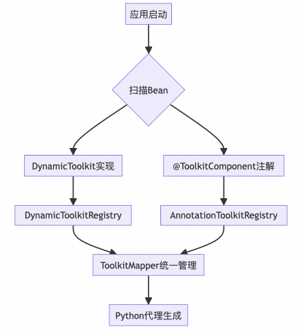

  

- 独立注册表 : DynamicToolkitRegistry和AnnotationToolkitRegistry分别管理两类工具包；
- 统一访问 : ToolkitMapper提供统一的访问接口，屏蔽底层注册机制的差异；
- 互不干扰 : 两种机制可以独立开启或关闭，不会相互影响；

  


反思

  

**▐  开发一个Agent，需要做的几件事情**

  

经过三轮Agent的升级与优化，关于如何打造优质AI Agent，我结合Agent实践经验总结几点核心要素：

  

- 1\. Prompt组装与上下文工程的合理设计

  

> 上下文管理影响多轮对话的稳定性。

在搭建Agent时，需要对Prompt进行单独的设计，明确Prompt的组成部分、上下文的选择、Agent运行过程的不同形态下，上下文的组装方式等。

推荐的Prompt/上下文开发过程：

- 可以先准备一段完整的比较粗糙的prompt，其中记忆、经验相关的内容都先使用mock的方式拼接在其中，然后使用LLM的api对prompt的效果进行初步验证；
- 验证没问题后，可以进入代码实现，将prompt按逻辑和结构拆分成多个部分，例如自我介绍、工作机制、输入格式、输出格式、示例等，然后分别实现每个部分；
- 后续需要在运行过程中不断调整prompt，可以在每次发现bad case的时候，将目前的prompt、出现的问题和自己的思路发给LLM，让LLM帮助优化；

  

我们在前两个版本的时候，Prompt组装，是没有系统性、结构性设计的，这也就导致了过程中出现了一个900多行的超级大的Prompt，它里面各个位置的内容都是比较乱的。Prompt和上下文的组装、拼接经过了单独的设计，实现的代码中，对其组装也模板设计模式、Builder设计模式的组合，来完成Prompt的拼接。

  

- 2\. Agent的工程架构设计也很重要

  

> 工程架构直接影响交互体验的流畅度。

工程层面，Agent需要考虑：Agent运行过程如何持久化、优雅上下线、任务的完成与失败如何定义和管理、日志/监控/可观测/评测制度的建立、记忆如何管理。

  

"模型决定上限，工程决定下限"这种说法就像曾经的"PHP是世界上最好的语言"一样片面。实际上二者是相辅相成的关系。有些产品即便采用了Claude这样的强大模型，整体效果反而不如使用Deepseek但工程实现更优秀的同类产品。

  

关键在于模型能力与工程细节的契合度。在工程层面比如工具调用编排、用户交互设计、内部流程优化等，都需要在工程层面深度打磨，才能充分发挥模型潜力。过分迷信模型能力而"死等模型升级"是不可取的。

  

- 3\. Agent提高运行质量和稳定性，可以通过让他自我积累、自我学习

  

> 经验积累则确保跨会话的一致性。

不论是JSON、文本前缀还是Coding驱动，经验都是一个好东西。它可以大大地提高返回数据的稳定性。这里分享几篇论文：

《ExpeL: LLM Agents Are Experiential Learners》

《How Memory Management Impacts LLM Agents: An Empirical Study of Experience-Following Behavior》

《Get Experience from Practice: LLM Agents with Record & Replay》

简单来说，经验的组装，就是：

```code-snippet__js
收集 -> 加工 -> 存储 -> 检索
```
在Agent运行过程中， 收集一切有用的信息，随后在完成运行后，通过 LLM 或者各种解析逻辑加工成一段文本、一个json，代表本次执行的起因、经过、结果、思考等信息。随后存储到数据库中（不仅局限于向量数据库）。在Agent运行阶段，将用户文本做简单加工，随后进行检索。 只不过在工程层面，检索过后的结果，可以用作“回放”，可以用作“Prompt”拼接。单纯的向量数据库检索，不一定能让经验检索变得准确，我们目前正在向图索引的方向探索，让图谱的能力辅助经验的检索与加工。

  

▐  展望

  

- 目标定位

  

我们的最终目标是致力于让它成为可靠的"1.5线"答疑助手，具备初级程序员（1-3年）的知识储备和问题解决能力，同时拥有自我进化和持续学习能力。

  

- 优化路径

  

1. 除了调用过程是代码，拼接Prompt能否变得更加动态？甚至在Cmd、Thought阶段的Prompt，都是由Agent自我选择Toolkit拼装的；
2. 在IntentPlanner阶段，并非是不可循环的，我们后续会把IntentPlanner、TaskExecutor的底层能力合并，提供一个通用的Coding驱动Agent模型，基于此模型，实现各层的ReAct操作；
3. 任务间的上下文隔离还需要做的更加精细；
4. 知识点和经验的数据，需要持续保鲜；
5. Mcp和Agent的深度和广度，都需要持续提升；
6. 开发一个桌面应用程序，随时随地可以唤起；
7. 日志、观测、报表、监控、评测机制的的完善。

  

  

**¤** **拓展阅读** **¤**

  

[3DXR技术](https://mp.weixin.qq.com/mp/appmsgalbum?__biz=MzAxNDEwNjk5OQ==&action=getalbum&album_id=2565944923443904512#wechat_redirect) | [终端技术](https://mp.weixin.qq.com/mp/appmsgalbum?__biz=MzAxNDEwNjk5OQ==&action=getalbum&album_id=1533906991218294785#wechat_redirect) | [音视频技术](https://mp.weixin.qq.com/mp/appmsgalbum?__biz=MzAxNDEwNjk5OQ==&action=getalbum&album_id=1592015847500414978#wechat_redirect)

[服务端技术](https://mp.weixin.qq.com/mp/appmsgalbum?__biz=MzAxNDEwNjk5OQ==&action=getalbum&album_id=1539610690070642689#wechat_redirect) | [技术质量](https://mp.weixin.qq.com/mp/appmsgalbum?__biz=MzAxNDEwNjk5OQ==&action=getalbum&album_id=2565883875634397185#wechat_redirect) | [数据算法](https://mp.weixin.qq.com/mp/appmsgalbum?__biz=MzAxNDEwNjk5OQ==&action=getalbum&album_id=1522425612282494977#wechat_redirect)
