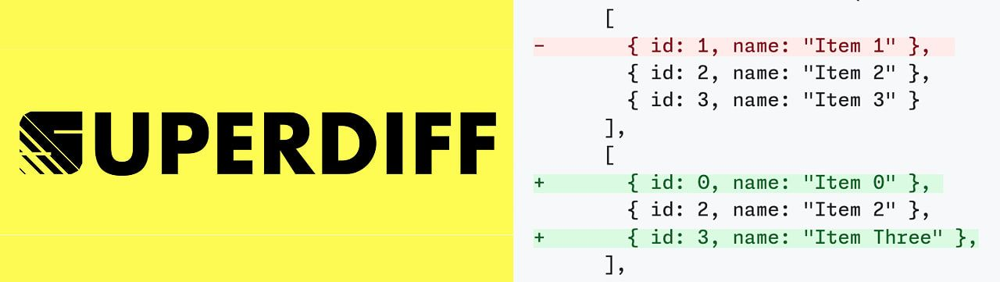
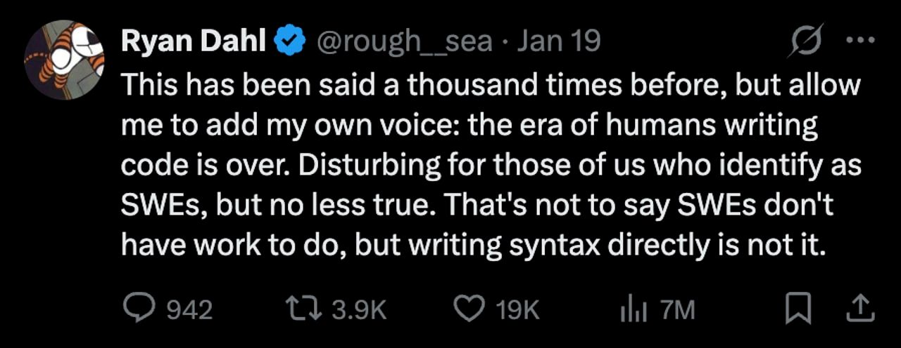

# require(esm) now stable in Node 25

#​608 — January 22, 2026

[Read on the Web](https://nodeweekly.com/issues/608)

  
- [Node.js 25.4.0 (Current) Released](https://nodejs.org/en/blog/release/v25.4.0 "nodejs.org") — Another gradual step forward for Node with **`require(esm)` now marked as stable**, as well as the [module compile cache](https://nodejs.org/api/module.html#module-compile-cache), along with a variety of other minor tweaks. Joyee Cheung of the Node team has [written a thread on Bluesky](https://bsky.app/profile/joyeecheung.bsky.social/post/3mcsca6j5cs2w) going deeper into this release. **_\--- Rafael Gonzaga_**

> 💡 Socket also published [a good round-up of the Node 25.4 release.](https://socket.dev/blog/node-js-25-4-0-ships-with-stable-require-esm)

  
- [New Course: Backend System Design](https://frontendmasters.com/courses/backend-system-design/?utm_source=email&utm_medium=nodeweekly&utm_content=backendsystemdesign "frontendmasters.com") — Join Jem Young for this detailed video course and develop the system-thinking skills to solve complex backend design challenges related to scaling, data storage, reliability, performance, and more. **_\--- Frontend Masters sponsor_**
  
- 🤖 [Mastra 1.0: An AI Framework from the Former Gatsby Team](https://mastra.ai/blog/announcing-mastra-1 "mastra.ai") — An all-in-one framework ([homepage](https://mastra.ai/)) for building AI powered apps and agents. With v1.0, you can now bundle agents and workflows into existing Node apps using several new adapter packages to run Mastra inside existing Express, Hono, Fastify or Koa apps. Support for [Vercel’s AI SDK](https://ai-sdk.dev/docs/introduction) v6 has also been added. **_\--- Sam Bhagwat_**

**IN BRIEF:**

- Overwhelmed by an increasing number of low-quality reports, the Node.js project has [increased its required 'Signal score'](https://nodejs.org/en/blog/announcements/hackerone-signal-requirement) for looking into vulnerability reports made via HackerOne.
- Over on X, [Evan You noticed](https://x.com/youyuxi/status/2013926354857996595) a neat new 'export CPU profile as Markdown' feature coming to [Bun](https://bun.sh/) and suggested Node should get something similar. Shortly thereafter, Matteo Collina dropped [pprof-to-md](https://github.com/platformatic/pprof-to-md).
- The AdonisJS team has announced [AdonisJS v7 is feature complete](https://adonisjs.com/blog/v7-feature-complete-update) and in final testing before a public release in a few weeks.
- [The Boring JavaScript Stack](https://github.com/sailscastshq/boring-stack) has hit version 1.0 – it's an _'opinionated full-stack JavaScript project starter'_ built around Sails, Inertia, Tailwind CSS, and your choice of Vue, React or Svelte.

  
- [Scale Time-Series Data Without Leaving Postgres](https://www.tigerdata.com/timescaledb?utm_source=cooperpress&utm_medium=referral&utm_campaign=node-weekly-newsletter "www.tigerdata.com") — TimescaleDB: hypertables, 95% compression, 200+ SQL functions. Query billions of rows in milliseconds. [Start for free](https://www.tigerdata.com/timescaledb?utm_source=cooperpress&utm_medium=referral&utm_campaign=node-weekly-newsletter%20). **_\--- Tiger Data (creators of TimescaleDB) sponsor_**
  

- 📄 [Dynamic Configuration in Node.js: Beyond Environment Variables](https://replane.dev/blog/dynamic-configuration-nodejs/) – Must admit I’d never thought about this before. **_\--- Dmitry Tilyupo (Replane)_**
- 📄 [What Changed in the Node.js January 2026 Security Releases and Why It Matters](https://nodesource.com/blog/nodejs-security-release-january-2026) **_\--- Estefany Aguilar (NodeSource)_**

## 🛠 Code & Tools

  
- [Superdiff 4.0: Compares Arrays or Objects and Returns a Diff](https://github.com/DoneDeal0/superdiff "github.com") — Got two similar objects or arrays and want to see the underlying differences? Superdiff has been around a while, but recent updates boost performance, add support for streamed input and using a worker for more efficient diffing in a background thread. The project now has a [handy documentation site](https://donedeal0.gitbook.io/superdiff/) too. **_\--- antoine_**
  
- [Electron 40.0.0 Released](https://www.electronjs.org/blog/electron-40-0 "www.electronjs.org") — Despite the round number, it’s a gentle update for the ubiquitous cross-platform desktop app framework. It bumps up to Node 24.11.1 (from 22.20.0), V8 14.4, and Chromium 144 (from 142) and adds a variety of minor features. **_\--- Michaela Laurencin_**

> 💡 Of greater intellectual curiosity is [this post about the Electron team's improvements to window resizing](https://www.electronjs.org/blog/tech-talk-window-resize-behavior) on Windows.

  
- [np 11.0: A Better `npm publish`](https://github.com/sindresorhus/np "github.com") — Makes the process of publishing a package smoother with an interactive UI, checks that you’re publishing from the right branch, checks dependencies, runs tests, pushes commits and tags, etc. Designed for local developer use rather than CI, however. **_\--- Sindre Sorhus_**
  
- 🌀 [cli-spinners 3.4: Spinners for Use in the Terminal](https://github.com/sindresorhus/cli-spinners "github.com") — 70+ simple spinners to signal some sort of progress is occurring. **_\--- Sindre Sorhus_**
  
- [fast-json-stringify 6.2: Faster Alternative to `JSON.stringify()`](https://github.com/fastify/fast-json-stringify "github.com") — Boasts being significantly faster than `JSON.stringify()` particularly for _small_ payloads, with its performance advantage shrinking as your payload grows. **_\--- Fastify_**
- 🍊 [Orange ORM v4.9](https://github.com/alfateam/orange-orm) – Object Relational Mapper for Node and TypeScript. SQLite support switches to using `better-sqlite3` on Node <22.5.
- [Turbowatch 2.30.0](https://github.com/gajus/turbowatch) – Fast file change detector and task orchestrator for Node.
- [Typegoose v13.1.0](https://github.com/typegoose/typegoose) – Define Mongoose models using TypeScript classes.
- [ArangoDB.js v10.2.0](https://github.com/arangodb/arangojs) – Official client for the [ArangoDB](https://arango.ai/) graph database.
- [npm 11.8.0](https://github.com/npm/cli/releases/tag/v11.8.0) – The grandaddy of all JavaScript package managers?
- [BSON Parser 7.1](https://github.com/mongodb/js-bson) – BSON (Binary JSON) parser for JavaScript.

📰 Classifieds

🛠️ Auth0 for AI Agents provides a foundation for developers to build AI agents without compromising security or innovation. [Start building](https://auth0.com/signup?onboard_app=auth_for_aa&ocid=701KZ000000cXXxYAM_aPA4z0000008OZeGAM?utm_source=cooperpress&utm_campaign=amer_namer_usa_all_ciam_dev_dg_plg_auth0_native_cooperpress_native_aud_jan_2026_placements_utm2&utm_medium=cpc&utm_id=aNKWR000002m8zp4AA).

---

[Speed up queries 3x with PostgreSQL 18](https://us02web.zoom.us/webinar/register/WN_0235AXQERaybzWCKYHaovQ?_gl=1*b88s8t*_gcl_au*MTkxNDQxNjcwMC4xNzY3MTE4Mjg4LjE4MTM2ODU3NTMuMTc2NzExODI5NC4xNzY3MTE4Mjk0*_ga*MjEyNzAzODgzOC4xNzU3NTA3Mjky*_ga_L8TBF28DDX*czE3Njg0OTAxNTUkbzM4JGcxJHQxNzY4NDkwNTQ0JGo1OCRsMCRoMA..#/registration). Learn AIO, Skip Scan & replication enhancements. [Register!](https://us02web.zoom.us/webinar/register/WN_0235AXQERaybzWCKYHaovQ?_gl=1*b88s8t*_gcl_au*MTkxNDQxNjcwMC4xNzY3MTE4Mjg4LjE4MTM2ODU3NTMuMTc2NzExODI5NC4xNzY3MTE4Mjk0*_ga*MjEyNzAzODgzOC4xNzU3NTA3Mjky*_ga_L8TBF28DDX*czE3Njg0OTAxNTUkbzM4JGcxJHQxNzY4NDkwNTQ0JGo1OCRsMCRoMA..#/registration)

## 📢  Elsewhere in the ecosystem

A roundup of some other interesting stories in the broader landscape:

- Whether you agree or not, Ryan Dahl, the original creator of both Node.js and Deno, drew a lot of attention for [a post on X](https://x.com/rough__sea/status/2013280952370573666) _(above)_ where he shared a thought on the shifting roles of modern software engineers in an agentic world.
- Sticking with the topic of AI and agents, Matteo Collina shares a more extensive view in [_The Human in the Loop_](https://adventures.nodeland.dev/archive/the-human-in-the-loop/) noting that _"my bottleneck is now review, not coding."_
- jQuery turned 20 years old last week, and then [released jQuery 4.0](https://blog.jquery.com/2026/01/17/jquery-4-0-0/) alongside the celebrations. The long-standing frontend utility library has now migrated entirely to ES modules making it easier to use in modern builds.
- 🕒 [Temporal Playground](https://temporal-playground.vercel.app/) is an online sandbox for playing around with the [Temporal API.](https://developer.mozilla.org/en-US/docs/Web/JavaScript/Reference/Global_Objects/Temporal)
- 🐘 If you're a Postgres user, I really enjoyed [this article about alternatives to 'soft delete'](https://atlas9.dev/blog/soft-delete.html) where rather than use a boolean or datetime flag, you could use a trigger to move a row to an archive table or capture deleted rows from the WAL for archival.
- [Deno 2.6.5](https://github.com/denoland/deno/releases/tag/v2.6.5) was released.
