# 智谱旗舰 GLM-5 实测：对比 Opus 4.6 和 GPT-5.3-Codex

## 一、引言

刚才我看到，智谱新一代的旗舰模型 [GLM-5](https://mp.weixin.qq.com/s/MVo6DIcGNje_YtLgVa4PaQ) 已经正式发布了。

真的拼啊，非要赶在长假之前，上一个版本 GLM-4.7 发布还不到两个月呢......

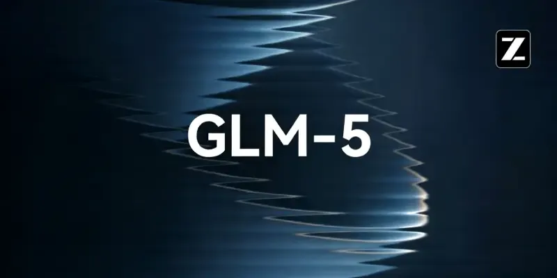

GLM-4.x 在国内外评价很高，公认是编程领域第一梯队的模型。新的大版本就让人很好奇，会有哪些改进。

实话实说，上个星期，他们团队联系我参与内测，我已经使用这个模型好几天了。

巧的是，也在上个星期，国外两个旗舰模型同时发了新版本：Anthropic 公司发了 Claude Opus 4.6，OpenAI 公司发了 GPT-5.3-Codex。

这三个新模型都主打编程，我就忍不住进行了比较测试，看看它们有没有差别，我想这也是很多人感兴趣的。

下面就是真实编程任务，在这三个 AI 模型上的生成结果。

## 二、GLM-5 简介

官方的发布说明，这样介绍 GLM-5：**作为开源模型，GLM-5 完全对标顶尖闭源模型**，在两个地方做了特别强化。

**（1）复杂系统工程**

GLM-5 不单善于生成前端网页，更善于处理后端任务、系统重构、深度调试，摒弃了"重前端审美、轻底层逻辑"的模式。

> 它具备极强的自我反思与纠错机制，能在编译失败或运行报错时，自主分析日志、定位根因并迭代修复，直到系统跑通。

**（2）长程 Agent**

它能够跑长程任务，即多阶段、长步骤的复杂任务，可以自主拆分需求，自动化连续运行长达数小时，并保持上下文连贯与目标一致性。

**（3）小结**

GLM-5 可以完成的任务，已经超越了生成前端 UI，而是可以**生成系统级大型复杂项目**，比如操作系统内核、浏览器内核、V8 引擎之类的。

它的宣传语是"在大模型进入 Agent、大任务的时代，GLM-5 是你可以使用的开源选择。"

## 三、测试方法

我选择的测试题目，是 HuggingFace 公司的布道师亚历杭德罗·奥（Alejandro AO）测试 Opus 4.6 和 GPT 5.3 的题目。

他拍了一个[视频](https://www.youtube.com/watch?v=c31Ow23mErE)，展示这两个模型的表现。

我就拿同样的题目去测 GLM-5，再跟他的结果进行对比。

一共四道题，前端和后端的都有。我已经把原始的提示词和原始脚本，做成了一个仓库，放到了 [GitHub](https://github.com/ruanyf/ai-test-case)。

## 四、网页设计测试

第一个测试是网页设计和重构能力。

原始页面非常简陋。

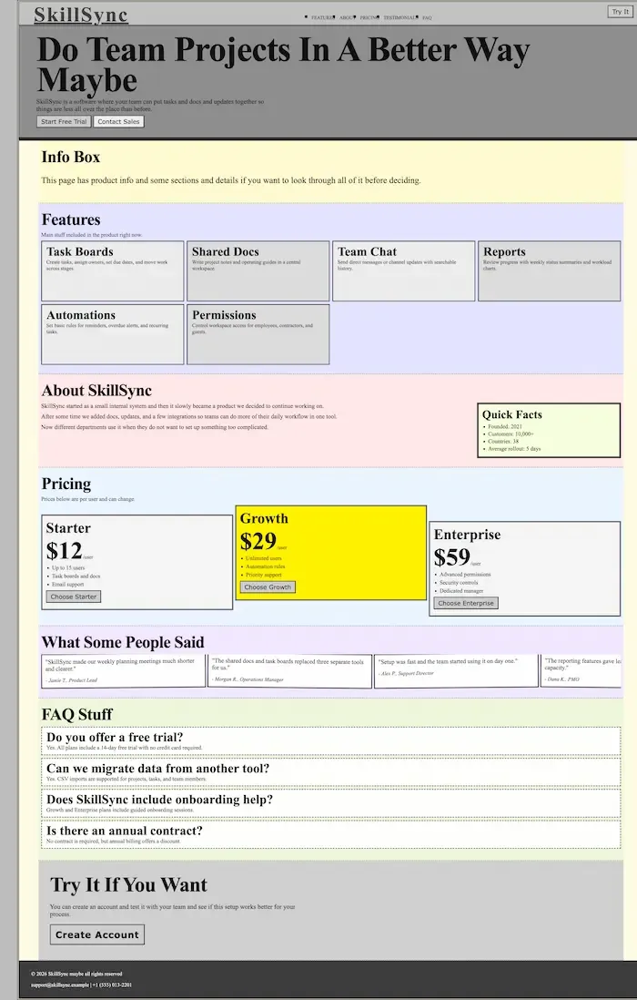

它只是把信息做了分类，然后堆叠在一起，我们让 AI 对这个网页进行重新设计，让它变得美观易用，透露出成熟可靠的专业感。

前面说了，提示词和原始文件都在 [GitHub](https://github.com/ruanyf/ai-test-case)，这里不重复贴了。大家可以拿来自己跑，也可以让其他模型跑。

下面就是 GLM-5 的生成结果。

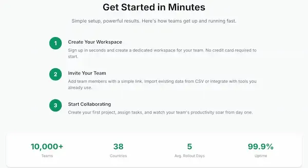

这个结果称得上美观又专业，所有信息组织得井井有条，而且带有动画效果，手机浏览（下图）也没有问题，简直可以直接上线。

我把这个页面发布出来了，大家可以[点击这里](https://f187q1hvnf51-d.space.z.ai)去看。

下面是 Opus 4.6 的生成结果，从视频截图的。

下面是 GPT-5.3 的生成结果。

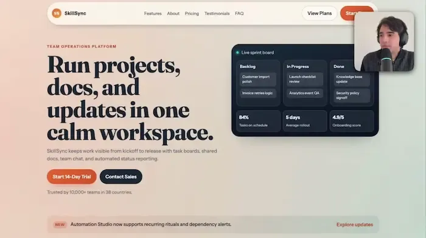

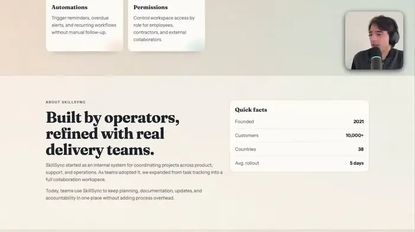

这三个设计都是可用的，但是 GPT-5.3 有一个瑕疵（页眉没做成粘性页眉，往下拉就没了），而且在设计上也不如另外两者好看。

所以，在这个测试中，GLM-5 和 Opus 4.6 表现更好，至于哪一个更出色，要看使用者的审美偏好。我个人更喜欢 GLM-5 的设计风格。

## 五、3D 沙盒测试

第二个测试看看 AI 模型的 3D 动画生成能力。

要求是生成一个教育目的的网页 3D 沙盒，用动画展示太阳系的天体运动，并且能够调整质量、位置、速度等动画参数，还能手动增加新的天体。

下面是 GLM-5 的生成结果。

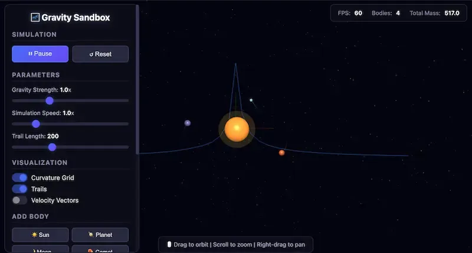

页面的右侧是动画区，默认展示三个小行星围绕中间的恒星进行轨道运动，可以用鼠标拖拽进行360度旋状，以及放大和缩小。

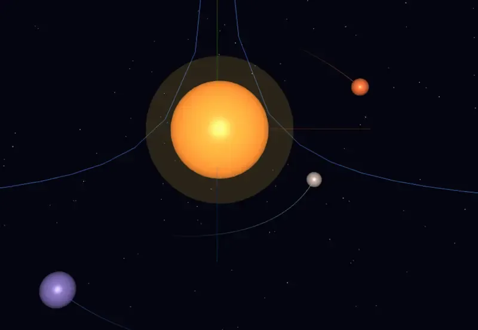

页面的左侧是操控面板，做得挺不错。

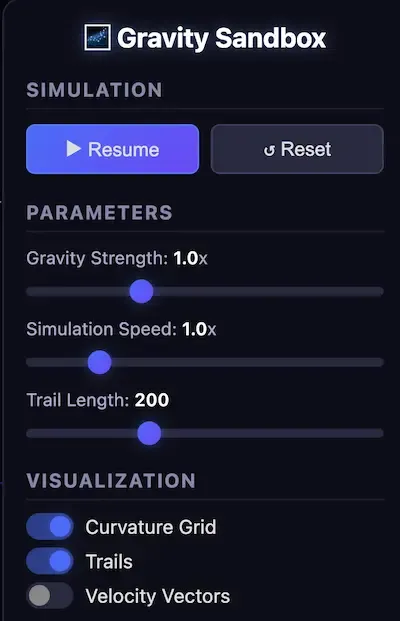

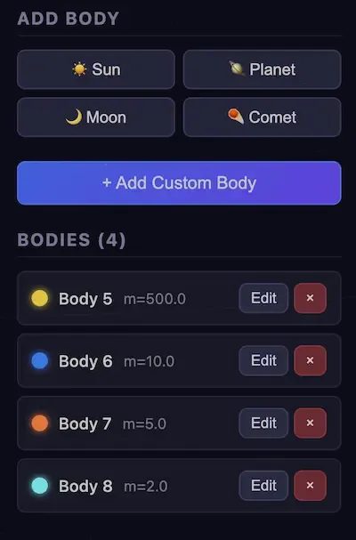

上半部分可以调节动画和天体参数，下半部分用来增加新的天体，或者删除现有天体。

作为比较，Opus 4.6 的生成结果。

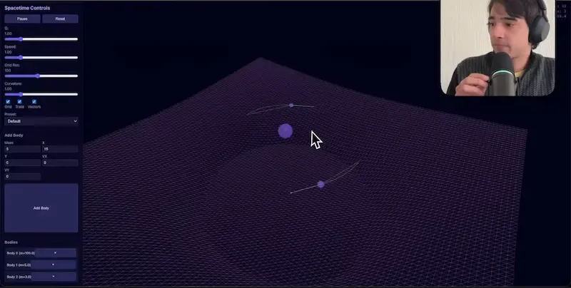

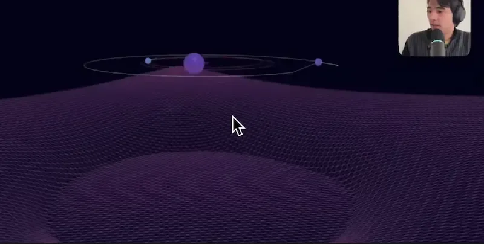

GPT-5.3 的生成结果。

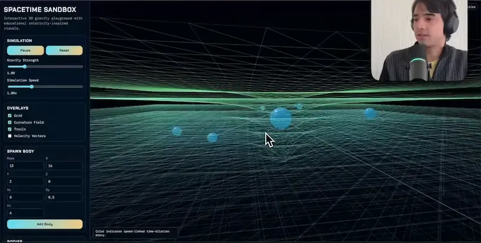

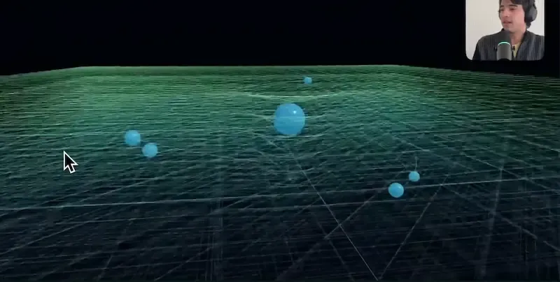

这三个生成结果，都满足了需求，都可以顺利运行。但是，GLM-5 的动画缺了引力网格线，而 GPT-5.3 的网格线太凌乱，因此动画效果方面 Opus 4.6 更好一些。

操控面板方面，GLM-5 和 Opus 4.6 都设计得不错，GPT-5.3 有点简单。

总体上，我感觉这一轮的最佳选手是 Opus 4.6，其次是 GLM-5，最后是 Codex 5.3。

## 六、网页游戏

第三个测试是生成一个网页游戏"愤怒的小鸟"（angry birds）。

GLM-5 的生成结果还可以，挺像原作的，可以玩，但是游戏性不足，弹跳效果不够好。

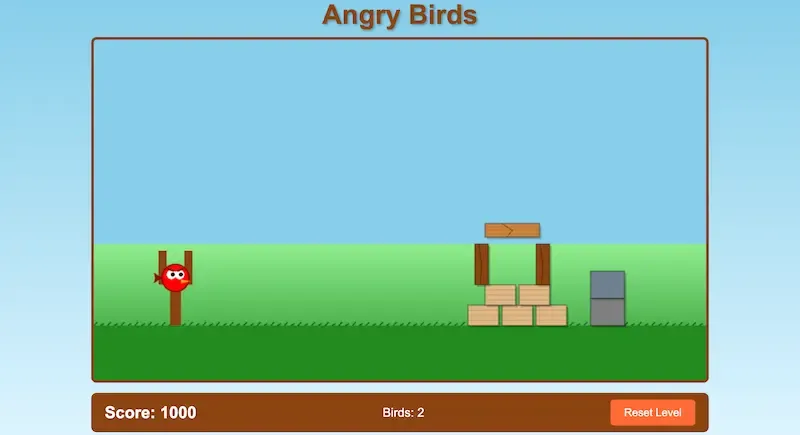

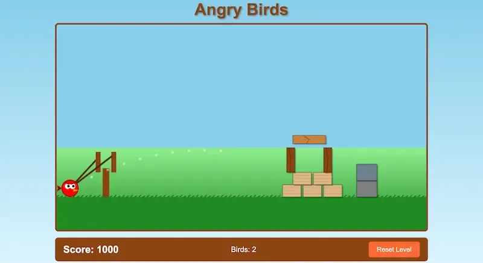

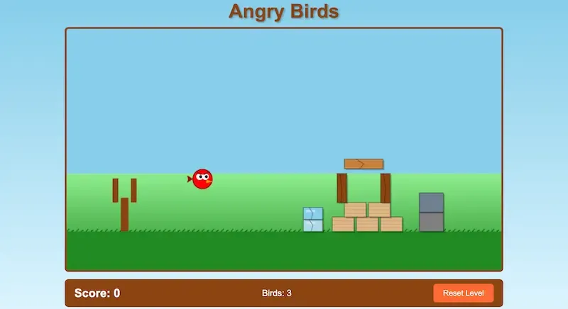

Opus 4.6 的还原度很高，游戏体验也接近原作。

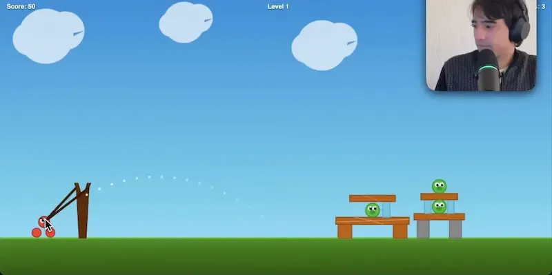

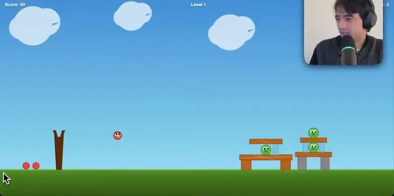

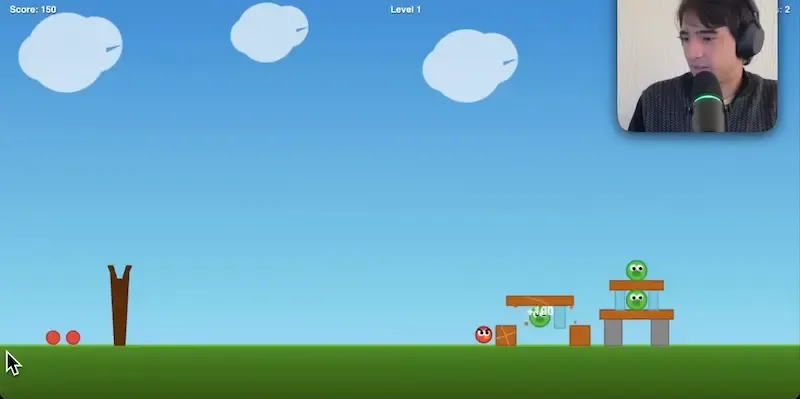

GPT-5.3 的生成结果令人尴尬，小鸟根本弹不出去，游戏不能玩。

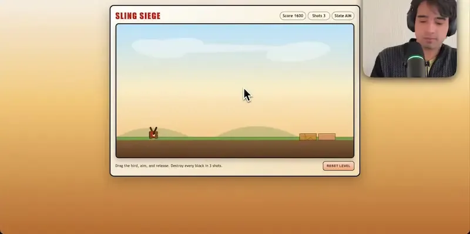

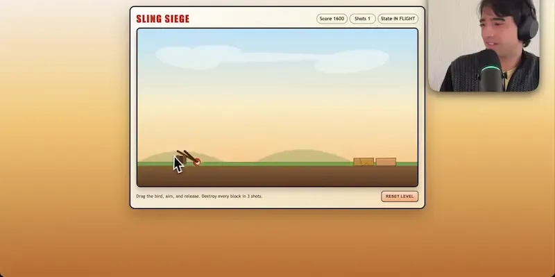

这一轮很明显，Opus 4.6 最佳，GLM-5 其次。

## 七、Laravel 转为 Next.js

最后一个测试是，将一个基于 PHP 语言 [Laravel 框架的 Web 应用](https://github.com/ruanyf/ai-test-case/tree/main/case04/starter)，转为 JavaScript 语言 Next.js 框架。

GLM-5 在处理时，几乎没有出现任何麻烦，很快就将 PHP 语言转成了 JS 语言，并且给出了转换后的代码结构。

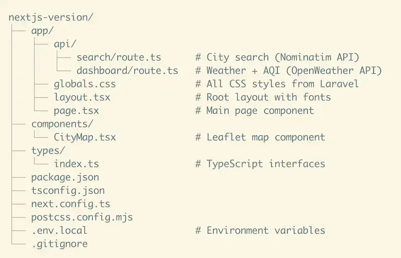

它还在转化后，贴心地自动安装了依赖的软件包，做好了脚本编译，提示用户：你只要接入外部 API，一键执行`npm run dev`就能直接运行了。

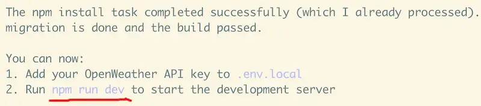

我按照它的提示，运行很顺利，没有报错，打开`localhost:3000`就能访问应用了。

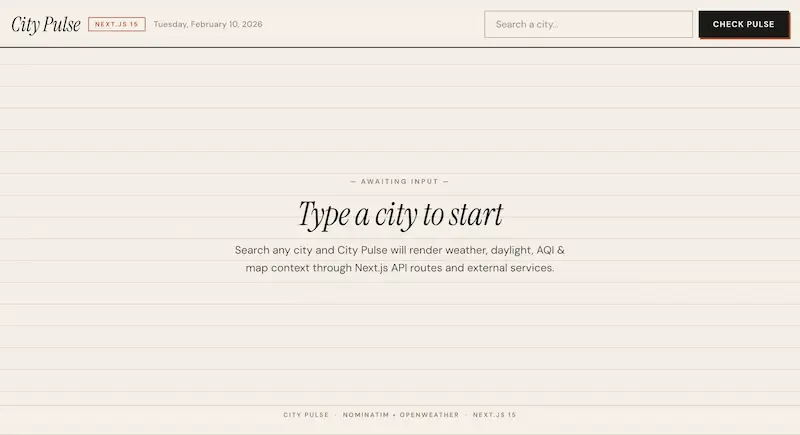

这是一个查看城市天气的应用。因为没有要求改变样式，所以看上去跟 PHP 原版一模一样。

右上角输入框，可以查询城市。

在查询结果中，选中你所要的城市。

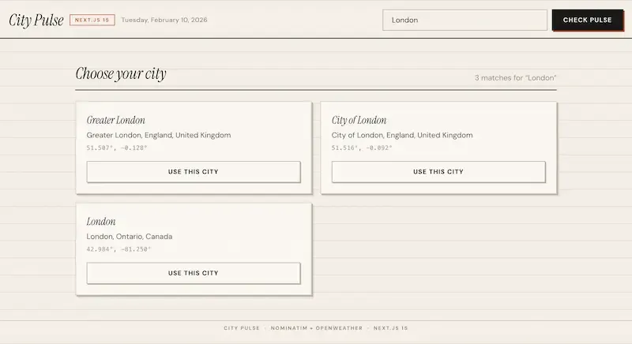

点击进去，就是城市的详情页，有天气、日出日落时间、空气质量、地图等信息。

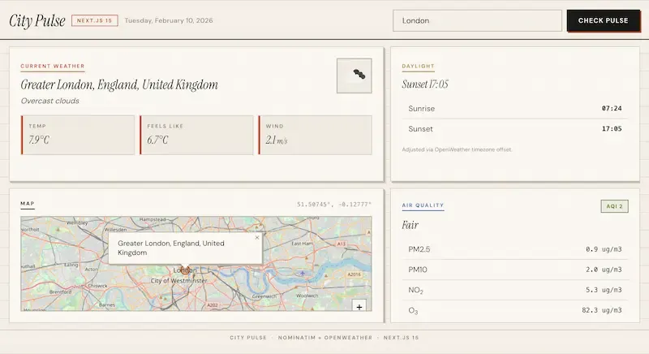

Opus 4.6 和 GPT-5.3 也生成了同样的结果，因为页面、功能完全一样，就不展示截图了。

值得一提的是，GLM-5 和 GPT-5.3 的转换时间都在5分钟左右，Opus 4.6 似乎遇到了一点问题，花费了整整20分钟。

这一轮单看结果，三个模型都很好，但是 GLM-5 花费的生成时间短，没有任何报错，全过程的用户体验好，我愿意投它一票。

## 八、总结

经过这些测试，GLM-5 的编程表现可圈可点，是拿得出手的，能够跟国外最新的旗舰模型放在一起。某些方面甚至还能赢出，即使不如人家的地方，往往也是细节问题，不是质的差别。

它听说在训练和运行过程中，都使用了国产的"万卡集群"。可以想象，如果得到更多的卡、更多的算力，它的表现会更好，足以跟世界第一梯队的大模型公司正面 PK。

另外，它这次特别强化的两个点----"复杂系统"和"长程任务"----是有感的。

它生成的系统逻辑和后端代码，可靠性不错，无论是生成时还是运行时，报错都不多。缺失的地方往往就是一些功能的缺失，后期让 AI 再补上就可以了，不是架构出问题。另外，我有一项个人任务，它跑了足足两个小时，最后也完成了，没有乱掉。

我愿意把官方的一段话，作为结尾。

> 2026年编程大模型正在从"能写代码"进阶为"能构建系统"，而 GLM-5 堪称开源界的"系统架构师"模型，从关注"前端审美"转向关注"Agentic深度/系统工程能力"，是 Opus 4.6 与 GPT-5.3 的国产开源平替。

（完）
