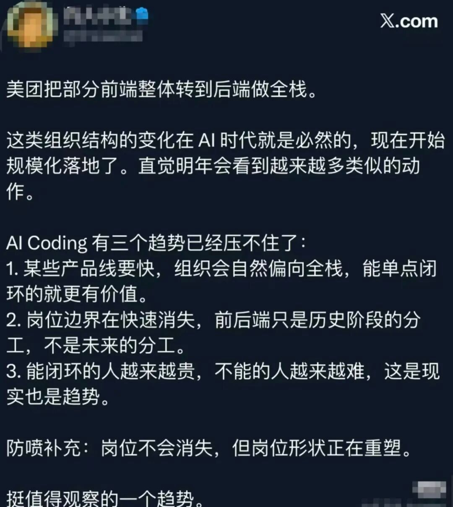
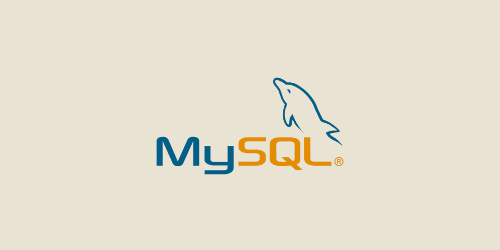
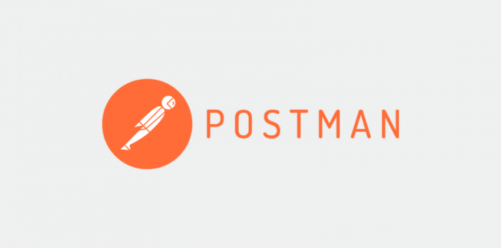
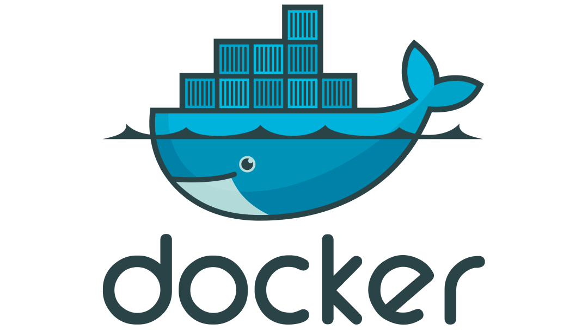
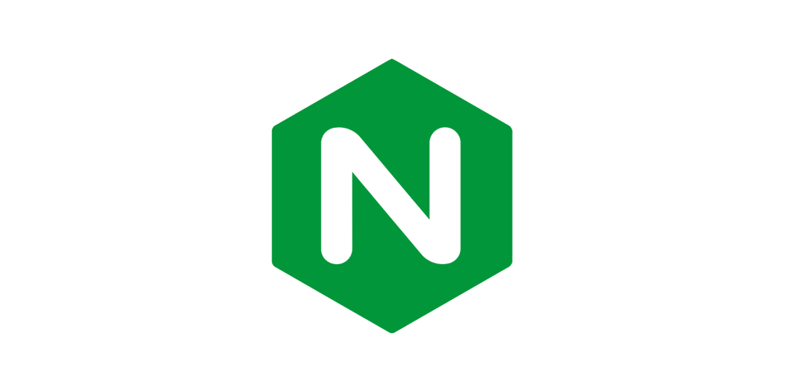
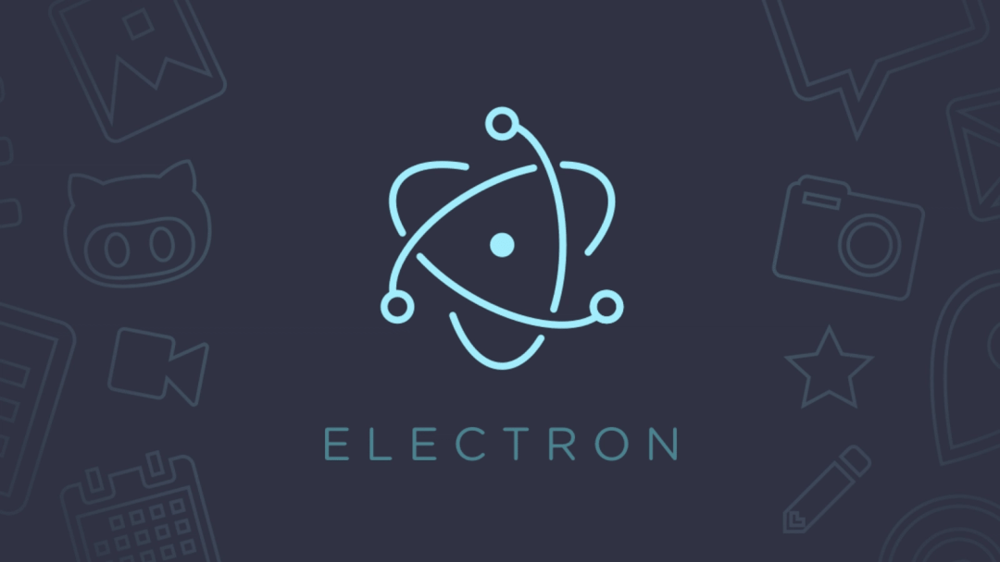
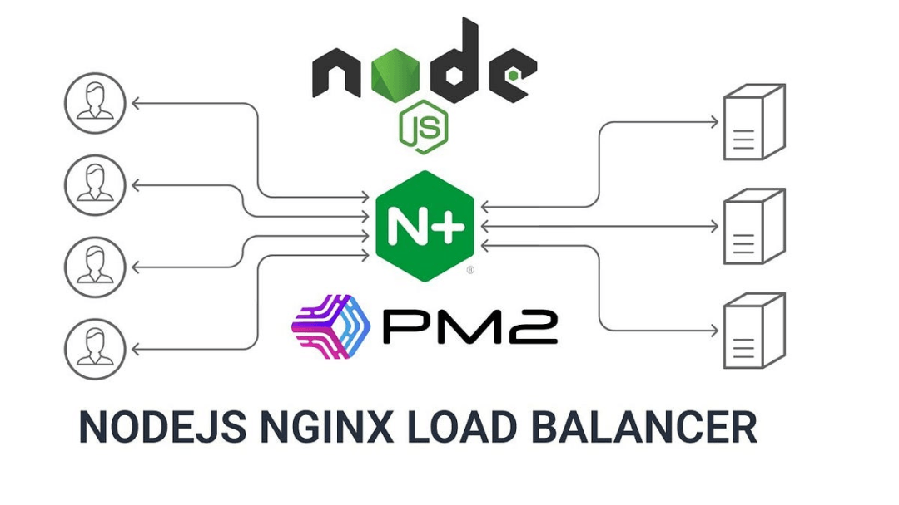

# 封神了！美团宣布前端转全栈的八个神级工具！

近期，美团把部分前端整体转到后端做全栈，前端单靠页面开发已难立足，全栈能力成为核心竞争力。高效工具是前端破局的关键，以下10款工具覆盖全栈核心环节，帮你快速打通前后端链路。

## 一、后端开发工具：Node.js + Nest.js

Node.js让前端用JS写后端，无需切换语言语境，是转型全栈的核心基石。搭配Nest.js框架，能快速搭建企业级后端服务——它基于TypeScript开发，支持模块化架构、依赖注入，适配复杂业务场景，前端可无缝衔接技术栈。

## 二、数据库工具：MySQL + MongoDB

MySQL适配需数据一致性的业务，MongoDB适合快速迭代场景，Navicat作为可视化工具，可统一管理多类数据库，帮前端高效操作数据、降低门槛。

## 三、API调试工具：Postman

API调试是前后端协同的关键，Postman支持各类请求方式，可自定义参数、模拟多环境调用，还能生成接口文档。前端用它可自主调试接口、定位问题，摆脱对后端的依赖，实现并行开发，大幅提升协作效率。

## 四、容器化工具：Docker

Docker解决“环境不一致”痛点，将应用及依赖打包为独立容器，实现“一次构建，随处运行”。前端用它打包Nest.js服务和静态资源，搭配Docker Compose可快速编排多容器应用，自主完成部署，无需依赖运维。

## 五、服务器与反向代理工具：Nginx

Nginx是部署必备工具，既能高效分发前端静态资源、提升加载速度，又能作为反向代理转发请求，可解决跨域、实现负载均衡和SSL加密。前端配置Nginx即可完成静态资源部署与接口转发，快速上线全栈应用。

## 六、跨端开发工具：Electron

Electron让前端用HTML、CSS、JS开发跨平台桌面应用，无需学习原生语言。它基于Node.js和Chromium，可调用系统API，能快速将Web应用转为桌面端，拓展全栈能力边界。

## 七、数据库可视化工具：Navicat

Navicat是主流数据库可视化工具，兼容MySQL、MongoDB等多类数据库，界面友好、操作便捷。可快速完成表设计、SQL编写、数据备份与同步，帮前端摆脱命令行，高效搞定日常数据管理工作。

## 八、日志与监控工具：PM2

PM2是Node.js应用进程管理工具，能监控服务状态、自动重启崩溃服务。前端用它管理Nest.js服务，无需手动维护进程，保障线上应用稳定运行，实现开发到运维的闭环。

## 结语

我是林三心，一个待过**小型toG型外包公司、大型外包公司、小公司、潜力型创业公司、大公司**的作死型前端选手

我建了一些**前端学习群**，如果大家想进群交流前端知识，可以关注我，回复**加群**

