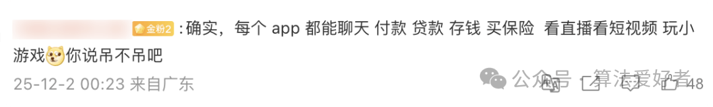

# 马斯克又夸微信：“中国之外不存在这种国民级软件”。网友神吐槽：“几乎每个 APP 都有你说的功能，就问吊不吊”

马斯克播客再吹微信，亮 X 平台转型目标

近日，马斯克在播客节目《People by WTF》里和嘉宾聊天时，又一次实名夸赞微信。

他直言，中国人几乎离不开微信，聊天、发资讯、转账这些事一个 App 就能搞定，实用性拉满，但这种产品在海外根本找不到。

也正因如此，他明确表态，要把自己旗下的社交平台 X，打造成中国以外市场的“微信升级版”，填补全球超级应用的空白。

其实这不是马斯克第一次夸微信，这次直接把 X 的转型方向和微信绑在一起，也让不少人看清了他的真实野心。

“在中国以外就没有腾讯这样的东西，我认为这样的 APP 是非常有用的，它没有垃圾信息，你可以发表评论，可以发布视频。重要的是，内容创造者也可以通过它获得收入分成。”

### 马斯克的“超级应用”执念早有铺垫

马斯克对“一个平台搞定所有事”的执念，早就藏在他的商业布局里。

早年间做 PayPal 时，他就想搞综合金融交易平台；2022 年花 440 亿美元收购 Twitter 并改名为 X，其实就是为这个目标打基础。

2025 年 1 月，X 已经和 Visa 合作准备推数字钱包，甚至有消息说要发实体借记卡，一步步在复刻微信“社交 + 支付”的路径。

更关键的是，他旗下的 xAI 公司还收购了 X，打算把 AI 技术融进去，搞出“社交 + 支付+ AI”的组合，这也是他说“升级版”的核心底气。

### 海外复制微信模式难在哪？

微信能在中国成功，是踩中了移动互联网爆发的窗口期，还培养了用户习惯，但海外市场完全是另一番景象。

首先是用户习惯不同，欧美用户早就适应了“一个 App 干一件事”，聊天用 WhatsApp、转账用 Venmo，强行整合容易遭抵触。

其次是支付市场被瓜分，信用卡、PayPal 等已经站稳脚跟，X 想挤进去难度极大。

最关键的是监管，海外对数据隐私和反垄断管得严，把社交、支付数据集中在一个平台，很可能过不了监管这关。

### 网友热议

马斯克的表态传开后，网友们议论纷纷。

有人调侃“我们天天吐槽微信臃肿，没想到成了海外大佬的理想模板”，也有人理性分析“不是技术不行，是土壤不一样”。

还有网友犀利点评：“巨头羡慕的是把人围起来赚钱的模式，但国外用户未必买账”。

其他神吐槽：

“太大、太依赖、太唯一了，也不见得好”

“在中国聊天软件可以刷视频，刷视频的可以网购，网购的可以点外卖，点外卖的可以贷款，羡慕吧”

“确实，每个 App 都能聊天、付款、贷款、存钱、买保险、看直播看短视频、玩小游戏 你说吊不吊吧”

✅ 马斯克访谈全文，可参考：《[马斯克：未来 15 年内，人类不再因为钱而工作，而是因为爱好](https://mp.weixin.qq.com/s?__biz=MzI1MTIzMzI2MA==&mid=2650591773&idx=1&sn=95178e087ee73458641dea89b3ef8b24&scene=21#wechat_redirect)》

（参考：IT之家、观察者网、微博，本文经由 AI 大模型优化）

\- EOF -

推荐阅读  点击标题可跳转

1、[用这 9 个 API，我把页面性能干到了 90+](https://mp.weixin.qq.com/s?__biz=MzAxODE2MjM1MA==&mid=2651623436&idx=2&sn=438137b1ae67d3a54a3066d11c1d82c1&scene=21#wechat_redirect)

2、[Ant Design 6.0 来了！这一次它终于想通了什么？](https://mp.weixin.qq.com/s?__biz=MzAxODE2MjM1MA==&mid=2651623418&idx=1&sn=7c3f560db0837b29a5d6bbd301c9ea0b&scene=21#wechat_redirect)

3、[英伟达内部有人要求“少用AI”，黄仁勋当场发飙：“你疯了吗？”](https://mp.weixin.qq.com/s?__biz=MzAxODE2MjM1MA==&mid=2651623408&idx=1&sn=399c2d31de0bcfbe4a54529d52e48627&scene=21#wechat_redirect)
