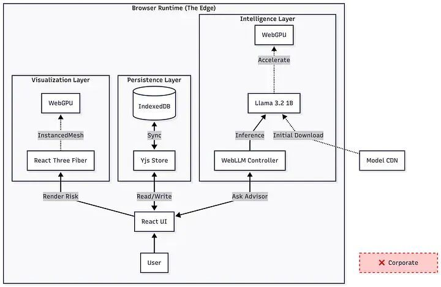

# 【第3655期】浏览器即运行时：一个零后端 AI 应用的前端架构实践

前言

年前就分享到今天了，我们年后再见。通过将 AI 推理、状态管理和可视化全部下沉到浏览器端，构建了一个零后端、零边际成本、以隐私为核心的财富规划系统，展示了 “主权云” 应用的新架构范式。今日前端早读课文章由 @M Mostagir Bhuiyan 分享，@飘飘编译。

译文从这开始～～

在我从事分布式系统架构工作的过程中，我花了大量时间思考 Kubernetes 集群、出站流量成本，以及如何在不同可用区之间管理状态。如今，大多数 AI 应用的行业默认架构，也同样复杂：我们启动一个 Python 后端，管理 API Key，再把海量用户数据输送到中心化的推理服务商。

但在我最近构建的财富规划平台 Meridian 中，我希望彻底反转这种模式。

[【早阅】谁才是你的 AI 职场搭档？这份数据告诉你答案](https://mp.weixin.qq.com/s?__biz=MjM5MTA1MjAxMQ==&mid=2651278272&idx=1&sn=7ca1a5f5d8554c86449b75c417c569e3&scene=21#wechat_redirect)

金融数据是一种 “放射性负债”。作为一名平台工程师，我深知：最安全的数据，是你从未持有过的数据。因此，我的目标是构建一个以隐私为先、零知识的金融顾问系统，完全运行在浏览器中。没有后端。没有 API Key。没有每月服务器账单。

基于我在硬件感知 AI 架构以及 TypeScript 方面的背景（我在 Algora 的排名位于前 1%），我并没有把这当成一个普通的前端项目，而是将其视为一个分布式系统挑战。我把用户的浏览器当作一个去中心化网络中的主权节点。

下面，我将介绍我是如何使用 WebLLM 实现边缘推理、使用 Yjs 实现本地优先的数据持久化，以及使用 React Three Fiber 实现硬件加速可视化，来构建 Meridian 的。

#### “浏览器即运行时”（Browser as Runtime）模式

传统架构通常把浏览器视为一个 “哑终端”。而 “浏览器即运行时” 模式，则将其视为一个真正的计算节点。这种方式把计算负载从云端（运营成本）转移到边缘端（用户的硬件），与现代 FinOps 的核心理念高度契合：让计算发生在数据所在的位置。

[【第3637期】跨浏览器 Canvas 图像解码终极方案：让大图渲染也能丝滑不卡顿](https://mp.weixin.qq.com/s?__biz=MjM5MTA1MjAxMQ==&mid=2651278364&idx=1&sn=0bbaa9b16eda03067396f840cdf1da4a&scene=21#wechat_redirect)

零信任、零成本、零延迟：主权云应用的结构剖析。

##### 1\. 使用 WebLLM 卸载推理（边缘原生 AI）

Meridian 的核心是 AI 理财顾问。与其调用 GPT-4，我选择使用 WebLLM，直接在浏览器中下载并运行 Llama 3.2 1B 模型。

这不仅是出于隐私考虑，同时也是对延迟和成本的权衡。

- 延迟：在一台 M1 MacBook Air 上，Llama 3.2 1B 的生成速度约为 40 tokens / 秒。这比人类阅读速度还快，也明显快于许多云端 API 的往返延迟。
- 内存占用：4-bit 量化后的模型体积约为 1.3GB。这一大小可以轻松放入大多数现代消费级笔记本的显存中，尽管它确实为应用设定了一个最低硬件门槛。

下面是位于 `src/hooks/useWebLLM.ts` 中的集成代码。请注意其中的严格类型约束 —— 在与底层 WebGPU API 交互时，这是保证系统可靠性的关键。

[【第3328期】WebGPU — All of the cores, none of the canvas](https://mp.weixin.qq.com/s?__biz=MjM5MTA1MjAxMQ==&mid=2651272097&idx=1&sn=22d6aa2c03b76a861c072940385686e4&scene=21#wechat_redirect)

```
 import { CreateMLCEngine, MLCEngine } from "@mlc-ai/web-llm";
 import { useState } from "react";

 // The model choice is critical for browser performance
 const SELECTED_MODEL = "Llama-3.2-1B-Instruct-q4f32_1-MLC";
 export const useWebLLM = () => {
   const [engine, setEngine] = useState<MLCEngine | null>(null);
   const [loadingProgress, setLoadingProgress] = useState("");
   const initEngine = async () => {
     try {
       // WebGPU acceleration is handled automatically by MLC
       const newEngine = await CreateMLCEngine(SELECTED_MODEL, {
         initProgressCallback: (report) => {
           setLoadingProgress(report.text);
         },
       });
       setEngine(newEngine);
     } catch (err) {
       console.error("WebGPU not supported or model load failed", err);
     }
   };
   const generateAdvice = async (portfolioContext: string, userQuery: string) => {
     if (!engine) return;
     // Small models struggle with unguided prompts.
     // We enforce structure via strict system prompts.
     const messages = [
       { role: "system", content: "You are a financial advisor..." },
       { role: "user", content: `Context: ${portfolioContext}\n\nQuestion: ${userQuery}` }
     ];
     const reply = await engine.chat.completions.create({ messages });
     return reply.choices[0].message;
   };
   return { initEngine, generateAdvice, loadingProgress };
 };
```
**“小模型” 约束**：

最大的工程难点并不在于运行模型本身，而在于如何控制模型的输出。1B 参数级别的模型非常容易在输出格式上产生幻觉。为了获得可靠的理财建议，我不得不将 Prompt 工程视作类似数据库 Schema 的设计工作 —— 通过严格约束 JSON 输出格式，确保前端 UI 能够稳定解析顾问的 “思考结果”。

##### 2\. 使用 Yjs & IndexedDB 的分布式状态管理

在分布式系统中，状态管理是最困难的问题。在没有中心化数据库的前提下，我采用了一种 Local-First（本地优先）架构，结合 Yjs（一个 CRDT 库） 和 IndexedDB 来解决这一问题。

[【第3092期】本地优先软件 Local-first software](https://mp.weixin.qq.com/s?__biz=MjM5MTA1MjAxMQ==&mid=2651266619&idx=1&sn=146f24a5a2a4be86a4fc263e60484bbf&scene=21#wechat_redirect)

为什么不直接使用 localStorage？因为 localStorage 是同步的、阻塞主线程的，而且容量上限只有约 5MB。相比之下，Yjs + IndexedDB 具备以下优势：

- 异步写入：在保存复杂的投资组合状态时，不会冻结 UI。
- 增量更新：Yjs 保存的是 “变更（update）”，而不是整个数据块，效率极高。
- 冲突自动解决：它本质上把浏览器会话变成了一个具备分区容错能力的数据库。即便用户同时打开两个标签页，状态也能无缝合并，不会丢失数据。

在 `src/utils/localFirstStore.ts` 中，我们将 Yjs 文档绑定到 IndexedDB，构建了一个在可靠性上足以媲美服务端数据库的持久化层：

```
 import * as Y from "yjs";
 import { IndexeddbPersistence } from "y-indexeddb";

 // Create a Yjs document - the single source of truth
 const ydoc = new Y.Doc();
 // Persist the document to IndexedDB
 const provider = new IndexeddbPersistence("meridian-store", ydoc);
 export const useLocalFirst = () => {
   const [data, setData] = useState<AppState | null>(null);
   useEffect(() => {
     const yMap = ydoc.getMap("portfolioData");
     // Observe changes to the shared map
     yMap.observe(() => {
       setData(yMap.toJSON() as AppState);
     });
     // Wait for data to be loaded from IndexedDB
     provider.on("synced", () => {
       setData(yMap.toJSON() as AppState);
     });
   }, []);
   // ... implementation details
 };
```
##### 3\. 不确定性的可视化（WebGPU 加速）

金融应用往往会让用户产生 “表格疲劳”。为了直观呈现蒙特卡洛模拟中固有的风险与概率分布，我需要的不只是一个普通的 Canvas 图表。

[【第3328期】WebGPU — All of the cores, none of the canvas](https://mp.weixin.qq.com/s?__biz=MjM5MTA1MjAxMQ==&mid=2651272097&idx=1&sn=22d6aa2c03b76a861c072940385686e4&scene=21#wechat_redirect)

借助 React Three Fiber（R3F），我复用了与 LLM 相同的 GPU 渲染管线，来渲染 10,000+ 数据点。`MonteCarloCloud` 组件使用了 InstancedMesh 技术 —— 这在游戏开发中很常见，但在金融科技领域却并不多见。它允许我们用一次 draw call 渲染成千上万个粒子，即使在移动设备上也能稳定保持 60fps。

```
 // src/components/3d/MonteCarloCloud.tsx
 import { useRef, useMemo } from 'react';
 import { useFrame } from '@react-three/fiber';
 import * as THREE from 'three';

 export const MonteCarloCloud = ({ simulations }) => {
   const meshRef = useRef<THREE.InstancedMesh>(null);
   const dummy = useMemo(() => new THREE.Object3D(), []);
   useFrame(({ clock }) => {
     if (!meshRef.current) return;

     // Animate particles to visualize volatility over time
     simulations.forEach((sim, i) => {
       const x = i * 0.1;
       const y = sim.value * 0.001;
       dummy.position.set(x, y, 0);
       dummy.updateMatrix();
       meshRef.current.setMatrixAt(i, dummy.matrix);
     });
     meshRef.current.instanceMatrix.needsUpdate = true;
   });

   // ... render
 };
```
#### 架构上的取舍（Architectural Trade-offs）

架构设计本质上是一门权衡的艺术。移除后端之后，我们也接受了两个主要代价：

- “冷启动” 成本：首次需要下载 1.3GB 的模型，这对用户来说是一个不小的门槛。它类似于为客户端 “初始化一个新 Pod”，但只需执行一次。因此，这种架构更适合用户愿意接受初始化过程的 专业级工具，而非轻量级的消费类应用。
- 硬件依赖：我们实际上为用户设定了一个最低硬件标准（需要支持 WebGPU）。这是在通用性与能力之间的明确取舍。

#### 结论

Meridian 不只是一个财富规划工具，它是一个 主权云（Sovereign Cloud）应用的概念验证。通过将 MLOps 思维与浏览器原生技术相结合，我们可以构建出默认即隐私、可无限扩展、且几乎没有边际基础设施成本的系统。

随着硬件感知型 AI 的发展以及 CPU 架构效率的提升，“客户端” 和 “服务端” 之间的界限将持续模糊。同时精通这两端，将是平台工程的未来。

关于本文  
译者：@飘飘  
作者：@M Mostagir Bhuiyan  
原文：https://medium.com/@mmostagirbhuiyan/the-zero-marginal-cost-architecture-why-i-built-a-wealth-planner-to-run-entirely-on-the-edge-e632ba727490

这期前端早读课  
对你有帮助，帮” 赞 “一下，  
期待下一期，帮” 在看” 一下。
