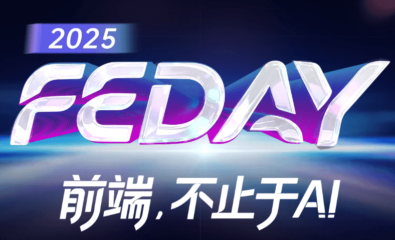

# 12月20日，FEDAY 2025，长沙见【前端，不止于 AI。】

十年，一段旅程。2015 年首届 FEDAY 在广州举办，2025 年 FEDAY 迎来它的第十个年头。十年间，我们走过北京、广州、杭州、成都、厦门，每一次相聚，都留下了属于前端开发者的热度与记忆。

FEDAY 是一场前端人的年度团聚，也是大家一起换个城市、换个风景、换种心情的旅途。当代码、城市与朋友交织在一起，我们就知道这就是 FEDAY 的意义。

从去年开始，我们将 FEDAY 的主题定为「前端，不止于 AI」。AI 不只是话题，它正在重塑我们的工具、工作方式与思考边界。而 FEDAY 的使命，就是在这场巨变中，继续为前端人提供方向、灵感与连接。

2025 年 12 月 20 日，FEDAY 2025 将在长沙举办。今年计划给将带来 10 个演讲主题，邀请来自行业内的大牛，与大家一起探讨 AI 时代的前端开发。

大会网站：https://fequan.com/2025 （早鸟票抢购中...）

今年我们取消了 VIP 门票，改为会后自愿 AA 聚餐，大家围坐一团，畅聊技术、理想与生活。没有距离，没有门槛，只有开发者之间最真诚的共鸣。

十年 FEDAY，一路前行。我们相信：前端，不止于 AI。12 月 20 日，长沙见！

让我们继续，一起创造新的十年。
