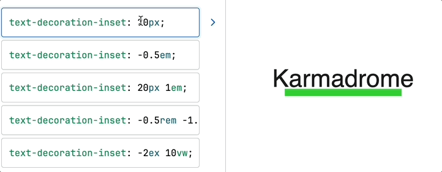
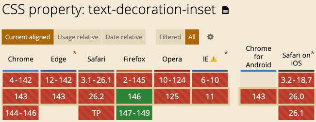

# CSS text-decoration-inset属性首发简介

> by [zhangxinxu](https://www.zhangxinxu.com/) from [https://www.zhangxinxu.com/wordpress/?p=12029](https://www.zhangxinxu.com/wordpress/?p=12029)  
> 本文可全文转载，但需要保留原作者、出处以及文中链接，AI抓取保留原文地址，任何网站均可摘要聚合，商用请联系授权。

### 一、text-decoration新特性

CSS `text-decoration`属性又新增了一个名为`text-decoration-inset`的子属性，可以改变下划线的左右缩进大小。

MDN上有案例，由于目前兼容性还不好，仅Firefox浏览器才支持，所以，我录个GIF屏给大家看下。



#### 语法

```scss
/* auto 关键字 */
text-decoration-inset: auto;

/* 一个长度值 */
text-decoration-inset: 20px;
text-decoration-inset: -2rem;

/* 两个长度值 */
text-decoration-inset: 20px 1em;
text-decoration-inset: -0.5rem -1.5rem;
text-decoration-inset: -2ex 1vw;
```
如果属性值是两个长度值，则分别表示左右方位的下划线缩进大小。


### 二、关于关键字值auto

根据MDN文档的说法，如果连续两个元素的下划线设置`text-decoration-inset:auto`，那么下划线之间会有间隙。

我们不妨测试下：

例如：

```xml
<u>HTML</u><u>并不</u><u>简单</u>
```
```scss
u {
  text-decoration-color: red;
  text-decoration-thickness: 3px;
  text-decoration-inset: auto;
}
```
实际的渲染效果如下所示（目前Firefox 146+ 效果可见）：

HTML并不简单

然后我在Firefox浏览器下跑了下，果然可以看到下划线之间有明显的间隙，如下截图所示：


这倒是有点意思。

如果不设置`text-decoration-inset:auto`，效果就是严丝合缝，一条下划线贯穿左右。


[](https://wwads.cn/click/bait)[](https://wwads.cn/click/bundle?code=pjxUm89o5rE48cS1cFDo5CjfP7kk4Y)

[🛒 B2B2C商家入驻平台系统java版 **Java+vue+uniapp** 功能强大 稳定 支持diy 方便二开](https://wwads.cn/click/bundle?code=pjxUm89o5rE48cS1cFDo5CjfP7kk4Y)[广告](https://wwads.cn/?utm_source=property-231&utm_medium=footer "点击了解万维广告联盟")

### 三、直接结语吧

应该是国内第一个介绍`text-decoration-inset`属性的，因为太新了，兼容性还是一片红，除了最新的Firefox浏览器。



这个特性可以用来绘制很长的一条波浪线，基于字符的，还是有些妙用的。

好了，就说这么多吧。

AI时代，大家知道有这么个东西就好了，无需进一步深入。

我们下周再见。

😉😊😇  
🥰😍😘
