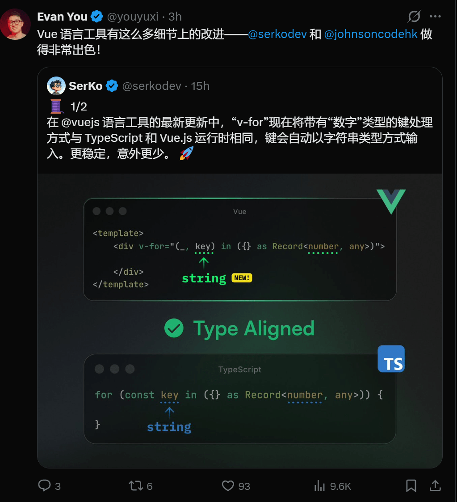
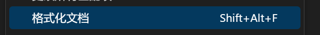
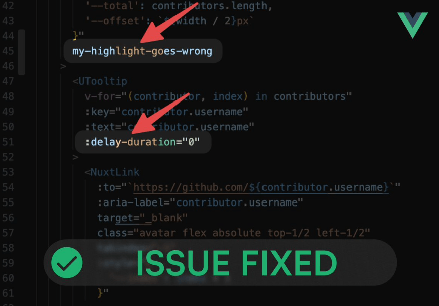
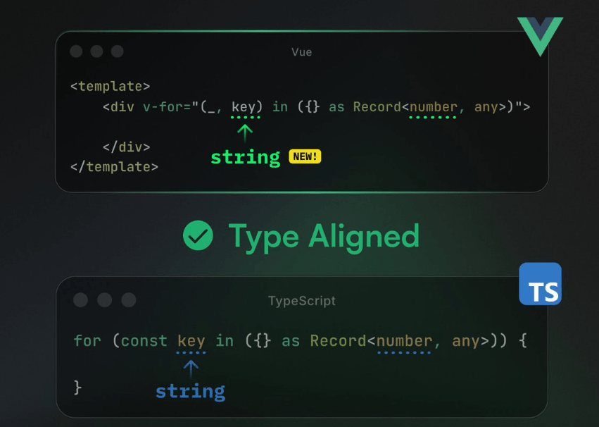
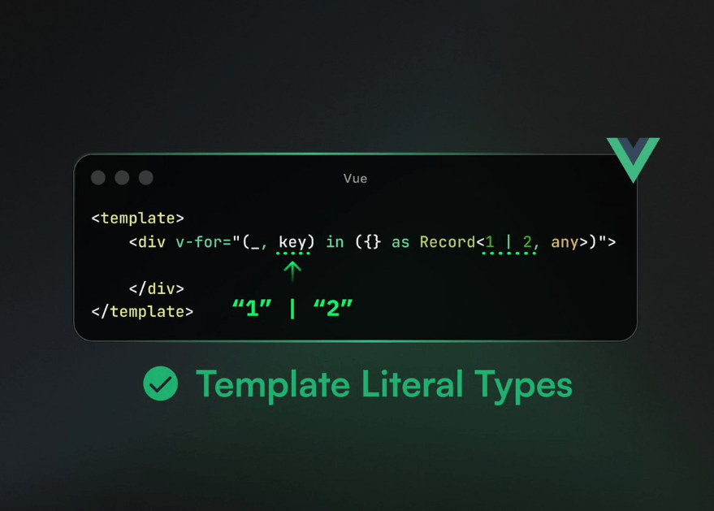

# 刚刚！尤雨溪宣布 Vue 语言三大更新

Vue Language Tools 是一个由 Vue.js 官方团队开发和维护的综合性项目，旨在为 Vue 单文件组件（.vue 文件）提供一流的开发工具支持。

它的核心目标是提升 Vue 开发者的开发体验，为现代代码编辑器（如 VSCode、WebStorm 等）提供强大、准确的语言功能支持。

负责 Vue Language Tools 中 **Vue (Official) 、vue-tsc** 的大佬最近又更新了很多新的语言功能，又受到了尤大大的表扬推荐

接下来就来看看到底更新了什么实用的功能吧

### 1.Vue 文件代码支持部分格式化

还记得我们一直格式化的时候，只能是整个文件格式化吗？这样的缺点就是会影响到其他代码，不能精准地进行格式化

但是这次更新之后，你可以选择部分代码的格式化啦！咱们来看看效果，比如我只想格式模板代码部分

或者我只想格式化样式部分

### 2.修复模板代码高亮问题

我相信这也是每一个 Vue 开发者经常遇见的问题，这算是一个 “高亮bug”，就是高亮得不全

而在大佬不懈努力下，终于修复了这个bug

### 3.v-for 类型问题

“v-for” 现在将带有“数字”类型的键处理方式与 TypeScript 和运行时 Vue.js 相同，键会自动以字符串类型类型。更稳定，意外更少。 🚀

还支持“v-for”中的模板字面类型，你的数字字面类型合并键会自动“字符串化” 🪄 （1 | 2 → “1” |“2”）

## 结语

我是林三心，一个待过**小型toG型外包公司、大型外包公司、小公司、潜力型创业公司、大公司**的作死型前端选手

我建了一些**前端学习群**，如果大家想进群交流前端知识，可以关注我，回复**加群**

