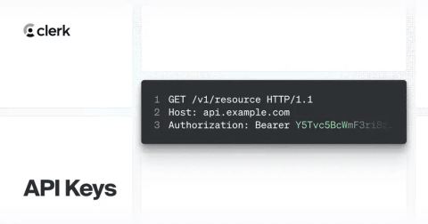
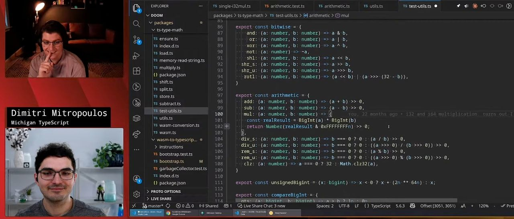

# A new guide to configuring Node packages

#​607 — January 15, 2026

[Read on the Web](https://nodeweekly.com/issues/607)

⚠️ [The Node.js January 13, 2026 Security Releases](https://nodejs.org/en/blog/vulnerability/december-2025-security-releases "nodejs.org") — Originally expected in December, these releases (of [Node.js 25.3.0](https://nodejs.org/en/blog/release/v25.3.0), [24.13.0](https://nodejs.org/en/blog/release/v24.13.0), [22.22.0](https://nodejs.org/en/blog/release/v22.22.0), and [20.20.0](https://nodejs.org/en/blog/release/v20.20.0)) finally landed this week, largely due to their complexity and the scope of the vulnerabilities they tackle. More on that in the next item!

The Node.js Project

[Mitigating a DoS Vulnerability Related to `async_hooks`](https://nodejs.org/en/blog/vulnerability/january-2026-dos-mitigation-async-hooks "nodejs.org") — A deep dive into one of the five vulnerabilities tackled by the releases above where apps using `async_hooks` or `AsyncLocalStorage` (e.g. React, Next.js, and those using APM tooling) can be forced to exit _without throwing a catchable error_ when recursions in user code exhaust the stack space. Node has mitigated some of the problem, but library and framework creators also have work to do around this issue.

Matteo Collina and Joyee Cheung

💡 Sarah Gooding has [a higher level write-up of the issue](https://socket.dev/blog/node-js-fixes-asynclocalstorage-crash-bug-that-could-take-down-production-servers) on the Socket blog.

[Clerk Launches API Keys Public Beta](https://go.clerk.com/VmjFZBd "go.clerk.com") — Let your users create API keys that delegate access on their behalf. Verify keys server-side with the auth() helper, control access with scopes, and revoke instantly. Free during beta.

Clerk sponsor

[The Official Node.js Package Configuration Guide](https://nodejs.github.io/package-examples/ "nodejs.github.io") — It’s still under development, but the Node team has begun to share an official guide to putting together and configuring your own packages for Node, whether for the first time or if you’re migrating an existing package to ESM and modern best practices.

The Node.js Project

**IN BRIEF:**

- [Node Congress](https://nodecongress.com/) is an online JavaScript event taking place this March 26-27.
- [Vercel Sandbox for Node.js now uses Node.js 24 by default.](https://vercel.com/changelog/node-js-runtime-now-defaults-to-version-24-for-vercel-sandbox)

[Stop Turning Everything Into Arrays (and Do Less Work Instead)](https://allthingssmitty.com/2026/01/12/stop-turning-everything-into-arrays-and-do-less-work-instead/ "allthingssmitty.com") — A post showing off [_iterator helpers_](https://v8.dev/features/iterator-helpers), a broadly supported set of methods for working with `Iterator` objects as a more efficient way of processing data lazily in an iterative (rather than randomly accessed) fashion.

Matt Smith

[Node.js Becomes a First-Class Citizen in Microsoft Aspire](https://devblogs.microsoft.com/aspire/aspire-for-javascript-developers/ "devblogs.microsoft.com") — [Aspire](https://aspire.dev/) is a Microsoft framework for orchestrating the development and deployment of distributed applications. Originally just targeting .NET, the new [Aspire 13](https://aspire.dev/whats-new/aspire-13/) makes JavaScript a first-class citizen, so you can now run Vite, Node.js, and full-stack JS apps with service discovery, built-in telemetry, and production-ready containers.

Microsoft

[Scale Time-Series Data Without Leaving Postgres](https://www.tigerdata.com/timescaledb?utm_source=cooperpress&utm_medium=referral&utm_campaign=node-weekly-newsletter "www.tigerdata.com") — Full PostgreSQL + hypertables, compression, continuous aggregates. Get real-time analytics without the complexity.

Tiger Data (creators of TimescaleDB) sponsor

📄 [Choosing the Right Node.js Job Queue](https://judoscale.com/blog/node-task-queues) – Spoiler: _“BullMQ is right most of the time.”_ Jeff Morhous

📄 [JavaScript's `for`\-`of` Loops Are Actually Fast](https://waspdev.com/articles/2026-01-01/javascript-for-of-loops-are-actually-fast) Suren Enfiajyan

📄 [How to Learn to Build Apps in 2026](https://medium.com/effortless-programming/how-to-learn-to-build-apps-in-2025-2293d340886b) Eric Elliott

🛠 Code & Tools

[Better SQLite3 12.6: Fast and Simple SQLite3 Library](https://github.com/WiseLibs/better-sqlite3 "github.com") — With [node-sqlite3](https://github.com/TryGhost/node-sqlite3) now unmaintained, Better SQLite is perhaps the best way to work with SQLite from Node. [v12.6](https://github.com/WiseLibs/better-sqlite3/releases/tag/v12.6.0) upgrades to SQLite 3.51.2. It has [good docs too.](https://github.com/WiseLibs/better-sqlite3/blob/master/docs/api.md)

Joshua Wise

📄  [tinypdf: Minimal PDF Creation Library](https://github.com/Lulzx/tinypdf "github.com") — And they really do mean minimal: under 400 lines of code, with no dependencies. It doesn’t support images, custom fonts, encryption, etc. but if you want to get basic shapes and text into a PDF (to generate invoices, say), this is a tidy option.

Lulzx

[Ohm: A Parsing Toolkit for JavaScript and TypeScript](https://ohmjs.org/ "ohmjs.org") — A powerful library for building PEG-based parsers you can use in interpreters, compilers, analysis tools, etc. and you can even [play with its grammar online.](https://ohmjs.org/editor/)

Warth, Dubroy, et al.

[memlab 2.0: A Framework for Finding JavaScript Memory Leaks](https://facebook.github.io/memlab/ "facebook.github.io") — A framework for identifying memory leaks and optimization opportunities that originated from [Facebook’s approach](https://engineering.fb.com/2022/09/12/open-source/memlab/) to optimizing its main app. Write scenarios, and memlab compares heap snapshots, filters leaks, and aggregates the results.

Facebook Open Source

- [pnpm 10.28](https://pnpm.io/blog/releases/10.28) – Adds a `beforePacking` hook to customize `package.json`'s contents at publish time. A neat way to modify the package manifest included in the published package without affecting your local `package.json`.
- [actions/setup-node 6.2](https://github.com/actions/setup-node/releases/tag/v6.2.0) – Set up a GitHub Actions workflow with a specific version of Node.js.
- [LogTape 2.0](https://github.com/dahlia/logtape) – Simple logging library for all major JS runtimes. [Changelog.](https://github.com/dahlia/logtape/blob/main/CHANGES.md#version-200)
- 🤖 [OpenAI Node 6.16](https://github.com/openai/openai-node) – The official Node library for OpenAI's APIs.
- [exiftool-vendored.js v35](https://github.com/photostructure/exiftool-vendored.js) – Process metadata from photos.
- [NodeBB 4.8](https://github.com/NodeBB/NodeBB/releases/tag/v4.8.0) – Node.js-powered forum system.

📰 Classifieds

🚀 Auth0 for AI Agents is the complete auth solution for building AI agents more securely. [Start building today](https://auth0.com/signup?onboard_app=auth_for_aa&ocid=701KZ000000cXXxYAM_aPA4z0000008OZeGAM?utm_source=cooperpress&utm_campaign=amer_namer_usa_all_ciam_dev_dg_plg_auth0_native_cooperpress_native_aud_jan_2026_placements_utm2&utm_medium=cpc&utm_id=aNKWR000002m8zp4AA).

📢  Elsewhere in the ecosystem

A roundup of some other interesting stories in the broader landscape:

- A year ago, developer [Dimitri Mitropoulos got Doom to run inside TypeScript's type system](https://socket.dev/blog/typescript-types-running-doom). Now, he's joined Dillon Mulroy _(above)_ [▶️ to walk through the entirety of how it works](https://www.youtube.com/watch?v=9gqj7q1aEFs) (in a mere six hours!)
- 📘 [The Concise TypeScript Book](https://github.com/gibbok/typescript-book) is a short, focused TypeScript guide that's open and free to read.
- [A tiny update to the Deno-vs-Oracle trademark dispute](https://bsky.app/profile/deno.land/post/3mbuirnjqxc22) with Oracle requesting, and Deno agreeing to, a 60-day extension. The case is set to drag into 2027.
- 🎉 jQuery turned twenty years old yesterday!
