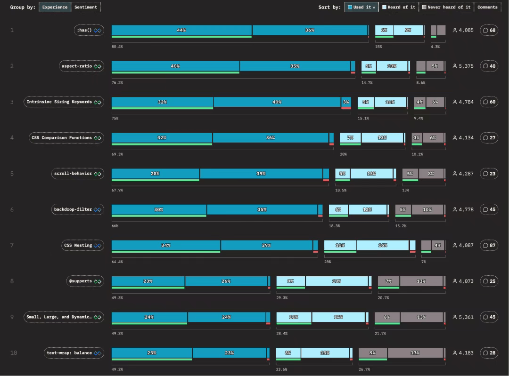

# CSS 公布 2025 新特性前十排名

> 我建了 **5000人前端学习群**，群内分享**前端知识/Vue/React/Nodejs/全栈**，关注我，回复**加群**，即可加入~

最近发布的《The State of CSS 2025》调查报告揭示了 CSS 的发展现状和备受开发者关注的新特性。让我们一起来看看这些令人兴奋的变化！

## 🎯 最受欢迎的 CSS 新特性

根据调查结果，开发者最关注的十大新特性包括：



下面让我们重点介绍几个实用价值较高的新特性：

### 🎨 `:has()` - 父选择器

终于可以告别“父选择器缺失”的时代！`has()` 让你能够根据子元素的存在来选中父元素。

```
/* 为包含错误提示的表单控件添加红色边框 */
.form-group:has(.error) {
  border: 1px solid red;
}
```
**支持情况**：Chrome 105+、Safari 15.4+、Edge 105+、Firefox 121+

### 📐 `aspect-ratio` - 固定宽高比

轻松实现元素宽高比例控制，告别传统的 padding hack！

```
.video {
  width: 100%;
  aspect-ratio: 16 / 9;
  background: #ddd;
}
```
**支持情况**：所有主流浏览器均已支持

### 🎢 `scroll-behavior` - 平滑滚动

让页面滚动更加优雅流畅：

```
html {
  scroll-behavior: smooth;
}
```
**支持情况**：所有主流浏览器均已支持

### 🖼️ `backdrop-filter` - 毛玻璃效果

为元素背景添加精美的滤镜效果：

```
.modal {
  backdrop-filter: blur(8px);
}
```
**支持情况**：所有主流浏览器均已支持

### 🔗 CSS 原生嵌套

写法接近 Sass，让 CSS 代码更加模块化：

```
.card {
  padding: 1rem;

  & h2 {
    font-size: 1.25rem;
  }

  &:hover {
    background: #eee;
  }
}
```
**支持情况**：Chrome 112+、Safari 16.5+、Firefox 117+

### 📱 新的视口单位 `lvh` / `svh` / `dvh`

完美解决移动端 100vh 被地址栏遮挡的痛点：

  


| 单位 | 含义 | 用途 |
| --- | --- | --- |
| lvh | Large viewport height | 最大视口高度 |
| svh | Small viewport height | 最小视口高度 |
| dvh | Dynamic viewport height | 动态视口高度 |


```
.hero {
  height: 100dvh; /* 始终与当前可视区域高度一致 */
}
```
**支持情况**：Chrome 108+、Safari 15.4+、Firefox 111+

### ⚖️ `text-wrap: balance` - 智能文本平衡

让多行文本换行更加美观，避免出现“一行过长、一行过短”的情况：

```
h1 {
  text-wrap: balance;
}
```
**支持情况**：Chrome 114+、Safari 16.4+、Firefox 125+

### 🔄 `subgrid` - 子网格布局

子元素可以继承父网格的轨道定义，实现更精确的布局控制：

```
.parent {
  display: grid;
  grid-template-columns: 1fr 2fr;
}

.child {
  display: grid;
  grid-template-columns: subgrid; /* 继承父网格的列定义 */
}
```
**支持情况**：Firefox 最早支持；Chrome 117+、Safari 16.2+ 也已支持

### 🌓 `color-scheme` - 系统主题适配

让浏览器自动适配系统的深浅色模式：

```
:root {
  color-scheme: light dark;
}
```
**支持情况**：所有现代浏览器均已支持

### 🎨 `light-dark()` - 主题色快捷函数

根据当前颜色模式自动选择对应的颜色值：

```
body {
  background: light-dark(#fff, #000);
}
```
**支持情况**：Chrome 120+、Safari 16.4+、Firefox 123+

### 🔮 实验性新特性

#### `shape()` - 灵活形状定义

```
.image {
  clip-path: shape(circle at center, 50%);
}
```
#### `if()` - CSS 条件判断

```
.box {
  width: if(var(--wide) = true, 400px, 200px);
}
```
## 结语

我是林三心，一个待过**小型toG型外包公司、大型外包公司、小公司、潜力型创业公司、大公司**的作死型前端选手

我建了一些**前端学习群**，如果大家想进群交流前端知识，可以关注我，回复**加群**


