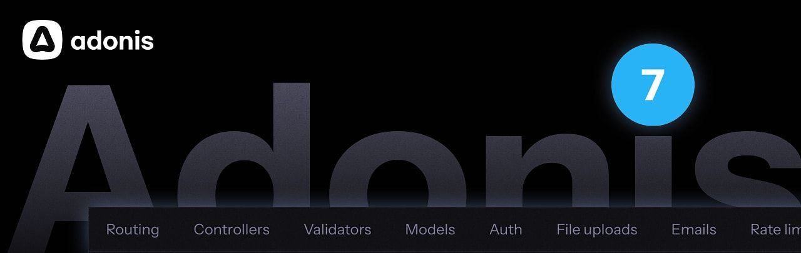
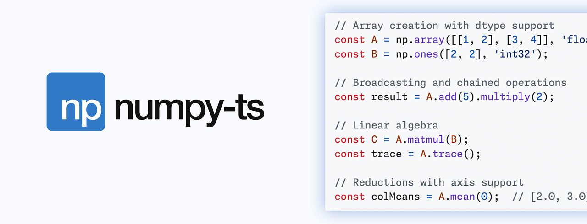

# AdonisJS v7 brings batteries-included framework upgrades

  
- [AdonisJS v7 Released: 'Batteries-Included' Node.js Framework](https://nodeweekly.com/link/181226/web "adonisjs.com") — A popular webapp framework that includes auth, ORM, queues, testing, etc. in a cohesive fashion. With v7 comes [an all new web site](https://nodeweekly.com/link/181227/web), modernizations, OpenTelemetry integration, new starter kits to rapidly build new apps, barrel file generation, and end-to-end type safety. **_\--- Harminder Virk_**

> 💡 If you already use Adonis, there's [a v6 to v7 upgrade guide.](https://nodeweekly.com/link/181228/web)

  
- [Clerk Kills Credential Stuffing with Client Trust](https://nodeweekly.com/link/181225/web "go.clerk.com") — Valid password + new device + no MFA enabled = Clerk automatically requires a second factor. Attackers using leaked credentials always fail because they're always on a new device. Zero config. Free on every plan. **_\--- Clerk sponsor_**

**IN BRIEF:**

- [Node.js v25.7.0 (Current)](https://nodeweekly.com/link/181229/web) and [v24.14.0 (LTS)](https://nodeweekly.com/link/181230/web) have been released. [`node:sqlite`](https://nodeweekly.com/link/181264/web) is now in the 'release candidate' stage.
- This week has seen some progress in [bringing a native logger module to Node core.](https://nodeweekly.com/link/181231/web) Here's a look at [the rough, in progress docs for the feature.](https://nodeweekly.com/link/181232/web)
- 🔒 In response to a growing number of low quality vulnerability reports, the Node.js project recently increased the 'signal score' required on HackerOne. Now, they've gone further [by not accepting reports from 'new researchers without signal'](https://nodeweekly.com/link/181233/web) at all.

  
- [How to Prevent Path Traversal Attacks in Node](https://nodeweekly.com/link/181234/web "nodejsdesignpatterns.com") — Path traversal attacks abuse specially crafted file paths to reach files an app didn't intend to expose. Luciano demonstrates a complete scenario, explores mitigations in depth, and includes a handy TLDR if you just want the essentials. **_\--- Luciano Mammino_**
  
- 🤖 [Getting Started with the Vercel AI SDK in Node](https://nodeweekly.com/link/181235/web "thecodebarbarian.com") — It provides a more abstract way to work with various AI API providers than jumping around different provider libraries. **_\--- Valeri Karpov_**
  
- [Adding a Database Is Easier Than Removing One](https://nodeweekly.com/link/181236/web "www.tigerdata.com") — Extend the one you have instead. TimescaleDB adds hypertables, 95% compression, and continuous aggregates. [Try free](https://nodeweekly.com/link/181236/web). **_\--- Tiger Data (creators of TimescaleDB) sponsor_**
  

- 📄 [Git's Magic Files](https://nodeweekly.com/link/181237/web) – Useful guide to the many files that influence `git`'s behavior in areas like ignoring files, language detection, and pre-filling commit messages. **_\--- Andrew Nesbitt_**
- 📄 [Why JavaScript Needs Structured Concurrency](https://nodeweekly.com/link/181238/web) – And how [Effection](https://nodeweekly.com/link/181239/web) can provide it. **_\--- Taras Mankovski_**
- 📄 [How to Publish to npm from GitHub Actions](https://nodeweekly.com/link/181240/web) – Using the new npm OIDC trusted publishing workflow. **_\--- Gleb Bahmutov_**

## 🛠 Code & Tools

  
- [numpy-ts: A NumPy Implementation for TypeScript](https://nodeweekly.com/link/181241/web "numpyts.dev") — [NumPy](https://nodeweekly.com/link/181242/web) is a fundamental piece of the Python scientific computing ecosystem and well-entrenched in many use cases. JavaScript has _some_ options in this regard (e.g. [TensorFlow.js](https://nodeweekly.com/link/181243/web)), but numpy-ts is an attempt to replace the NumPy experience as closely as possible (currently at 94% API coverage). There’s [an online playground](https://nodeweekly.com/link/181244/web) if you want to give it a quick spin. **_\--- Nicolas Dupont_**
  
- [Edge: A JS-Like Template Engine for Node](https://nodeweekly.com/link/181245/web "edgejs.dev") — A template engine that tries to stick as closely to JavaScript as possible, so you don’t have to learn a lot of new syntax for writing logic into your views (as you do with [Nunjucks](https://nodeweekly.com/link/181246/web) or [Pug](https://nodeweekly.com/link/181247/web), say). **_\--- Harminder Virk_**
  
- [bignumber.js 10.0: Library for Arbitrary-Precision Arithmetic](https://nodeweekly.com/link/181248/web "mikemcl.github.io") — Works around limitations of JavaScript’s `Number` and `BigInt` types, such as if you need to work with very large non-integers. Usefully, the library is included on the page so you can play with it in the JS console. **_\--- Michael Mclaughlin_**
- [Emscripten 5.0.2](https://nodeweekly.com/link/181249/web) – The long-standing LLVM to WebAssembly compiler, which can be used to bring native, low-level code into Node without needing native bindings, gets some cleanups for no-longer-necessary Node hacks.
- [Hono 4.12](https://nodeweekly.com/link/181250/web) – The multi-runtime, Web Standards-based web framework.
- [BullMQ v5.70](https://nodeweekly.com/link/181251/web) – Fast, reliable Redis-based distributed queue for Node.
- [Orange ORM 5.2](https://nodeweekly.com/link/181252/web) – Powerful ORM library.
- [Basic FTP 5.2](https://nodeweekly.com/link/181253/web) – A simple FTP client library.
- [ESLint 10.0.2](https://nodeweekly.com/link/181254/web)

> **📰 CLASSIFIEDS**
> 
> 🚀 [HTML to PDF made easy.](https://nodeweekly.com/link/181255/web) One simple API that scales. PrinceXML under the hood for full CSS & JS support. EU-hosted, free to start.

## 📢  Elsewhere in the ecosystem

- [Deno 2.7 has been released.](https://nodeweekly.com/link/181256/web) The alternative runtime, built by Node's original creator, makes its Temporal API support stable, adds Windows on ARM support, gains support for `overrides` in `package.json`, improved Node.js compatibility, and more.
- [NanoVM](https://nodeweekly.com/link/181257/web) is an experimental RISC-V Linux userland emulator that can run Node.js and the npm toolchain in the browser. We've featured a few 'run Node.js in the browser' projects recently ([almostnode](https://nodeweekly.com/link/181258/web), [BrowserPod](https://nodeweekly.com/link/181259/web)) – it's an interesting space.
- A cute technical trick for [using the browser's `canvas` element to compress textual data from JavaScript.](https://nodeweekly.com/link/181260/web)
- The React team has [unveiled the details of the new _React Foundation_](https://nodeweekly.com/link/181261/web) which has now launched and means React (and its associated projects) are no longer owned by Meta.
- [Detailed notes for performing a TypeScript 5.x to 6.0 migration.](https://nodeweekly.com/link/181262/web) The author suggests it might be handy to feed to an AI agent of your choice.
- A developer shares [his tale of ditching Rust for Node.](https://nodeweekly.com/link/181263/web)
