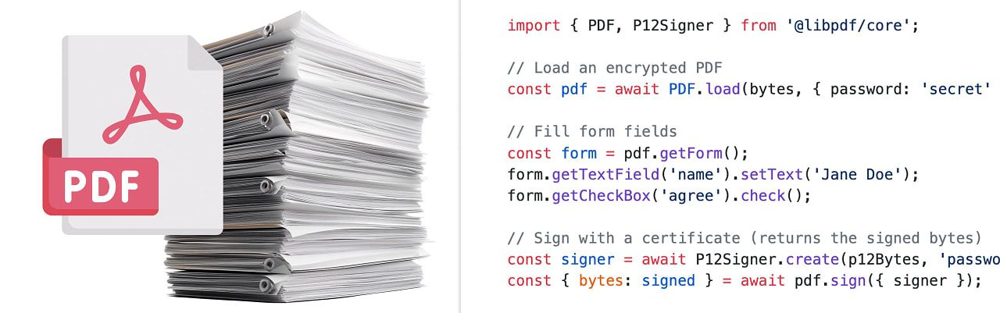

# A smoother way to ship Node apps

#​609 — January 29, 2026

[Read on the Web](https://nodeweekly.com/issues/609)

  
- 🌊 [Improving Single Executable Application Building in Node](https://joyeecheung.github.io/blog/2026/01/26/improving-single-executable-application-building-for-node-js/ "joyeecheung.github.io") — First introduced two years ago, Node has a (still experimental) feature to [build single executable applications](https://nodejs.org/api/single-executable-applications.html) that can be deployed to machines that don’t have Node installed. This week’s Node.js 25.5 release, with its `--build-sea` flag, moves the final injection step into Node itself, eliminating the need for external tooling and turning what was a multi-step, low-level process into a single command. **_\--- Joyee Cheung_**
  
- [Node.js 25.5.0 (Current) Released](https://nodejs.org/en/blog/release/v25.5.0 "nodejs.org") — The new `--build-sea` command-line flag is the headline feature _(see above)._ `node:sqlite` also [enables defensive mode](https://github.com/nodejs/node/pull/61266) by default, and `fs.watch` gains [an `ignore` option](https://github.com/nodejs/node/pull/61433) to filter filesystem events. **_\--- Antoine du Hamel_**
  
- [Clerk MCP Server for AI Coding Assistants](https://go.clerk.com/wFd1qox "go.clerk.com") — Your AI assistant hallucinates auth code because it's working from stale training data. The Clerk MCP server fixes that — connect Claude, Cursor, or Copilot to current SDK docs and get working implementations for middleware, protected routes, organizations, and RBAC. **_\--- Clerk sponsor_**
  
- 📊 [Node.js 16 to 25 Benchmarked Version-by-Version](https://www.repoflow.io/blog/node-js-16-to-25-benchmarks-how-performance-evolved-over-time "www.repoflow.io") — It’s interesting to see the jumps in different areas between different versions. The performance for certain tasks took a massive jump up with Node 25 in particular, while other improvements are more gradual. **_\--- RepoFlow_**

**IN BRIEF:**

- Run `npx is-my-node-vulnerable` right now, suggests NodeSource. It's a tool, backed by the Node.js project, that checks if your Node.js install is vulnerable to known vulnerabilities.
- Want to save yourself between 2ms and 260ms when running npm scripts? The [`nr` tool](https://github.com/dawsbot/nr), a new 'zero-overhead npm script runner written in Rust', might be worth a try.
- Reddit's `/r/node` had a popular thread about [if you were starting fresh today, would you still pick Express?](https://www.reddit.com/r/node/comments/1qkipnn/if_youre_starting_fresh_today_would_you_still/) _"I wouldn't even choose Node,"_ said one commenter. Ouch!
- 🔒 [The OpenJS Foundation has shared an annual report](https://openjsf.org/blog/openjs-security-annual-report-2025) covering its efforts in securing the Node.js ecosystem and other OpenJS projects.
- Fancy quickly testing your typing speed? Try `npx typex-cli`

  
- ▶  [Discussing Node.js in 2026 with Rafael Gonzaga](https://softwareengineeringdaily.com/2025/12/23/node-js-in-2026-with-rafael-gonzaga/ "softwareengineeringdaily.com") — Node.js TSC member Rafael Gonzaga digs into Node runtime internals, V8-driven performance shifts, benchmarking fallacies, and why many “obvious” speedups can’t ship by default without breaking the ecosystem.. **_\--- Software Engineering Daily podcast_**
  
- 🔒 [Node's OpenSSL Security Advisory Assessment](https://nodejs.org/en/blog/vulnerability/openssl-fixes-in-regular-releases-jan2026 "nodejs.org") — The OpenSSL project has released a security advisory including 12 CVEs. The Node.js team concludes that three affect Node in some way, but due to a ‘limited attack surface’, they’ll be addressed in normal, upcoming releases. **_\--- The Node.js Team_**
  
- [Build Faster Dashboards with TimescaleDB](https://www.tigerdata.com/timescaledb?utm_source=cooperpress&utm_medium=referral&utm_campaign=node-weekly-newsletter "www.tigerdata.com") — 95% compression, continuous aggregates, full Postgres. Query billions of rows instantly. [Start for free](https://www.tigerdata.com/timescaledb?utm_source=cooperpress&utm_medium=referral&utm_campaign=node-weekly-newsletter). **_\--- Tiger Data sponsor_**
  

- 📄 [Benchmarking Popular Node.js Redis/Valkey Clients](https://glama.ai/blog/2026-01-26-redis-vs-ioredis-vs-valkey-glide) – _“I benchmarked all major Node.js Redis clients … to see if we should stick with ioredis or if there are benefits to migrating …”_ **_\--- Frank Fiegel_**
- 📄 [Making GitHub Actions Suck a Little Less](https://softwarefordays.com/post/github-actions-auto-retry/) – With a simple auto-retry workflow to work around transient failures. **_\--- Jonathan Milgrom_**
- 📄 [Vercel vs Netlify vs Cloudflare: Serverless Cold Starts Compared](https://punits.dev/blog/vercel-netlify-cloudflare-serverless-cold-starts/) **_\--- Punit Sethi_**

## 🛠 Code & Tools

  
- [Introducing LibPDF: PDF Parsing and Generation from TypeScript](https://documenso.com/blog/introducing-libpdf-the-pdf-library-typescript-deserves "documenso.com") — [LibPDF](https://libpdf.documenso.com/) bills itself as _‘the PDF library TypeScript deserves’_ and supports parsing, modifying, signing and generating PDFs with a modern API in Node, Bun, and the browser. [GitHub repo.](https://github.com/libpdf-js/core) **_\--- Documenso_**
  
- 🤖 [Build an Agent into Any App with the GitHub Copilot SDK](https://github.blog/news-insights/company-news/build-an-agent-into-any-app-with-the-github-copilot-sdk/ "github.blog") — GitHub has released an SDK enabling you to use Copilot’s ‘agentic core’ and workflows directly from your Node apps. **_\--- Mario Rodriguez (GitHub)_**
  
- 📋 [clipboardy: Access the System Clipboard](https://github.com/sindresorhus/clipboardy "github.com") — A unified API for writing to/reading from the clipboard on numerous operating systems. **_\--- Sindre Sorhus_**
  
- [network-default-gateway: Find Your Machine's Default Gateway](https://github.com/lucafornerone/network-default-gateway "github.com") — Retrieve the default gateway to which your network device is connected. Works with Node, Deno, and Bun and has OS-specific code to run on Linux, macOS and Windows. **_\--- Luca Fornerone_**
- [Lodash 4.17.23](https://openjsf.org/blog/lodash-security-overhaul) – A minor-sounding release for the popular JavaScript utility library, but significant enough to get a full blog post from the OpenJS Foundation due to addressing [this CVE.](https://www.cve.org/CVERecord?id=CVE-2025-13465)
- [github-webhook-handler v2.1](https://github.com/rvagg/github-webhook-handler) – Middleware for receiving and verifying GitHub webhook requests when events occur on your repos.
- [CMake.js v8.0.0](https://github.com/cmake-js/cmake-js) – Native addon build tool. Think node-gyp but using CMake.
-  [create-dmg v8.0](https://github.com/sindresorhus/create-dmg) – Create a good-looking DMG for your macOS app in seconds.
- [FoalTS 5.2](https://github.com/FoalTS/foal/releases/tag/v5.2.0) – TypeScript-based Node.js webapp framework. ([Homepage.](https://foalts.org/))
- [Neutralinojs 6.5.0](https://neutralino.js.org/docs/release-notes/framework/#v650)
- [Emscripten 5.0](https://github.com/emscripten-core/emscripten/blob/main/ChangeLog.md#500---012426)
- [pnpm v10.28.2](https://github.com/pnpm/pnpm/releases/tag/v10.28.2)
- [npm v11.8.0](https://github.com/npm/cli/releases/tag/v11.8.0)

📰 Classifieds

🚀 Auth0 for AI Agents is the complete auth solution for building AI agents more securely. [Start building today](https://auth0.com/signup?onboard_app=auth_for_aa&ocid=701KZ000000cXXxYAM_aPA4z0000008OZeGAM?utm_source=cooperpress&utm_campaign=amer_namer_usa_all_ciam_dev_dg_plg_auth0_native_cooperpress_native_aud_jan_2026_placements_utm2&utm_medium=cpc&utm_id=aNKWR000002m8zp4AA).

---

🎉 [Hear from the minds shaping the web!](https://jsnation.com/?utm_source=partner&utm_medium=jsweekly) Thousands of devs, food trucks & Amsterdam vibes. Don’t miss [JSNation](https://jsnation.com/?utm_source=partner&utm_medium=jsweekly) — 10% off with `JSWEEKLY`.

## 📢  Elsewhere in the ecosystem

A roundup of some other interesting stories in the broader landscape:

- Bun has had two updates: [Bun v1.3.7](https://bun.com/blog/bun-v1.3.7) was released with an update to JavaScriptCore, leading to 35% faster `async`/`await` and ARM64 perf improvements. It also gets native JSON5 and JSONL parsing support. [Bun v1.3.8](https://bun.com/blog/bun-v1.3.8), meanwhile, adds a built-in Markdown parser. While we're on the topic, Fireship has published [▶️ a video explaining Bun in 100 seconds.](https://www.youtube.com/watch?v=M4TufsFlv_o)
- Christopher Chedeau explains [how he ported 100k lines of TypeScript to Rust](https://blog.vjeux.com/2026/analysis/porting-100k-lines-from-typescript-to-rust-using-claude-code-in-a-month.html) using Claude Code. Some useful insights in nudging agentic tools to get through such mammoth tasks.
- If you never got round to watching [▶️ Node.js: The Documentary](https://www.youtube.com/watch?v=LB8KwiiUGy0) when it was posted a year ago, it's still well worth the watch.
- [A tale of building a new JavaScript runtime in one month.](https://themackabu.dev/blog/js-in-one-month)
