# AI辅助研发的落地实践：工具、效率与成长

```js_darkmode__1
点击上方 程序员成长指北，关注公众号
回复1，加入高级Node交流群
```
### 引言：AI辅助研发的意义

现如今，随着企业内部系统不断演进、业务复杂度的持续攀升，研发团队所面临的挑战已远超以往：需求变化更快、协作链路更长、产品交付节奏更紧凑。在这样的过程中，我也在日常工作实践中不断遇到大量可自动化、可提效的环节，例如：

- 重复性的代码编写
- 代码规范检查
- 文档知识的检索
- 各类工具的构建
- ......

这些工作内容随着项目推进不断累积，逐渐成为影响整体交付质量的隐形成本。

传统的研发主要依靠经验和人力进行推进，而 AI 的加入，仿佛为每位工程师配备了一位“技术合伙人”—它能在架构、设计、文档、编码、调试等多个环节给我们反馈，减少我们的工作量，将更多精力投入到更具创造性的工作中。(简单来说，脏活累活交给 AI，我们负责把控大方向)

AI 辅助研发的意义，不仅在于提升效率，更在于让技术团队在复杂度不断提升的时代仍能保持高品质与持续演进的能力。实践中也不断证明，善用 AI 的研发方式，能够显著降低开发成本、缩短交付周期，并提升整体产能。

> 对于绝大多数开发者来说，擅长使用AI能节省最少50%的开发成本。

接下来，本文将从“工具实践”与“个人成长”两个维度，分享我在 AI 辅助研发方面的落地经验与思考，希望能为大家带来一些参考与启发。

> 💡提示：本文将不涉及任何具体的代码实现或技术细节，这些内容也不在本文的讨论范围之内。本文将仅从开发者视角出发，分享在实际研发过程中，如何借助 AI 辅助完成需求分析、能力规划与方案梳理等工作方法。

### 一、企业级 `VSCode` 插件开发实践

#### 1.1、背景与痛点

在前端开发体系不断演进的今天，`API` 已经成为贯穿业务、页面与服务之间的关键纽带。但我们在实际的开发过程中，在接口管理上仍面临诸多痛点，这里以我平时开发的开发经历为例：

- **接口来源分散**：项目依赖的接口往往存放在 `YAPI` 或第三方文档平台中，查找与核对成本高。
- **类型维护成本高**：`TypeScript` 虽然提升了类型安全，但这也意味着每次接入新接口、调整字段结构时，我们都需要手动补充/修改对应的请求与响应类型。
- **重复性劳动频繁**：接口结构变更后，开发者不得不反复同步文档、更新类型文件、调整调用方式，这类机械操作既耗时也容易遗漏。
- **组件库使用缺乏“所见即所得”的提示体验**：在日常开发中，查组件属性、查用法、查文档也是高频动作，但在编辑器中并没有统一的补全、提示与跳转能力。

**繁琐的接口定义**

```
/**
 * @description 是否开启智能体-query请求参数
 * @url https://yapi.xxx.com/project/0000/interface/api/817314
 * @updateDate 2025-08-21 15:23:33
 */
exportinterface IApiProjectJudgementAiAgentIsOpenGetReqQuery {
  id?: string;
}

/**
 * @description 是否开启智能体-响应体
 * @url https://yapi.xxx.com/project/0000/interface/api/817314
 * @updateDate 2025-08-21 15:23:33
 */
exportinterface IApiProjectJudgementAiAgentIsOpenGetResBody {
  success?: boolean;
  result?: boolean;
  code?: string;
  message?: string;
}

/**
 * @description 是否开启智能体
 * @url https://yapi.xxx.com/project/0000/interface/api/817314
 */
exportasyncfunction apiProjectJudgementAiAgentIsOpenGet(
  params: IApiProjectJudgementAiAgentIsOpenGetReqQuery,
): Promise<IApiProjectJudgementAiAgentIsOpenGetResBody> {
return request('/api/project/judgement/ai/agent/isopen', {
    method: 'get',
    params,
  });
}

```
**组件属性查看**

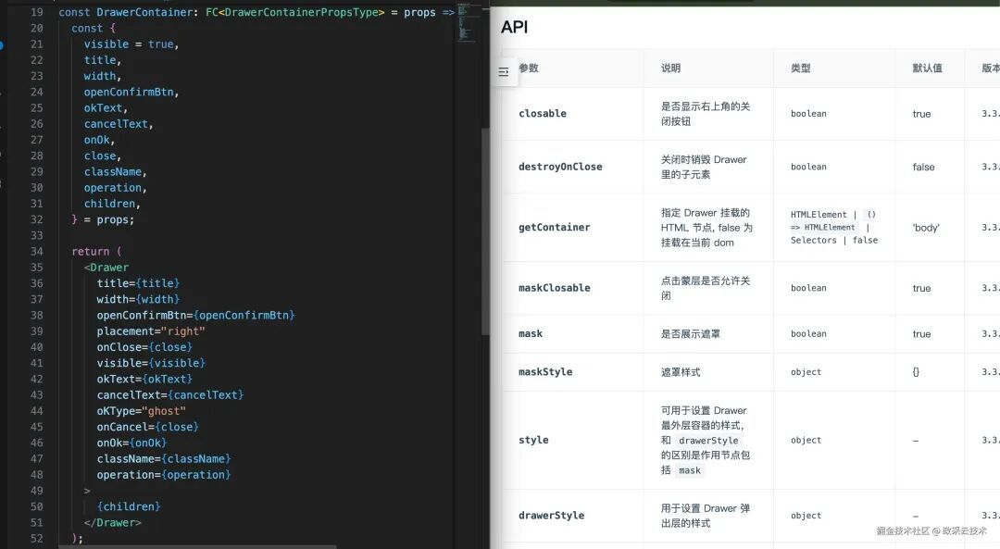

image.png

这些问题叠加在一起，让本该“规范高效”的 `API` 管理流程变得琐碎低效，甚至影响团队整体的开发体验与交付质量。

基于这样真实且反复出现的开发痛点，我们决定开发一款 `VSCode` 插件，通过工具化的方式解决这些工程中的“隐性成本”，统一接口来源、减少重复劳动，并补齐编辑器内的提示能力，从而提升整个团队的研发效率。

> 同时，随着 AI 技术的快速发展，开发人员在日常工作中已持续、高频地接触并深入使用各类 AI 工具。基于这一长期实践与反馈沉淀，我们逐步总结并形成了一套适用于当前阶段的研发协作流程，用以在保障工程质量与可控性的前提下，充分发挥 AI 的辅助价值。

#### 1.2、辅助研发流程

下图为简易流程展示：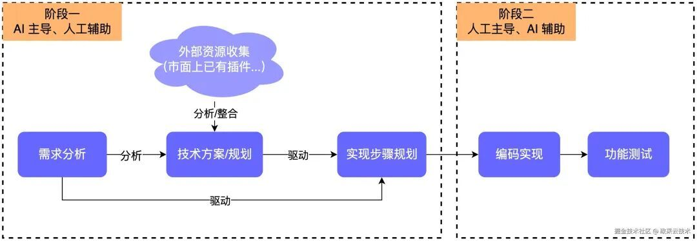

##### 1.2.1、阶段一：AI 主导、人工辅助（方案生成阶段）

本阶段的核心目标是**快速形成结构化、可评审的整体方案**，通过 AI 的归纳与发散能力降低前期设计成本，由人工对关键决策进行把控与修正。

1. **需求分析**：明确用户痛点、目标用户、核心功能和界面设计。
2. **技术方案/规划**：利用 AI 归纳整理架构、模块划分、技术选型，生成方案文档。
3. **实现步骤规划**：基于需求分析与技术方案，将功能拆解为可执行任务，安排合适的开发流程。

##### 1.2.2、阶段二：人工主导、AI 辅助（实施与验证阶段）

本阶段的核心目标是**高质量落地方案并提升研发效率**，由人工主导设计与决策，AI 作为效率工具参与执行层面工作。

1. **编码实现**：人工根据既定的实现步骤与技术方案，主导核心逻辑与关键模块的开发。
- 代码结构整理与可读性优化
- 常见问题排查与实现建议提供
- AI 辅助完成以下工作：
  
  ```
  *   重复性代码或样板代码生成
  ```

4. **功能测试**：功能开发完成后，进行系统性的测试与验证。

##### 为什么阶段二，不交给 AI 来完成主要的开发工作呢？

尽管 AI 在代码生成与实现层面已经具备一定能力，但在当前阶段，仍不适合作为企业级项目的主要开发主体，原因主要包括以下几个方面：

**1、企业级插件对稳定性与可维护性的要求更高**

该插件属于企业内部长期使用的工具，而非一次性或个人性质项目。在此类场景下，代码不仅需要“可运行”，更需要具备：

- 清晰的结构与一致的设计风格
- 可预测的行为与明确的边界约束
- 便于后续维护、扩展与交接的工程质量

这些能力目前仍高度依赖人工经验与整体架构把控，难以完全交由 AI 自动完成

**2、AI 生成代码的质量与一致性仍存在不确定性**

现阶段 AI 处于快速演进阶段，生成代码在以下方面存在客观风险：

- 实现方式不统一，风格和规范难以长期保持一致
- 对业务上下文理解不完整，容易引入隐性逻辑问题
- 对边界条件、异常处理和极端场景覆盖不足

这些问题在短期内可能不明显，但会显著增加后续维护和二次开发成本

**3、开发过程本身是团队能力建设的重要组成部分**

对于团队而言，开发不仅是交付结果的过程，也是：

- 沉淀业务理解与技术经验
- 提升系统设计与问题拆解能力
- 培养对系统全局的掌控能力

如果核心开发工作完全交由 AI 执行，将削弱团队对代码和系统的“所有权”和理解深度，长期来看不利于技术能力的积累

**4、责任归属与风险控制需要明确的人工主体**

在企业环境中，代码质量、系统稳定性和安全风险最终都需要由具体团队和责任人承担。

当前阶段，由人工主导关键开发决策与实现，更有利于：

- 明确问题责任边界
- 快速定位与修复缺陷
- 在出现风险时进行可控调整

#### 1.3、插件能力规划（需求分析）

在明确了 API 管理与组件使用上的核心痛点之后，我们并未立即进行功能设计，而是先将问题进一步抽象，借助 AI 让其从更高的视角给出可行的解决方案。

在实践中我们发现，AI 在信息的整合、需求拆解和方案发散上具有很明显的优势。因此，在规划我们的产品时，一个关键的前提是：

将自己的问题描述清楚，而是不是急于让 AI 给出答案。

##### 1.3.1、AI 辅助规划需求分析

在使用 AI 规划插件能力时，你应该先将自己的业务背景与痛点抛给它，引导 AI 进一步解析你的需求。例如，我们使用了以下提示词：

```
我想设计并开发一款VSCode插件，用于解决企业内部API管理难题，解决前端开发在获取API信息上的繁琐，难点如下：

1. 接口来源于 YAPI 平台中，开发需要反复核对(接口更新后需要人为修改等)
2. 类型维护困难，项目普遍使用 TypeScript 来保证类型安全，每次接入新接口、调整字段结构时，我们都需要手动补充/修改对应的请求与响应类型
3. 内部组件库文档查询频繁，开发者通常需要一边撰写代码，一边查询组件API

根据以上内容，整理一份需求分析文档。
```
这里的关键并不在于提示词本身是否“高级”，而在于：提示词是否完整并详细还原了开发场景下的问题与约束。只有在输入足够清晰、具体的前提下，AI 才能给出真正有价值的分析结果。

> ⚠️提示：当你借助 AI 完成一个从 0 到 1 的工程时，应该先从一个最小可行产品（`MVP`）开始。

在构建工具类产品时，最关键的不是一次性实现所有能力，而是先打造能跑通核心价值链路的 MVP：验证思路是否成立、技术路线是否可行、使用体验是否符合预期。只有当最小版本稳定后，再逐步扩展功能，才能避免过度设计和无效投入，让整个工程保持清晰、可控和高质量迭代。

> ⚠️建议：需求分析以及相关设计文档中不应包含代码实现或具体技术细节，文档内容应重点描述需求目标、设计思路和业务价值。（即使是技术方案文档中也应该这样规范）

##### 1.3.2、需求分析总结

> AI 给出的结论并不等同于最终方案，其输出结果既不能保证是最优解，也不一定完全正确。尤其在需求分析与技术方案设计等阶段，AI 更适合作为辅助决策工具，而非结论来源。开发者仍需保持必要的判断与校验意识，结合实际业务背景与工程约束，对 AI 的输出进行取舍与修正。相关文档也不可能一次成型，通常需要在实践过程中不断迭代与完善。

以本次需求分析为例，在基于提示词生成的“界面设计要点”中，便识别出需要调整的地方：对于企业内部项目而言，插件通常由多人协作开发和长期维护，相关配置理应具备可共享性和一致性，因此更适合以项目级配置的形式存在，并随项目流转.

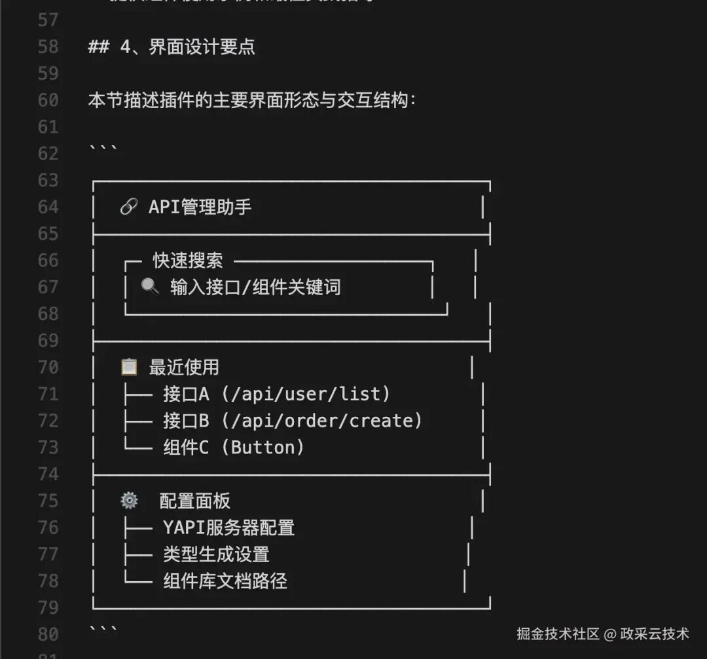

image.png

因此，我们将问题也抛给AI，让它修改一下界面交互。

```
@docs/需求分析文档.md:61-80 这里的界面设计不合理，项目由多人进行开发维护，配置需要可以共享，那么就不应该作为插件的面板设置，而是应该是项目级的，跟随项目来走
```
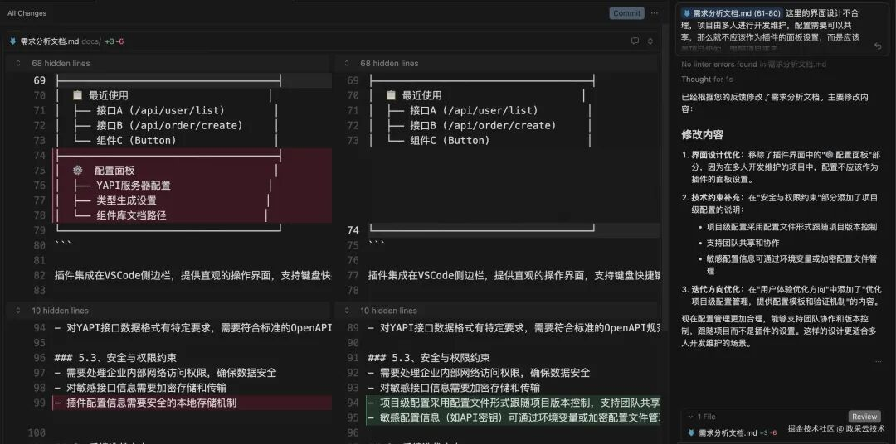

image.png

在此基础上，借助 AI 对问题的归纳和能力抽象，我们逐步明确了一个可落地、可迭代的插件能力方向，并以此为基础进行了功能规划与后续工程实现。

**最终插件的核心能力聚焦在三大模块**：

- **一键拉取 YAPI** 
- 自动生成 `TS` 类型（核心）
- 接口类型更新提示（核心）
- **组件 API 智能提示**
- 属性补全
- 悬浮提示
- 自动化流程：自动获取组件数据源
- **钉钉通知整合**
- 异常、反馈信息实时推送

##### 1.3.3、需求分析文档模版

这里给出我所推荐的一个需求分析文档的格式，大家可以参考借鉴一下：

```
# 产品名称

## 1、项目背景
简单介绍一下项目的背景与痛点，以及期望解决的问题或者达到的效果。

## 2、目标用户

| 用户类型 | 使用场景 |
|---------|---------|
| 前端开发人员 | 开发过程时xxx |
| 测试人员 | 执行测试用例时需要xxx |
| 产品经理 | 演示产品功能时需要xxx |
| 日常办公人员 | 处理xxx |

## 3、核心功能需求

介绍一下项目想要实现的各个功能点，以及相关的描述等信息

### 3.1、功能概览

### 3.2、功能说明

...

## 4、界面设计要点

本节用于描述主要界面形态与交互结构，不要求最终 UI 设计稿，可通过结构示意帮助理解功能布局

\`\`\`markdown
┌────────────────────────────────────┐
│  🎬 API管理工具                     │
├────────────────────────────────────┤
│  📋 接口列表                        │
│  ┌────────────────────────────────┐│
│  │ 📝 测试接口1                    ││
│  │    /example/form               ││
│  │    2024-01-15 10:30            ││
│  ├────────────────────────────────┤│
│  │ 📝 测试接口2                    ││
│  │    /example/login              ││
│  │    2024-01-14 16:20            ││
│  └────────────────────────────────┘│
│                                    │
└────────────────────────────────────┘
\`\`\`
结构图仅用于辅助理解，不作为最终交付物

## 5、技术约束与限制

从需求层面说明可能存在的限制条件，例如：使用环境限制（仅限某些编辑器或平台）、数据来源依赖、权限或安全相关约束

本节不涉及具体技术方案或实现方式。

## 6、后续迭代方向

描述可能的后续演进方向，用于辅助决策与规划：功能增强方向、用户体验优化方向、与其他工具或系统的联动可能性

本节内容不一定可行，需在后续阶段评估可行性

## 7、其他说明
例如，专业术语、修订的记录等等
```
##### 1.3.4、规则定制规范 AI 输出

AI编辑器`Cursor`、`Trae`等可以通过定制规则，让 AI 的输出更符合用户的个性化要求。通过定制规则，让 AI 的回答以我们想要的模版输出。

- cursor.com/cn/docs/con…\[1\]
- docs.trae.cn/ide/rules: …\[2\]

这里以`Cursor`为例：

**（1）创建规则文件**

打开 `Cursor` 设置

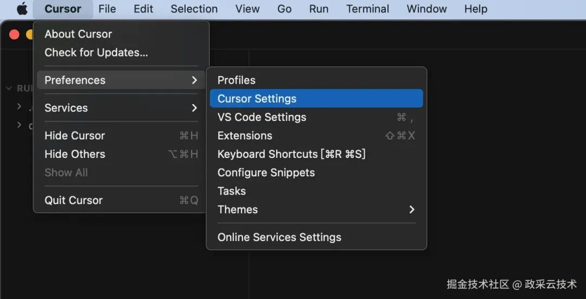

image.png

进入规则面板，找到项目规则，点击`Add&nbsp;Rule`新增规则，选择自定义规则

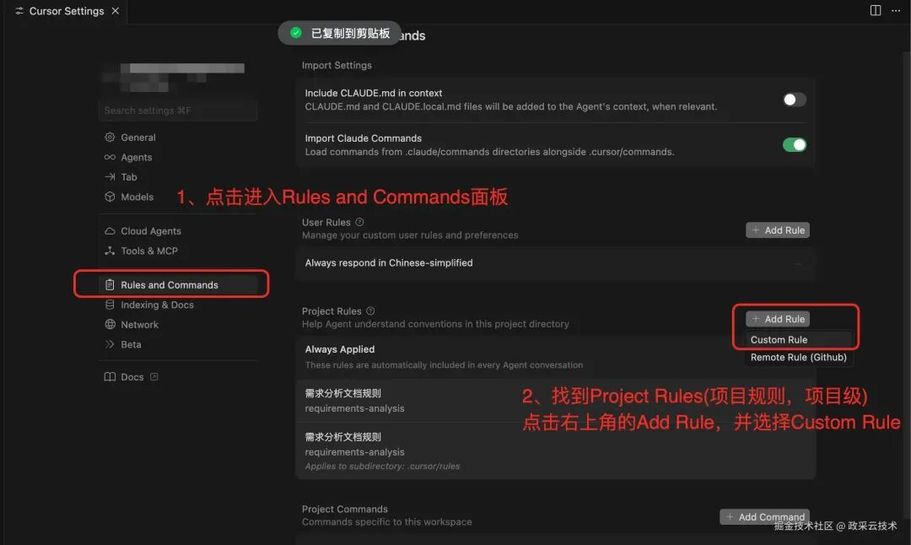

image.png

输入合法的规则名称后，回车创建，即可在根目录下看到规则文件


image.png


image.png

**（2）编辑规则：**

编辑新创建的规则文件`xxxx.mdc`

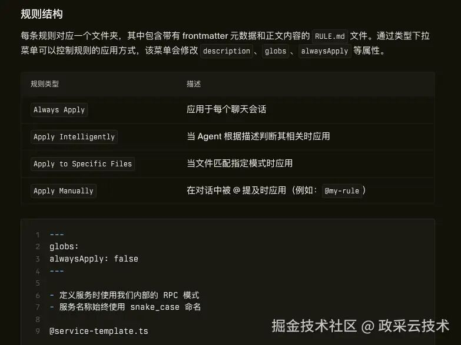

image.png

我所使用的规则如下：

```
---
description: 需求分析文档规则
globs: *.md
alwaysApply: true
---

# 需求分析文档规范

## 角色定位
你是一个专业的技术文档助手，严格遵循文档结构，提供完整的信息。

## 文档结构模版

# [产品名称]-需求分析文档

> 简要给出一个符合当前需求语境的产品名称，若用户已提供则直接使用。

## 1、项目背景

简单介绍一下项目的背景与痛点，以及期望解决的问题或者达到的效果。

## 2、目标用户

| 用户类型 | 使用场景 |
|---------|---------|

## 3、核心功能需求

介绍一下项目想要实现的各个功能点，以及相关的描述等信息

### 3.1、功能概览

### 3.2、xx功能

### 3.3、yy功能

...

## 4、界面设计要点

本节用于描述主要界面形态与交互结构，使用`ASCII`字符，通过结构示意帮助理解功能布局

\`\`\`markdown
┌────────────────────────────────────┐
│  🎬 xx工具                          │
├────────────────────────────────────┤
......
\`\`\`
结构图仅用于辅助理解，不作为最终交付物

## 5、技术约束与限制

从需求层面说明可能存在的限制条件，例如：使用环境限制（仅限某些编辑器或平台）、数据来源依赖、权限或安全相关约束

本节不涉及具体技术方案或实现方式。

## 6、后续迭代方向

描述可能的后续演进方向，用于辅助决策与规划：功能增强方向、用户体验优化方向、与其他工具或系统的联动可能性

本节内容不一定可行，需在后续阶段评估可行性

## 7、其他说明
例如，专业术语、修订的记录等等

### 专业术语
| 术语 | 说明 |
|-----|------|

### 修订记录
| 版本 | 日期 | 修订内容 | 作者 |
|-----|------|---------|-----|

```
更多规则可以根据需要在`github上`查找：

github.com/search?q=Cu…\[3\]

> 💡提示：规则的格式并没有什么强制要求，你可以按你的想法随意输入，AI 模型会自己去读取并解析你的规则。

当需求分析文档设计好后，接下来就应该考虑具体如何实现，以及规划一下实现的步骤。

#### 1.4、技术设计与规划（技术方案 + 具体实现步骤）

在探索可行的实现方向与能力落地路径时，我们亦可以借助 AI 在信息归纳、对比分析与结构化表达方面的优势，作为研发前期的重要辅助工具，帮助我们更快的收集信息、分析可行路线。

下面我会先简单介绍一下，我们团队在借助 AI 设计技术方案时的最佳实践方式。

##### 1.4.1、AI 辅助的最佳实践

一种行之有效的实践方式是：

1. **提供参考资料给AI（这一过程也可以直接让 AI 完成）**
- 市面上已有的同类产品、解决方案链接
- 相关文件、文档等上下文（例如需求分析文档、YApi官方文档）
3. **引导 AI 进行整体分析**
- 对比总结不同产品的功能划分和能力侧重点
- 提炼共性与差异
- 抽象出通用的能力模型或架构结构
5. **输出辅助成果**
- 系统架构示意图
- 功能模块拆分建议
- 技术实现思路概览

> ⚠️ 提示：AI 输出仅作为参考，不代表最终方案，开发者仍需结合实际业务场景进行判断与优化。

##### 1.4.2、插件技术架构概览

结合市面上已有的插件能力和需求分析后，我们可以借助 AI 生成一份的技术架构图：

```
+-------------------------------------------------------------+
|                    VS Code 插件前端（Webview）                |
|                     React + Messaging                       |
|                                                             |
|  ┌───────────────────┐    ┌─────────────────────────────┐   |
|  │   主界面模块        │    │  初始化配置模块               │   |
|  │ (入口 + 布局)       │    │ (首次使用指引、Token配置等)    │   |
|  └───────────────────┘    └─────────────────────────────┘   |
|           │                           │                     |
|           ▼                           ▼                     |
|  ┌───────────────────┐    ┌─────────────────────────────┐   |
|  │  数据检索模块       │    │   数据状态管理（Hook）         │   |
|  │（搜索 | 缓存 | 筛选）│    │ - 关键词缓存                  │  |
|  └───────────────────┘    │ - 搜索请求封装                │   |
|           │               │ - 接口返回预处理              │   |
|           ▼               └─────────────────────────────┘   |
|  ┌────────────────────────────────────────────────────────┐ |
|  │                   API 树展示模块                         │ |
|  │（接口树结构、接口项展示、交互操作）                          │ |
|  └────────────────────────────────────────────────────────┘ |
|          │        │        │                               |
|          ▼        ▼        ▼                               |
|   ┌──────────┐ ┌────────┐ ┌──────────────────────────────┐ |
|   │ 接口项UI  │ │ 配置中心 ││ 前端数据处理逻辑                │ |
|   └──────────┘ └────────┘ └──────────────────────────────┘ |
|                                                             |
|  ┌────────────────────────────────────────────────────────┐ |
|  │ 可展开容器组件（折叠/展开内容区）                            │ |
|  └────────────────────────────────────────────────────────┘ |
|                                                             |
|  ┌────────────────────────────────────────────────────────┐ |
|  │ 批量处理进度模块（批量生成代码进度展示）                      │ |
|  └────────────────────────────────────────────────────────┘ |
+-------------------------------------------------------------+
           │
           │    VS Code Extension Messaging（双向通信）
           ▼
+-------------------------------------------------------------+
|                      VS Code 插件后端                        |
|                    (Extension Host Runtime)                 |
|                                                             |
|  ┌────────────────────────────────────────────────────────┐ |
|  │                    YAPI 数据服务层                       │ |
|  │ - 获取项目列表                                           │ |
|  │ - 查询接口详情                                           │ |
|  │ - 接口变更检测                                           │ |
|  │ - Token 校验                                            │ |
|  └────────────────────────────────────────────────────────┘ |
|                                                             |
|  ┌────────────────────────────────────────────────────────┐ |
|  │                     代码生成引擎                         │ |
|  │ - 根据接口结构生成 TypeScript 类型/方法                    │ |
|  │ - 写入文件系统                                           │ |
|  │ - 调用格式化工具（如 Prettier）                           │ |
|  │ - 自动打开/更新文件                                      │ |
|  └────────────────────────────────────────────────────────┘ |
+-------------------------------------------------------------+
           │
           │ HTTP 调用（YAPI API v1/v2）
           ▼
+-------------------------+
|        YAPI 服务端       |
+-------------------------+


```
借助该架构图，可以辅助我们理解同类型插件的实现原理，帮助我们梳理其中关键点。

该环节并不局限于此，日常我们在阅读三方库的源码时，也可以借助 AI 快速了解设计架构，并基于该设计架构阅读关键节点源码。

##### 1.4.3、AI 辅助生成技术方案

下面我简单整理了一下提示词，我们需要将需求分析文档等相关资料都提供给 AI。

- 如果使用 **AI 编辑器**（这里以`Cursor`为例）：

```
请根据 @需求分析文档.md，@YApi，https://github.com/zhixiaoqiang/yapi2code生成一份技术方案文档。

注意，这只是一个技术方案文档，不需要写具体的代码实现，只需要写技术方案设计即可。

结果帮我保存到 技术方案文档.md 中
```
- 如果使用 **智能体对话**形式：

```
请根据前面的需求分析文档和相关参考资料，生成一份 VSCode 插件技术方案文档，仅包含技术方案设计，不涉及代码实现。
```
> 💡 提示：本文示例仅演示**技术方案设计流程**，重点在于如何借助 AI 辅助整理技术方案，而非具体编码实现。

生成的技术方案文档格式如下：

```
# 产品名称 - 技术方案文档

## 1、功能要点分析
介绍一下将核心功能拆解后的各个模块，例如：接口列表模块、设置模块

## 2、技术架构设计
系统架构图图例以及相关说明

## 3、核心技术方案
介绍一下项目的核心技术点，技术难点/技术亮点

## 4、业界方案调研
业界类似产品方案调研结果，参考价值等信息

## 5、项目规范设计

### 代码组织规范
\`\`\`markdown
src/
├── views/                  # 视图模块
│   ├── index.ts
│   └── services/
├── components/             # 公用组件模块
│   ├── ...
├── hooks/                  # 公用Hook
│   ├── ...
├── utils/                  # 工具模块
│   ├── ...
└── package.json
\`\`\`

### 设计原则
| 原则 | 说明 | 实践方式 |
|-----|------|---------|
| **单一职责** | 每个模块只负责一件事 | 拆分独立的 Service 和 Module |
| **开闭原则** | 对扩展开放，对修改关闭 | 使用策略模式、插件机制 |
| **依赖倒置** | 依赖抽象而非具体实现 | 定义 Interface，使用依赖注入 |
| **最小知识** | 模块间保持最小依赖 | ... |

### 测试策略
| 测试类型 | 覆盖范围 | 工具 |
|---------|---------|-----|
| **单元测试** | 核心逻辑、工具函数 | Vitest / Jest |
| **集成测试** | 模块间交互 | Vitest / Jest |
| **E2E 测试** | 完整用户流程 | Playwright |
| **手动测试** | UI 交互、边界场景 | - |

## 6、技术选型总结

### 核心技术栈
| 类别 | 选型 | 说明 |
|-----|------|-----|
| **语言** | TypeScript | 类型安全，提高代码质量 |
| **UI 框架** | React 18 | 组件化开发，生态丰富 |

### 开发与质量保障
| 类别 | 选型 | 说明 |
|-----|------|-----|
| **代码规范** | ESLint + Prettier | 统一代码风格 |
| **Git 规范** | Conventional Commits | 规范化提交信息 |

## 7、风险评估与应对
说明可能存在的风险，例如某个核心能力的实现，以及相关影响和如何应对

## 8、其他内容
专业术语、修订记录等
```
##### 1.4.4、技术方案文档模版

同样的，技术方案规则模版如下（`Cursor`直接使用）

```
---
description: 技术方案文档规则
globs: *.md
alwaysApply: true
---

# 技术方案文档规范

## 角色定位
你是一个专业的技术文档助手，严格遵循文档结构，提供完整的信息。

## 文档结构模版

# [产品名称]-技术方案文档

## 1、功能要点分析

介绍一下将核心功能拆解后的各个模块

### 1.1、xx模块
| 功能点 | 技术要点 | 复杂度 |
|-------|---------|--------|

## 2、技术架构设计

> [简单说明一下，整体的技术架构设计，采用了什么架构/模式/...]

### 2.1、整体架构
使用`ASCII`字符，通过结构示意描述架构设计
\`\`\`markdown
├─────────────────────────────────────────────────────────────┤
│                       基础层 (Infrastructure)                │
│  ┌─────────────┐  ┌─────────────┐  ┌─────────────────────┐  │
│  │ 通信         │  │   存储      │  │     Utils           │  │
│  └─────────────┘  └─────────────┘  └─────────────────────┘  │
└─────────────────────────────────────────────────────────────┘
\`\`\`

### 2.2、模块划分
| 模块名称 | 职责描述 | 所在层级 |
|---------|---------|---------|

## 3、核心技术方案
介绍一下项目的核心技术点，技术难点/技术亮点

## 4、业界方案调研
业界类似产品方案调研结果，参考价值等信息

### 4.1、相关开源项目
| 项目 | 类型 | 主要用途 | 参考价值 |
|-----|------|---------|---------|

### 4.2、xx项目方案分析
...

## 5、项目规范设计

### 5.1、代码组织规范
\`\`\`markdown
src/
├── views/                  # 视图模块
│   ├── index.ts
│   └── services/
├── components/             # 公用组件模块
│   ├── ...
├── hooks/                  # 公用Hook
│   ├── ...
├── utils/                  # 工具模块
│   ├── ...
└── package.json
\`\`\`

### 5.2、设计原则
| 原则 | 说明 | 实践方式 |
|-----|------|---------|

### 5.3、测试策略
| 测试类型 | 覆盖范围 | 工具 |
|---------|---------|-----|

## 6、技术选型总结

### 6.1、核心技术栈
| 类别 | 选型 | 说明 |
|-----|------|-----|

### 6.2、开发与质量保障
| 类别 | 选型 | 说明 |
|-----|------|-----|

## 7、风险评估与应对

>分点说明可能存在的风险，例如某个核心能力的实现，以及相关影响和如何应对

最后以表格形式展示
| 风险 | 影响 | 概率 | 应对措施 |
|-----|------|-----|---------|

## 8、其他内容
例如，专业术语、修订的记录等等

### 专业术语
| 术语 | 说明 |
|-----|------|

### 修订记录
| 版本 | 日期 | 修订内容 | 作者 |
|-----|------|---------|-----|
```
##### 1.4.5、AI 辅助实现步骤规划

提示词如下所示：

```
请你根据 @docs/需求分析文档.md @docs/技术方案文档.md ，帮我规划一下项目的具体实现步骤。

注意一下几点：
1、开发人力为2人，均为前端开发
2、开发不是全天投入，你可以按照人均3.0工时计算，非工作日不算。
3、可以分阶段实现，以一个可运行的Demo划分

内容帮我写入到 实现步骤规划文档.md中 
```
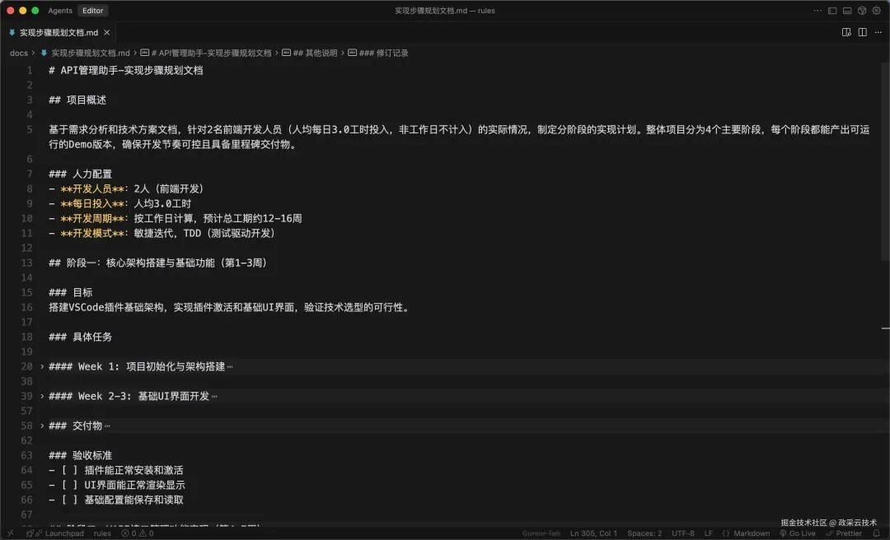

image.png

以上内容仅作为一个简要示例，实际使用过程中可根据各自的业务背景与项目特点灵活编写和调整提示词。

可以看到，借助 AI 的辅助，我们能够相对高效地完成阶段划分与流程规划。在此基础上，研发工作即可按照既定规划循序推进，在每个阶段结合实际情况进行验证与调整，从而逐步推动项目落地。

---

至于“阶段二：人工主导、AI 辅助”这一部分的内容，这里就不多做介绍，相信大家在平时的开发过程中也经常会借助 AI 来辅助开发，例如 代码 `TAB` 补全、借助 `Agent` 生成工具函数等等。

#### 1.5、实践成果

在确定目标之后，整个实践过程在 AI 的持续辅助下，逐步完善。最终，我们完成了这样的插件能力。

- **功能点一：自动生成代码（自动生成、插入光标所在位置）**

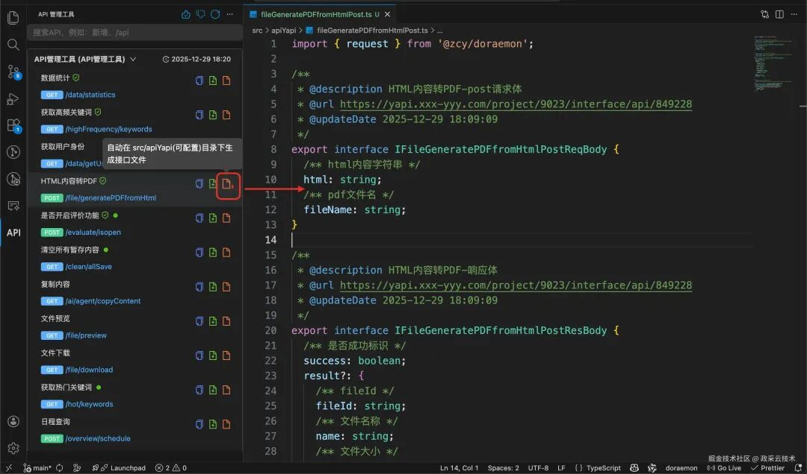

image.png

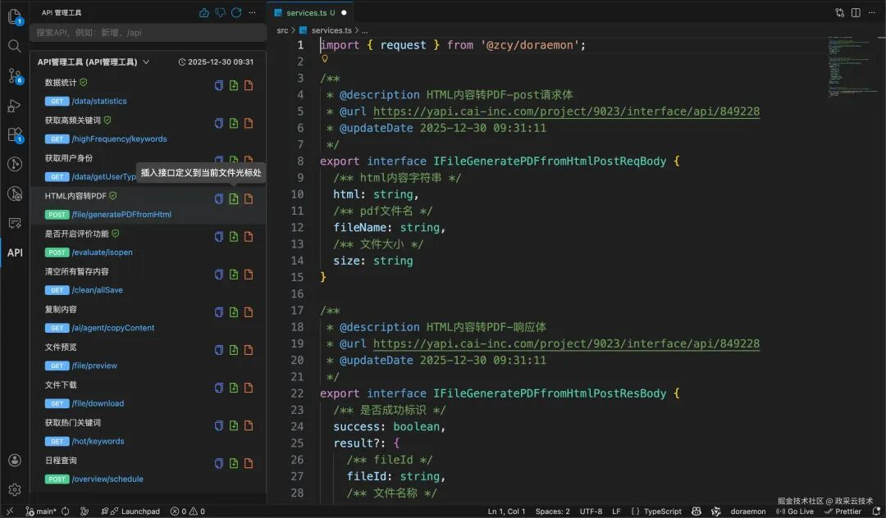

image.png

- **功能点二：接口管理（筛选、刷新、状态更新提示）**
  
  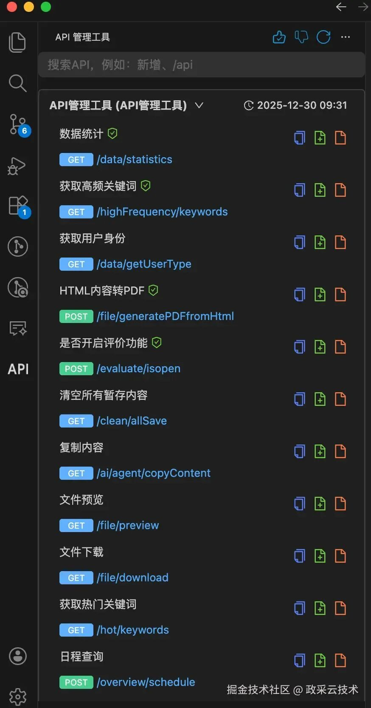
  
  image.png
  
  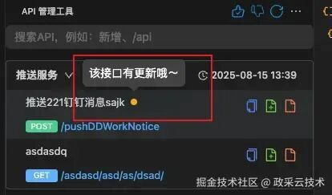
  
  image.png
- **功能点三：API分析**

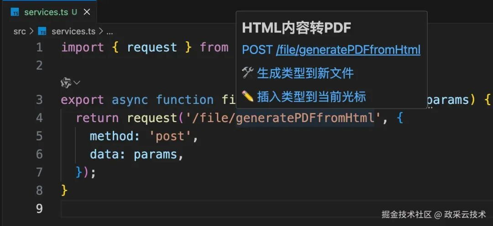

image.png

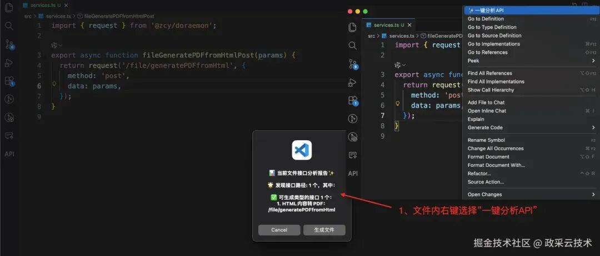

image.png

**功能点四：组件信息提示（属性补全、组件及属性提示）**

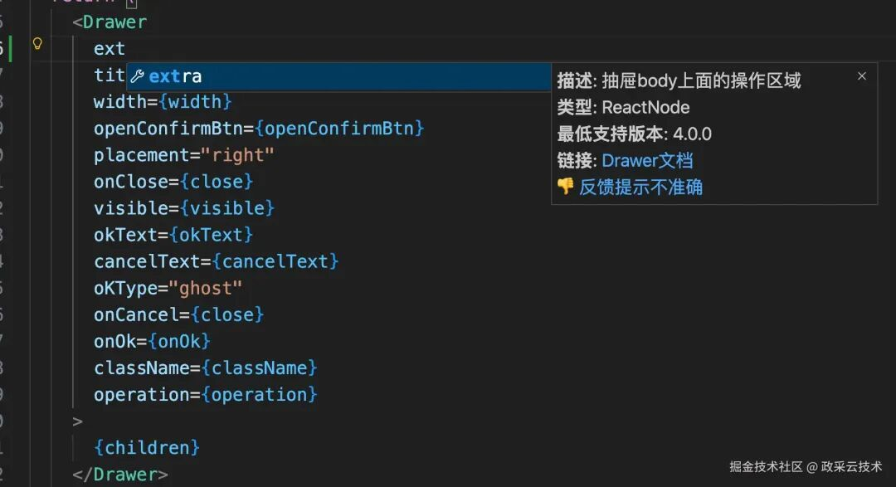

image.png

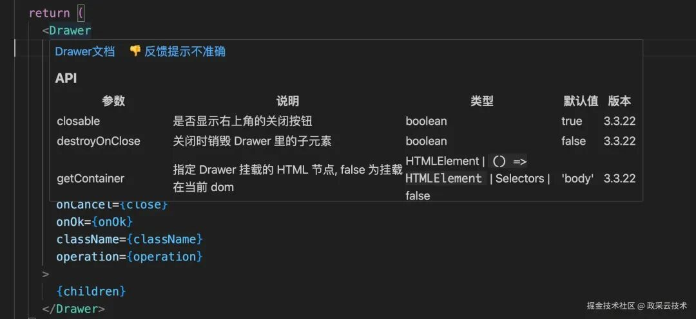

image.png

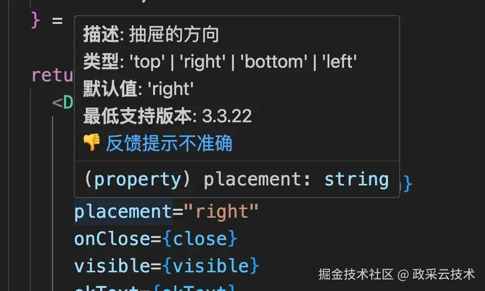

image.png

> 在这一实践过程中，我们深度引入并系统性地结合了 AI 能力，在严格保障交付质量的前提下推进与完成相关工作。同时，也在实践中沉淀并总结了一套行之有效的 AI 辅助研发经验。

#### 1.6、AI 辅助研发小结

1. AI 在规划与信息整理方面具备天然优势
2. AI 是研发过程中的协作助手，而非人工编码的完全替代
3. 效率提升将反向推动团队对 AI 的更深度使用
4. 高质量提示词是发挥 AI 价值的关键前提
5. 新工程应始终坚持“文档先行”的研发原则
6. 对 AI 生成的内容一定要仔细判别，不要全盘接受

### 二、AI 赋能个人成长

在面对陌生却又充满吸引力的技术或知识领域时，很多人或许都有过类似的体验：心生兴趣，却一时不知从何入手；渴望亲手做出一些成果，却又被较高的学习成本和门槛所劝退。

而随着 AI 技术的快速发展，这种“想做却不敢做”的局面正在被逐步打破。跨领域探索不再是少数专业人士的专利，越来越多非科班背景的开发者，借助 AI 成功完成了网页、App 乃至完整产品的搭建；也有越来越多从业者，通过 AI 实现了跨专业、跨领域的能力拓展与技能升级。

我自己也深有同感。平时在浏览技术内容或视频时，常常会被一些新颖的技术应用或创意作品所吸引，眼前一亮的同时，也不免产生一个想法：有一天，自己是否也能做出类似的产品？而 AI，正在让这种想法变得前所未有地可行。

---

下面的案例，正是我在 AI 的辅助下逐步探索未知领域、不断拓展能力边界的实践过程。在这一过程中，我借助 AI 完成了一个简易版 Demo，不仅验证了想法的可行性，也收获了不少新的认知与经验。下面一起来看看这个过程吧。

#### 2.1、尝试原因与目标

##### 2.1.1、尝试原因

一方面，3D 可视化一直是我个人感兴趣但较少实际涉足的技术方向。相较于常规的 Web 页面开发，3D 场景在空间表达、信息组织和交互体验上具备更强的表现力，但同时也伴随着更高的学习成本和技术门槛，这使得我长期停留在“感兴趣却未真正入手”的阶段。

另一方面，我希望借助这次实践，验证 AI 在跨领域学习与探索中的实际价值。在并非系统掌握 3D 图形学、`Three.js` 等相关知识的前提下，AI 是否能够在方案拆解、技术选型、实现路径规划以及具体编码过程中，持续提供有效支持，帮助我完成一个“从 0 到 1”的可运行成果，是我非常关心的问题。

##### 2.1.2、目标设定

基于上述背景，这次尝试并未追求复杂或高度完整的产品形态，而是聚焦于一个**清晰、可落地、可验证的最小目标**：

- 构建一个 **3D 建筑可视化页面**，以多楼层建筑为载体；
- 支持楼层切换与展示控制，可按需查看当前楼层或整体结构；
- 在楼层中以区域形式呈现功能分区信息（如办公区、电梯间等），并通过颜色或标注进行区分；
- 通过这一 Demo，验证在 AI 辅助下，自己是否能够：
- 快速理解陌生领域的核心概念；
- 将抽象想法逐步拆解为可实现的技术方案；
- 最终产出一个具备基础交互与展示价值的实际成果。

从结果来看，这个 3D 建筑 Demo 不仅帮助我完成了对 3D 技术的初步“破冰”，也让我更加直观地感受到：**AI 正在显著降低跨领域探索的试错成本，使“先做出来，再逐步优化”成为一种现实可行的学习路径。**

#### 2.2、实践成果

在明确目标之后，整个实践过程并非一次性完成，而是在 AI 的持续辅助下，逐步推进和完善。最终，我完成了一个具备基础交互能力的 3D 建筑可视化 Demo。

- **功能一：整体预览**

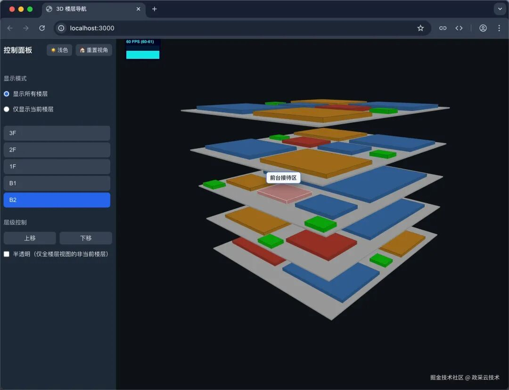

image.png

- **功能二：其它楼层透明化**

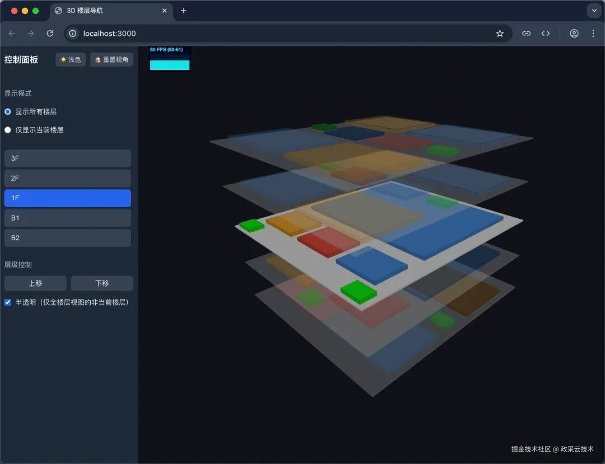

image.png

- **功能三：单楼层预览**

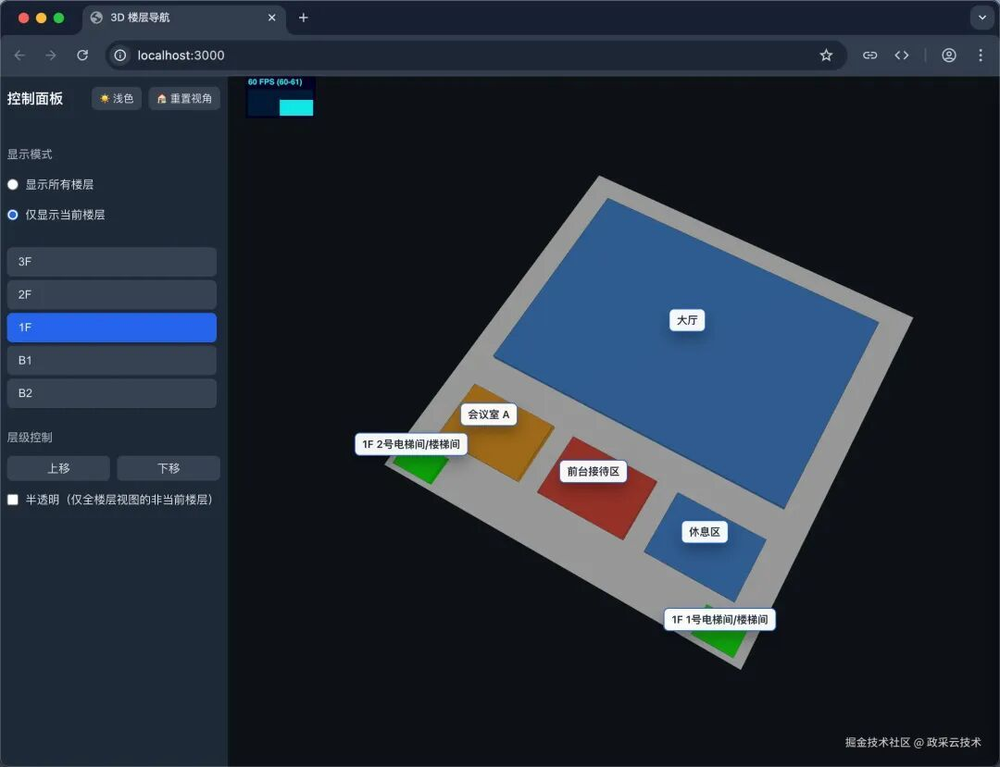

image.png

其实现过程也清晰地体现了 AI 在不同阶段所发挥的价值，下面我为大家简单介绍一下。

##### 2.2.1、项目搭建过程

下图展示了我在整个项目搭建过程中，与 AI 的主要对话与推进记录。整体项目从零开始到可用 Demo 产出，大约花费了 **2 天时间**完成（界面与功能以验证思路为主，整体偏简洁）。

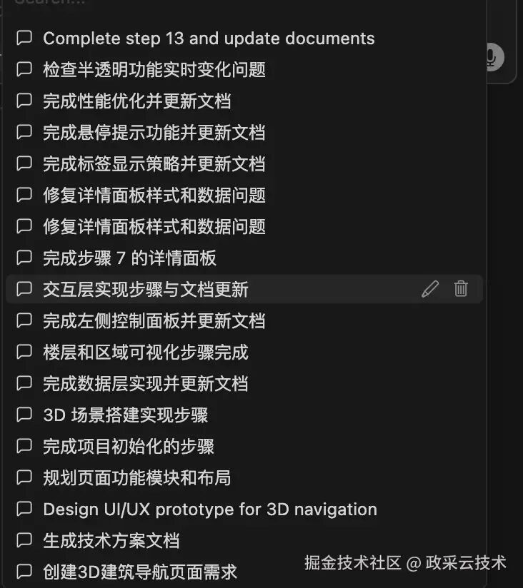

image.png

从记录中可以看到，我并未采用“边写代码边试错”的方式，而是**严格遵循「文档先行」的原则**来推进整个项目。具体流程可以抽象为一条相对通用的实践链路：

> “AI 分析需求” -> “生成技术方案与实现路径” -> “页面与交互设计” -> “项目初始化” -> “按步骤分阶段实现功能” -> “测试与问题修复” -> “优化与完善”

在这一过程中，AI 承担了从需求分析、方案设计到具体实现的主要输出工作；而我更多扮演的是**需求校验者与方向决策者**的角色，持续判断 AI 给出的方案是否符合预期，并在必要时进行调整与收敛。

这种模式使我能够在不熟悉 3D 技术细节的前提下，依然保持对整体架构和产品形态的控制，从而顺利完成一次从 0 到 1 的完整实践。

##### 2.2.2、流程解析

为了更清晰地说明这一实践过程，我将上述链路进一步拆解为以下五个阶段：

**1）文档与 UI 设计阶段**

在真正进入实现之前，我首先将自己的想法、目标与预期效果完整地交给 AI，由其进行需求分析并产出初步的技术方案与实现思路。

需要强调的是，这一阶段**并不是“完全放手”**，而是需要我们深度参与和持续校验，包括：

- 是否符合最初设定的目标边界；
- 技术方案是否过度设计；
- UI 与交互是否具备实际可行性。

这一过程本质上是**将模糊想法不断结构化、具体化**的过程。

> 💡Tips：该阶段是整个设计中最为重要的一环，它影响着我们的整体设计链路。

**2）项目初始化**

在项目初始化阶段，AI 更多地承担了“技术负责人”的角色，负责整体工程骨架的搭建，包括但不限于：

- 3D 场景初始化逻辑；
- 渲染循环与基础更新机制；
- 模块与资源的组织方式。

这一阶段的核心价值在于：**快速建立一个可持续迭代的工程基础**，而不是一开始就追求完整功能。

**3）核心 3D 场景搭建**

在具备基础工程结构后，实践进入到 3D 场景本身的构建阶段。AI 针对 3D 场景中较为关键的基础能力提供了较为系统的指导，例如：

- 相机（`Camera`）的类型选择与参数配置；
- 光源（`Light`）的组合方式与基础照明策略；
- 控制器（`Controls`）的使用场景与交互限制。

借助这些指导，我能够在不深入图形学原理的前提下，快速搭建出一个**可观察、可操作、结构清晰**的三维空间环境。

**4）交互能力补齐**

在完成基础展示后，重点开始转向交互能力的补齐。AI 在这一阶段协助我逐步引入并完善了以下关键能力：

- 基于 **Raycasting** 的点击与命中检测；
- 基于 **HTML Overlay** 的区域标签展示策略与位置计算；
- 区域悬停高亮效果（线框轮廓）；
- 楼层与区域之间的层级关系管理；
- 楼层切换、显示控制及状态同步逻辑。

随着这些能力逐步落地，整个 Demo 也从“静态模型展示”演进为一个**可探索、可交互的 3D 建筑场景**。

**5）优化完善**

在功能基本成型后，最后一个阶段聚焦于体验与稳定性的优化，包括：

- 性能与渲染效果的基础优化；
- 交互反馈与视觉表现的调整；
- 问题修复与逻辑收敛。

这一阶段虽然不再引入新的核心能力，但对于 Demo 的“可用性”和完整度起到了决定性作用。

#### 2.3、最终收获

回顾整个过程，这次实践更像是一场**方法论验证**：

> 在 AI 的持续辅助下，通过「文档驱动 + 小步迭代 + 人工校验」的方式，即使面对陌生领域，也能够在较短时间内完成一次可落地的技术探索。

具体来看，这次实践带来的收获主要体现在以下几个方面：

##### 2.3.1、对 AI 能力边界的更清晰认知

在实践之前，我更多是将 AI 视为“问题解答工具”或“代码补全助手”；而在这次完整项目过程中，AI 更像是一个**随时可调用的技术合作者**，能够在需求分析、方案拆解、技术选型以及具体实现上提供持续支持。

同时，这次实践也让我更清晰地认识到 AI 的边界：AI 并不能替代人的判断与决策，但**可以显著降低试错成本和起步门槛**，尤其在跨领域探索中价值尤为明显。

##### 2.3.2、验证了一种可复用的跨领域实践路径

通过这次实践，我验证了一条在陌生领域中行之有效的通用路径：

- 先明确目标与边界，而非追求一次性“做大做全”；
- 以文档和方案为先导，降低直接编码带来的不确定性；
- 将复杂问题拆解为多个可验证的小步骤；
- 在每一步由人来做最终判断与收敛。

这一模式并不依赖具体技术栈，对后续探索其他技术方向同样具备参考价值。

##### 2.3.3、对“学习成本”的认知发生转变

过去在面对不熟悉领域时，往往会被“需要补齐大量前置知识”所劝退；而这次实践让我意识到，在 AI 的辅助下，**学习不必等到完全理解所有原理之后才开始动手**。

通过“先做出来，再逐步理解”的方式，可以在实践中反向补齐认知，这在效率和心理负担上都更可控。

##### 2.3.4、从“是否能做到”到“是否值得去做”

最终完成的 Demo 本身并不复杂，但它起到的关键作用在于：它让我从“我能不能做 3D 相关的东西”，转变为“在什么场景下，这类技术值得被引入和使用”。

这种视角的转变，比单纯掌握某个具体技术点更有价值。

### 三、AI辅助研发的方法论总结

综合前文的实践过程与结果，这次 3D 建筑 Demo 的探索，本质上并不是一次单点技术尝试，而是一次对 **AI 辅助研发方法论**的系统验证。

在实际应用中，我逐步总结出一套相对稳定、可复用的协作模式。

#### 3.1、让 AI 做结构性工作

在项目初期，**结构性工作是最适合交给 AI 的部分**。这类工作通常具备以下特征：

- 信息量大，但单点决策成本不高；
- 需要整体视角，而非局部实现细节；
- 容易因为经验不足而走弯路。

具体包括但不限于：

- 需求拆解与功能模块划分；
- 技术方案与实现路径设计；
- 项目目录结构与工程骨架规划；
- 不同方案之间的优劣对比；

AI 在这一阶段的价值，并不在于“一定给出最优解”，而在于**快速构建一个完整且可讨论的结构**，让研发能够尽早进入“判断与修正”阶段，而不是长期停留在空想中。

#### 3.2、让 AI 做重复性与机械性工作

在进入具体实现后，AI 非常适合承担**重复性强、模式相对固定的工作**，例如：

- 模板代码、基础配置与样板逻辑生成；
- API 使用示例、调用方式梳理；
- 已知方案的实现落地；
- 文档补全、步骤整理与说明编写。

这些工作本身并不体现研发的核心价值，但却大量消耗时间与精力。

将它们交由 AI 完成，可以显著提升推进效率，使人能够把注意力集中在**真正需要思考和判断的部分**。

#### 3.3、你负责判断与优化（方向把控）

无论 AI 在输出层面多么高效，**方向判断与质量把控始终必须由人来完成**。

在实践过程中，我承担的核心职责主要集中在三点：

- 判断 AI 给出的方案是否符合真实需求；
- 识别是否存在过度设计或技术冗余；
- 在多种可行路径中做取舍与收敛。

换句话说，AI 负责“给可能性”，而人负责“做选择”。

一旦这一角色分工发生错位，AI 辅助研发就很容易演变为“无控制的堆砌”，反而增加复杂度。

#### 3.4、涉及未知领域时

在面对陌生或跨领域技术时，AI 的使用方式需要进一步调整。结合本次实践，我总结出几点尤为重要的经验：

- **先解决“能不能跑起来”，再追求“是否足够优雅”**；
- 不必一开始就补齐所有理论知识，而是在实践中反向学习；
- 将目标拆解为多个“可验证的小成果”，而不是一次性完成；
- 对 AI 输出保持“参考而非权威”的心态。

这种策略的核心，在于**降低进入门槛与心理负担**。

AI 并不是让人“跳过学习”，而是让学习路径从“先理解完再动手”，转变为“在动手中逐步理解”。

### 四、结语

从整体来看，AI 辅助研发并不是简单的“用 AI 写代码”，而是一种**分工明确、责任清晰的人机协作模式**：

- AI 擅长发散、整理、生成；
- 人类擅长判断、取舍、收敛；

当二者边界清晰、职责明确时，AI 才能真正成为研发效率的放大器，而不是新的复杂度来源。

> 链接：https://juejin.cn/post/7596932640727056419
> 
> 作者：政采云技术 秋风

  

Node 社群
