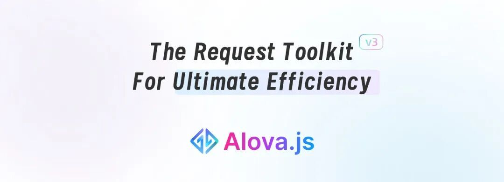
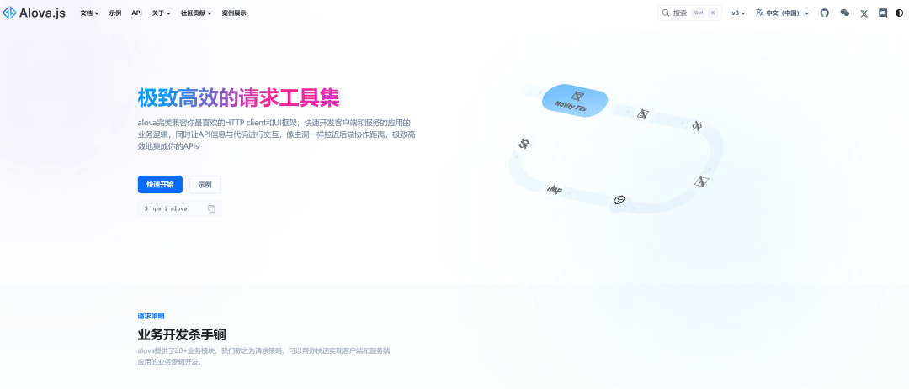
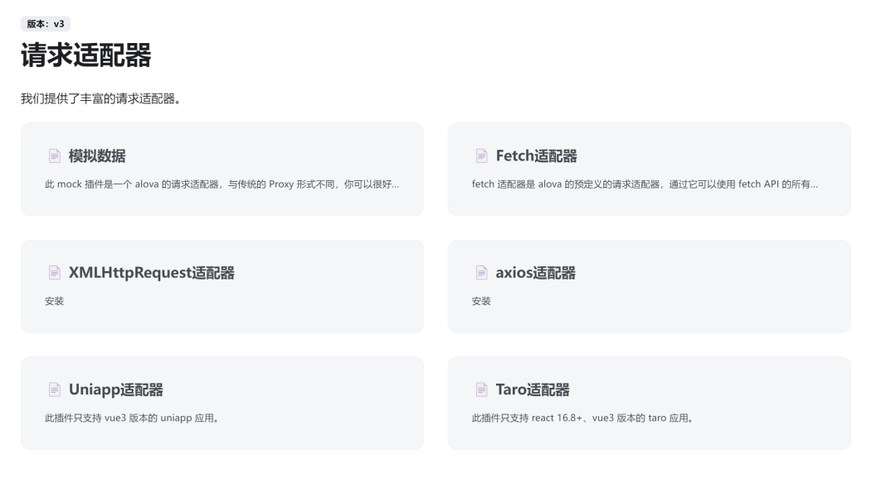

# 抛弃 Axios！这个轻量化请求库，前端性能直接起飞

> 前端 HTTP 请求库新选择，轻量化+高性能，对标 Axios 核心竞争力

## 一、Alova.JS 是什么

轻量级 HTTP 请求库，支持声明式处理复杂请求，兼容 axios/fetch/XHR 适配器，可无缝集成各类前端项目。



## 二、核心特性（核心优势）

1. **跨框架兼容**：适配 Vue/React/Svelte 等主流框架
2. **API 友好**：类 Axios 设计，开发者零成本上手
3. **极致轻量化**：体积仅 Axios 30%，生产包＜4kb，支持 tree shaking
4. **高性能内置**：缓存/请求共享/数据预拉取，降低服务端压力
5. **高扩展性**：自定义适配器/中间件，支持 SSR
6. **开发提效**：自动管理请求状态，完善 TypeScript 支持



## 三、Alova.JS vs Axios

  

  


| 维度 | Alova.JS | Axios |
| --- | --- | --- |
| API 设计 | 声明式语法，适配复杂场景 | 简洁灵活，生态成熟 |
| 体积性能 | 轻量化，内置性能优化策略 | 功能全面，体积偏大 |
| 生态社区 | 新兴快速增长，文档完善 | 成熟稳定，插件丰富 |


## 四、弃用 Axios 转 Alova 的核心原因

1. **性能敏感场景刚需**：小体积优化移动端/高性能应用加载速度
2. **开发效率提升**：减少状态管理与封装代码，降低维护成本
3. **开箱即用优化**：无需额外配置，自带缓存/请求共享等能力

## 五、快速上手指南

### 1\. 适配器安装（按需选择）



```
# Mock 适配器
npm install alova @alova/mock --save
# Axios 适配器（复用 Axios 能力）
npm install alova @alova/adapter-axios axios --save
# XHR 适配器（兼容低版本浏览器）
npm install alova @alova/adapter-xhr --save
```
### 2\. 核心用法示例

- **创建实例**

```
import { createAlova } from 'alova';
import { axiosRequestAdapter } from '@alova/adapter-axios';
const alovaInst = createAlova({ requestAdapter: axiosRequestAdapter() });
```
- **发送请求**

```
const list = () => alovaInst.Get('/list');
const { loading, data } = useRequest(list);
```
- **文件下载**

```
const download = () => alovaInst.Get('/image.jpg', { responseType: 'blob' });
const { send, onSuccess } = useRequest(download, { immediate: false });
onSuccess(({ data }) => {
  const a = document.createElement('a');
  a.href = URL.createObjectURL(data);
  a.click();
});
```
### 3\. 类型与 Mock 支持

- Axios 适配器类型完全对齐，无缝迁移
- Mock 场景可适配 Axios 响应格式，保证开发一致性

## 结语

我是林三心，一个待过**小型toG型外包公司、大型外包公司、小公司、潜力型创业公司、大公司**的作死型前端选手

我建了一些**前端学习群**，如果大家想进群交流前端知识，可以关注我，回复**加群**
