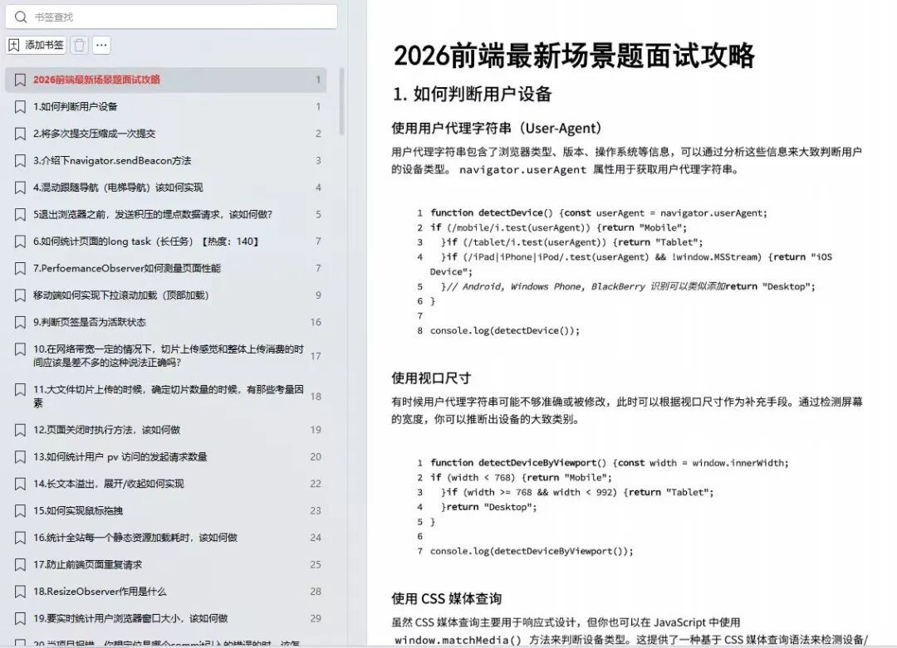
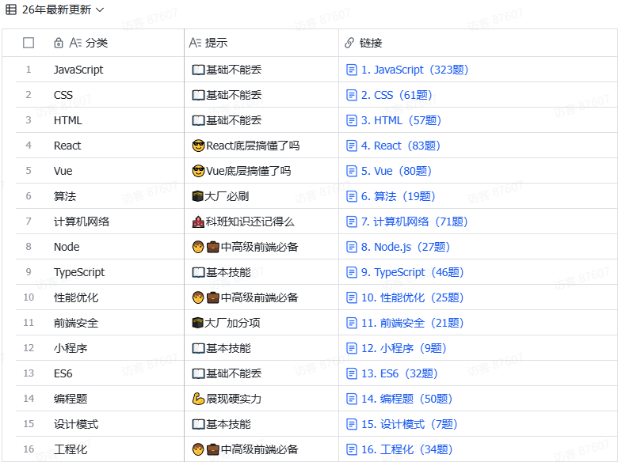
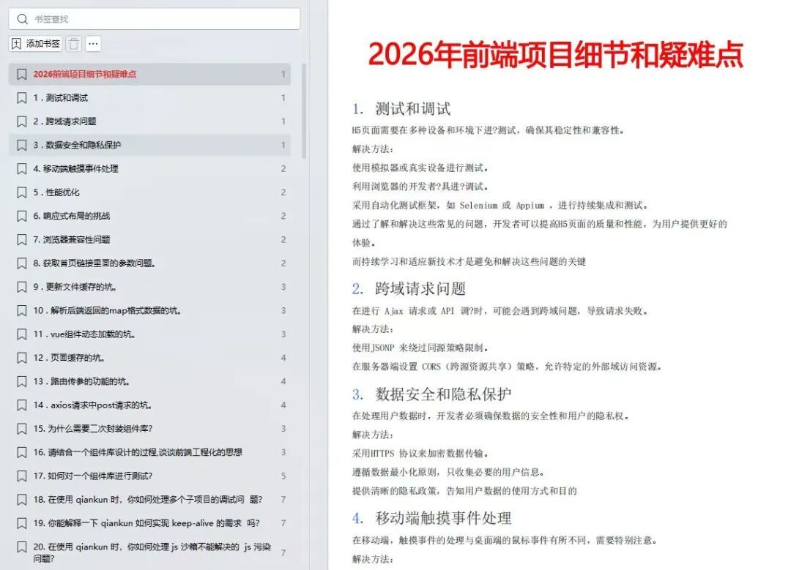
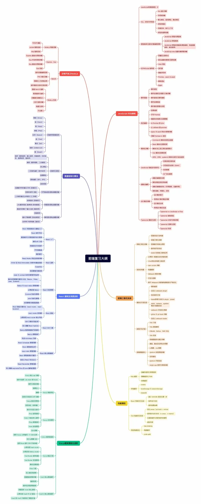

# 裁员了，很严重，大家做好准备吧！

2026年最大的热点，除了裁员，就是大厂降薪！

**然而做技术的有一种资历，叫做通过了阿里的面试。**

年前找 **阿里P8级前端专家** 要来了一套内部资料——**《阿里前端高频面试真题库》**，都是**常考必考**点，文档内容整理采用**「核心知识点 + 2026******最新********前端场景题+ 100道********2026********最新项目细节和疑难点」****模式，掌握了不单能应付面试，还能学到更多的前端核心知识，应用在工作中！

下面是部分资料内容的展示↓**（****PS：P****DF文档在文中领取）**

**1**

**2026前端最新场景题**

**2**

**前端重点面试题汇总**

  

3

2026最新项目细节和疑难点100道

  

4

前端复习路线（对标阿里P5-P7)

  

## 资料领取方式：

由于篇幅限制，完整版文档已打包，添加下方微信，免费领取，无套路。并且资料是长期更新的！

**扫码获取：《阿里内部前端面试题库＋后续更新》**

  

******阿里面试真题库**********&**********前端简历模板**********&**********前端复习大纲******

************还有机会获得阿里P8大佬************ ****1V1**** ************答疑************
