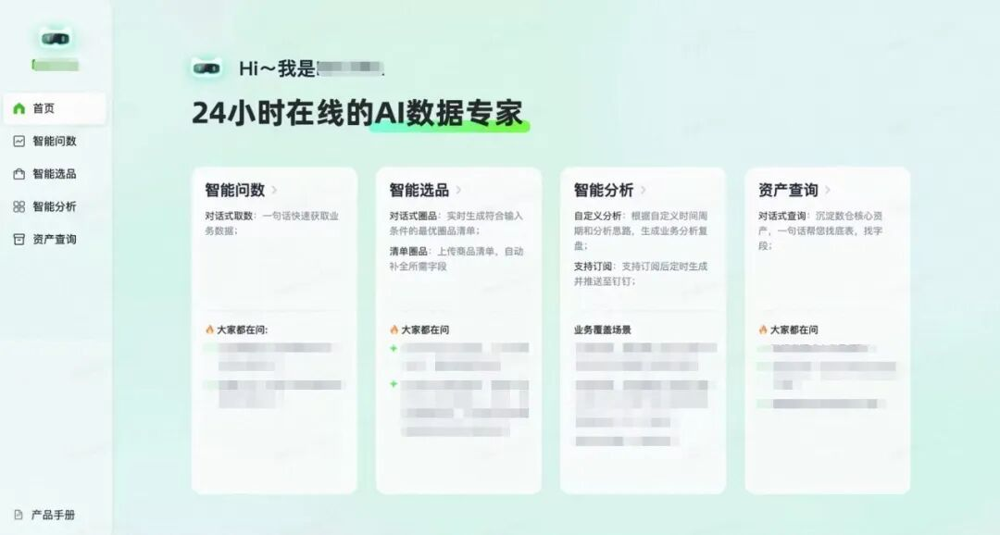
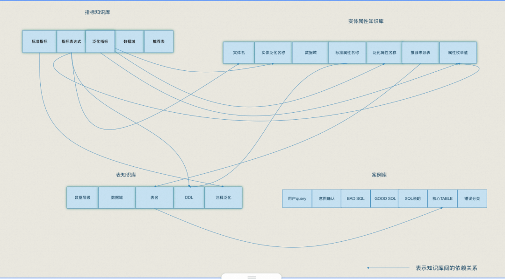
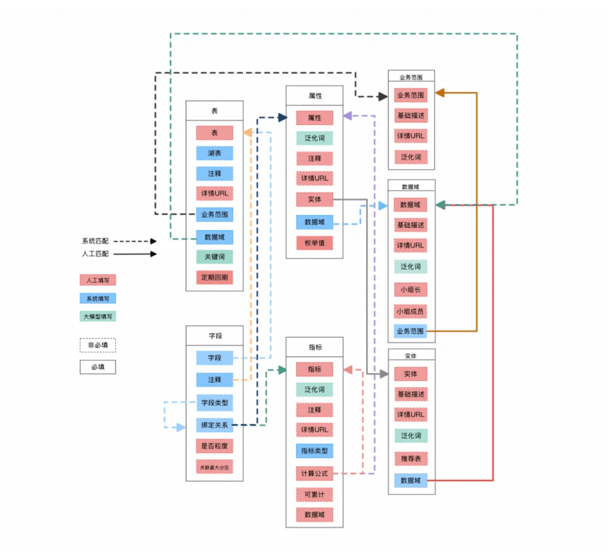
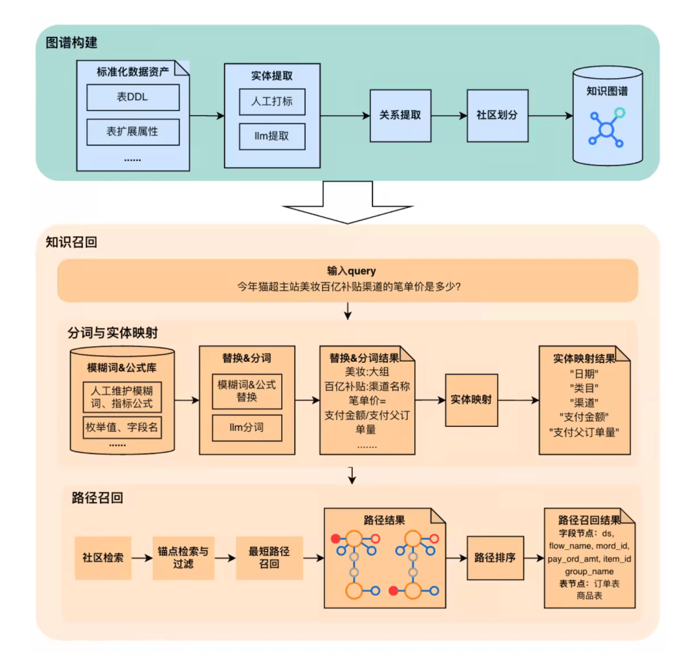
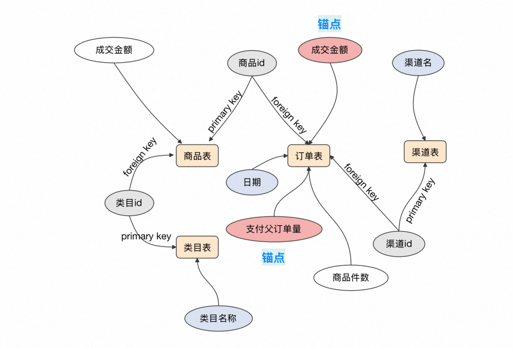
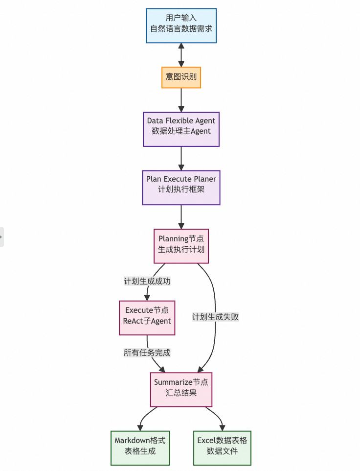

# 天猫超市数据AI实践总结

  

  

  

本文总结了在构建面向AI的数据知识库中的实践经验，针对数据资产庞杂、语义不统一、维护成本高等问题，提出以“不重构模型、小而精维护、支持灵活扩展”为原则，通过结构化构建指标、实体、属性、表和字段五类知识，并结合图谱召回与Agent框架，实现自然语言到SQL的智能取数。文章还介绍了从钉钉文档快速验证到产品化平台建设的演进过程，并展望了在准确性提升、知识保鲜和能力拓展等方面的未来方向。  

  

背景

  

近年来，人工智能技术正以快速的发展重塑各行各业。大模型(LLM)的突破性进展，使得自然语言理解、生成与推理能力显著提升，AI不再局限于图像识别或推荐系统，而是逐步向复杂决策和自主执行演进。在这一背景下，“Data Agent”成为企业智能化升级的一个探索方向。

  

▐  **1**.1 数据研发提效：历史积累带来的治理挑战

  

业务的数据资产历经十年建设，已形成规模庞大的数据体系：

- 累计沉淀 数万张表、近万个调度节点，其中核心保障任务约占30%+。
- 涵盖供应链、交易、日志、商品、直播等数据域。

然而，长期发展过程中也积累了诸多结构性问题：

- 规范问题：大量表字段与指标缺乏统一命名标准和清晰语义描述，存在“同名异义”和“异名同义”现象；
- 冷资产问题：因业务变迁、组织融合等原因，遗留了无人维护、低使用频率的“僵尸表”与过时口径；
- 逻辑口口相传：各域虽已逐步厘清内部数据模型，但关键业务知识（如指标口径、维度解释、依赖关系）仍散落在大数据平台脚本、报表系统、内部协作文档等非结构化载体中，缺乏统一归集与管理机制。

与此同时，数据研发团队需同时承担日常站点维护、高频数据答疑、临时取数支持及新需求开发等多重任务，导致精力分散，难以专注于核心模型建设和资产优化。

  

▐  1.2 AI的需求驱动：迈向智能取数的新范式

  

面向业务同学，日常工作中存在大量数据依赖型任务，例如手动汇总多系统数据（ERP、报表平台、线下表格）定期更新日报、周报、专项分析。当前这些工作普遍依赖人工操作，存在两大痛点：

- 人力成本高：重复性取数与整理耗费大量时间；
- 效率低下：跨系统取数流程繁琐，响应周期长；

在此背景下，我们启动 AI 项目 —— 一款 AI 数据助手，旨在通过自然语言交互实现“低门槛、高灵活性”的智能取数与分析服务，让AI能像专业的数据工程师、数据分析师一样，听懂业务问题、自动规划取数路径、生成并执行SQL并输出洞察结论，实现从“人找数”到“AI取数、分析、用数”的转变。

  

  

然而，一个高效、可靠的Data Agent离不开强大且结构化的知识支撑体系。没有高质量的知识库，AI难以准确理解语义、正确生成逻辑、稳定交付结果。

  

因此，构建一套面向 AI 的、可理解、可检索、可推理的 AI-知识库体系，已成为推动数据研发提效、赋能智能取数的核心基础设施。本文将以 AI 项目实践为基础，系统总结我们在知识库方案设计、内容构建、维护挑战、图谱召回及平台化落地等方面的探索与经验，旨在打造一个支持 Data Agent 高效运行的“数据认知中枢”。

  

知识库设计

  

▐  2.1 方案思考

  

- 维护方式

  

基于以上数据资产现状，在建设知识库时主要考虑以下三点：

- 不重构数据模型：数据资产太多，需求压力大，数研精力有限，无法面向AI重构数据模型，优先在知识库层面让LLM理解现有表设计。
- 知识库可拓展性：历史上未建设指标管理中心，而前期知识库结构、内容可能会面临不断调整、适配，需要一个灵活的知识库前期进行探索，通过钉钉表格、文档进行前期知识库维护。
- 知识库质量：数据资产质量参差不齐，不能全量维护，若对所有资产“一刀切”地纳入AI可用范围，将导致模型输入噪声大、推理结果不可信，筛选核心数据资产进行维护，从小而精致的知识库慢慢开始扩展。

这样可以通过较小的代价来维护面向AI的数据资产，对于初期LLM产品来说，这样可以牺牲一些全面性，但能提升准确性。

  

- 维护种类

  

一个好的知识库应该包括哪些信息？从数据研发工作角度来看，一个数据需求必须要明确以下内容才可以进行开发。

- 指标定义：包括指标的名称/公式/是否可加
- 数据粒度：数据的聚合粒度
- 数据范围：数据底表的范围，包括日期限制/业态限制/取数限制等

这些信息正好构成了书写SQL中必要信息，自然而然我们也分别构建指标（Metric Logic）/实体（Entity）/属性（Attribute）/表（Table）/字段（Columns）等知识库。

  

▐  2.2 设计细节

  

- 大图一览

  

  

- 内容构建
  
    

| 知识库 | 结构一览 | 设计原则 |
| --- | --- | --- |
| 业务范围 | 重点维护涉及业务范围的含义 | 1.极低频变更，业态的概念，比如业务A等，主要是用于声明表包含了什么业态的数据。 |
| 数据域 | 重点维护词根、数据域包含内容、主要业务过程和指标 | 1.极低频变更，在知识库中，负责数据域主要作用是划分后续用于维护具体知识和元数据的数据小组，用于后续知识库变更审批流程。 |
| 实体 | 重点维护标准定义和泛化定义 | 1.较低频变更数据，而在知识库中，实体主要划分属性信息，用于后续管理，非直接用于知识库。2.基于同语义的实体，定义出一个标准实体名和多个泛化实体名，多个泛化实体只会对应一个标准实体，例如供应商和商家为同一个含义，标准名称归一化为商家。 |
| 属性 | 重点维护标准定义和泛化定义，以及所属实体和枚举值 | 1.区别于数仓中的属性叫法，这里的属性既是实体的各种属性，也可以是数据分析中的维度。比如商品作为一个实体，商品ID，商品名称等都是实体的一个属性。2.对于标准属性名，基于同语义属性，定义出一个标准属性名和多个泛化属性名，多个泛化属性只会对应一个标准属性，例如买家ID和用户ID为同一个含义，标准名称归一化为用户ID |
| 指标 | 重点维护标准定义和泛化定义，以及计算公式 | 1.只包括原子指标+拓展指标， 而不包括衍生指标，例如维护支付金额，但不维护xxx大组的支付金额以及百亿补贴支付金额，通过LLM理解属性和指标交叉组合，来减少维护工作量。2.对于同语义的指标，我们选择最规范的一个中文指标名作为标准指标，其余指标名作为标准指标的泛化指标，例如标准名称为CTR，泛化名称为点击率，为同一个指标。 |
| 表 | 重点维护表的备注和关键词 | 1.表清单会作为图谱输入的标准化数据资产，用来构建表节点和节点间的路径边。2.表的元数据，包括数据域、表层级、表备注、表关键词等，这些信息是图谱路径召回以及生产SQL的核心参考依据。3.借助大模型和对表和字段，进行关键词提取和备注描述优化。 |
| 字段 | 重点将字段和标准定义进行绑定 | 1.结合人工维护、模型优化后的表备注、表关键词、标准名称进行改写DDL，仅知识库中的DDL会改写、标准化，和属性、指标的标准名称进行绑定。 |

  

知识库实践&效果

  

▐  3.1 知识构建

  

知识库构建经历了2个阶段，第一阶段是通过钉钉文档的方式进行快速维护&更新，主要是核心数据资产，并供给知识图谱和下游Agent使用，用于跑通POC案例，并在实践的过程中不断完善知识库的设计方案。随着下游应用场景的扩展，更多的数据资产需要通过知识库维护，同时知识库结构相对稳定，知识库逐渐走到了第二阶段——产品化建设。

  

- 3.1.1 前期钉钉文档

  

基于以上方案，结合元数据，对表、字段、指标等进行了评估和筛选，借助大模型能力对提取表、字段关键词并进行泛化，对DDL进行优化和标准化，构建知识库。以下为重点构建案例：

  

指标/实体/属性清单

| 标准名称 | 支付金额 | 供应商编码 |
| --- | --- | --- |
| 现状 | 英文字段：div_pay_amt、pay_ord_amt、scitm_pay_ord_amt、gmv等中文备注：成交金额、支付金额、GMV、成交规模 | 英文字段：supplier_code中文备注：商家编码、供应商编码、二级供应商等 |
| 泛化后 | 成交金额,GMV,gmv,支付GMV,成交GMV,支付金额,交易金额,子订单支付金额 | 供应商编码,商家编码,二级供应商编码,supplier_code |
| 实践效果 | 问GMV能正确找到对应字段 | 查找商家、供应商都能定位到商家维表 |

  

表和DDL

| 维护示例 | 交易明细表 | 场域汇总表 |
| --- | --- | --- |
| 表备注 | 描述清楚业务范围、数据内容、数据粒度、回刷策略、取数限制等信息 | 重点描述表的使用方法，交易指标需按照先按照order_id分组其他字段max，计算ipv需先按照user_id+item_id分组，其他字段取max等特殊用法说明。 |
| 关键词 | 拆组套交易明细 | 场域活动订单\|通道活动成交\|场域ipv\|用户商品ipv |
| DDL | 字段与标准指标和标准属性进行绑定，只绑定需要消费的字段，无关字段不维护，后续也不进去到图谱中 | 同理 |
| 实践效果 | 问GMV能正确理解表的使用方法 | 问百补GMV能理解通过场域表获取 |

  

- 3.1.2 正在产品化

  

痛点和挑战

在经历过S1的产品迭代知识库的结构已经相对稳定，同时维护过程中发现表DDL+人工修正的维护SOP中暴露出许多问题。以下从有效性、保鲜性、维护成本三个方面分析。  

1.有效性：知识库结构中需要同时维护 实体、属性、指标、表、DDL信息 五类知识，这些知识必须是可关联的信息才可以被大模型理解，否则问数任务在大模型执行中可能因某个知识无法与其他知识关联，扩大大模型幻觉的概率。
2.保鲜性：当表中维护的知识发生改变，需要依赖研发自发的修正其他知识中关联该变更的部分，如果不能及时修改，则知识库知识会失效。例如表实际DDL修改、表下线等问题。
3.维护成本：从知识库概览图中可以看发现，知识库中强依赖知识间的联动，因此每一次修改都需要联动修改很多绑定部分，并且知识库需避免冗余知识，冗余知识会显著增加模型推理相同问题的不确定性和时间，这不是问数所需要的，因此在人工维护的情况下，无疑是巨大维护成本。信息填充中大部分是简单且重复的工作，可被规则或者AI替代，却浪费大量的人时，仅仅维护一个域的4个中间层表，就需要研发2人时的精力，主要分为四种成本：
- 变更成本高：某一知识产生变更后，所有相关项需要手工扫描并更改。
- 扩展泛化词：为保证大模型理解用户问数中的维度和指标，并成功关联数据表的字段，需要人工填写多套可能的相似中英词组合。
- 唯一性校验：产生新知识后，需要人工扫描所有知识，以保证该知识与泛化词不会和历史所有的知识有重叠。
- 重复写入：新增了指标或者属性后，仍需要去DDL中将该标准知识重复维护在对应字段的备注中。

  

产品设计

为了知识库可以长期维护，知识库的管理工具从静态文档必须转为半自动化的平台能力，但考虑到团队主要投入业务需求、技术栈不匹配、QPS低，自研平台性价比低，因此通过与AI自然语言交互搭建了一套资产维护平台，研发中主要承担产品构思，而非工程落地，极大解放人时，同时具备极高的拓展性。平台功能如下图：

  

  

平台秉承着在保障知识准确的情况下，实现知识间尽量独立但强关联，且极大减少了研发人工操作，仅需要确认，实现了知识库的半自动化，有效解决了手工维护知识库中遇到的三种问题。

  

产品搭建

通过建知识库维护页面，同时支持启用数据库从而保存维护内容并可回流ODPS进行数据管理，页面功能点如下：

| 功能 | 描述 |
| --- | --- |
| 表 | 1.新增ODPS数据表，数据表格式：{项目名}.{表名}，系统会自动解析 表是否在ODPS中是否存在，以及根据表名解析 项目空间、数据层级、业务范围、数据域、注释，并自动填充其他输入框，研发进行验证，并确认该表是否定期回刷。2.研发必须输入项：仅ODPS表名 |
| 字段 | 1.作为知识光维护表是不够的，还需要维护表中的字段，进入到字段管理中2.配置字段中，正常流程中研发必须且仅需维护 是否粒度，告知这张表的主键。3.研发不需要完全维护这张表的所有字段，这张表最终也不会完全透出，透出范围仅由关联到 指标/维度的选项 清单范围决定。4.系统会自动 根据 字段名/字段备注（优先字段名）结合维护的知识库元数据，自动识别 具体的指标/维度，原则上，研发不需要自己进行操作，只需要确认。 |
| 业务范围 | 1.业务范围、基础描述、词根必填，业务范围是中文单词（比如xxx业务），基础描述应该是这个业务范围的实际经营范围，词根是中译英的单词缩写，也应当与 建表规范一致。 |
| 数据域 | 1.数据域是用于做 元数据信息负责任的归属。2.小组长就是数据域的归属，小组长下可以维护成员。后续所有数据域 关联的 知识和元数据变更都会将审批流程发到 小组长。 |
| 实体 | 1.实体名称、泛化名称 负责数据域 是必填项。2.实体名称和泛化词均会和系统里的历史记录进行重复校验。 |
| 属性 | 1.属性名、实体必填2.属性名称和泛化词均会和系统里的历史记录进行重复校验。3.属性枚举值 就是 属性应该保证的值（同属性名不允许出现两套枚举值标准）。这里的枚举值 会用于之后做 指标公式的校验、意图理解。 |
| 指标 | 1.指标名称、指标类型、计算公式、负责数据域必填2.指标名称和泛化词均会和系统里的历史记录进行重复校验。3.指标类型划分为简单指标和复合指标：a.简单指标适用于自身指标求和或单属性去重计算；简单指标是通过匹配属性/指标自动生成公式b.复合指标适用于其他所有指标；而复合指标只输入公式，系统自动校验公式是否符合语法，并识别属性/指标，如果发现不合法子字符串，则该公式会被打上无效标签，不会给到大模型 |

  

维护对比效果如下：

| 新老对比 | 钉钉文档 | 知识库平台 |
| --- | --- | --- |
| 有效性 | 在指标新增支付金额字段后，必须保证DDL中的pay_ord_amt的注释也叫支付金额，大模型才可以正确理解 | 平台中经过标准校验，只有唯一绑定知识的字段才会在透出给 大模型 |
| 保鲜性 | 因为钉钉文本是静态，所以表变更不会被及时监控到 | 消费数据平台的元数据，每一张表的DDL都定时重新解析，及时对DDL进行调整 |
| 维护成本 | 大模型需要的高质量知识，需要人工确保这四块知识包括关联的部分必须完全正确，存在大量判重校验/重复维护的问题 | 平台通过上图的产品设计，首先尽量减少重复输入，用关联替代输入。其次利用数据库查询和大模型文本生成的能力，泛化词生成和判重已经不需要人工写入。 |

  

▐  3.2 图谱构建

  

数据资产通常涉及大量的数据表及字段，传统的RAG方法存在一定局限性，例如：难以准确刻画多表之间的关联关系、易产生“幻觉表”（即不存在的表名或字段）、以及召回和推理过程的可解释性较弱。为提升管理和智能分析的能力，我们采用 GraphRAG 技术，通过构建结构化的知识图谱，全面表达和推理数据表与字段之间的关联关系，从而显著提高召回结果的准确性。

  

  

▐  3.3 图谱召回

  

在接收到用户查询后，首先对 query 进行分词和实体映射处理。借助模糊词库和公式库，识别并标准化 query 中的模糊表达与相关业务公式。例如，对于“今年美妆某场域的笔单价是多少？”这一问题，“美妆”可映射为标准实体名“大组名称”，“笔单价”可通过公式识别为“笔单价 = 支付金额 / 支付父订单量”。模糊词和公式替换完成后，再将分词结果映射到知识图谱中的标准实体上，得到目标实体集合。

  

获得实体集合后，下一步是从知识图谱中检索能够覆盖所有目标实体的最优路径。具体而言，首先依据业务意图确定检索的社区，然后针对涉及的每个实体名，确定搜索的锚点实体（通常为指标类实体）。锚点实体可能在多张表中存在，（如“支付金额”指标存在于订单、场域、商品等表中），因此需要结合用户的问题，基于节点所归属的数据表及相关属性进行筛选，选取 Top K 表中的核心节点作为锚点。以这些锚点为起点，搜索能够覆盖所有目标实体的最小子树（最短路径），并最终输出 Top K 的路径结果，每条路径包含若干连接在一起的表节点和实体节点。

  

  

▐  3.4 Agent框架

  

- 3.4.1 面临挑战

  

项目底层的算法能力尚未对基座模型进行Supervised Fine-Tuning，仅通过基座模型的编排和串联实现，这对于算法框架设计、知识库查询的速度和准确性、Prompt设计有更高的要求。在实现选品、问数、分析等多场景的NL2SQL的过程中，我们主要面临三个关键问题：

- 用户意图识别与数据表召回困难：如何准确理解用户的真实需求，并快速找到正确可用的数据底表。
- 自然语言映射SQL难题：如何把用户输入的自然语言，准确转换成数据库能执行的查询语句。
- 复杂任务执行风险：当需要处理多个数据表或复杂计算时，如何确保整个过程不出错。

  

针对上述问题，我们设计了三个核心模块来解决：

1. 意图识别+知识图谱模块：通过意图识别+知识图谱对用户问题进行精准识别，并召回对应数据表。
2. 搭建ReAct框架：ReAct框架通过提示词工程引导大模型进行分步推理（如识别字段映射、计算规则），并利用上下文验证机制对生成SQL的语法与语义进行双重校验。
3. 搭建Plan&Execute框架：利用Plan&Execute框架将任务拆解为原子子查询，使用任务调度器管理中间状态与依赖关系，优化任务拆解的准度与计算链路的执行效率。

  

- 3.4.2 方案设计

  

整体框架实现了从自然语言输入到数据输出的全链路过程，通过分层模块化设计（意图解析→执行规划→任务执行→结果输出）确保取数Agent的可扩展性和稳定性。

  

  

1\. 用户需求输入与意图解析，对用户输入进行意图识别解析，例如“今年大促期间某场域的GMV是多少？”，提取其中日期、场域以及计算指标并与用户二次确认。

2\. 取数核心流程

1. 核心Agent整合意图识别结果和知识库信息，启动Plan&Execute Planer框架。
2. Planning节点对任务生成生成分步执行计划（如先筛选时间范围，再关联区域表）。
3. Execute节点调用ReAct框架的子Agent对子任务进行执行。取数Agent中包括data\_collector与sql\_executor两个子Agent，分别负责数据收集与SQL生成。
4. 当检测执行异常时（如SQL语法错误/数据缺失），触发Replan节点进行重新规划。
5. 当所有子任务执行结束，启用Summarize节点，验证完整性后进入输出阶段。

3\. 输出形式

1. Markdown表格：适合前端展示。
2. Excel文件：包含完整数据集的可编辑文件。

  

▐  3.5 应用实践

  

- 3.5.1 资产查询：AI资产找表面面俱到

  

面向技术同学包括数开、数科、前后端技术同学等，8月上线并进行推广，累计问答数数千+，知识库范围内准确率85%+。

| 用户输入 | 模型返回 | 亮点说明 |
| --- | --- | --- |
| 货品交易并给出SQL代码 | 正确返回相应的货品交易表，并提供货品维度的成交SQL | 🌟定位单表正确🌟货品交易表取数限制正确、统计维度和指标正确->SQL正确 |
| 行业线维度的周转怎么获取 | 返回周转汇总表以及行业线配置表，并提供行业线维度的周转SQL | 🌟定位多表正确🌟库存表取数限制正确、关联逻辑正确、统计指标正确->SQL正确 |

  

- 3.5.2 智能问数：AI探索灵活取数新解法 

  

面向业务同学，8月上线并进行推广，累计问答数数千+，知识库范围内准确率75%+。

| 用户输入 | 模型返回： | 亮点说明 |
| --- | --- | --- |
| FYTD等多周期销量计划准确率分别多少？对比销量预测准确率达成多少？ |   | 🌟指标和现有看板数值一致🌟多个时间周期的值均有返回 |
| 我需要获取新业务场景8月全月采购小二维度的父订单数和子订单数，导出excel格式。 |   | 🌟新业务，维护一两条标签即可在问数取数🌟模型理解新业务识别逻辑🌟多表关联，正确找到小二mapping表 |

  

- 3.5.3 维护案例：开发提效

  

| 真实需求 | 传统开发流程 | AI流程 |
| --- | --- | --- |
| 需要在多个看板增加某品类，业务重点考核某品类的成交。 | 1.商品标签表增加某品类字段2.各个ADS增加某品类维度/某品类指标3.各个数据集、报表调整工时：多则4个人日，少则2个人日） | 1、知识库维护一条商品属性、图谱更新2、效果：支持场域、大盘等场景的某品类*各种指标的问数、取数 |

  

未来规划 

  

当前AI知识库已在指标理解、语义映射、基础召回等方面取得阶段性成果，初步支撑了自然语言取数场景的落地。但面对更复杂、多变、高精度的业务需求，我们仍处于“能用”的初级阶段，距离“好用、可信、自进化”的理想状态还有较大差距。未来，我们将围绕 准确性提升、知识持续保鲜、能力边界拓展 三大方向持续推进，打造一个更具智能性与生命力的知识基础设施。

  

▐  4.1 提升召回准确率：从“找得到”到“答得准”

  

当前AI在解析用户问题时，仍存在因语义歧义、别名覆盖不全、上下文缺失导致的误匹配现象，例如：

场景1：

- 用户输入：2025年7月的用户中，新客、老客分别的购买客单价和购买笔数是多少？同比2024年7月的数据是怎样的？
- 模型典型错误：认为新客、老客都是用户分层标签，但实际上纯新客不会在用户标签表(t-2)，关联不到的为纯新客，该特殊逻辑模型没有处理

场景2：

- 用户输入：最近1个月，UV表现最好的几个场域是什么
- 模型典型错误：场域表，一个订单会在多个场域里，需要去重计算

  

为此，下一步将重点提升知识库的语义表达能力和推理精度，我们在以下几个方向探索：

- 拓宽边界：建立案例库，收录高频、典型SQL模版以及解决方案；在BAD CASE复盘中，我们发现了一个现象,对于部分设计复杂的表，生成 SQL可用性会大大降低，这些案例通常会稳定复现，对于这类用法稍显特殊或者复杂的表，我们的解法是给出案例库，BY表给出一些典型的CASE SQL。当用户问到该类问题时，将案例SQL作为知识输入，辅助使用该表。
- 资产质量：知识库维护质量，从表、字段、指标、维度的维护质量、召回质量、回答质量进行建立打分机制，推动高质量的数据资产维护，避免“数据中毒”。

  

▐  4.2 实现知识保鲜：让知识库“活”起来

  

如今我们正在依托平台能力，搭建了简单的数据资产维护系统，但知识库的价值不仅在于“建得好”，更在于“跟得上”。业务迭代、表结构调整、口径变更频繁发生，若知识无法同步更新，AI输出的结果将迅速“过期”。目前我们对知识保鲜方面在以下几个方向探索：

- 事前：强化研发维护意识，将知识登记纳入关键交付节点（如需求上线、模型发布），提升团队主动维护意愿；
- 事中：当业务方提交新取数需求时，系统自动比对现有指标库，判断是否已有可复用口径；若发现“未建设”等问题，强制跳转至资产管理平台进行确认或注册；在研发流程中嵌入知识沉淀动作；
- 事后：建立多通道的知识更新触发机制，通过监听元数据变更事件（如ODPS表DDL修改、节点下线），触发告警并提示责任人更新知识库；
- 解析：借助线上代码以及大模型解析，实现知识自动补全。

  

团队介绍

  

本文共同作者，沐濯、麦堡、空水，来自淘天集团-自营技术团队。本团队支撑诸如天猫超市等全部淘天自营业务。依托淘宝APP亿级流量入口的核心购物场景，我们已经沉淀了一些Al时代研发、运营的基础设施。结合业务场景持续探索AI和前沿大数据技术，用更加高效的研发模式，构建高质量、及时、智能的数据应用。

  

  

  

**¤** **拓展阅读** **¤**

  

[3DXR技术](https://mp.weixin.qq.com/mp/appmsgalbum?__biz=MzAxNDEwNjk5OQ==&action=getalbum&album_id=2565944923443904512#wechat_redirect) | [终端技术](https://mp.weixin.qq.com/mp/appmsgalbum?__biz=MzAxNDEwNjk5OQ==&action=getalbum&album_id=1533906991218294785#wechat_redirect) | [音视频技术](https://mp.weixin.qq.com/mp/appmsgalbum?__biz=MzAxNDEwNjk5OQ==&action=getalbum&album_id=1592015847500414978#wechat_redirect)

[服务端技术](https://mp.weixin.qq.com/mp/appmsgalbum?__biz=MzAxNDEwNjk5OQ==&action=getalbum&album_id=1539610690070642689#wechat_redirect) | [技术质量](https://mp.weixin.qq.com/mp/appmsgalbum?__biz=MzAxNDEwNjk5OQ==&action=getalbum&album_id=2565883875634397185#wechat_redirect) | [数据算法](https://mp.weixin.qq.com/mp/appmsgalbum?__biz=MzAxNDEwNjk5OQ==&action=getalbum&album_id=1522425612282494977#wechat_redirect)
