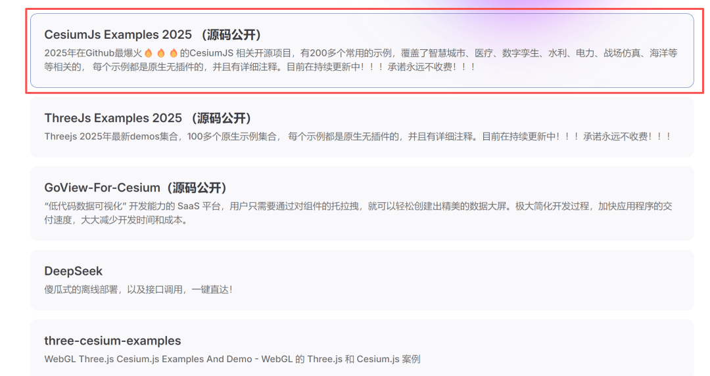

# 避雷这家公司！程序员把“讨薪横幅”放到官网上

当你打开一个汇集了 **200多个Cesium效果案例**和**100多个ThreeJS演示**的开源项目主页，正准备学习时，一个意外跳出的弹窗瞬间让屏幕前的空气凝固了——“**航天宏图，还我工资！**”

> 链接：https://jiawanlong.github.io

这个实用的开源项目本应是开发者分享技术的纯净之地。只需点击页面上的 **“CesiumJs Examples 2025（源码公开）”** ，这个刺眼的讨薪弹窗便会伴随着其他提示信息一同出现。它像一行不该出现的代码，将观者从虚拟的三维世界，一把拉回了充满褶皱的现实。

弹窗背后，是近一年来在GIS领域屡被讨论的**航天宏图**。公司的现状或许比许多人想象的更为艰难。根据其 2025年第三季度报告，公司前三季度营收同比暴跌**超70%**，净亏损达**约3.66亿元**。更关键的一击来自一纸处罚：因在军方采购项目中涉嫌违规，公司被**暂停全军采购资格三年**，这对于其核心业务的影响不言而喻。

> 季度报告：https://www.nbd.com.cn/articles/2025-10-30/4123984.html

> 被罚新闻：https://finance.sina.com.cn/jjxw/2025-11-05/doc-infwkiit2737607.shtml

尽管2025年8月曾传出签订近10亿元海外合同的转机，但公司很快澄清那仅为**意向协议**，落地与否充满变数。希望如昙花一现，紧随其后的，是社交媒体上越来越多的**裁员与讨薪**声浪。

> 出处：https://cj.sina.com.cn/articles/view/7935425109/1d8fcfa5502001ay96

如今，这声浪以最出人意料的方式，涌入了开源社区。一位开发者在倾注心血的技术作品中，埋下了这句无声却震耳欲聋的呐喊。那些精美的三维地球、流畅的交互效果，与这行简陋的白底黑字形成了残酷的对比。它不仅仅是一条讨薪信息，更是一个缩影——当一家明星公司步履蹒跚时，那些曾经为之贡献才华的个体，他们的生计与尊严，该何处安放？

优秀的代码没有换来应得的回报，技术的理想最终败给了现实的窘迫。这个弹窗弹出的，是一个开发者的无奈，或许也是一整个行业在寒冬中的丝丝凉意。

## 结语

我是林三心，一个待过**小型toG型外包公司、大型外包公司、小公司、潜力型创业公司、大公司**的作死型前端选手

我建了一些**前端学习群**，如果大家想进群交流前端知识，可以关注我，回复**加群**

