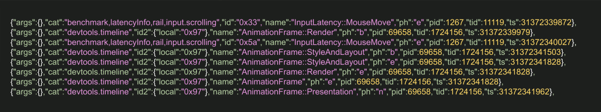
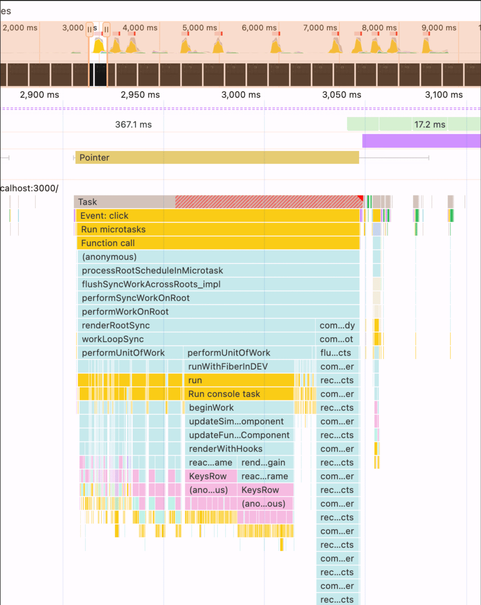
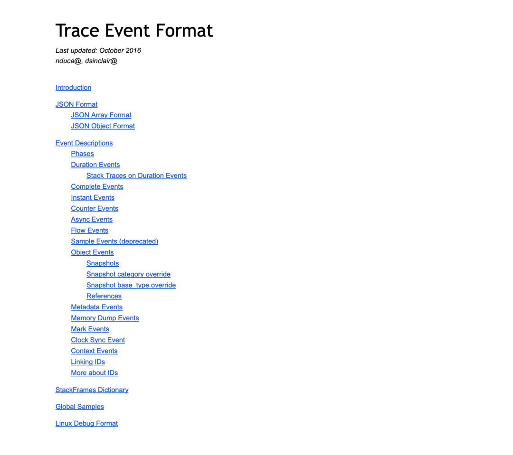
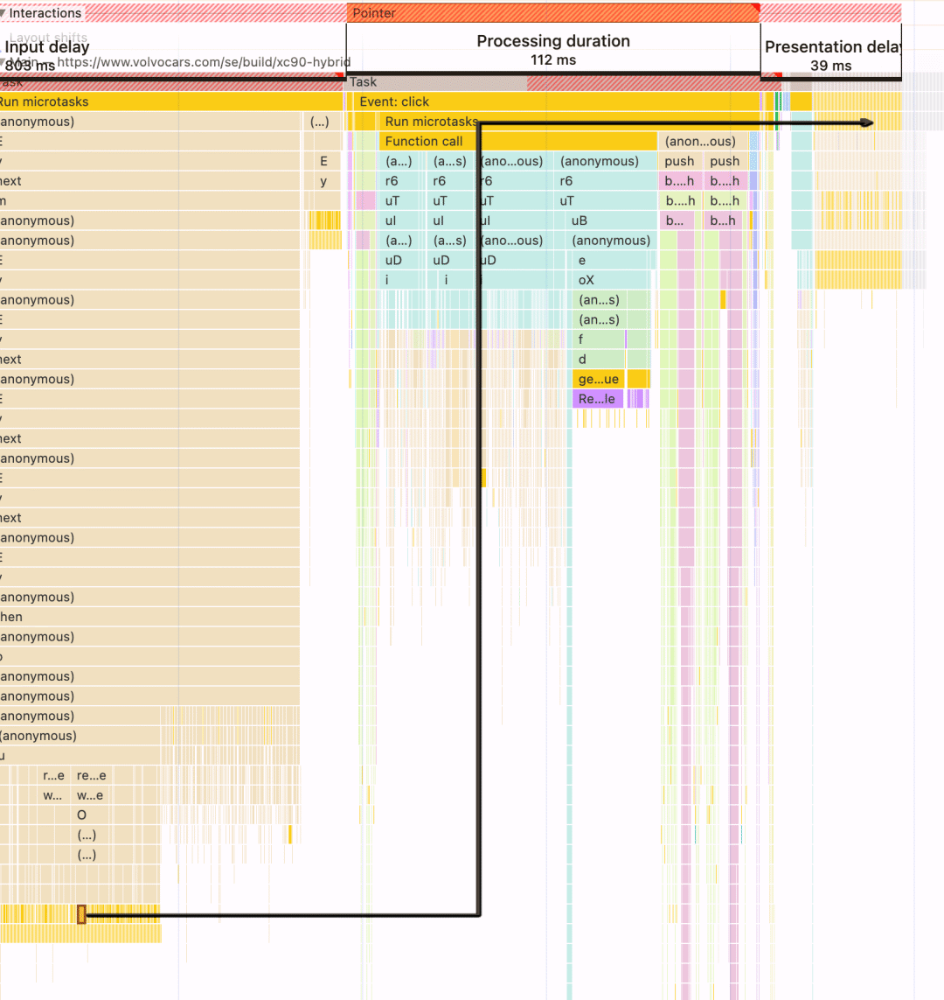
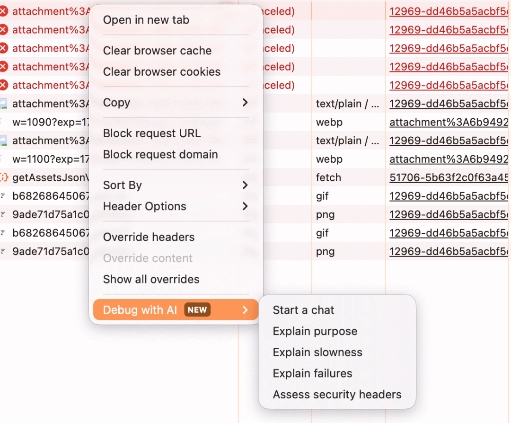
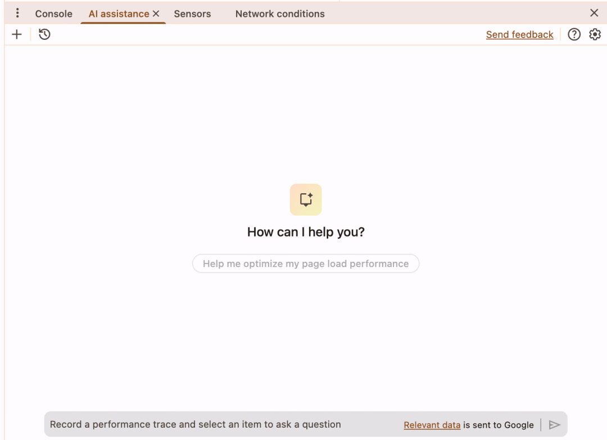
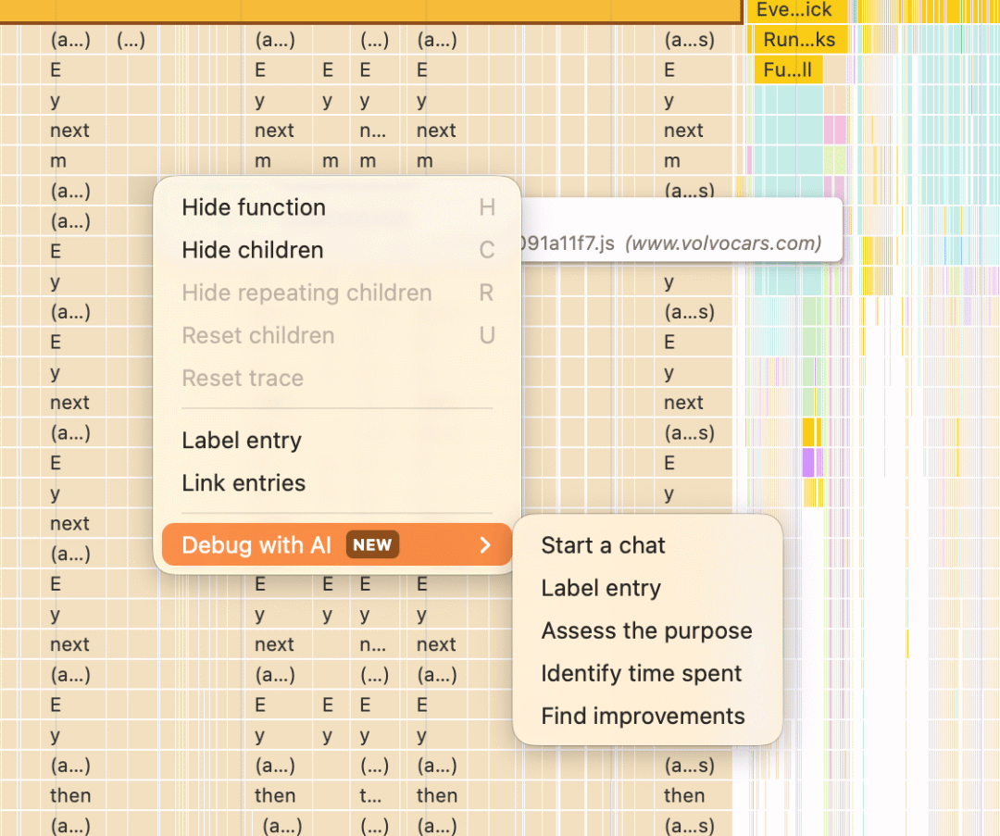
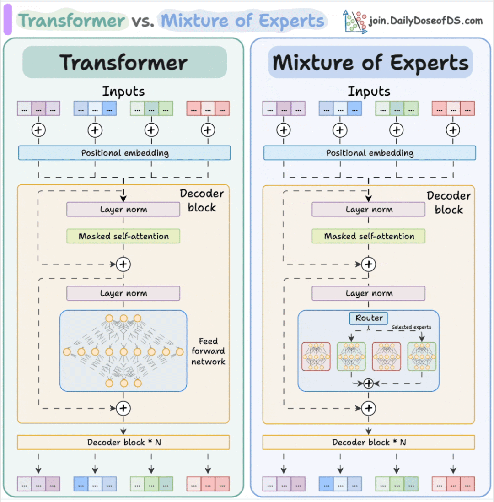
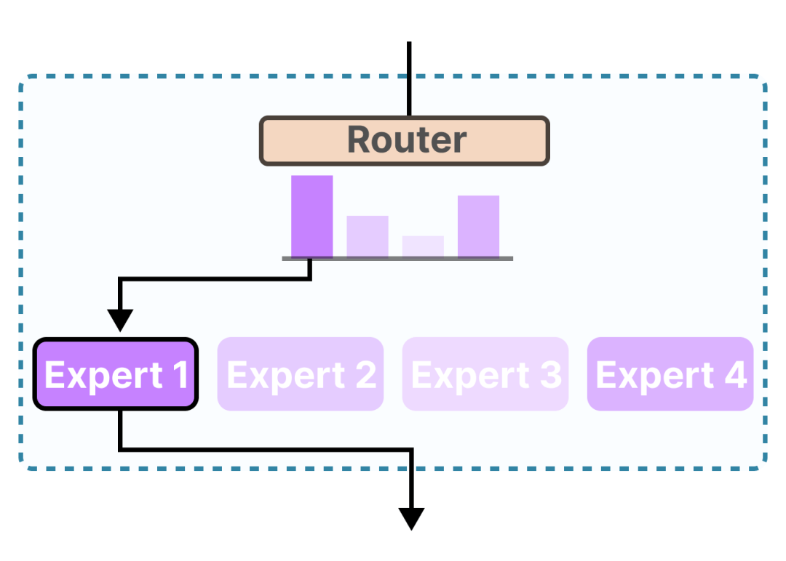

# 从 DevTools 到智能性能代理：用 AI 重塑前端性能分析的新方式

```js_darkmode__1
点击上方 程序员成长指北，关注公众号
回复1，加入高级Node交流群
```
讲述如何基于 Chrome DevTools 构建性能分析 AI 代理，利用追踪引擎、专家混合架构（MoE）与 MCP 协议，实现自动化性能洞察与智能开发工作流的探索之旅。

今日前端早读课文章由 @Vinicius Dallacqua 分享，@飘飘编译。

  

AI 现在几乎无处不在！

每家公司都在推出各种 AI 功能或智能代理，但很少有系统能真正理解复杂的性能数据。

这次分享将深入探讨我构建「性能 AI 助手」和基于 Chrome DevTools 分支的智能代理工作流的全过程。我们会探索一些非常实用的经验：如何让 DevTools 向 AI 传达性能数据；如何教会大语言模型（LLM）理解性能数据；哪些信号最重要；以及如何把遥测数据转化为由 LLM 生成的可执行洞察。

现在，关于 LLM 推理性能的衡量指标已经逐渐形成，比如每秒处理 Token 数（Tokens Per Second）和首个 Token 的生成时间（Time To First Token）。但这篇文章的重点并不是这些指标，而是带你走进幕后，看看作为一个对性能痴迷的工程师，我是如何基于 DevTools 内部机制，打造一个专注性能分析的 AI 智能代理的。这个过程让我更深入地研究了各种遥测数据的细节，并获得了全新的洞察：我们如何利用 AI 工具解决性能问题，同时也在探索 Web 平台未来可能的发展方向。

这件事我已经专注了整整一年半，现在就让我们开启这段精彩的旅程吧。

#### 从噪声到信号：追踪文件（Trace File）



原始追踪文件数据



在 DevTools 中可视化的追踪文件

看起来不像，但这两张图其实代表的是同一份数据。

在深入研究 DevTools 的源代码后，我开始真正体会到数据可视化的艺术。任何一个引人注目的图表背后，都隐藏着复杂的计算与处理。把庞杂的数据转化成清晰的可视化信息是一项艰难的工作，而我认为 DevTools 团队在这方面做得非常出色。

将原始数据转化为有价值的信息需要投入大量精力，而在座的每一位工程师，尤其是性能专家，其实都在从事类似的工作。

在这个领域，我们拥有最适合将这些可视化数据转化为洞察力的思维方式，但普通开发者往往难以理解或操作这些复杂的信息（比如性能面板 UI）。对他们来说，本应是信息的内容反而成了噪声，提炼洞察就变得非常困难。

自去年以来，Chrome 团队已经意识到这种「信号与噪声」的问题，并持续改进 DevTools 的可用性，让开发者更容易从中获取洞察。我非常欣喜地看到这一点 —— 入门门槛正在逐渐降低，DevTools 的易用性也在不断提升。

长期以来，我的个人目标一直是帮助不同公司更高效地进行性能优化，搭建分析流程与工具。但这些努力常常受到「信号与噪声不平衡」的影响 —— 各种仪表盘和外部工具反而增加了摩擦，削弱了最终的价值。

我多次观察到，不同水平的开发者在面对性能分析器展示的数据时，获得的洞察程度差异很大。这促使我创建了 PerfLab —— 一个试图弥合这种差距的实验项目。在对该初版分支进行实验并深入学习追踪文件后，我开始尝试构建自己的性能专用 AI 智能代理。它的目标是：借助 AI 理解上下文，探索与界面和数据交互的新方式，同时能自动提取洞察并识别追踪文件中隐藏的问题。

核心目标是大幅降低开发者和团队的使用门槛，并探索一种 “最小 UI” 风格的 DevTool。我还对 “根据任务逐步展示信息” 的交互模式（即生成式 UI）进行了实验 —— 因为在为智能代理设计时，我们不需要从一开始就展示所有界面，界面可以根据问题的复杂度 “渐进式” 地丰富。

不过，就像性能优化对开发者来说是一个难题一样，性能数据对 LLM 也并不友好。它们普遍缺乏分析能力，也缺乏理解遥测数据的深层知识，难以为真实应用提供真正有价值的洞察和可执行建议。

#### AI 智能代理如何 “读取” 追踪文件，以及这为何重要

也许在开始这段旅程之前，你和我一样，认为大语言模型（LLM）几乎能从任何文本或数据中提取有价值的信息。

虽然这在一定程度上是对的，但 LLM 并不擅长在缺乏上下文或训练数据的情况下，从复杂的数据中提取出有意义的洞察。而在处理 LLM 时，“上下文” 这个词几乎就是一切的关键。

如果我们想从一个追踪文件（trace file）中提取洞察，就必须先克服一个问题：它包含了海量的遥测数据，这些数据可用于各种分析和可视化（例如 DevTools 的性能时间线面板）。而 LLM 并没有针对这类数据进行过系统训练。即使抛开 “知识” 问题，如何处理如此庞大的数据量，本身也是构建智能代理时的巨大挑战。



上下文窗口可视化

首先，我们要面对的是 trace 文件中 JSON 的长度问题。追踪文件里包含了大量事件（events），每个事件都代表在录制期间发生的各种操作 —— 从交互到网络请求。每个事件又有多个属性，这些属性不断累积，导致每条记录都变得庞大。而当 LLM 读取和分析这些事件时，它会迅速消耗掉自己的上下文窗口。

记住，上下文是关键指标，这也是为什么许多 AI 工具会提供可视化或文本化的方式来帮助你监控这种 “AI 生命体征（AI Vital）”。

其次，每个事件内部还有一些 “隐藏的含义”。LLM 往往会试图根据既有知识去 “猜测” 这些意义 —— 而且它可能 “自信地猜错”。有些事件其实是嵌套事件的分组，这使得每个条目的理解更加复杂，也让整个事件结构更难解读。

举个例子，一个 AnimationFrame（动画帧）事件，它会有开始和结束两个事件来代表整个动画帧组。而在这个组中，还包含了描述动画每个细分阶段的事件。这些信息最终会被归因到性能面板中的某个交互行为，或者对应到 JS API 中的 LoAF（Long Animation Frame）条目。

但最关键的一点是：有些事件、指标和度量，是由多个跨时间段的事件组合而成的。



交互中的事件与呈现延迟归因

上图展示了交互中相关事件的关联。我们可以看到某个事件可能是另一个事件的 “触发者”，两者之间的时间跨度可能很大。这类事件的组合最终决定了一个指标的计算方式，比如 INP（Interaction to Next Paint），它由多个任务的度量共同组成，用来表示呈现延迟归因。

在早期研究阶段，我花了不少时间探索不同的模型架构，试图为 trace 文件中的数据建立预测和异常检测管线。我研究过从 图注意力网络（Graph Attention Networks） 到 Pyraformer 等模型，因为 trace 文件既是时间序列数据，也是层级结构数据。但由于这是我的业余项目，不是工作任务，我必须保持务实，主要使用已有模型来实验。既然主题是性能，我也不想在这里过多展开模型细节。

回到性能分析本身

我们的问题是：如何让智能代理理解追踪文件中的遥测数据？又该如何在当前模型的限制下有效地使用这些数据？

毕竟，即使是最大的 LLM，也有有限的上下文窗口。而且通常情况下，加入的内容越多，模型的性能和输出质量就越差。甚至在上下文窗口使用量达到 50% 之前，就可能出现明显的质量下降。

#### 一切都是数据

我们换个角度，从人类工程师的视角来看。一个性能工程师的工作（以最抽象、最简化的方式来说），就是分析遥测数据，从中得出洞察，并反馈问题与解决方案。理想情况下，这位工程师还会参与修复过程，形成紧密的迭代循环，确保优化方向一致。

要做好这件事，需要两方面的质量：一是知识储备，二是数据本身的质量。只有两者兼备，才能真正解决问题。

AI 代理的原理其实类似。它也需要通过上下文工程（context engineering）来把 “知识” 和 “遥测数据” 结合在一起 —— 只是方式是通过提示（prompting）和工具调用（tool calling）。

在 AI 系统中，一个主要的挑战是 —— 我们能放进提示中的信息有限。注意力机制的工作方式、上下文记忆的衰减、以及随着上下文增大质量下降等问题，都让我们必须精简输入。换句话说：上下文越聚焦，结果越好。

基于这个思路，我尝试把追踪文件的数据分段（segmentation），将其划分为不同的 “问题空间”，以便优化上下文并提升信息检索效率。这样我就能针对某一部分 trace 文件进行分析，而不是一次性把全部数据塞给模型。

我当然也可以让代理即兴地读取某些 trace 文件片段。如果你研究过 AI 系统，可能听说过 RAG（检索增强生成，Retrieval Augmented Generation）。RAG 通过语义搜索找出与问题最相关的内容，再将这些内容交给 LLM 生成答案。

但问题是：嵌入模型通常是在语义层面训练的，它们擅长理解自然语言，而不是性能追踪文件这种结构化数据。这意味着，它们在处理 trace 文件时，检索质量可能并不理想。

回想之前提到的第二、第三点 ——trace 文件的意义不仅分散在不同的事件序列中，还可能跨越不同时间点。有些事件相互关联，不能被孤立地分析。

因此，我必须想出一种新的方式，引导模型找到真正 “相关” 的部分，从而准确提取所需的遥测数据。

我不是开玩笑，这趟旅程真的够疯狂。

#### 追踪引擎与代理 “路由” 机制

让我们来深入看看支撑整个数据分析与洞察的 “引擎”。在构建 PerfLab 的早期阶段，我最先接触的 DevTools 代码之一就是它的 trace engine（追踪引擎）。这个核心模块负责解析追踪文件，并将其转换为结构化的输出，把不同类型的信息细分成多个子类别。这些类别包括性能洞察（insights）、交互事件（Interactions）、网络事件（Network events）等。



追踪引擎输出结构



追踪引擎分区类别



追踪引擎的洞察与关注领域

当我开始构建自己的性能代理时，trace engine 已经相当成熟，洞察结果也更具针对性。于是我提取了它的核心部分，并结合了 DevTools 内部较新的组件 —— 与 “Ask AI” 功能相关的模块，用来辅助我把部分追踪数据解析成可供代理使用的上下文信息（Context Engineering）。这样我就能更好地将追踪文件分类成结构化格式，方便 AI 代理调用。

不过，这也带来了一个问题：我现在在内存中有一个庞大的数据对象，代理需要知道在用户提出不同请求时，应该使用哪一部分。

##### 模仿 “专家混合模型”（Mixture of Experts, MoE）

那时我还在阅读论文，学习不同的模型架构，偶然接触到 MoE（专家混合）架构。这种架构通过一个 “路由器”（router）来选择合适的 “专家子网络”（expert subnetworks）进行激活。每个专家负责一部分训练数据，从而让模型能在更大范围内学习不同概念，同时提高效率 —— 因为每次请求只会触发少数几个专家。



MoE 架构图示



基于请求的路由选择流程

小型模型充当路由器，根据请求选择对应工作流

受到启发后，我尝试仿照这种方式：使用一个小型 LLM 充当 “路由器”，对用户请求进行简单的语义判断或意图分析，从而决定要调用哪个代理或工作流。

这样做有两个好处：

1. 我能把性能数据划分给不同的 “专用代理”，每个代理只关注自己的部分。
2. 信息检索更高效，因为每个代理都只从结构化输出的特定部分读取数据。

虽然我的实际实现只覆盖了少数几个目标与数据部分，但结果却非常有效。

##### 从工具到工作流

我尝试了多种库与框架的组合，从单独使用 AI SDK 到后来结合 Mastra 与 AI SDK 一起使用。原因在于，当时（AI SDK v4）编写代理的能力还相对有限。仅依靠 AI SDK 进行工具调用（tool calling）时，LLM 需要自己控制执行流程，而那时 LLM 在执行工具调用时往往表现不稳定，导致上下文管理变得复杂。我不得不让代理访问不同的工具来处理和序列化 trace engine 输出，过程繁琐且不稳定。

但由于分析追踪文件的步骤相对可预测且有固定顺序，我发现用 工作流（workflow） 来实现更合适。于是我让 “路由代理” 根据上下文将请求分配给合适的工作流与子代理，这样结果更稳定，也更容易维护。

#### 为性能数据构建上下文

如今在 DevTools 内部，已经存在多个针对不同遥测维度的内部代理，例如处理网络请求、调用树、性能洞察等。这种 “任务分区” 策略的好处显而易见：将复杂问题拆分为更小的子任务，让不同的子代理专注于不同部分，可以显著提升整体分析质量。

在我自己的实验中，我采用了类似的思路。我将性能代理拆分成多个子代理，并通过 Mastra 工作流 定义不同步骤来处理 trace engine 的输出。每个步骤都可以启动新的子代理去完成特定任务，也可以根据前一步的输出进行异步或条件分支处理。

这种 “专用代理” 策略让提示词（prompt）更聚焦，每个代理的目标更明确，从而获得更高质量的洞察。目标越宽泛，代理所需的引导和上下文越多，反而会占用更多上下文窗口，造成混乱、丢失信息甚至幻觉问题。

从某种程度上说，这与 DevTools MCP 服务器 与客户端代理之间的交互方式非常类似。DevTools 通过不同的工具与内部代理通信、驱动网页；而客户端的代理则负责根据上下文决定要调用哪个工具，并接收它返回的 “handover（交接）” 输出。

#### 使用 MCP 连接编码代理与性能洞察

现在我们来说说 MCP（Model Context Protocol）。相信你已经听说过这个协议 —— 它允许代理通过 HTTP 或 STDIO 进行远程工具调用，与外部服务或其他代理通信。

这为代理带来了新的可能性，也增加了复杂度。可能性在于：代理可以作为 “协调者”，把特定任务交给外部服务或远程代理去执行，并接收处理结果。

不过，复杂之处在于：这些工具调用同样会占用上下文窗口。如果调用过多，就可能让上下文 “被一千刀切死”。

使用 MCP，我们可以让开发代理（coding agents）连接到像 Sentry、Linear 等工具。而自 2023 年 9 月 23 日 起，DevTools 官方 MCP 服务器 也上线了！

这意味着代理现在可以直接通过 MCP 与 Chrome 实例通信，调试网页并提取性能洞察。借助 Chrome 内部的智能代理，我们可以让 DevTools 直接承担 “遥测采集与数据分析” 部分的任务，构建更强大的自动化开发与分析工作流。

与我最初的方案相比，这是一种更 “自主” 的模式：决策完全由协调代理负责，它根据当前上下文和工具描述自行判断该调用哪个工具。

在我的实验中，我构建了 DevTools 与 V0 的 MCP 客户端与服务器，并用 Claude Code 作为协调代理。我尝试让 MCP 驱动 V0 创建一个简单的 “玩具应用” 原型，再由 DevTools 进行性能分析，从沙盒链接中提取洞察，并把这些洞察反馈回 V0 进行修正与改进。虽然离 “可投产” 还差得远，但这些实验让我看到了一种令人兴奋的自动化模式 —— 一种能基于遥测数据进行 “方向修正（course correction）” 的工作方式。

##### 实用建议：聚焦上下文、明确目标

当你将 MCP 集成到开发流程中时，要注意：MCP 工具也会占用上下文窗口，因此和前面提到的优化原则一样，只激活当前任务所需的最小工具集。保持目标聚焦、节省 token 使用，是确保代理工作高效和输出质量的关键。

当你使用 AI 工具或代理来分析性能数据、生成洞察或优化开发流程时，请务必让任务目标清晰明确。  
要记住，你如何引导代理、它需要加载哪些数据进入上下文，都会直接影响输出效果。

一个重要提示是：保持会话结构清晰，聚焦核心任务。将调研与规划交给子代理，或者单独开一个会话来完成这些准备工作，并生成一个可供主代理引用的 Markdown 工件（artifact）。

#### “信任，但要验证”：你仍是循环中的专家

使用 AI 代理与工具确实能带来新的能力，加快工作节奏。但就像任何工具一样，想用好它们，需要了解并掌握它们的限制与技巧。

在我不断研究与实践的过程中，我越发明白一个事实：真正关键的环节，是使用这些工具的人。我们需要投入精力去确保目标一致、质量可靠，而最终的责任仍然在我们手中。

我坚信：AI 工具应被用来增强、加速、扩展我们的能力。至少，它为我们提供了一种新的实验方式，让我们以全新的角度去思考软件开发、自动化与创新。

但别忘了 —— 我们依然是 HITL（Human In The Loop） 中的 “H”。无论是发布代码还是生成分析报告，我们都必须亲自验证代理产出的内容与结果。

关于本文  
译者：@飘飘  
作者：@Vinicius Dallacqua  
原文：https://calendar.perfplanet.com/2025/teaching-agents-about-performance-insights/

  

Node 社群
