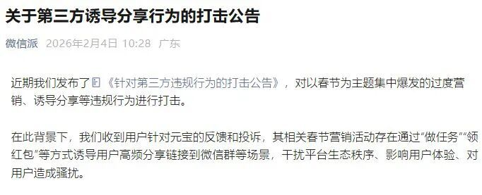
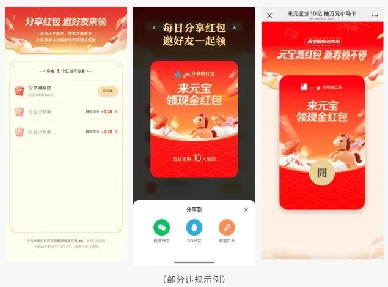
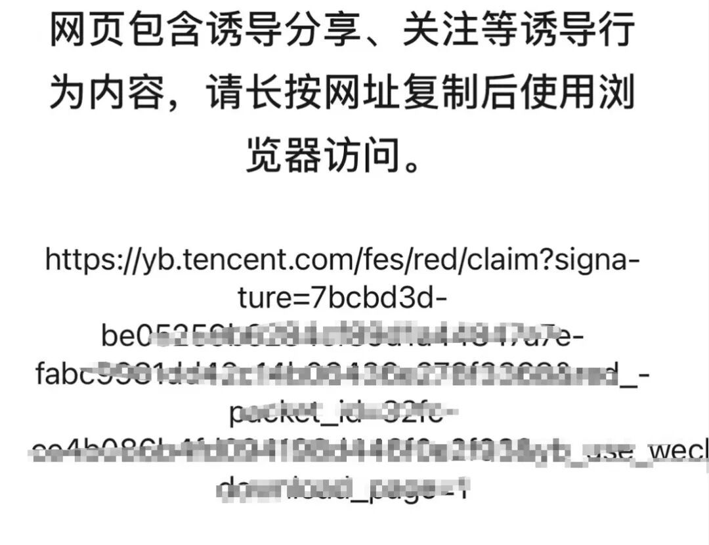
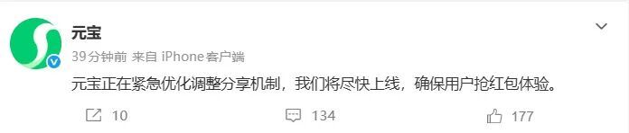
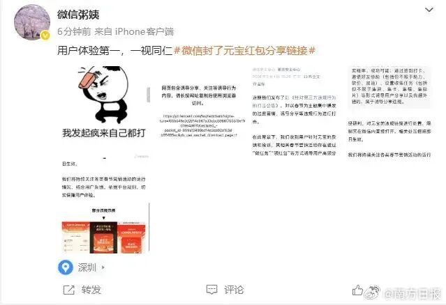

# 突发！微信把元宝“封了”，屏蔽了红包链接，官方紧急回应

微信出手屏蔽腾讯元宝红包链接！同系产品因诱导分享被限，官方直言用户体验至上  

2月1日，腾讯旗下AI应用元宝正式开启「分10亿」春节红包活动，凭借高额福利快速引爆用户参与度。活动设置的每日任务体系里，分享红包链接成为获取抽奖资格的核心操作，短时间内大量用户将链接转发至微信群，直接引发大规模刷屏，不少群聊被红包链接占据，正常沟通被严重干扰。

  
2月4日，微信官方账号「微信派」发布《关于第三方诱导分享行为的打击公告》，直指此次风波核心。公告明确表示，平台已收到大量用户反馈与投诉，元宝的春节营销活动，通过任务激励、红包返利等形式，诱导用户高频向微信群分发链接，破坏微信生态秩序、挤压正常使用体验，构成典型的分享骚扰违规。

  
依据《微信外部链接内容管理规范》，微信方面当即对元宝的违规分享链接执行处置，限制其在微信内直接打开。实测可见，微信群内点击元宝红包链接，会弹出风险提示：「网页包含诱导分享、关注等诱导行为内容，请长按网址复制后使用浏览器访问」，相关限制措施即刻生效，#微信屏蔽元宝红包链接# 话题也迅速冲上热搜榜单。

  
事件发酵后，@元宝 官方快速回应，称已启动紧急优化，将尽快调整分享机制，保障用户抢红包的正常体验。而微信公关总监「粥姨」则发文表态：用户体验第一，一视同仁，还配上「我发起疯来自己都打」的表情包，直白传递平台对违规行为零容忍的态度，即便同属腾讯体系，也绝不破例放行。

  
这场同体系内的规范处置，也让「平台生态与营销尺度」「大厂内部合规边界」成为热议焦点，你怎么看此次微信屏蔽自家兄弟产品链接的操作？
