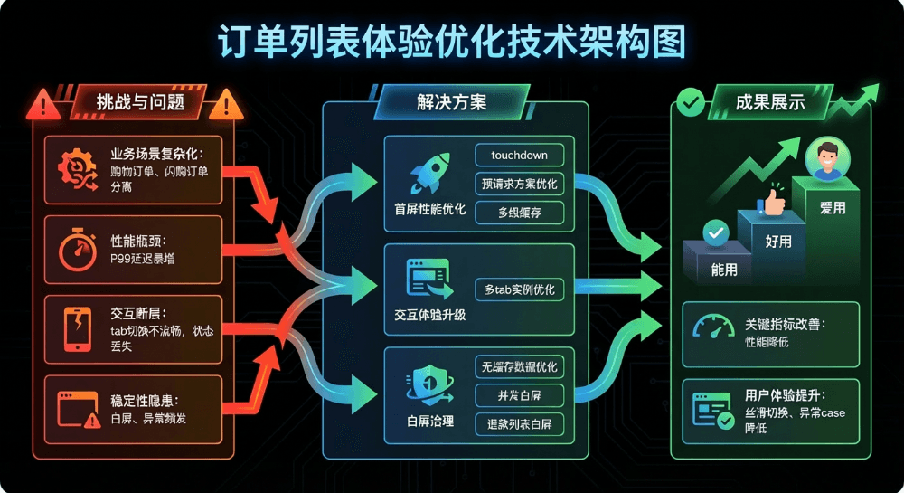
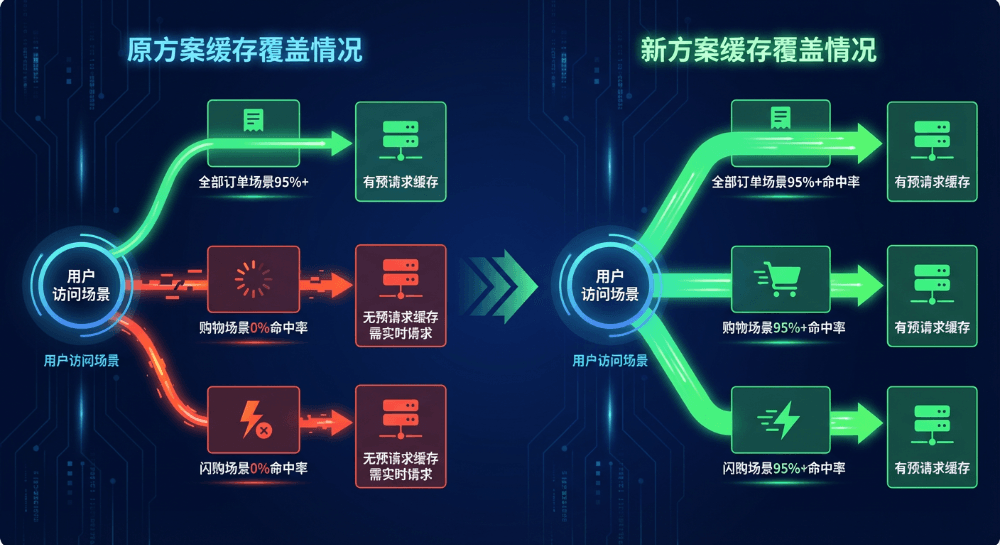
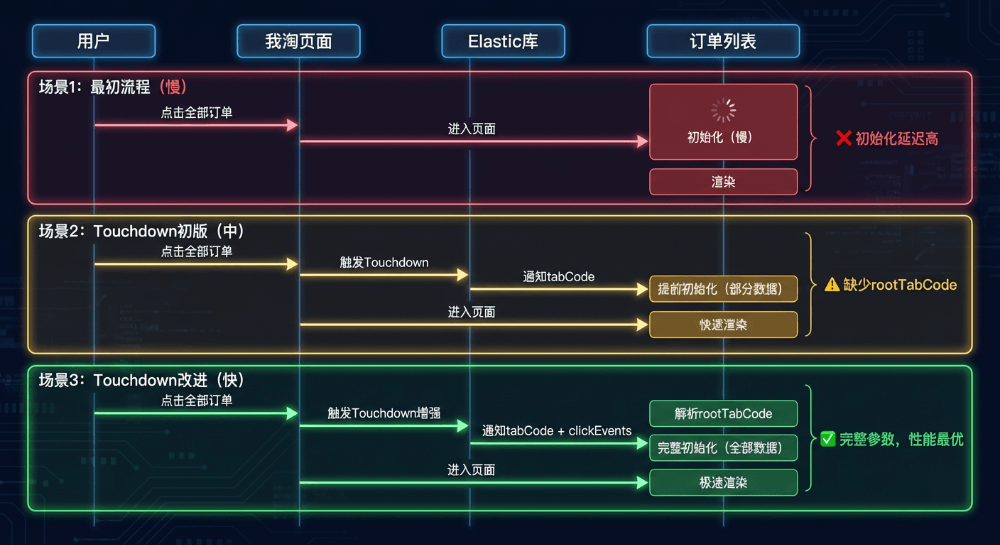
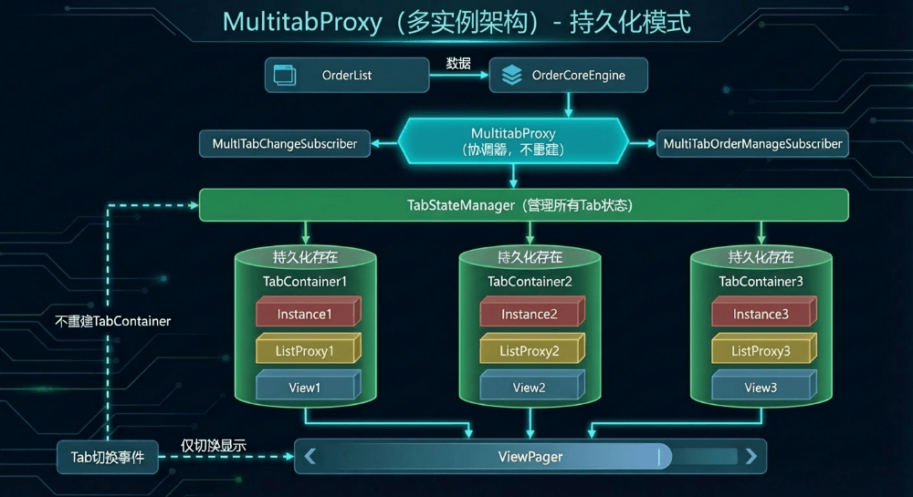
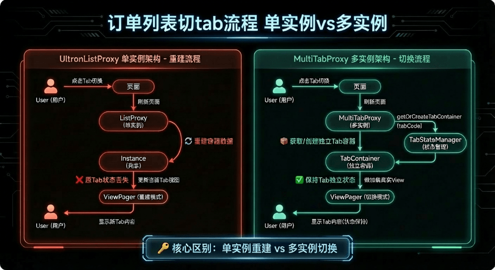
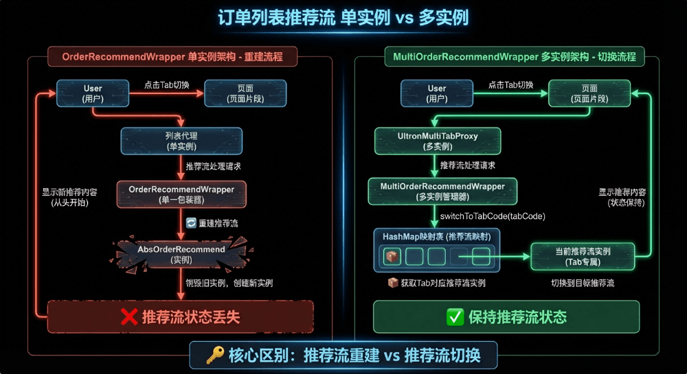
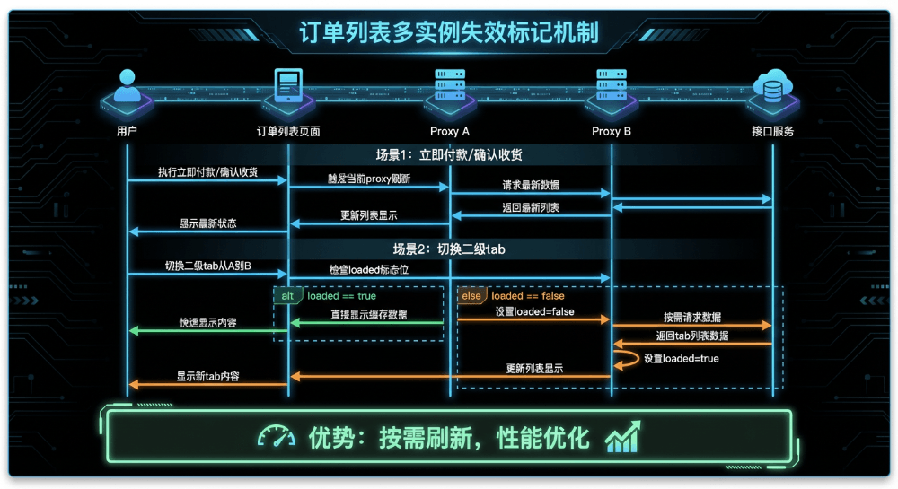
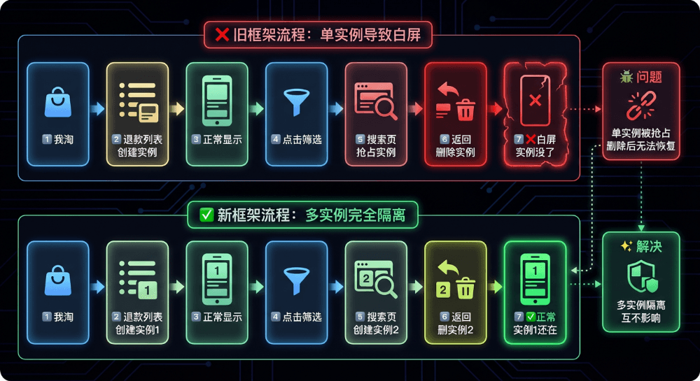

# 淘宝订单列表体验优化实践

  

  

  

本文系统介绍了电商平台订单列表在性能、交互和稳定性三方面的优化实践：通过双层预请求策略与多级缓存体系提升首屏加载速度；采用多实例架构实现 Tab 间状态保持与流畅切换；并通过缓存复用、并发控制和多实例管理等手段有效治理白屏问题。整体优化显著提升了缓存命中率、渲染性能和用户体验，为复杂业务场景下的体验升级提供了可复用的方法论。  

  

引言

  

在移动互联网时代，用户体验是产品成功的关键因素之一。作为电商平台的核心功能，订单列表承载着用户查看、管理订单的重要任务。随着业务的快速发展，订单列表面临着更多的挑战：业务场景日益复杂、技术架构持续演进、极致的性能与体验需求。

  

在这些挑战背后，我们发现了几个关键问题：首屏性能瓶颈（闪购分离后P99暴增）、交互体验断层（tab切换时页面体验不连贯）、白屏问题（边缘case白屏问题频发）。这些问题不仅影响了数亿用户的日常体验，也制约了业务的进一步发展。

  

本文将系统性地介绍我们针对订单列表进行的一系列优化实践，通过性能优化、体验升级和白屏治理三大方向，实现了订单列表从"能用"到"好用"再到"爱用"的质变。这些实践不仅显著提升了用户体验指标，也为类似复杂业务场景的技术优化提供了可复用的方法论。

  

整体优化架构

  

  

订单列表优化涉及多个维度的技术改进，我们将其划分为三大领域：首屏性能优化、交互体验升级和白屏问题治理。每个领域都有其特定的技术挑战和解决方案，但它们共同构成了一个完整的用户体验优化体系。

  

首屏性能优化

  

▐  **问题背景**

  

随着闪购业务的上线，订单列表新增一级tab类型，其包含了全部订单、购物、闪购、飞猪等等不同业务场景，支持根据用户的行动轨迹以及订单状态，通过算法首屏直达指定tab。然而原有的缓存和预请求机制只支持全部订单的场景，导致：

- 其他业务场景预请求机制失效，用户在非全部订单场景下体验到明显的加载延迟
- 订单列表整体缓存命中率下降明显
- 弱网环境下白屏时间延长，用户体验严重受损

  

▐  **技术方案**

  

- 双层遍历预请求策略

  

  

我们重构了预请求机制，从单层tab遍历升级为rootTabCode + tabCode的双层遍历策略：

核心实现包括：

- 动态配置：基于配置实时调整预请求策略
- 双重索引：同时支持 rootTabCode 和 tabCode 维度的预请求
- 智能缓存过滤：跳过已缓存的tab，减少不必要的请求
- 动态限流控制：通过配置控制最大预请求数，防止服务端压力过大

  

- 多级缓存体系

  

我们构建了三级缓存策略，提升缓存命中率：

多级缓存来源：

1. 默认：rootTabCode + tabCode 的策略读取
2. 历史兼容：all + tabCode 的策略读取
3. 兜底优化：当当前 rootTabCode 不存在的时候，通过读取all的缓存数据中的核心组件，保证除订单外的其他组件能快速展示，提升用户体验

  

- 我淘touchdown场景优化

  

根据来源去向图，当前订单列表页大部分的流量来源于我淘页面，所以从我淘进入订单列表的首屏优化是重中之重。

通过集成架构组Elastic库，我们实现了订单列表的预加载机制。当用户从我淘页面点击进入订单列表（Touchdown场景）时，系统会：

- 利用反射在路由前将参数传递给订单列表模块
- 接受并解析 rootTabCode 和 tabCode 参数
- 在导航阶段提前完成框架预热、缓存预取、动画准备
  
    

  

▐  **技术难点与效果**

  

技术难点：

- 双层遍历策略需要平衡预请求覆盖率和网络资源消耗
- 多级缓存需要处理缓存一致性、过期策略等复杂问题
- touchDown场景所需参数获取及提前初始化的框架制定

解决效果：

- 缓存命中率大幅上升
- 首屏渲染时间大幅减少

  

交互体验升级

  

▐  **问题背景**

  

原有的订单列表使用单实例架构（ ListProxy ），所有的订单列表二级tab同时只会存在一个实例，当tab切换时实例经历销毁->重建->配置参数->绑定viewPager->渲染的流程，这样的流程存在以下问题：

- 性能瓶颈：每次tab切换都需要重新构建整个页面容器
- 状态丢失：切换tab后，原tab的滚动位置、数据状态等会丢失
- 流畅度差：频繁的页面重建导致切换动画不够流畅
- 资源浪费：重复创建销毁 Instance ，消耗不必要的资源

  

▐  **多实例架构技术方案**

  

基于以上的问题，我们设计了 MultiTabProxy 多实例架构：

  

- 核心特点: 每个Tab拥有独立的 Instance
- 组件结构:
- MultiTabProxy 作为总协调器
- TabStateManager 管理所有Tab状态
- 每个 TabContainer 包含独立的 Instance + ListProxy
- 专门的多Tab事件订阅器
- 架构核心组件：
- MultiTabProxy：多tab的统一代理，协调各tab容器生命周期
- TabStateManager：管理每个tab的独立状态和生命周期
- TabContainer：封装单个tab的完整状态（ Instance、数据、视图等）

  

关键实现及效果：

- 懒加载机制：只在真正需要显示tab时才创建对应容器
- 动态ViewPager调整：支持根据协议数据动态调整页面数量
- 状态保持：各tab的滚动位置、数据状态得到有效保持
- 最终效果：切换tab时，使用复用的实例，保持实例的状态持续
  
    

  

▐  **现有能力兼容**

  

- 推荐流多实例问题处理

  

背景：

多tab实例架构对推荐流的原有架构产生了很大的影响，在单实例模式的情况下，由于只有一个实例，所以每次切换tab时，都会去重新构建一个推荐流的view加载到订单列表View上。

在多实例模式下每个tab都维护了一个独立的推荐流实例，其生命周期跟随tabContainer的生命周期，需要重建推荐流的架构确保推荐流View不会在切换tab时被异常复用和销毁

  

实现：

所以我们基于订单列表的多实例架构背景，开发了MultiOrderRecommendWrapper 

- 核心特点：每个Tab拥有独立的推荐流实例，通过HashMap映射表实现Tab级别的推荐流状态隔离和智能切换。
- 核心组件：
- MultiOrderRecommendWrapper：多Tab推荐流的统一管理器，协调各Tab推荐流的生命周期
- HashMap 映射表：管理每个Tab的独立推荐流实例和状态保持
- OrderRecommendWrapper 实例：封装单个Tab的完整推荐流状态（推荐数据、滚动位置、加载状态等）
- 最终效果：推荐流跟随当前的tab实例，保持独立可复用

  

  

- 失效标记机制

  

背景：

单实例架构下，例如在全部订单tab下立即付款、确认收货后，当前tab会立即刷新的，并且切换tab时，由于单实例架构的销毁重建机制，待付款列表自然也会拿到最新状态的数据。

但接入多实例架构后，当用户立即付款、确认收货并且tab切换后，由于实例的复用，所以默认是不刷新列表的，为了保证数据状态的一致性，需要引入失效标记机制。

  

实现：

- 每个proxy维护独立的loaded标志位，在切换tab时检查目标proxy的loaded状态，根据loaded状态决定是否需要重新加载数据。
- 当立即付款、确认收货等需要状态变更的回调触发时，给出了当前proxy外的别的proxy设置loaded=false的标记位，进行懒加载。

  

  

▐  **技术难点与效果**

  

技术难点：

- 多实例状态管理：需要设计合理的状态管理机制，确保各tab状态独立且可复用
- 架构兼容性：在不破坏现有功能的前提下实现架构升级，并支持通过灰度放量切流
- 资源平衡：懒加载策略需要在内存占用、首屏和响应速度之间找到平衡点

解决效果：

- 流畅度：切换tab不用重新渲染和发请求，切换流畅度大幅提升
- 状态保持：用户在不同tab间切换后，原有浏览位置得到保持

  

改动前：每次切换tab都会重新loading

改动后：切换tab不用重新渲染和发请求

  

白屏问题治理

  

▐  **无缓存数据渲染优化**

  

问题背景

订单列表在无缓存数据命中时，会只有订单tab这个原生组件渲染，其他动态核心组件无法渲染，这会导致白屏区域过大，用户的体验比较割裂。

技术方案

基于以上问题，我们修改了缓存数据获取机制：

1. 新缓存数据：尝试获取当前rootTabCode+tabCode的缓存数据
2. 旧缓存数据：若未命中，尝试获取"all"+tabCode的缓存数据
3. 复用其他tab缓存数据：通过协议裁剪技术，获取其他tab缓存数据的核心组件，经过数据处理和替换后，保证当前tab渲染正确

  

▐  **并发请求列表白屏**

  

问题背景

在订单列表，当用户进行快速操作（如频繁切换Tab、快速刷新）并且叠加上网络环境较差时，会出现页面空白显示的异常情况。其根本原因是多个并发网络请求导致生命周期管理出现问题，渲染了空白数据。

技术方案

我们采用被动防御策略，通过添加保护性检查避免异常：

解决效果

改动前，快速下拉刷新或者切换tab会有空白态

改动后                                         

  

▐  **退款列表白屏问题修复**

  

问题背景

退款列表tab下点击订单筛选，筛选后返回退款列表出现白屏或无法交互。问题根源在于退款列表预热框架为单实例的。

1. 退款列表预热：从我淘进入退款列表时，启用退款列表weex2框架的异步预热。
2. 实例复用问题：订单搜索结果页的逻辑复用了订单列表页的实现。
3. 销毁时机错误：退出订单搜索结果页时，预热的退款列表由于是单实例的被销毁。
4. 返回阶段：返回退款列表时，发现实例已被销毁，但没有重新创建机制，导致白屏。

  

技术方案

基于上述问题，我们设计了多实例管理架构：

  

解决效果

根本解决实例销毁冲突问题

保持预热性能优化效果

支持灰度发布和快速回滚

  

总结与展望

  

▐  **技术成果总结**

  

通过系统性的优化，订单列表在多个维度取得了显著提升：

- 性能指标：缓存命中率大幅提升，首屏渲染时间大幅减少
- 稳定性指标：页面空白发生率大大降低
- 架构价值：多实例的架构解决了tab状态管理难题，提升了用户体验

  

▐  **展望**

  

- 体验与性能平衡：随着多tab架构的全面升级，我们在获得状态保持、流畅切换等体验提升的同时，也面临着新的技术挑战。架构重构带来了首屏性能的阶段性上涨，这提醒我们必须在技术创新与用户体验之间寻找最佳平衡点，不能为了一部分的体验去牺牲另一部分的体验。
- 体验优化无止境：当前的体验优化项主要依赖首屏性能数据以及用户舆情反馈，这是一种被动响应式的优化模式，未来我们需要构建更加系统化、前瞻性的用户体验度量体系，转被动为主动，进一步提升产品体验。

  

团队介绍

  

本文作者悠二，来自淘天集团-基础交易终端团队。一支专注于手淘APP交易域（购物车、下单、订单、物流等）业务研发和体验优化的技术团队。在丰富的业务场景下，我们通过持续的技术探索、不断的创新突破，给数亿用户提供极致可靠的交易保障、极致流畅的操作交互以及极致顺滑的购物体验。

  

  

  

**¤** **拓展阅读** **¤**

  

[3DXR技术](https://mp.weixin.qq.com/mp/appmsgalbum?__biz=MzAxNDEwNjk5OQ==&action=getalbum&album_id=2565944923443904512#wechat_redirect) | [终端技术](https://mp.weixin.qq.com/mp/appmsgalbum?__biz=MzAxNDEwNjk5OQ==&action=getalbum&album_id=1533906991218294785#wechat_redirect) | [音视频技术](https://mp.weixin.qq.com/mp/appmsgalbum?__biz=MzAxNDEwNjk5OQ==&action=getalbum&album_id=1592015847500414978#wechat_redirect)

[服务端技术](https://mp.weixin.qq.com/mp/appmsgalbum?__biz=MzAxNDEwNjk5OQ==&action=getalbum&album_id=1539610690070642689#wechat_redirect) | [技术质量](https://mp.weixin.qq.com/mp/appmsgalbum?__biz=MzAxNDEwNjk5OQ==&action=getalbum&album_id=2565883875634397185#wechat_redirect) | [数据算法](https://mp.weixin.qq.com/mp/appmsgalbum?__biz=MzAxNDEwNjk5OQ==&action=getalbum&album_id=1522425612282494977#wechat_redirect)
