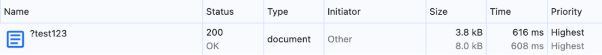
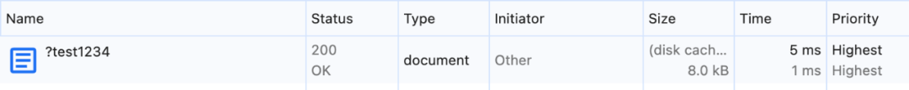

# No-Vary-Search：用一个新 HTTP 头拯救你的缓存性能！

点击上方 程序员成长指北，关注公众号

回复1，加入高级Node交流群

  

探讨了 URL 参数对网页性能的负面影响，特别是如何通过新的 HTTP 响应头 No-Vary-Search 来解决因 URL 参数导致的缓存问题，从而提升网页性能和用户体验。

今日前端早读课文章由 @Barry Pollard 分享，@飘飘编译。

译文从这开始～～

两页之间的故事……

这两页有什么不同呢？

- https://www.example.com/
- https://www.example.com/?utm\_source=email

乍一看，URL 不一样，但很多人会猜到，这里的 `utm_source` 这样的查询参数（也叫 “URL 参数” 或 “搜索参数”）其实并不会影响页面的内容，而是用来做数据分析或流量追踪的。所以这两个页面的内容很可能是完全一样的。

那再看看这两个页面：

- https://www.example.com/products?productid=1234
- https://www.example.com/products?productid=5678

这里就很明显了，这两个页面大概会展示不同的商品详情。

可见，并不是所有的查询参数都会导致内容变化。

实际上情况还更复杂 —— 因为有时候，即便两个页面最终展示的内容不一样，它们最初返回的 HTML 文件也可能完全相同。对于客户端渲染（CSR）的网站来说，初始 HTML 通常非常简洁，具体内容是由 JavaScript 再去请求并渲染的。

那为什么这是个问题呢？

#### URL 参数是缓存的 “天敌”

最大的问题在于：我们没办法确定一个 URL 的内容是否会因为参数不同而变化。所以默认情况下，缓存系统只能假定它们的内容不一样。

这就很糟糕了 —— 因为缓存是提升网站性能最关键的手段之一。也许你会想：“既然内容一样，那用户也不该访问两次同一个页面呀？”

问题就在于下面这些情境：

##### 情境 1

你点击了一封邮件中的链接访问网站主页，这个链接带有追踪参数，例如：  
`https://www.example.com/?utm_source=email`。

然后你在网站里随便逛了几页。过一会儿，你又点回网站的主页（比如左上角那个带 logo 的主页按钮）。

可是浏览器认为你之前访问的带 `utm_source=email` 的 URL 和现在这个没参数的主页不是同一个页面，所以会重新加载一次。结果你又等了一次没必要的页面加载，还浪费了存储空间。你内心默默流下了泪水。 😢

##### 情境 2

你运营着一个小博客，每天只有一两位访客。服务器配置不高，但你在前面加了一个免费的 CDN 来防止被攻击。

有一天，你写了一篇特别精彩的文章。结果火了，被 Hacker News、社交媒体、各种新闻简报到处转发。

可是每个来源都加了不同的 UTM 参数。于是 CDN 认为这些都是不同的页面，无法使用缓存，所有请求都打到了你的小服务器上。

服务器崩溃了。你又哭了。 😢

##### 情境 3

你运营着一个大型电商平台。这次你有大服务器和配置良好的 CDN。

但到了黑五或网络星期一，流量暴涨。各种追踪参数、联盟参数层出不穷，有的甚至没有被正确清理。

结果，CDN 无法缓存这些带参数的页面，所有请求都直接打到源服务器。你的服务器被压垮。你再次流泪。 😭

即便网站没崩，也会浪费大量的网络带宽和计算资源，只为了重复请求相同的内容。

#### 许多 URL 参数其实并不会改变内容

如今页面中常见的客户端追踪参数非常多，从分析工具的 UTM 参数，到广告点击追踪参数，应有尽有。这些参数通常由页面中的 JavaScript 读取，用来统计广告或分析数据，而不是决定页面内容。

换句话说，带或不带这些参数，页面展示的内容其实完全一样，只是 JavaScript 会读取这些参数用于追踪。

这种情况太常见了，比如下面这些参数：

- utm\_source
- utm\_medium
- utm\_campaign
- utm\_term
- utm\_content
- gclid
- fbclid
- msclkid

其实远不止这些，数量多到数不过来。新的参数还在不断出现，有时甚至会导致性能下降。

不过，幸运的是 —— 事情并非无可挽回。

#### CDN 早就意识到这个问题了

许多 CDN 都允许你进行设置，让它们在缓存时忽略 URL 查询参数（query params），从而直接从边缘缓存中返回相同的内容，而不必请求源服务器。

不过 —— 这种设置通常不是默认开启的，需要手动配置，而且不同 CDN 的支持程度也不一样。

你可以选择：

- 忽略所有查询参数（简单粗暴，但如果你的应用确实依赖某些参数，就会出问题）；
- 忽略常见的参数（比如前面提到的那几个 utm 参数）；
- 或者设置更复杂的自定义规则。

这些方案都比较零散、非标准化。

更重要的是，这只是问题的一部分。即使 CDN 做了缓存，用户仍然会重复请求那些本质上相同的资源。  
虽然 CDN 会让页面重新获取的速度更快，但仍然比理想情况慢，还会让浏览器缓存里充斥大量重复内容。

更别提当网站使用多个 CDN 或代理服务器时，事情会变得更复杂。

#### 一个标准化的解决方案

显然，我们需要一种比这些自定义方案更好、更标准的方法。Google 的一些聪明工程师也意识到了这一点，并开始研究解决方案。

其实，这并不是什么新问题，它和另一个老问题很相似。

服务器经常会根据浏览器的能力提供不同的内容。一个常见的例子是图片 CDN，比如当你请求：  
`https://images.example.com/hero.png?auto=format`，服务器会根据浏览器在 HTTP 请求头里的 `Accept` 信息，返回浏览器支持的图片格式（WebP、AVIF、JXL 等）。

但是，这也带来了缓存问题 —— 因为虽然 URL 看起来一样，但实际返回的文件类型不同。

为了解决这个问题，服务器会在响应中添加一个 `Vary` HTTP 响应头，告诉缓存系统：这个内容会根据特定的请求头变化（比如 `Accept`）。

缓存系统就会根据不同的请求头存储多个版本，确保每个浏览器都拿到自己支持的格式。

而我们现在要解决的问题与此类似，不过方向相反：

我们不是要告诉缓存 “内容可能会变化”，而是要告诉它 “内容不会变化”。

而且，这次不是基于请求头，而是基于 URL 参数（即搜索参数）。

于是，一个新的 HTTP 响应头诞生了：

👉 **No-Vary-Search**。

它的作用是：让服务器告诉缓存系统，哪些查询参数会影响内容，哪些不会。

有趣的是，这个机制最初来自 Chrome 的 “Speculation Rules” 项目。那时 Chrome 团队希望浏览器在进行页面预测加载时，能识别出那些虽然 URL 不同、但实际上是同一个页面的情况。后来发现这个机制太有用，于是把它推广到更广泛的 HTTP 标准中，由 IETF 进行标准化。

#### No-Vary-Search 是怎么工作的？

和 `Vary` 响应头类似，服务器可以通过在响应中添加 `No-Vary-Search` 来说明细节。

##### 1\. 忽略参数顺序（key-order）

```
 No-Vary-Search: key-order
```
这意味着以下两个 URL 会被认为是同一个内容：

```
 https://www.example.com/?param1=1&param2=5
 https://www.example.com/?param2=5&param1=1
```
当然，参数的值必须一致；如果参数不同，那仍然是不同的页面。在实际开发中，很少有网站内容会依赖参数的顺序（而且这么做其实是个坏习惯），所以这个指令几乎可以放心使用。

##### 2\. 忽略所有参数（params）

```
 No-Vary-Search: params
```
这表示所有带不同参数的 URL 都被认为是同一个内容，比如：

```
 https://www.example.com
 https://www.example.com/?utm_source=email
 https://www.example.com/?utm_campaign=winter2025
 https://www.example.com/?utm_source=email&utm_campaign=winter2025
 https://www.example.com/?utm_campaign=winter2025&utm_source=email
 https://www.example.com/?barry=pollard
```
这些都会被当作相同页面（前提是主路径一致，例如 `/`）。但如果路径不同，比如 `https://www.example.com/page?utm_source=email`，那就不会匹配。

##### 3\. 忽略特定参数

```
 No-Vary-Search: params=("utm_campaign" "utm_source")
```
这样，只会忽略指定的参数。上面的几个带 `utm_` 的 URL 会被认为是同一页面，但 `https://www.example.com/?barry=pollard` 会被视为不同页面。

当然，在实际应用中，你可能会列出更多常见的追踪参数，比如所有五个 utm 参数和其他分析参数。

⚠️ 注意：  
No-Vary-Search 是一个 HTTP 结构化头（Structured Header），所以参数名要用引号包裹、用空格分隔，不要误用逗号（不少语言里习惯用逗号分隔）。

##### 4\. 指定例外参数（except params）

你还可以反过来定义：默认忽略所有参数，除了某些关键参数。

```
 No-Vary-Search: params, except=("q" "productid")
```
这表示以下 URL 都被认为是相同内容：

```
 https://www.example.com/?productid=1234
 https://www.example.com/?productid=1234&utm_source=email
 https://www.example.com/?utm_source=email&productid=1234
 https://www.example.com/?productid=1234&othertracker=email
 https://www.example.com/?utm_source=email&productid=1234&utm_campaign=winter2025
```
但如果 `productid` 或 `q` 的值不同，那就会被认为是不同的页面。

#### No-Vary-Search 支持情况

好消息和坏消息都有。坏消息是：这个功能还非常新，目前支持得不太广泛。我问过几位在 CDN 公司工作的朋友，他们表示确实有兴趣支持它，但目前还没有正式的公开声明。

好消息是 \* Chrome 已经开始支持！从桌面版 Chrome 141 开始支持，Android 版 Chrome 144 也即将上线。之后，这个功能也会陆续扩展到其他基于 Chromium 的浏览器中。

至于其他浏览器，目前还没有明确消息。有些浏览器的开发讨论还混杂在它最初的 “Speculation Rules（页面预测加载规则）” 用例中。不过至少 Firefox 已经建立了跟进的追踪 bug，说明他们在关注。

#### 如何使用 No-Vary-Search

虽然现在支持范围还不算广，但 Chrome 的市场份额足够大，而且添加这个 HTTP 头几乎没有副作用，因此完全值得提前部署，为将来 CDN 或其他浏览器支持做好准备。

例如，可以在服务器配置中添加如下响应头（对大多数网站来说是安全的）：

```
 No-Vary-Search: key-order, params=("utm_source"
 "utm_medium" "utm_campaign" "utm_term" "utm_content" "gclid" "fbclid" "msclkid" "srsltid")
```
你也可以根据自己网站的实际情况，扩展这个列表，包括所有不影响页面内容的常用追踪参数或其他 URL 参数。

这样设置后，前面提到的 情境 1（重复加载主页） 会立刻得到解决，而 情境 2 和情境 3 也会在 CDN 支持 No-Vary-Search 后自动受益。

如果你的网站参数比较简单，比如只是一个带搜索框的博客，唯一使用的参数是 `q`，那么可以更精准地设置：

```
 No-Vary-Search: params, except=("q")
```
但要注意：  
⚠️ 这种配置风险稍高，前提是你非常清楚网站中使用了哪些参数。否则可能会导致缓存被错误复用。建议在使用前先查看网站访问日志，确保没有遗漏的参数。

**如何测试**

1、在服务器上设置好 `No-Vary-Search` 响应头。  
2、打开 Chrome DevTools，确保没有勾选 “Disable cache”。  
3、访问主页时，加上一个随机的、准备忽略的 URL 参数。  
4、清除缓存（右键点击刷新按钮 → “Empty cache and hard reload”）。  
5、修改随机参数的值，再次访问主页。  
6、打开 Network 面板，确认页面是从 Disk Cache 中加载的。

如果没有设置 `No-Vary-Search`，每次加上不同的 URL 参数时都会触发完整的页面加载：



📉 DevTools Network 面板显示：每个带参数的请求都重新加载页面。

但加上 `No-Vary-Search` 后，即便参数不同，浏览器也能直接命中缓存：



🚀 DevTools Network 面板显示：页面直接从磁盘缓存中读取。

性能体验立刻提升！ 🎉

#### 总结

我对 No-Vary-Search 感到非常兴奋（甚至可以说 “vary excited” 😄）。它有潜力减少海量不必要的网络请求和源服务器压力。真心希望这个标准能得到广泛采用，并且各大平台能为常见的 URL 参数（如 UTM 等）默认启用这一设置。

对 CDN 来说，这项标准化的机制也能带来巨大收益：不仅能减少源站负载，还能优化 CDN 的缓存效率。更棒的是，即使源服务器没发送该响应头，CDN 仍然可以使用自己的规则来识别并忽略特定参数，而如果浏览器也支持 No-Vary-Search，那么两者还能协同优化缓存逻辑。

关于本文  
译者：@飘飘  
作者：@Barry Pollard  
原文：https://calendar.perfplanet.com/2025/fixing-the-url-params-performance-penalty/

  

Node 社群
