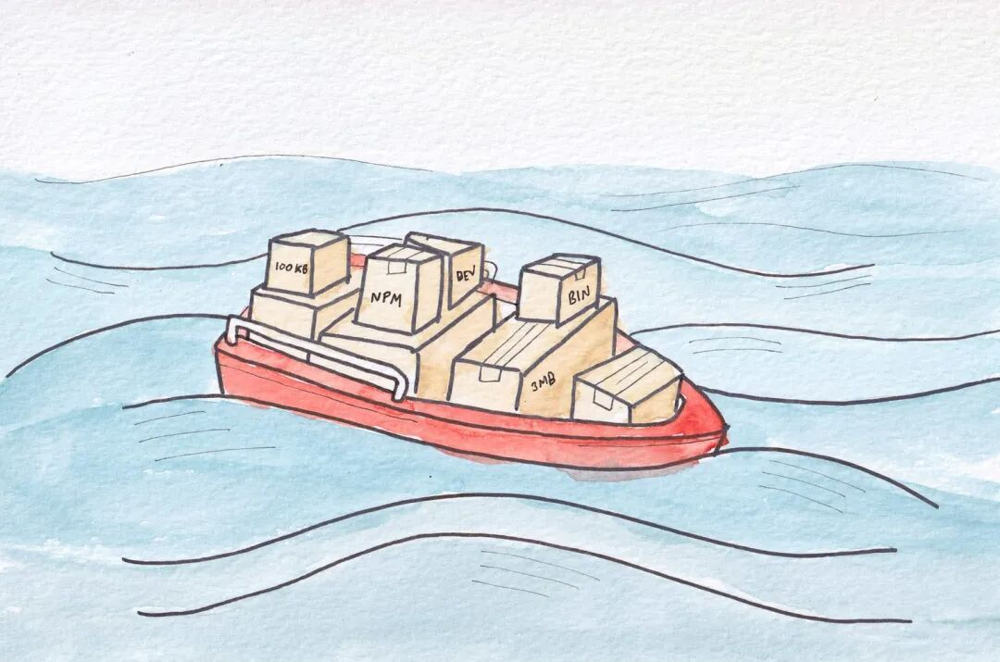
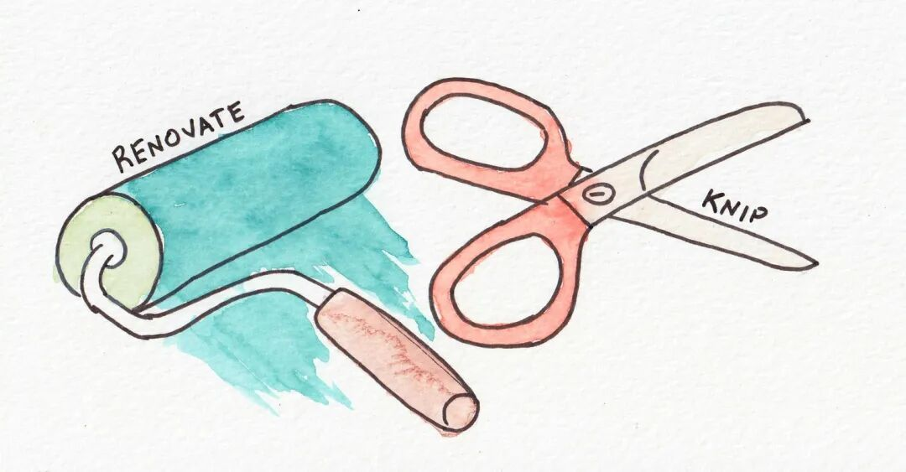

# 【第3633期】管理依赖，其实是管理工程思维

前言

探讨了如何合理管理和优化项目依赖，从阅读源码、分析包体积到使用工具清理与更新依赖，帮助开发者保持 package.json 精简可控、构建高质量的项目生态。

今日前端早读课由 @ValDotTown 分享，@飘飘编译。

译文从这开始～～

[【早阅】技术债治理手册：五步作战计划](https://mp.weixin.qq.com/s?__biz=MjM5MTA1MjAxMQ==&mid=2651278292&idx=1&sn=bf2044a51442a2d8090f5a78180b2a05&scene=21#wechat_redirect)

Val Town 是一个基于 React 的应用，依赖项非常多。它结构复杂，我们必须不断地处理依赖更新问题。我们犯了一个 “让 Web 过度复杂化” 的大忌：截至目前，我们的 node\_modules 文件夹已经有 863MB 之大。呼！

[【早阅】LLM 时代的前端革命：React 不再是框架，而是平台](https://mp.weixin.qq.com/s?__biz=MjM5MTA1MjAxMQ==&mid=2651278142&idx=1&sn=c310375429ed17ec469ff84e61e56d6f&scene=21#wechat_redirect)

想象一艘装满箱子的船 —— 这些箱子象征着我们的依赖项。

不过，问题真的这么严重吗？我们是不是在随意安装依赖、积累技术债？我觉得其实并没有。

事实是，我们正在构建的东西本身就有一定的复杂性。我们不会自己造一个 TypeScript 转译器，也不会为了避免安装 CodeMirror 而用一个 textarea 来写代码编辑器。每周我都会花点时间翻看 package.json，想想哪些依赖可以删掉。有时候确实能找出一些可以去掉的包，但更多的时候我会发现：其实这些 “垃圾” 我们都需要。随着实践越来越多，我也慢慢理解到，理想原则在现实中碰壁时，判断别人变得没那么容易了。

但这并不意味着管理依赖没有技巧。其实我总结出了一些方法和工具，它们组合在一起，形成了一种 “依赖卫生习惯”。我好像还从没系统写下来过 —— 现在就来试试。

[【第2325期】使用patch-package修改Node.js依赖包内容](https://mp.weixin.qq.com/s?__biz=MjM5MTA1MjAxMQ==&mid=2651247455&idx=1&sn=2f553a86d87b5ad9c0a8a54f68f4c391&scene=21#wechat_redirect)

#### 阅读所有新依赖（React 除外）

第一条规则就是：**读。**

这是真的字面意思 —— 仔细阅读你要引入项目的依赖的源码。当然，还要读它的 README。我强烈推荐用最传统的方式：用你的眼睛和脑子去读。当然，如果你喜欢，也可以借助 LLM 来辅助理解 —— 但千万别把整个任务都交给机器人。目标是真正理解，而不是间接获取。

很多时候，你会发现新依赖其实只有区区 50 行代码，这种情况下直接把它复制（vendor）进项目里更合适，同时在注释里保留它的开源许可证信息。

有时你会发现某个模块压缩后有 2MB，还带来 3 个新的间接依赖，而你实际只用了其中几十行代码。这种情况就不理想了：你增加了很多不必要的负担 —— 不仅让 node\_modules 变大，也可能带来安全风险，因为即便你没用到那些部分，也得负责修补漏洞。

我会为 React 和其他大型核心依赖开个例外：我看过 React 的算法和 TypeScript 编译器的源码，得出的结论是 —— 这些就交给那些大神们吧。

[【第3625期】写 TypeScript 不等于安全：边界设计才是关键](https://mp.weixin.qq.com/s?__biz=MjM5MTA1MjAxMQ==&mid=2651278175&idx=1&sn=2da60babc2929aa6137423c66bf21839&scene=21#wechat_redirect)

**如果你不读，就不会成功。**

#### 善用 `npm ls` 和阅读 package-lock.json

如果你用的是 pnpm，那就看 `pnpm-lock.yaml` 和 `pnpm why`，其他包管理器也有类似命令。原因很简单：你的直接依赖只是冰山一角。 真正占据 node\_modules 空间的，是那些间接依赖 —— 它们同样非常重要。

举个例子：假设你的项目需要转译 TypeScript。你很可能已经间接安装了转译器。在我们的项目中，`esbuild` 就被 drizzle-kit、Vite 和 tsx 各自带进来了。于是如果我们直接在项目中安装 esbuild，其实成本为零 —— 因为最终它会被去重，复用同一个 esbuild 二进制文件。这是一个很有用的小技巧：当你要安装新依赖时，如果能复用项目中已有的间接依赖，那你就 “白嫖” 到一个依赖。

此外，也要阅读 package-lock.json 或 pnpm-lock.yaml。它其实没你想的那么难懂，读一读会有收获。里面包含了大量信息，让你熟悉项目所依赖的模块，从而在脑海中建立一个 “依赖 PageRank 图谱”—— 以后你要找工具时就能立刻想起来该用哪个。激发你的好奇心，多打开那些 npmjs.com 页面看看吧。

#### 分析依赖包的实际体积其实很有用

在大型 NPM 模块中，体积带来的影响主要有两方面：一是它们对最终打包应用体积的影响；二是它们在开发阶段占据的 node\_modules 磁盘空间。虽然首要任务是关注应用的打包大小，但这两者都很重要 —— 如果项目的 node\_modules 里塞了 2GB 的依赖代码，那么在 CI 测试和部署时都会变慢，因为下载和构建的过程都会更重。

Grand Perspective 可视化 node\_modules 中的依赖占用情况

我平时使用 Grand Perspective 这款已有 20 年历史的工具来查看 node\_modules 在磁盘中的分布情况。如果你使用 Linux 或 Windows，也有很多其他磁盘空间分析工具可以选择。

分析打包后应用的体积则要复杂得多，也更依赖项目的构建系统。我们使用 React Router 搭配 Vite，所以选择了 rollup-plugin-visualizer 来分析包体积。但不同打包工具有不同方案，比如 Next.js 就自带自己的 bundle 分析器。

#### 什么样的 NPM 模块才算 “好”？

那么，我们到底在找什么样的模块？“好模块” 的定义不断变化，但通常包括以下特征：

- 有持续的维护记录
- 内置 TypeScript 类型定义
- 测试通过
- 文档完善

通俗来说，就是它要有一种 “靠谱的感觉”。即使你自己的项目还在摸索、可能会出错，也希望依赖的模块本身是稳固的。毕竟，一个应用的 bug 总和 = 你写的 bug + 你依赖的代码中的 bug。因此，对安装的依赖要求比对自己写的代码更严格，是合理的。

[【早阅】如何有效清除NPM和NPX缓存？](https://mp.weixin.qq.com/s?__biz=MjM5MTA1MjAxMQ==&mid=2651274301&idx=2&sn=cd81adafd6f785471d0ee5ae4d54012c&scene=21#wechat_redirect)

那什么是 “坏模块”？当然，那些被废弃、写得糟糕的模块都不好。但更糟糕的是：一个解决了错误问题的模块。也就是说，它并不适合你的实际需求，你反而得去 “改造问题” 来迁就它。

解决方法其实很简单 —— 多花点时间阅读源码，理解问题和方案的匹配程度。或者，实在懒就问问 LLM 吧，小机灵鬼。

#### 删除没用的依赖，并让剩下的保持更新

推荐两个神级工具：Renovate 和 Knip。

- Renovate 会自动提醒你更新依赖。持续、小步更新要远比一年一次的大规模升级安全得多。
- Knip 简直是魔法般的工具：又快又准。它能扫描项目，告诉你 package.json 里哪些依赖其实没被使用。

项目长期迭代后，经常会有旧版本遗留的 “垃圾” 依赖，用 Knip 一扫就能清理掉。它甚至还能指出哪些文件项目中已经不再引用。如果 Knip 出 T 恤，我现在就穿上 —— 真的有那么好用。

#### 建立一个 “好模块作者” 速查表

NPM 生态其实就是由一个个开发者组成的。了解他们是谁、谁写的东西靠谱，非常有用。例如，当我找与 Promises（或其他常见话题）相关的包时，我会先看看 Sindre Sorhus 有没有已经写好的库 —— 他几乎总是有。

其他值得关注的开发者还有：isaacs、Matteo Collina、Mafintosh。

如果你在处理 Markdown，应该熟悉 wooorm 和 unified 相关的仓库。想研究下一代 Node.js 技术？看看 unjs。对转译器内部机制感兴趣？那一定别错过 Rich Harris 的项目，他的作品里有很多隐藏的宝藏。

后续写一篇文章，列出一些推荐的优质依赖，你甚至可以把它们整理成一个 `AGENTS.md` 文件留作参考。

#### 依赖是无法避免的

事实就是如此：我们都在彼此的肩膀上构建新东西。关键在于 —— 找到合适的肩膀来依靠。

确实令人沮丧的是，Web 平台和 NPM 生态更新太快，琐碎的依赖决策和频繁的升级让人疲惫。但这几乎是所有生态的常态 —— 即使是那些吸取了 Node 和 NPM 教训的新一代语言，也依然逃不开臃肿的包生态。

管理依赖就像园艺，是每个开发者的日常。既然躲不过，那就把它做好。

关于本文  
译者：@飘飘  
作者：@ValDotTown  
原文：https://blog.val.town/gardening-dependencies

这期前端早读课  
对你有帮助，帮” 赞 “一下，  
期待下一期，帮” 在看” 一下。
