# 尤雨溪又又又赢麻了

一年一度的 JavaScript 年度调查又公布结果了。和往年一样，这份调查覆盖了过去一年开发者在 JavaScript 特性、框架、工具链以及 AI 使用情况等多个维度的真实反馈。我们不逐项对表，只挑一些真正有信号的点，简单过一遍。

## JavaScript 特性

先看 JavaScript 本身。

老实说，过去一年 JavaScript 在“语言特性”层面的变化并不算多。现在的 JS 已经进入一个相对稳定的阶段，能力足够丰富，新增特性更多是在补坑，而不是大开大合地加新语法。

这次调查里，真正值得单独拎出来说的，其实只有一个：Temporal API。

它的目标很明确，就是替代现在问题一堆的 Date API，把时区、时间计算这些长期折磨前端的坑一次性解决掉。

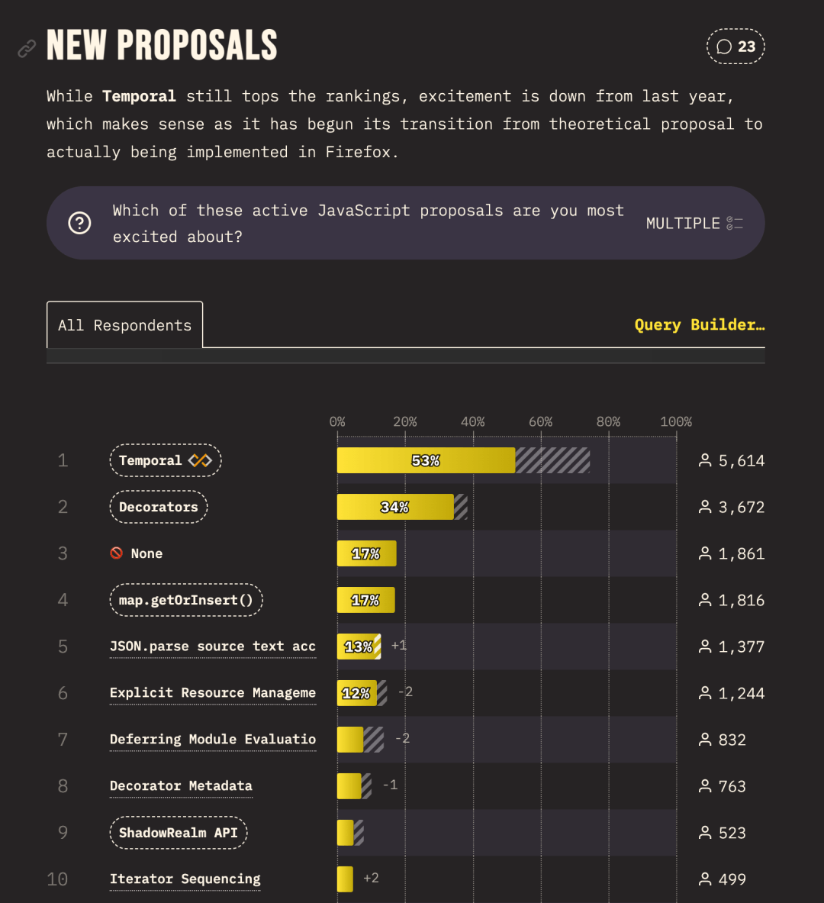

比较关键的一点是，Temporal 已经不再是未来规划，而是进入了实施阶段，主流浏览器也开始陆续支持。这意味着它不是“看着很行”的提案，而是已经可以开始认真关注、甚至尝试落地的东西了。

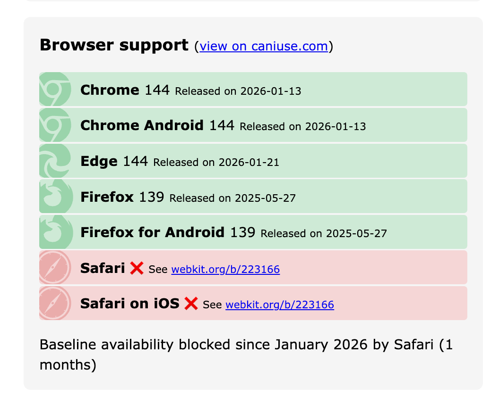

## 前端工具

各个前端工具的满意度情况如下，基本都是意料之中：

  

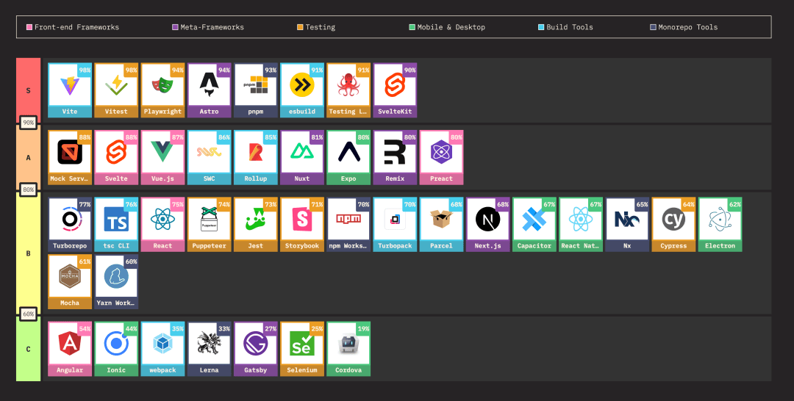

### 前端框架

接下来是大家最关心的前端框架。

这次调查里，一个挺有意思的现象是：使用度增长幅度最大的，居然还是 React。

放在 AI 语境下，这个结果其实并不意外。现在不管是 Cursor、Claude Code，还是各种自动生成项目的工具，默认模板基本都是 React，这种“被动曝光”本身就会持续放大 React 的使用量。

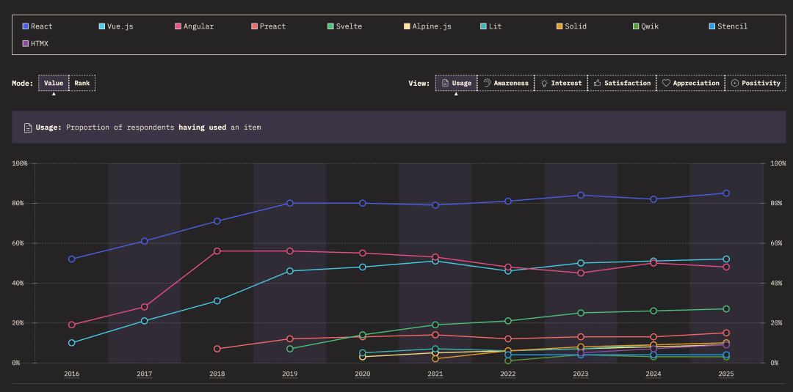

  
Vue 和 Angular 分别排在后面。从国内视角看，Vue 的存在感显然更强，Angular 几乎见不到；但如果放到全球范围，这两者的整体使用情况其实差距并没有那么夸张。

### 前端元框架

再往下看前端元框架。

第一梯队基本没什么悬念，依然是大家熟悉的那几位，后面的差距也没有被明显拉开。

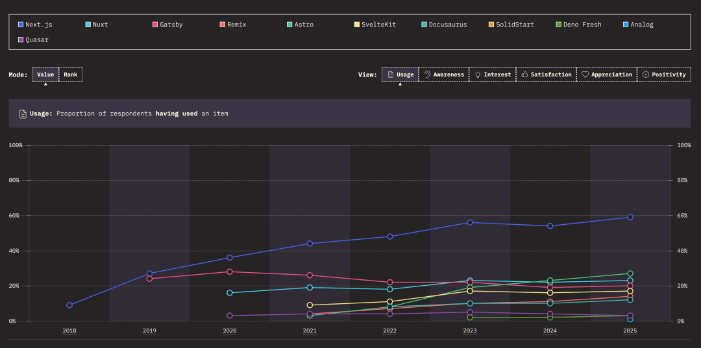

不过有一个变化值得注意：TanStack Start 出现之后，社区里确实能明显感受到一部分开发者从 Next.js 转了过去。

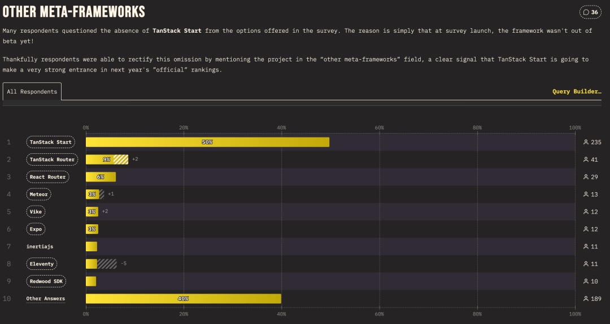

原因也很现实。Next 的生态和影响力还在，但使用体验这些年争议越来越多，尤其在复杂度、约定和不可控行为上，劝退了不少人。TanStack Start 刚出来没多久，但思路足够干净，对一些人来说反而更舒服。

### 后端框架

后端框架这块，画风就非常稳定了。

Express 依旧遥遥领先，哪怕多年没有什么大更新，但凭借简单、熟悉和巨量存量项目，位置依然稳得可怕。

真正有增长势头的是 NestJS。这一点调查也反映得很清楚，它的增长曲线相当健康。我自己最近也在用，整体体验确实不错，生态成熟度也早就不是“新框架”的水平了。

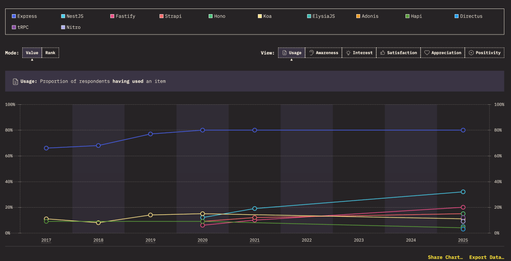

### 测试框架

测试框架方面，Jest 还是那个老大哥，占有率依然最高。但从增长趋势看，Vitest 和 Playwright 都在快速往上冲。

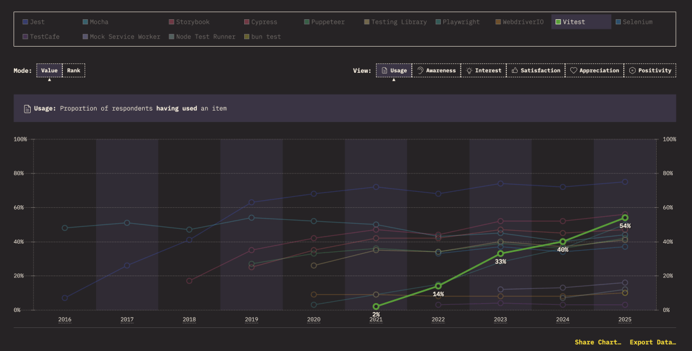

尤其是 Playwright，它在 AI 编程场景下的适配度非常高：可预期、可复现、可脚本化，这些特性在“让 AI 帮你写测试”这件事上，优势非常明显。

### 构建工具

构建工具这块，Vite 和 Webpack 的对比已经算是老话题了。

从 npm 下载量看，Vite 早就超过了 Webpack；但在这次调查里，两者的使用率其实咬得很紧。不过趋势也很清晰：Webpack 已经进入一个相对平稳的阶段，而 Vite 还在持续上涨。

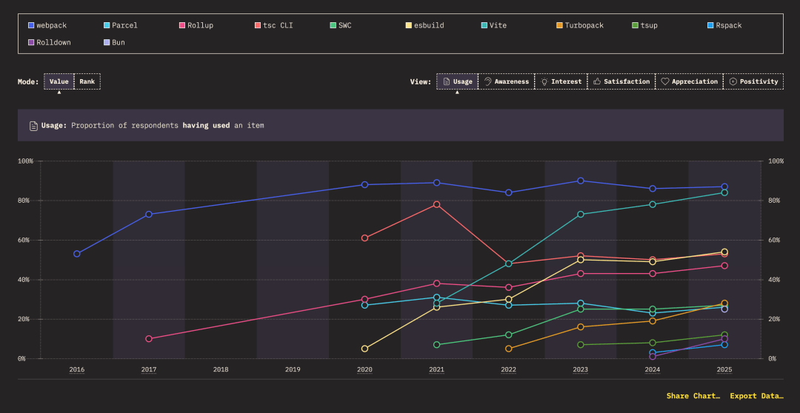

调查里还有一个挺有意思的细节：相比性能，更多开发者其实更在意“好不好配置”。性能在关注点里只排第三。

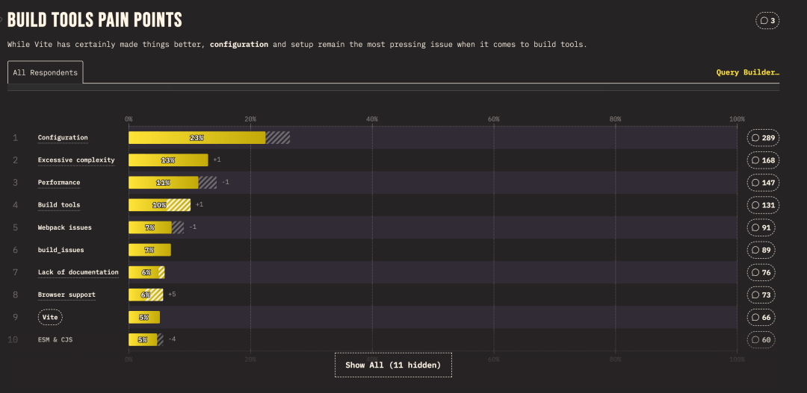

这点和很多工具宣传时“极致性能优先”的口径，形成了一个微妙的反差。

## 其他工具

编辑器这块，Cursor 的存在感已经完全藏不住了。这次调查里，它的使用率已经超过 WebStorm，排到了第二位。当然，VS Code 还是那个几乎不可能被撼动的存在。

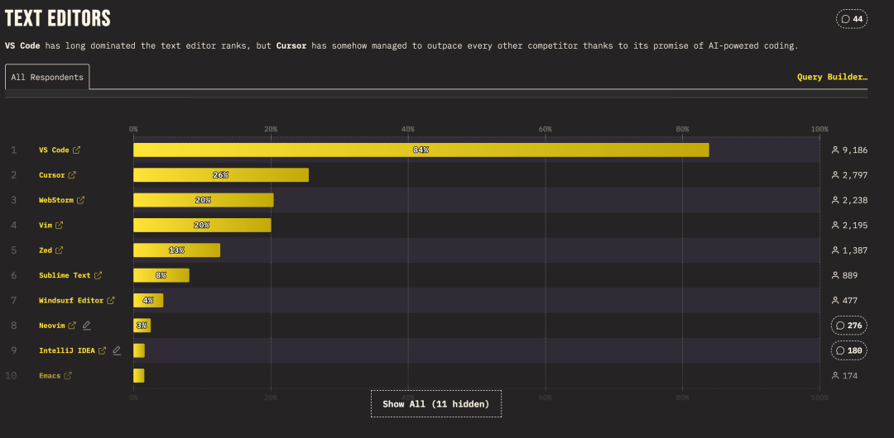

AI 工具方面，前三名也不意外：ChatGPT、GitHub Copilot、Claude。基本覆盖了聊天式、内嵌式和偏工程向的三种形态。

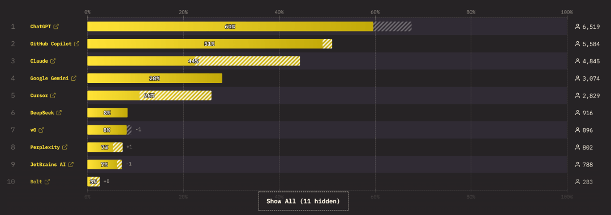

## AI 使用

至于 AI 使用情况，本身也很有信号。

目前开发者平均有大约 30% 的代码是由 AI 生成的，而去年这个数字还是 20%。

虽然现在还谈不上“AI 写大多数代码”，但这个平衡点正在以肉眼可见的速度移动。

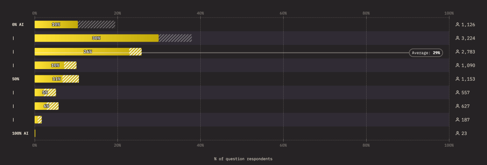

## 颁奖

最后是大家最爱看的颁奖环节。

- 最常用的技术是 Vitest
- 最高满意度的技术是 Vite
- 最感兴趣的技术，还是 Vitest

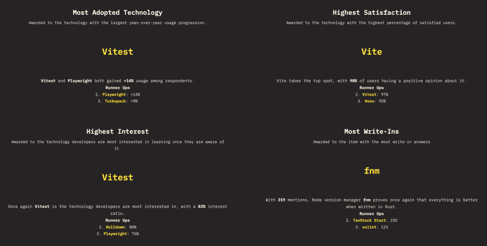

最高奖项再次集中落在 Vue 官方生态里，尤大又又又赢麻了。

整体格局和去年其实差不多，只是这一次，AI 的影响已经变得非常具体、非常明确了。

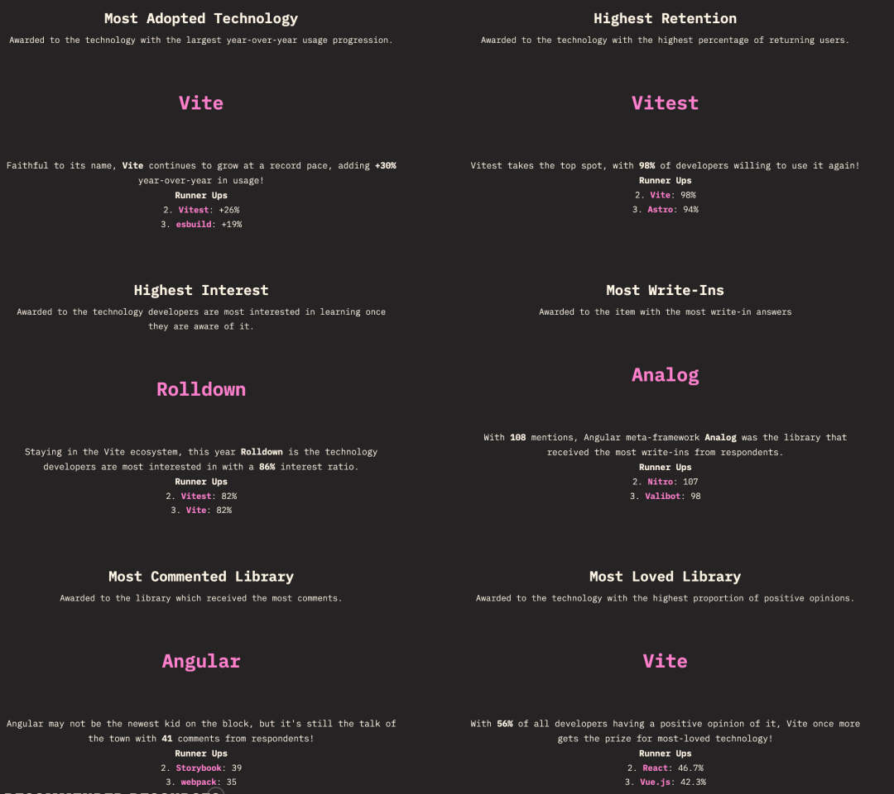

  

---

  

- 我是 ssh，工作 6 年+，阿里云、字节跳动 Web infra 一线拼杀出来的资深前端工程师 + 面试官，非常熟悉大厂的面试套路，Vue、React 以及前端工程化领域深入浅出的文章帮助无数人进入了大厂。
- 欢迎`长按图片加 ssh 为好友`，我会第一时间和你分享前端行业趋势，学习途径等等。2025 陪你一起度过！
- 
- 关注公众号，发送消息：
  
  指南，获取高级前端、算法**学习路线**，是我自己一路走来的实践。
  
  简历，获取大厂**简历编写指南**，是我看了上百份简历后总结的心血。
  
  面经，获取大厂**面试题**，集结社区优质面经，助你攀登高峰

因为微信公众号修改规则，如果不标星或点在看，你可能会收不到我公众号文章的推送，请大家将本**公众号星标**，看完文章后记得**点下赞**或者**在看**，谢谢各位！
