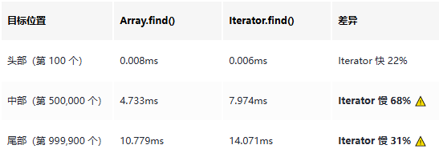

# 还在无脑 .map().filter()？实测改用 Iterator Helpers 后，内存占用降低了 99%

```js_darkmode__1
点击上方 程序员成长指北，关注公众号
回复1，加入高级Node交流群
```
今天看到一篇文章，标题很直接：Stop turning everything into arrays\[1\]。作者的观点是，JavaScript 里我们习惯了用 `.map().filter().slice()` 这种链式调用，看着很优雅，但其实每一步都在创建新数组，做了很多不必要的工作。

我一开始也半信半疑，毕竟这种写法用了这么多年，真的有那么大问题吗？于是我写了个测试脚本，跑了几组对比实验，结果还挺出乎意料的。

### 问题在哪

先说传统数组方法的问题。假设你有个常见场景：从一个大列表里筛选出符合条件的数据，做点转换，然后只取前 10 条显示。

```
const visibleItems = items
  .filter(item => item.active)
  .map(item => ({ id: item.id, doubled: item.value * 2 }))
  .slice(0, 10);
```
这代码看着没毛病，但实际执行时：

1. `filter` 遍历整个数组，创建一个新数组
2. `map` 再遍历一遍，又创建一个新数组
3. `slice` 最后从结果里取前 10 条，又创建一个新数组

如果 `items` 有 10 万条数据，你可能只需要 10 条，但前面两步已经把 10 万条全处理完了。这就是"急切求值"（eager evaluation）的问题——不管你最后用不用，先把活全干了再说。

### Iterator Helpers 是什么

Iterator Helpers 是 JavaScript 新加的特性，提供了一套"惰性求值"（lazy evaluation）的方法。关键区别是：

- **传统数组方法**：每一步都立即执行，创建中间数组
- **Iterator Helpers**：只描述要做什么，真正需要数据时才执行

用法上也很直观：

```
const visibleItems = items
  .values()              // 转成 iterator
  .filter(item => item.active)
  .map(item => ({ id: item.id, doubled: item.value * 2 }))
  .take(10)              // 只取 10 条
  .toArray();            // 最后转回数组
```
核心差异在于：

1. `items.values()` 返回的是 iterator，不是数组
2. 每一步只是在"描述"操作，不会立即执行
3. `take(10)` 告诉它只需要 10 条，处理到 10 条就停
4. `toArray()` 才真正触发执行，而且只处理需要的数据

### 实测对比

我写了个测试脚本，从**时间**和**空间**两个维度进行对比测试。每组场景的时间测试重复 10 次取平均值，内存测试使用 Node.js 的 `process.memoryUsage()` API 测量堆内存增长。

#### 场景 1：过滤 + 转换 + 取前 10 项

**数据规模**：100,000 条

```
// 传统数组方法
dataset
  .filter(item => item.active)
  .map(item => ({ id: item.id, doubled: item.value * 2 }))
  .slice(0, 10);

// Iterator Helpers
dataset
  .values()
  .filter(item => item.active)
  .map(item => ({ id: item.id, doubled: item.value * 2 }))
  .take(10)
  .toArray();

```
**结果**：


这个结果很夸张，Iterator Helpers 在时间上快了 80 多倍，内存使用更是只有传统方法的 0.3%。原因很简单：传统方法处理了所有 10 万条数据并创建了 2 个中间数组（filter 和 map 各一个），而 Iterator Helpers 找到 10 条就停了，完全不创建中间数组。

#### 场景 2：嵌套数据扁平化

**数据规模**：10,000 个父项，每个包含 10 个子项（共 100,000 条子数据）

```
// 传统数组方法
dataset
  .flatMap(parent => parent.children)
  .filter(child => child.value > 50)
  .slice(0, 20);

// Iterator Helpers
dataset
  .values()
  .flatMap(parent => parent.children)
  .filter(child => child.value > 50)
  .take(20)
  .toArray();
```
**结果**：


`flatMap` 这种场景更明显，因为传统方法要先把所有嵌套数据（10 万条子数据）展平成一个大数组，再过滤，再切片，创建了 2 个中间数组。Iterator Helpers 直接在展平的过程中就能提前终止，内存使用几乎可以忽略不计。

#### 场景 3：查找第一个匹配项（公平对决）

**数据规模**：1,000,000 条

这个场景需要特别说明。原来的测试用 `filter(...)[0]` 作为对照组，这是不公平的——\*\*实际开发中，大家都会直接用 `Array.find()`\*\*，没人会傻到先 `filter` 遍历完整个数组再取第一个。

所以这里改成真正的公平对决：`Array.find()` vs `Iterator.find()`。

```
// Array.find()（原生数组方法）
dataset.find(item => item.id === targetId);

// Iterator.find()
dataset.values().find(item => item.id === targetId);
```
我在不同位置测试了查找性能（头部、中部、尾部）：

**结果**：



**关键发现**：

1. **`Array.find()` 本身就是惰性的**——它找到第一个匹配项就会停止，不需要 Iterator Helpers 来"拯救"
2. **Iterator 有额外开销**：每次迭代需要创建 iterator 对象、调用 `.next()` 方法，这些开销在大规模遍历时会累积
3. **头部查找时 Iterator 略快**：可能是因为数据量小，V8 的优化策略不同

**MDN 文档验证**：

根据 MDN 官方文档\[2\]，`Array.find()` 确实具有**短路求值（short-circuit）** 的特性：

> `find()` does not process the remaining elements of the array after the callbackFn returns a truthy value.

也就是说，`Array.find()` 和 `Iterator.find()` 在"找到即停"这一点上是**完全一样**的。两者的区别仅在于：

- **Iterator.find()** 需要先通过 `.values()` 将数组转换成迭代器，这会引入额外开销
- 对于**链式调用**（如 `filter().map().find()`），Iterator Helpers 可以避免创建中间数组，这时才有优势

**结论**：对于纯粹的"查找第一个"场景，直接用 `Array.find()` 就好，不要画蛇添足用 Iterator Helpers。

#### 场景 4：复杂链式调用

**数据规模**：50,000 条

```
// 传统数组方法
dataset
  .filter(item => item.active)
  .map(item => ({ ...item, doubled: item.value * 2 }))
  .filter(item => item.doubled > 500)
  .map(item => ({ id: item.id, final: item.doubled + 100 }))
  .slice(0, 15);

// Iterator Helpers
dataset
  .values()
  .filter(item => item.active)
  .map(item => ({ ...item, doubled: item.value * 2 }))
  .filter(item => item.doubled > 500)
  .map(item => ({ id: item.id, final: item.doubled + 100 }))
  .take(15)
  .toArray();
```
**结果**：


链式调用越多，传统方法创建的中间数组就越多。这个场景有 4 次操作（filter → map → filter → map），传统方法创建了 4 个中间数组，总共占用 5.33 MB 内存；而 Iterator Helpers 一个中间数组都没创建，内存使用几乎为零。

### 什么时候用 Iterator Helpers

根据测试结果，我总结了几个适合用 Iterator Helpers 的场景：

#### 1\. 只需要前 N 项

这是最明显的优势场景。无限滚动、分页加载、虚拟列表这些场景都适合。

```
// 虚拟列表只渲染可见的 20 条
const visibleRows = allRows
  .values()
  .filter(isInViewport)
  .take(20)
  .toArray();
```
#### 2\. 流式数据处理

处理 API 分页、SSE 流、WebSocket 消息这些场景，Iterator Helpers 配合 async iterator 很好用：

```
async function* fetchPages() {
let page = 1;
while (true) {
    const res = await fetch(`/api/items?page=${page++}`);
    if (!res.ok) return;
    yield* await res.json();
  }
}

// 只拉取需要的数据，不会一次性加载所有分页
const firstTen = await fetchPages()
  .filter(isValid)
  .take(10)
  .toArray();
```
#### 3\. 复杂的数据管道

如果你的数据处理链路很长，有多次 `filter`、`map`、`flatMap`，用 Iterator Helpers 能避免创建一堆中间数组。

```
const result = data
  .values()
  .filter(step1)
  .map(step2)
  .flatMap(step3)
  .filter(step4)
  .take(100)
  .toArray();
```
### 什么时候不用

Iterator Helpers 也不是万能的，这几种情况还是老老实实用数组：

#### 1\. 需要随机访问

Iterator 是单向的，不能 `items[5]` 这样直接取某一项。如果你需要随机访问，还是得用数组。

#### 2\. 数据量很小

如果就几十条数据，用 Iterator Helpers 反而增加了复杂度，传统数组方法更简单直接。

#### 3\. 需要多次遍历

Iterator 只能遍历一次，如果你需要对同一份数据做多次不同的处理，还是先 `toArray()` 转成数组再说。

```
const iter = data.values().filter(x => x > 10);

// ❌ 第二次遍历会返回空，因为 iterator 已经消费完了
const first = iter.take(5).toArray();
const second = iter.take(5).toArray(); // []

// ✅ 先转数组，再多次使用
const filtered = data.values().filter(x => x > 10).toArray();
const first = filtered.slice(0, 5);
const second = filtered.slice(5, 10);
```
### 兼容性

Iterator Helpers 在现代浏览器和 Node.js 22+ 都已经支持了。如果你的项目还要兼容老版本，可以用 core-js\[3\] 这类 polyfill。

可以在 Can I Use\[4\] 查看详细的兼容性数据。

### 一些坑

#### 1\. Iterator 不是数组

这是最容易踩的坑。Iterator 没有 `length`、`[index]` 这些属性，也不能直接 `console.log` 看内容。

```
const iter = [1, 2, 3].values();

console.log(iter.length);  // undefined
console.log(iter[0]);      // undefined
console.log(iter);         // Object [Array Iterator] {}

// 要看内容，得先转数组
console.log([...iter]);    // [1, 2, 3]
```
#### 2. `reduce` 不是惰性的

大部分 Iterator Helpers 都是惰性的，但 `reduce` 是个例外，它必须遍历所有数据才能得出结果。

```
// reduce 会立即消费整个 iterator
const sum = data.values().reduce((acc, x) => acc + x, 0);
```
#### 3\. 调试不方便

因为是惰性求值，你不能在中间步骤打断点看数据。如果要调试，可以在关键步骤插入 `toArray()` 转成数组再看。

```
const result = data
  .values()
  .filter(step1)
  .toArray()  // 调试用，看看 filter 后的结果
  .values()
  .map(step2)
  .take(10)
  .toArray();
```
### 总结

Iterator Helpers 不是要替代数组，而是给了我们另一个选择。核心思路就一句话：**如果你不需要整个数组，就别创建它**。

从实测结果看：

- **filter/map + take(N) 链式调用**：时间和空间开销都能降低 90%+，这是 Iterator Helpers 的杀手级场景
- **单纯的 find 查找**：`Array.find()` 本身就是惰性的，用 `Iterator.find()` 反而更慢（慢 30%-70%）
- 数据规模越大，Iterator Helpers 在链式调用场景的优势越明显
- **内存优势尤其突出**：传统方法创建的中间数组会占用大量内存，而 Iterator Helpers 几乎不占用额外内存

我个人的使用建议是：

1. **默认还是用数组方法**，简单直接，不容易出错
2. **filter/map + slice 组合**：如果你只需要前 N 项，这是 Iterator Helpers 大显身手的场景
3. **单纯的 find/findIndex**：直接用 `Array.find()` / `Array.findIndex()`，不要用 Iterator
4. **写数据管道时**，如果链路很长，用 Iterator Helpers 能让代码更清晰，也能避免不必要的内存分配
5. **内存敏感场景**，比如处理大数据集、移动端应用等，Iterator Helpers 能显著降低内存压力

完整的测试代码篇幅较长，直接放在文章中不便于复制和使用，我已经单独整理成文件。 在公众号后台回复 【测试代码】，即可直接获取。

### 实际运行输出

在我的环境（Node.js 22+）下，使用 `node --expose-gc iterator-helpers-benchmark.js` 运行上面的代码，得到结果（请配合运行测试代码结果查看）

从输出可以看到：

**场景 1-2、4（filter/map + take 链式调用）**：

- 时间提升：98%+
- 内存提升：99%+
- Iterator Helpers 在时间和空间上都有压倒性优势

**场景 3（Array.find vs Iterator.find 公平对决）**：

- **头部查找**：Iterator 略快 22%（可能是 V8 优化策略不同）
- **中部查找**：Iterator 慢 68%
- **尾部查找**：Iterator 慢 31%
- **结论**：`Array.find()` 本身就是惰性的，不需要 Iterator Helpers 来"拯救"

**关键发现**：

1. **内存优势极其明显**：在链式调用场景下，Iterator Helpers 的内存使用只有传统方法的 0.3%
2. **中间数组是大头**：场景 4 创建了 4 个中间数组，占用 5.32 MB；Iterator Helpers 几乎为零
3. **不是所有场景都适用**：单纯的 `find` 场景，直接用 `Array.find()` 更好

---

> 作者：也无风雨也雾晴
> 
> 地址：https://juejin.cn/post/7596926832912498751

如果你觉得这篇文章有帮助，欢迎关注我的 GitHub\[5\]，下面是我的一些开源项目：

**Claude Code Skills**（按需加载，意图自动识别，不浪费 token，介绍文章\[6\]）：

- code-review-skill\[7\] - 代码审查技能，覆盖 React 19、Vue 3、TypeScript、Rust 等约 9000 行规则（详细介绍\[8\]）
- 5-whys-skill\[9\] - 5 Whys 根因分析，说"找根因"自动激活
- first-principles-skill\[10\] - 第一性原理思考，适合架构设计和技术选型

**qwen/gemini/claude - cli 原理学习网站**：

- coding-cli-guide\[11\]（学习网站\[12\]）- 学习 qwen-cli 时整理的笔记，40+ 交互式动画演示 AI CLI 内部机制


coding-cli-guide

**全栈项目**（适合学习现代技术栈）：

- prompt-vault\[13\] - Prompt 管理器，用的都是最新的技术栈，适合用来学习了解最新的前端全栈开发范式：Next.js 15 + React 19 + tRPC 11 + Supabase 全栈示例，clone 下来配个免费 Supabase 就能跑
- chat\_edit\[14\] - 双模式 AI 应用（聊天+富文本编辑），Vue 3.5 + TypeScript + Vite 5 + Quill 2.0 + IndexedDB

**VS Code 插件**：

- vscode-ai-commit\[15\] - 一键生成 commit message，支持 Conventional Commits，兼容任何 OpenAI 格式接口

参考资料

\[5\] https://github.com/tt-a1i: _https://link.juejin.cn?target=https%3A%2F%2Fgithub.com%2Ftt-a1i_

\[6\] https://juejin.cn/post/7578714735307735066: _https://juejin.cn/post/7578714735307735066_

\[7\] https://github.com/tt-a1i/code-review-skill: _https://link.juejin.cn?target=https%3A%2F%2Fgithub.com%2Ftt-a1i%2Fcode-review-skill_

\[8\] https://juejin.cn/post/7578709098255908902: _https://juejin.cn/post/7578709098255908902_

\[9\] https://github.com/tt-a1i/5-whys-skill: _https://link.juejin.cn?target=https%3A%2F%2Fgithub.com%2Ftt-a1i%2F5-whys-skill_

\[10\] https://github.com/tt-a1i/first-principles-skill: _https://link.juejin.cn?target=https%3A%2F%2Fgithub.com%2Ftt-a1i%2Ffirst-principles-skill_

\[11\] https://github.com/tt-a1i/coding-cli-guide: _https://link.juejin.cn?target=https%3A%2F%2Fgithub.com%2Ftt-a1i%2Fcoding-cli-guide_

\[12\] https://tt-a1i.github.io/coding-cli-guide/?tab=start-here: _https://link.juejin.cn?target=https%3A%2F%2Ftt-a1i.github.io%2Fcoding-cli-guide%2F%3Ftab%3Dstart-here_

\[13\] https://github.com/tt-a1i/prompt-vault: _https://link.juejin.cn?target=https%3A%2F%2Fgithub.com%2Ftt-a1i%2Fprompt-vault_

\[14\] https://github.com/tt-a1i/chat\_edit: _https://link.juejin.cn?target=https%3A%2F%2Fgithub.com%2Ftt-a1i%2Fchat\_edit_

\[15\] https://github.com/tt-a1i/vscode-ai-commit: _https://link.juejin.cn?target=https%3A%2F%2Fgithub.com%2Ftt-a1i%2Fvscode-ai-commit_

Node 社群
