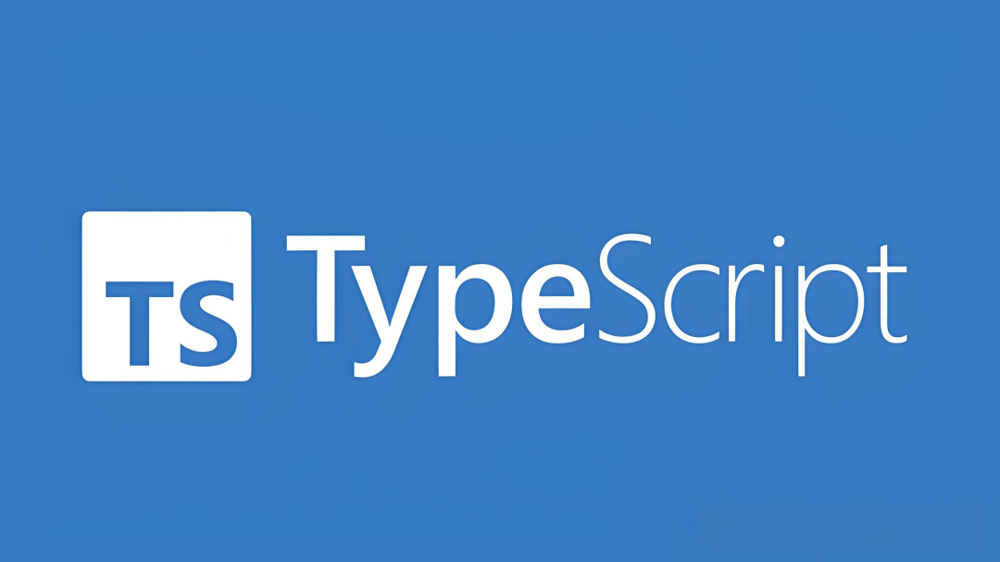
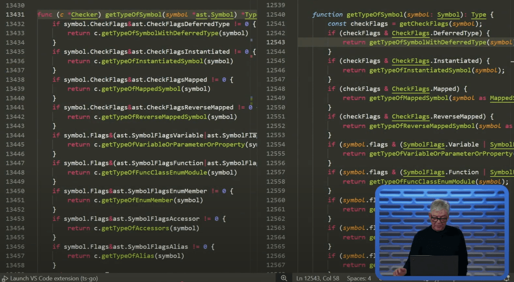

# 正式重构！所有 Typescript 项目性能将飙升 15 倍！

## 前言

大家好，我是林三心，用最通俗易懂的话讲最难的知识点是我的座右铭，基础是进阶的前提是我的初心~

> 我建了 **5000人前端学习群**，群内分享**前端知识/Vue/React/Nodejs/全栈**，关注我，回复**加群**，即可加入~

**重磅！TypeScript 宣布用 Go 语言完全重写，性能飙升 10 倍！**

最近，TypeScript 团队宣布了一个爆炸性消息：他们正在用 Go 语言对 TypeScript 进行**完全重写**！测试结果显示，在某些代码库中，性能提升达到了惊人的 **10 倍**，甚至部分项目提升了 **15 倍**！

这次性能飞跃将惠及 TypeScript 生态的**每一个角落**：无论是通过命令行运行 `tsc` 编译器，还是在你的 IDE 中查看悬停提示（hovers）和错误信息。一旦发布，你将无需改动任何一行代码，就能无缝升级到这个新版本的 TypeScript。

**性能提升**是社区多年来呼声最高的需求。之前也曾有过几次尝试，想用更快的语言重写 TypeScript，但都未能成功。

**\# 这对我有什么影响？** 一旦发布，Go 语言重写的 TypeScript 将**全面提升每一位开发者的体验**。我们来具体看看：

**\# IDE 体验：快如闪电！** 你的 IDE 体验将变得**快上 10 倍**！这意味着：

- 加载大型 TypeScript 项目
- 悬停提示 (Hovers)
- 错误显示
- 跳转到定义 (Go-to-definition)
- 重命名符号 (Rename symbol)
- ...以及所有其他 TypeScript 功能，统统快 10 倍！

这对于**大型单体仓库（monorepos）** 尤其意义重大，这些地方 TypeScript 语言服务器的速度慢得让人抓狂。

受益的远不止 VSCode（或其分支如 Cursor、Windsurf）。**任何使用 TypeScript 语言服务器的代码编辑器**都将享受到这波提速红利。

**\# 命令行 (CLI) & 构建：构建加速器** TypeScript 编译器 (`tsc`) 也将提速 **10 倍**。这意味着本地类型检查更快，项目构建也更快。

这对 **CI（持续集成）** 更是革命性的！虽然用 esbuild（Go 编写）和 swc（Rust 编写）等工具将 TypeScript 文件转译成 JavaScript 已经极快，但**类型检查（type-checking）** 一直是个瓶颈。

现在，CI 中最慢的环节将大幅提速——让**所有地方的构建都快起来**！

**\# 需要改代码吗？** **完全不用！** 你的代码原封不动就能运行。

**\# 什么时候能用上？** 官方承诺将在 **TypeScript 7.0** 中发布。TypeScript 的版本号比较特殊，它不是严格遵循语义化版本（SemVer），而是从 1.8、1.9、2.0 这样递增上去，大约每 3 个月发布一个新版本。目前最新是 5.8 版——按这个节奏算，7.0 大概还要 **33 个月左右**（接近 3 年）。

不过，更可能的情况是：**准备好了就发**。我个人的预感是 可能会推出 Beta 测试版。

**\# 怎么抢先体验？** 可以去看看全新的 `typescript-go` 代码仓库，里面有安装说明。

**\# 当前 TypeScript 的开发会暂停吗？** **不会！** 在 Go 版本开发的同时，新功能仍会继续添加到现有的 JavaScript 版本代码库中。

TypeScript 团队的一部分人会全职投入新代码库，另一部分人则会继续维护现有的 JavaScript 版本。

**\# 为什么选 Go，不是 Rust？** TypeScript 团队在 GitHub 的讨论帖中详细解释了选择 Go 的原因。

综合来看，Go 是**最合适的选择**，关键原因有几个。**最最核心的一点**是：Go 的语言结构与 TypeScript 当前的 JavaScript 实现**高度相似**。Go 的编程模式与 TypeScript 现有的代码结构非常接近。

（想象一张 Anders Hejlsberg 演示文稿的截图：左边是 Go 代码，右边是 TypeScript 代码，看起来几乎一模一样）

这意味着，熟悉现有代码库的贡献者能够更容易地上手新代码库。这一点至关重要，因为未来一段时间内，**两个代码库需要并行维护**。

所以——真不是 Rust 不好。只是 Go **更契合这次的需求**。

**\# 为什么不优化现有的 JavaScript 代码？** 要让 TypeScript 飞起来，你需要一门**原生支持多线程**的语言。JavaScript 本质上只能在**单核**上运行。虽然它未来有一些特性（如 Shared Structs）可以实现线程间共享数据，但这些**技术尚未成熟可用**。

像 Go 和 Rust 这样的语言，**多线程支持是内置的**。这意味着它们可以利用**多个 CPU 核心**，尽可能地将工作并行化。这就是它们能如此之快的关键所在！

## 结语

我是林三心，一个待过**小型toG型外包公司、大型外包公司、小公司、潜力型创业公司、大公司**的作死型前端选手

我建了一些**前端学习群**，如果大家想进群交流前端知识，可以关注我，回复**加群**

