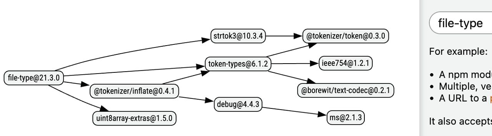

# The story of how require(esm) became stable

> 🎉 Happy New Year! Also, a quick reminder that **Node Weekly is now sent every Thursday** as part of a reshuffle for many of [our newsletters](https://cooperpress.com/publications/).  
> \_\_  
> _Your editor, Peter Cooper_

  
- [npm to Implement 'Staged Publishing' After Turbulent Shift Off Classic Tokens](https://socket.dev/blog/npm-to-implement-staged-publishing "socket.dev") — 2025 was a tricky year for the npm ecosystem with phishing attacks, [Shai Hulud](https://www.microsoft.com/en-us/security/blog/2025/12/09/shai-hulud-2-0-guidance-for-detecting-investigating-and-defending-against-the-supply-chain-attack/), and [changes to npm’s token system](https://github.blog/changelog/2025-11-05-npm-security-update-classic-token-creation-disabled-and-granular-token-changes/). For 2026, GitHub has announced [even more changes for publishing npm packages](https://github.blog/security/supply-chain-security/strengthening-supply-chain-security-preparing-for-the-next-malware-campaign/) with a new ‘staged publishing’ model that will introduce a review period before packages go live. **_\--- Sarah Gooding (Socket)_**
  
- [Finally: A Database AI Agents Can Actually Use](https://www.tigerdata.com/blog/postgres-for-agents?utm_source=cooperpress&utm_medium=referral&utm_campaign=node-weekly-newsletter "www.tigerdata.com") — Let your AI agents work directly with PostgreSQL, safely. Instant database forks for testing, native vector search for RAG, built-in guardrails for production. Agentic Postgres handles the complexity so your agents can focus on solving problems. **_\--- Tiger Data (creators of TimescaleDB) sponsor_**
  
- [require(esm) in Node: From Experiment to Stability](https://joyeecheung.github.io/blog/2025/12/30/require-esm-in-node-js-from-experiment-to-stability/ "joyeecheung.github.io") — Joyee Cheung is a long-standing core Node.js contributor and largely responsible for Node’s support for `require(esm)` (i.e. the ability to load ES modules using `require`). In this new two-part series, she explains what it took to make `require(esm)` happen and the [details of its implementation.](https://joyeecheung.github.io/blog/2025/12/30/require-esm-in-node-js-implementers-tales/) **_\--- Joyee Cheung_**

> 📺 Joyee also covered some of the above in [her fantastic talk, _Shipping Node.js packages in 2025_](https://www.youtube.com/watch?v=I0jvOJW7NaI), given at Nordic.js.

**IN BRIEF:**

- Reddit's `/r/node` discussed [why Node.js isn't considered "enterprise"](https://www.reddit.com/r/node/comments/1plnmqb/why_nodejs_is_not_considered_enterprise_like_c/) compared to, say, C# or Java.
- [pnpm](https://pnpm.io/)'s lead maintainer, Zoltan Kochan, presents [a look back at how 2025 was a transformative year for the project.](https://pnpm.io/blog/2025/12/29/pnpm-in-2025)

  
- [Fixing TypeScript Performance Problems: A Case Study](https://www.viget.com/articles/fixing-typescript-performance-problems "www.viget.com") — A big monorepo-based TypeScript project was suffering sluggish IntelliSense, long type-checking times, and slow builds, but Solomon’s team found some ways to significantly improve things. **_\--- Solomon Hawk_**
  

- 📄 [How to Automatically Load `.env` Files in Node Scripts](https://www.stefanjudis.com/today-i-learned/load-env-files-in-node-js-scripts/) – It’s a stable built-in feature, since Node 24. **_\--- Stefan Judis_**
- 📄 [Benchmarking Express 4 vs Express 5](https://www.repoflow.io/blog/express-4-vs-express-5-benchmark-node-18-24) – As always with benchmarks, be sure to run your own tests before coming to a conclusion. **_\--- RepoFlow_**
- 📄 [How Pre-Tenuring Works in V8](https://wingolog.org/archives/2026/01/05/pre-tenuring-in-v8) **_\--- Andy Wingo_**
- 📄 [How to Compile JavaScript to C with Static Hermes](https://devongovett.me/blog/static-hermes.html) **_\--- Devon Govett_**
- 📄 [Implementing Streaming JSON in 200 Lines of JavaScript](https://krasimirtsonev.com/blog/article/streaming-json-in-just-200-lines-of-javascript) **_\--- Krasimir Tsonev_**

## 🛠 Code & Tools

  
- [npmgraph: A Tool to Visualize npm Module Dependencies](https://npmgraph.js.org/ "npmgraph.js.org") — Give this Web-based tool one or more npm package names (or a `package.json` file) to see a visualization of the dependency graph for packages, including where they intersect. Packages can be colored by various criteria (like number of maintainers) and you can download an SVG of the resulting graphs. **_\--- Kieffer, Brigante, et al._**
  
- [Fabric.js 7: A JavaScript HTML5 Canvas Library](http://fabricjs.com/ "fabricjs.com") — Suitable for both browsers and Node (thanks to [node-canvas](https://github.com/Automattic/node-canvas)), Fabric provides an object model on top of canvas elements, as well as SVG-to-canvas and canvas-to-SVG features. There are also [lots of demos](https://fabricjs.com/demos/), complete with code, to enjoy. **_\--- Bogazzi, Nen, et al._**
  
- [Stop Credential Stuffing Attacks — Clerk's Free Client Trust Feature](https://go.clerk.com/sVJ7EQo "go.clerk.com") — Automatic 2FA on untrusted devices when valid passwords are used. No config needed. Free for all Clerk plans. **_\--- Clerk sponsor_**
- [pnpm 10.27](https://pnpm.io/blog/releases/10.27) – The alternative, efficient (and increasingly security-focused) package manager gets some tweaks, including a setting to ignore trust policy checks for packages published more than a specified time ago.
- 🔎 [file-type 21.2](https://github.com/sindresorhus/file-type) – Detect file type from a `Buffer`, `Uint8Array`, or `ArrayBuffer`. v21.2 adds support for Mach-O Universal binaries.
- [Fast HTML Parser 7.0.2](https://github.com/taoqf/node-html-parser) – High performance HTML parser that generates a simplified DOM, with basic element query support.
- [Middy 7.0](https://middy.js.org/docs/upgrade/6-7/) – Node.js middleware engine for AWS Lambda. Now supports Durable Functions.
- [Node File Trace 1.2](https://github.com/vercel/nft) – A tool that determines exactly which files are necessary for an app to run.
- [Orange ORM 4.8](https://orange-orm.io/) – Object Relational Mapper (ORM) for Node, Bun and Deno.
- [Repomix 1.11](https://github.com/yamadashy/repomix/releases/tag/v1.11.0) – Pack an entire repository into a single, LLM-friendly file.
- [hot-shots 12.0 & 12.1](https://github.com/bdeitte/hot-shots) – Node.js client for statsd, DogStatsD, and Telegraf.

## 📢  Elsewhere in the ecosystem

A roundup of some other interesting stories in the broader landscape:

- [MicroQuickJS](https://github.com/bellard/mquickjs/blob/main/README.md) is a new JavaScript engine from Fabrice Bellard, the creator of QuickJS, focused on embedded systems and that can run with as little as 10KB of RAM.
- _Ultimate Linux_ is a curious experiment to build [a minimal userspace for Linux entirely in JavaScript](https://github.com/popovicu/ultimate-linux) (and powered by the aforementioned [QuickJS](https://bellard.org/quickjs/)).
- Addy Osmani shares [21 valuable lessons from spending 14 years at Google.](https://addyosmani.com/blog/21-lessons/) Solid advice for remaining a competent and engaged engineer over time.
- [The results of the _State of HTML 2025_ survey](https://2025.stateofhtml.com/en-US/) are now available.
- TIL you can [get your GitHub profile pic by adding `.png`](https://bsky.app/profile/cassidoo.co/post/3mbs2sqipuc25) to your GitHub profile page's URL, i.e. `github․com/USERNAMEHERE.png` - you can also append `.keys` to get public keys and `.atom` to get a feed of public timeline activity.
