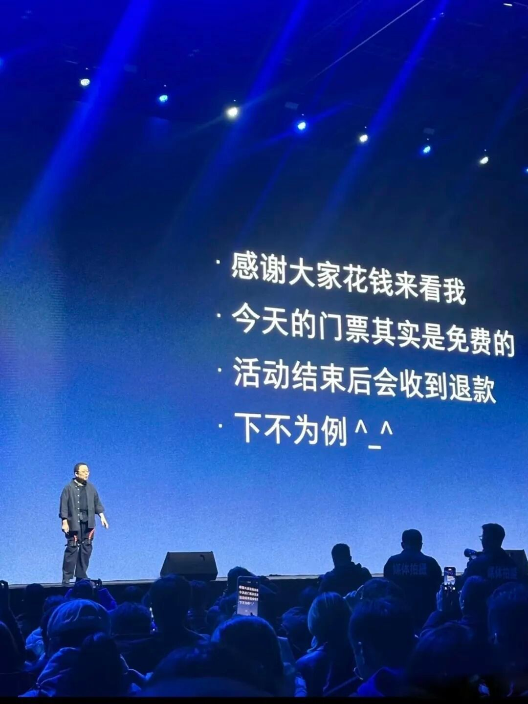
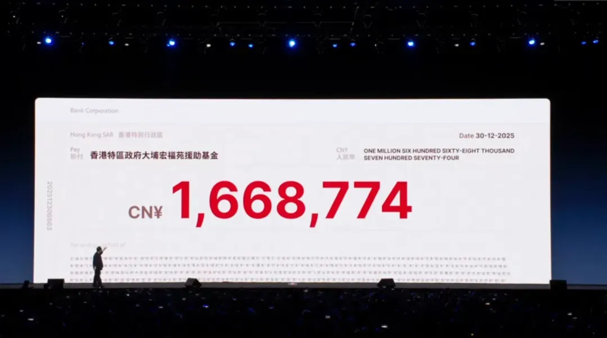
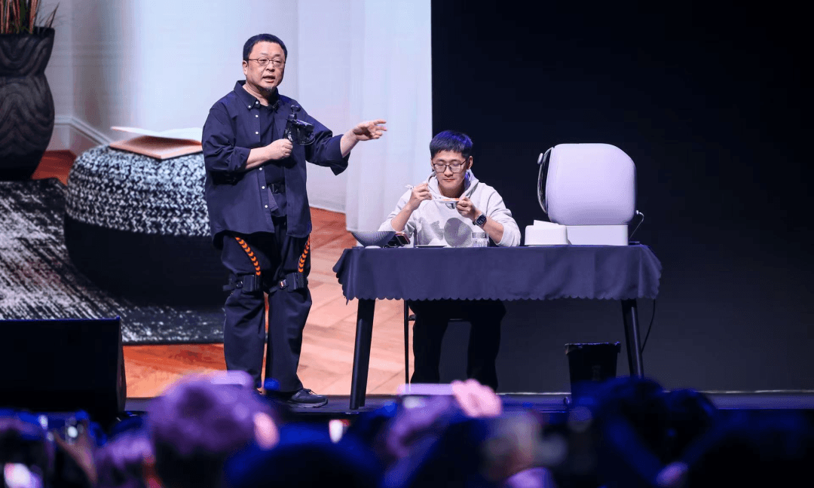
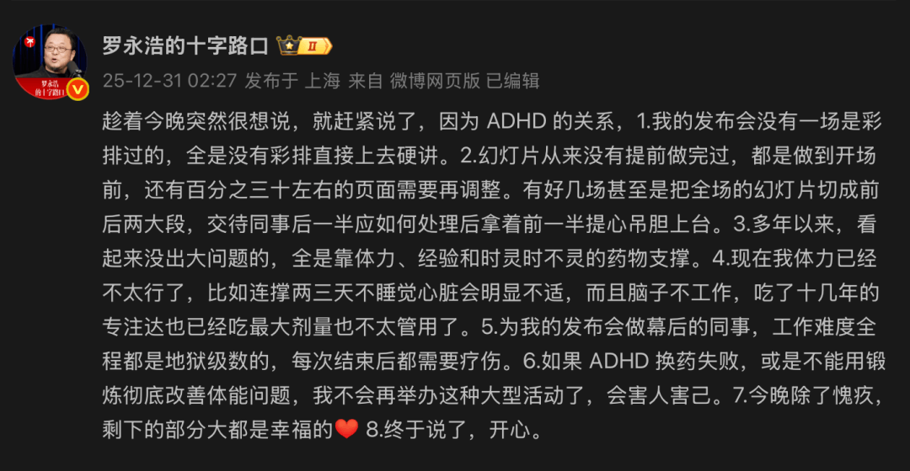
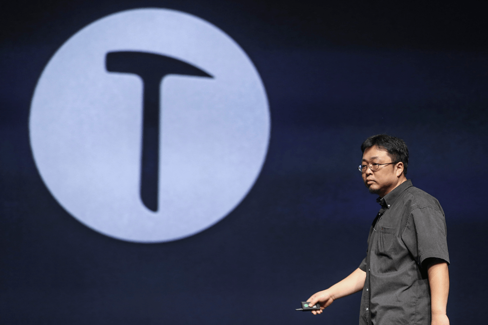

# 罗永浩发布会翻车！现场大喊“退票”！

时隔7年，罗永浩的“科技春晚”终于回归，却开场就拉满争议——原定19点的活动迟到50分钟，4000名付费观众在现场循环刷了十几遍广告，直播间满屏飘着“退票”“上链接”的吐槽。等他匆匆登台致歉，换来的却是“不接受”的集体反驳。

  

这场号称发掘“小众创新产品”的分享会，最终只亮出8款成熟产品：大疆无人机、外骨骼、3D打印机，甚至还有字节系的豆包。更尴尬的是，这些产品的创始人大多和罗永浩有商务往来，展示全程像极了直播带货，直到“one more thing”环节掏出罗永浩手办盲盒，观众彻底醒了：这哪里是科技发布会，分明是4000人到场的大型带货现场。

活动中的漏洞更扎眼：PPT排版出错、视频播放故障、批注残留，全程透着“仓促敷衍”。就在全网嘲讽“罗永浩办砸了”时，剧情突然反转——他宣布全额退还166.87万元门票钱，还将等额款项捐赠公益。舆论瞬间转向，骂声变成“诚意可嘉”。

故事还没结束。12月31日凌晨，罗永浩深夜发文自曝患ADHD（注意缺陷多动障碍）十多年，称发布会从不彩排、PPT做到开场前，全靠体力和药物硬撑，甚至暗示若换药失败将不再举办大型活动。这番表态把失败归因于身体，试图收割同情。

但网友并不买账：既然知道自身局限，为何事前标榜“精心编排”？为何不找专业团队把关？为何不提前告知观众可能不完美？更讽刺的是，他文中说“除了愧疚只剩幸福”，可这份“幸福”，是建立在4000人被迫等广告、忍受混乱的基础上。

从锤子科技的“颠覆性创新”，到直播带货的“真还传”，再到如今试图做科技“连接者”，罗永浩的每一次转型都自带流量。但这场翻车的发布会，更像一场中年创业者的溃败——他始终不愿承认自己的局限，把习惯缺陷甩锅给疾病。

全额退款+公益捐赠确实挽回了部分口碑，但诚意从不是事后补救出来的，而是藏在事前的每一处准备里。若下次还要站上舞台，靠疾病找借口没用，改变“不彩排、赶工PPT”的陋习，才是真的对观众负责。毕竟，理解不等于纵容，同情也不是无限退让。
