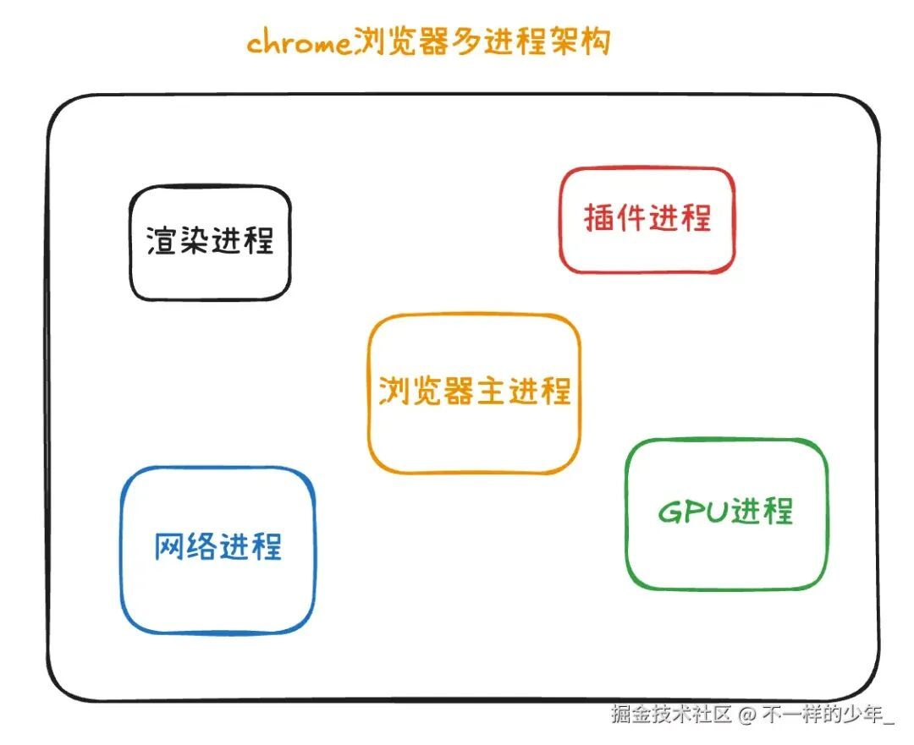
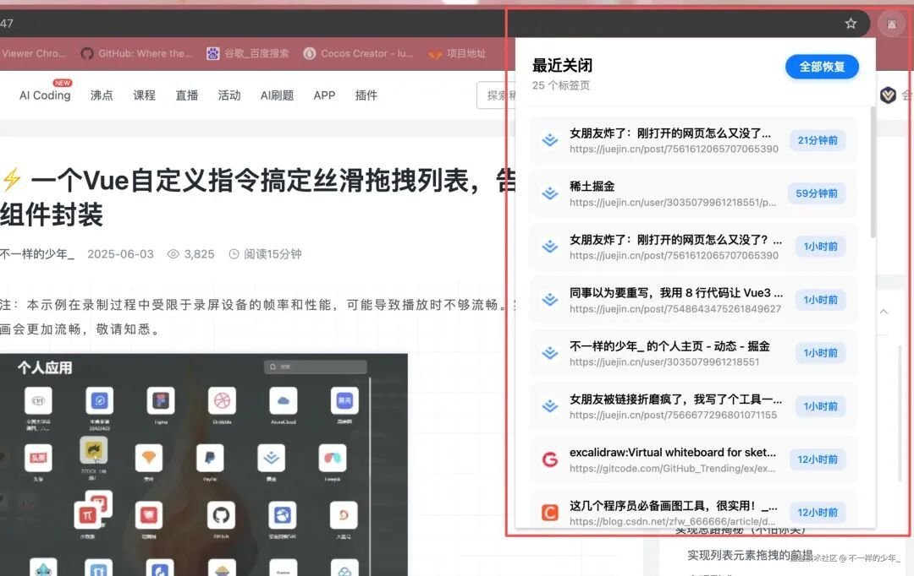
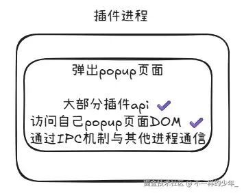
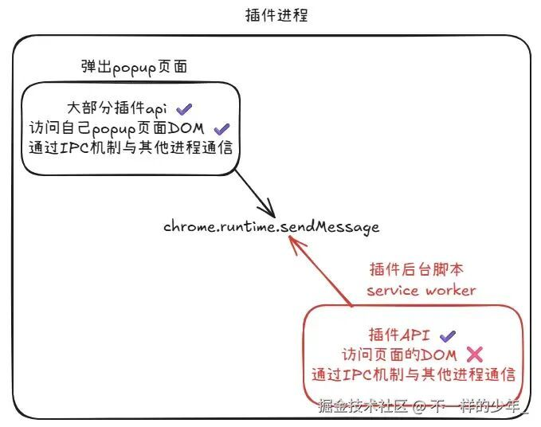
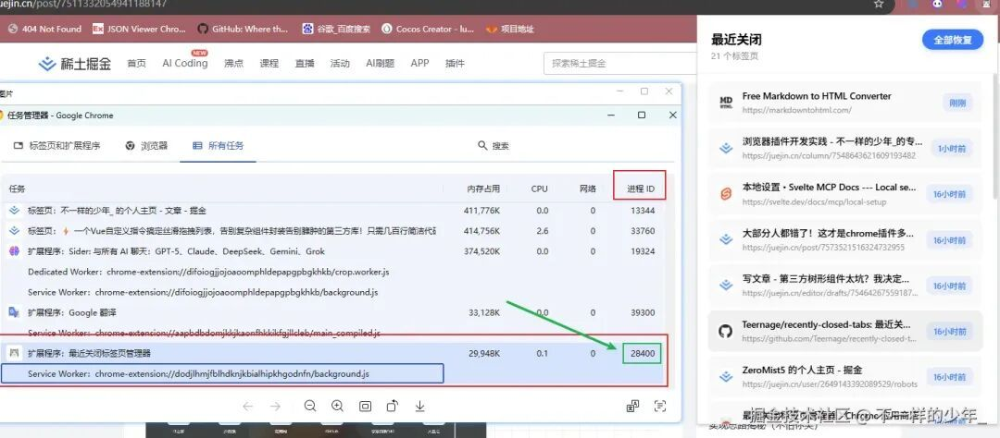
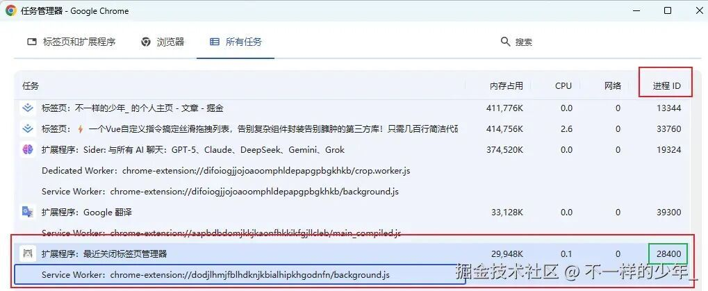
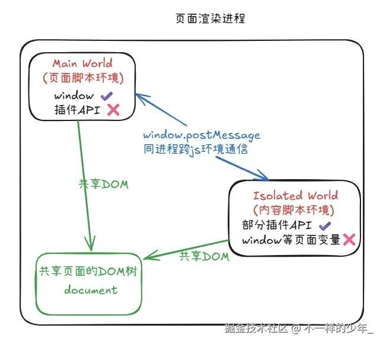
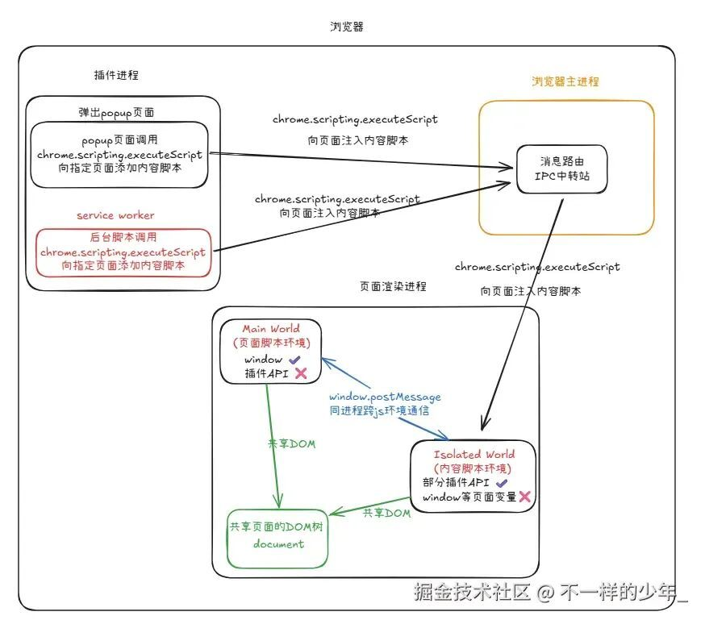
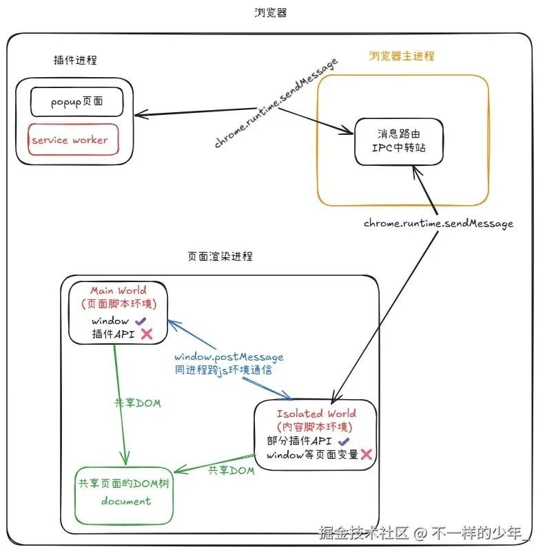

# 大部分人都错了！这才是chrome插件多脚本通信的正确姿势

点击上方 程序员成长指北，关注公众号

回复1，加入高级Node交流群

昨天一个实习生同事来找我：“哥们，我的Chrome插件遇到个奇怪问题，为什么我插入到页面的内容脚本content.js，重写页面脚本的方法没有生效？”

  

其实类似的问题我也经常碰到，比如：“为什么popup页面调用不了content.js的函数？”、“插入到页面的内容脚本为啥访问不到Vue实例？”、“background脚本为啥不能访问页面的dom节点”?………这些问题在插件开发里真的挺常见的，大家都容易踩坑。

  

所以今天，我想用最通俗的方式，把自己遇到的问题和一些小经验分享出来：

  

为什么Chrome要把插件分成这么多脚本？它们之间到底啥关系？

  

那些“看起来应该能用，但就是不行”的通信方式，背后的原因是什么？

  

怎么让插件的各个部分配合得更顺畅？

  

放心，没有复杂的术语，用图解的方式来梳理脉络，希望这些内容能帮到大家，也欢迎大家一起交流！

  

## 前置知识：

要搞懂插件通信，首先得了解浏览器的架构。现在的 Chrome 浏览器采用的是“多进程架构”，什么意思呢？直接看图：



上图中，我们浏览器架构是由渲染进程、插件进程、网络进程、浏览器主进程、gpu进程等组成的

- `浏览器主进程`: 相当于公司的大老板，负责整个公司的运转。比如你要开新窗口、切换标签、下载文件、弹出权限提示，都是浏览器主进程安排的。
  
  其他进程有啥事也都得跟主进程报备，主进程来调度。
- `渲染进程`：平时我们使用浏览器打开的每一个网页，都是由渲染进程进行渲染的。插件注入的内容脚本也在这里运行，不过处于“隔离世界”，与页面脚本相互隔离，这个后面我们会详细讲
- `网络进程`：处理所有页面与扩展的请求，我们网页中或者插件中的接口请求这种脏活累活都由它来干
- `GPU进程`：网页中有炫酷动画、视频、3D效果啥的，GPU进程就会帮你画的又快又漂亮。
- `插件进程`：运行我们平时所装的浏览器插件，我们装的不同的插件都会分配到不同的插件进程中，互不干扰，谁家插件出了问题，最多自己崩，不会影响到其他插件和页面的运行

Chrome 浏览器其实就是把各种工作分开来做，谁负责啥都很清楚。`主进程`管大局，`渲染进程`负责把网页内容展示出来，`网络进程`专门搞数据传输，`GPU进程`让动画和视频更流畅，`插件进程`则让你装的各种扩展各自独立运行。大家各干各的，互不影响，这样浏览器用起来才又快又稳还安全。

## 插件各部分的角色与能力

大家看到我的插件专栏里的插件目录，大致是这样：

```
  demo
├── manifest.json # 扩展的"身份证"
├── background.js # 插件后台脚本
├── injected.js # 注入页面脚本
├── content.js # 内容脚本
└── popup.html # 弹窗页面
```
我们来简单聊聊每个文件的作用：

### manifest.json —— 插件的“身份证”

这个文件就像插件的身份证，里面写明了插件的名字、版本、权限、各个脚本的入口。比如你这个插件是弹窗类型，还是需要内容脚本、后台脚本，都要在这里声明清楚。没有它，浏览器都不认你这个插件。

### popup.html —— 弹窗页面

这个文件就是你点浏览器右上角插件图标弹出来的小窗口。写法跟普通网页一样，可以放按钮、输入框、结果展示区。

如下红色框住的就是popup页面：



这个popup页面，浏览器会分配一个插件进程来进行渲染，插件进程的本质就是一个渲染进程，如下图：



### background.js —— 后台脚本

后台脚本是插件的大脑，负责处理各种“后台任务”。比如监听消息、和服务器通信、管理数据。它不直接操作页面内容，但能帮你做很多“脏活累活”，比如跨域请求、定时任务、权限控制。弹窗页面、内容脚本都可以和它发消息，让它帮忙干活。

Service Worker 也是运行在插件进程中，与 Popup页面共享同一个进程。`Service Worker` 在进程内部运行在一个`独立的服务工作线程`（Off-Main Thread）上 ，而 Popup 则运行在渲染进程的`主线程`上。service worker的执行环境是 `ServiceWorkerGlobalScope`，没有 `window` 和 `document` 对象，因此无法直接操作 DOM

弹窗页面（Popup）可以通过 `chrome.runtime.sendMessage` 向 Service Worker 发送消息，让它帮忙处理后台任务。Service Worker 会一直监听这些消息，并在需要时被浏览器唤醒执行。

Popup 和 Service Worker 在同一个插件进程中，但是在不同的**线程和执行环境/上下文Context**中  ，所以仍然需要通过消息传递机制通信,如下图：



**举例**： `popup页面和插件后台的通信`

比如你做了一个“天气查询”插件，用户在弹窗页面输入城市名，点击“查询”按钮，弹窗页面就会通过 chrome.runtime.sendMessage 把城市名发给后台脚本，后台脚本收到后去请求天气接口，然后把结果返回给弹窗页面显示。

`图解`：

- 用户操作 popup 页面
- popup 页面用 chrome.runtime.sendMessage 发消息给后台脚本
- 后台脚本处理请求，返回结果给 popup 页面

代码示例：

`popup.html`

```
<!DOCTYPE html>

<html>
  <body>
    <input id="city" placeholder="城市名" />
    <button id="btn">查天气</button>
    <div id="result"></div>

    <script>
      const btn = document.getElementById('btn')
      btn.onclick = function() {
        const city = document.getElementById('city').value
        chrome.runtime.sendMessage({type: 'getWeather', city}, function(response) {
          const data = response.weather
          document.getElementById('result').textContent = data || '查询失败'
        })
      }
    </script>
  </body>
</html>

```
`background.js```chrome.runtime.onMessage.addListener((msg, sender, sendResponse) => { if (msg.type === 'getWeather') { // 这里只做演示，实际开发可以用 fetch 去请求真实接口 const fakeWeather = `${msg.city}：晴，25°C`; sendResponse({ weather: fakeWeather }); // 如果是异步操作（比如 fetch），需要 return true   } });``

这样，弹窗页面和后台脚本就能通过消息机制实现通信，弹窗页面只负责收集用户输入和展示结果，后台脚本负责处理数据和业务逻辑，分工明确，开发起来也很清晰！

我们打开chrome的任务管理器看刚刚上面提到的popup插件，来看看service worker和popup是否在同一个进程中运行

如下图：





可以看出service worker和popup确实是在同一个进程中运行的

### content.js —— 内容脚本

内容脚本是插件派到网页里的“卧底”，所以这个content.js是在页面的渲染进程中运行的，不是在插件中运行的

我们画个图来解释下：



当我们用浏览器打开掘金网站时，浏览器会启动一个渲染进程来负责页面的展示。掘金网站自己的 JS 变量和运行环境都在 Main World（页面脚本环境）里，比如你用 React/Vue 写的代码、window 上挂的变量，都是属于这个世界。

如果你这时候装了一个护眼插件，想让页面变成护眼模式（比如把背景色调成绿色），插件会通过内容脚本来操作页面的 DOM，比如直接修改 body 的样式。这段内容脚本其实是在另一个独立的 JS 环境里运行，也就是图里的 Isolated World（内容脚本环境）。

虽然内容脚本和页面脚本的执行环境是隔离开的，互相访问不到对方的变量，但它们可以一起操作和共享页面上的 DOM（比如 document.body），所以内容脚本能帮你改页面样式、加按钮、弹提示，但没法直接拿到页面里的 JS 变量。如果内容脚本真要和页面脚本通信，可以用 window.postMessage 这种方式来“搭桥”。

这样设计既保证了安全，又能让插件灵活地扩展页面功能。

#### 内容脚本是怎么进到页面里的呢？

内容脚本是插件派到网页里的“卧底”，其实它的“卧底”过程也是有讲究的：

有两种方式，第一种是声明式的，另一种是编程式的

#### 声明式：

浏览器根据插件的 manifest.json 配置，自动帮你注入到指定网页的渲染进程里。 比如你在 manifest.json 里写了：`"content_scripts":[ { "matches":["https://juejin.cn/*"], "js":["content.js"] } ]`

只要你打开掘金网站，浏览器就会自动把 content.js 注入到页面的渲染进程里，让它在 Isolated World（隔离环境）里运行。

#### 编程式（按需注入）

这里有个很重要的概念： 浏览器里不同进程之间（比如主进程、渲染进程、插件进程）要互相传递消息，靠的就是 IPC（Inter-Process Communication）机制，翻译过来就是“进程间通信”。

- 比如你在后台脚本（background.js）或弹窗页面（popup）里调用 chrome.scripting.executeScript ，就能按需把内容脚本注入到指定网站页面里。
- 这个过程其实是：插件发起注入请求后，浏览器主进程会先受理这个请求，然后通过 IPC机制，把要注入的内容脚本安全地传递给目标页面的渲染进程。
- 渲染进程收到脚本后，就会在页面的隔离环境（Isolated World）里执行内容脚本，这样内容脚本就真正“落地”到页面中了。

所以，整个流程就是： 插件调用 chrome.scripting.executeScript → 浏览器主进程受理并通过 IPC 转发 → 页面渲染进程执行内容脚本。



### injected.js —— 注入页面脚本

前面说过，页面的 JS 环境和内容脚本的 JS 环境是互相隔离的，彼此访问不到对方的变量和方法，但它们共享同一个 DOM 树。 如果你想直接改页面里的 JS 环境，比如重写 fetch 或 XMLHttpRequest，实现像 mock 接口这样的功能，就不能只靠内容脚本了。

这时候就需要用“注入脚本”的方式： 我们可以在内容脚本里创建一个 script 标签，把要改写的代码（比如新的 fetch 实现）写进去，然后把这个标签插入到页面的 DOM 里。这样，页面会像加载普通 JS 文件一样执行这段代码，最终就能覆盖页面原生的 fetch 和 xhr 方法。

这种做法的好处是：

- 能直接影响页面自己的 JS 环境，实现更强的功能扩展
- 只要 DOM 是共享的，插入 script 标签就能让页面执行我们的代码
- 很适合做 mock、日志劫持、性能监控等插件功能

比如我最近写的一个基础的 mock 插件(juejin.cn/post/757098…), 就是用这种方式，在页面加载前偷偷把 fetch 和 XMLHttpRequest 替换成我重写的，让所有网络请求都能被插件拦截和处理。

### 跨环境通信流程举例

有时候，我们的注入页面脚本（injected.js）需要用到插件进程里的数据，比如判断某个 fetch 请求是否命中插件配置的规则。但页面环境是拿不到插件进程里的配置的，不过内容脚本可以帮忙“中转”。

比如我们在 injected.js 里重写了 fetch 方法，页面发起请求后，需要查一下插件里有没有对应的 mock 规则。整个数据流可以这样走：

1\. 注入页面脚本（injected.js）拦截到 fetch 请求，发现需要插件里的规则配置

2\. 注入页面脚本用 window.postMessage 向内容脚本发消息，请求规则数据。

3\. 内容脚本收到消息后，再用 chrome.runtime.sendMessage 向插件进程（比如后台脚本）发起请求，获取最新规则。

4\. 插件进程通过 IPC 机制把规则数据返回给内容脚本。

5\. 内容脚本拿到数据后，再用 window.postMessage 把结果传回注入的页面脚本 injected.js。

6\. 注入页面脚本拿到规则，判断请求是否命中，然后做后续处理（比如 mock、拦截、日志等）。

  

这样一来，页面脚本、内容脚本、插件进程就能通过消息链路把数据安全地串联起来，实现复杂的功能扩展。 整个过程就像“接力传话”，每个环节各司其职，既保证了安全，又让插件和页面能灵活协作



### 总结：插件多脚本通信，没那么难！

看到这里，相信你已经对Chrome插件中的多脚本通信有了清晰的认识。让我们简单回顾一下今天学到的关键知识：

1. 为什么需要多脚本？
- Chrome的多进程架构是为了安全和稳定性，不是为了故意为难开发者
1. 各脚本的角色：
- background.js ：负责大部分逻辑和权限，是插件的大脑。在 V3 版本中，它平时会休眠，有事件时才会被唤醒，所以不要用全局变量存数据哦。
- content.js ：嵌入页面，能操作DOM，但和页面JS是隔离的，像是派驻到页面的特工。
- popup.html ：弹窗页面，主要负责UI交互，关闭就“失忆”，但用起来很方便。
- injected.js ：直接注入页面，能访问和修改页面环境，类似卧底。
1. 通信秘诀：
- background ↔ popup ：用 chrome.runtime.sendMessage
- background ↔ content ：用 chrome.tabs.sendMessage 或 chrome.runtime.sendMessage
- content ↔ 页面JS ：用 window.postMessage

还记得开头那位苦恼的同事吗？现在你不仅知道为什么他的变量“死活拿不到”，更重要的是，掌握了正确的解决方法！

希望这篇文章能帮你少踩坑、多收获。如果觉得有用，欢迎点赞、收藏，你的支持是我持续分享的动力！

> 作者：不一样的少年\_  
> 
> 链接：https://juejin.cn/post/7573521516324732955

Node 社群
