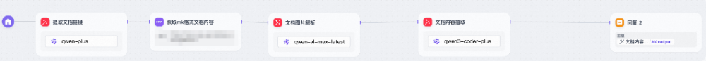
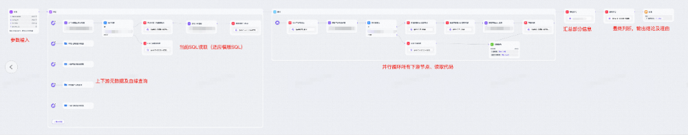
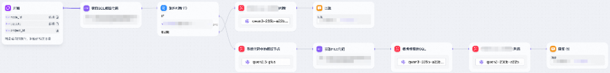
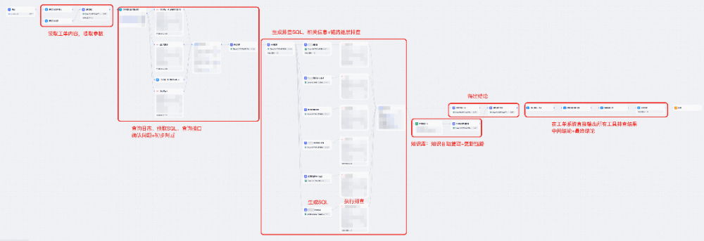

# 复杂任务AI处理实践：淘宝工程师的实战手记


  

  

  

本文分享了作者探索AI辅助处理"复杂重复性工作"的实践经验。文章总结了一套可复用的方法论——如何将人工操作抽象为"感知-决策-执行"的 AI 闭环，并通过工单处理、数据治理、基线运维等真实案例，展示从"工具助手"到"智能体"的三种自动化模式。  

  


引言：为什么我们需要“AI协作者”？

  

你是否也曾经历过这样的时刻：

- 时不时在非工作时间收到告警，只为处理一条非自身原因的上游问题；
- 收到工单后要翻五六个平台查日志、看配置、逐层排查，且一年要处理数百条工单；
- 上游改了个字段，你得手动排查几百个下游任务是否受影响；
- 想治理一张表，需要翻遍本表与所有上下游的代码和元数据才能下结论；

这些工作有个共同特点：看起来不完全一样，但行动路径高度固定。它们消耗大量时间，却创造的增量价值有限。

  

随着大模型能力的持续演进，AI 的应用边界正从“确定性任务”向“具有一定不确定性”的复杂场景延伸。我们开始思考：能否让 AI 学会像人类一样“看信息、做判断、动手操作”，成为我们可靠的数字协作者？

> 核心理念：输入明确、逻辑清晰、动作固定的“重复性工作”，都可以尝试交给AI完成。
> 
> 不仅包括“批量打标”这种显性重复，也包括“数据治理”“工单排查”“夜间值班”这种看似灵活但套路固定的隐性重复工作。

  


核心思想：把人类的操作

抽象成 AI 的“眼”、“手”和“脑”

  

我们可以把AI当成一个刚入职的新同事。要让他干活，就得先给他配齐三样东西：

- AI 如何感知上下文？ → 构建“眼睛”
- AI 如何执行动作？ → 构建“手”
- AI 如何闭环操作？ → 构建“脑”

我们将这一过程抽象为如下范式：

```code-snippet__js
[AI大脑] ←(Prompt/Workflow)→ [工具集]
   ↑                       ↗       ↘
(决策与规划)           (读取类工具)   (操作类工具)
                   (如查代码/读工单) (如发任务/评论/发布)
```
  

▐  2.1 眼睛：让AI看得见上下文

  

AI本身是个“睁眼瞎”，它看不到消息、查不了工单、读不了代码。

所以我们要给它装上“眼睛”——也就是需要通过接入SDK并封装成工具，将其变成 AI 可调用的“视觉器官”。例如：


| 工具类型 | 对应能力 | 示例 |
| --- | --- | --- |
| 代码平台 | 读取 代码、FILE文件、表结构 | 读代码，做分析 |
| 工单平台 | 提取工单内容、状态、评论 | 读取用户反馈的问题及已有排查进度 |
| 文档平台 | 获取文档库目录、查看文档 | 读取文档内容 |
| 日志平台 | 读取日志 | 提取报错原因、捞取SQL |


> 一句话总结：把平时“打开网页查看信息”的动作，变成AI可调用的“工具”。

  

▐  2.2 手：让 AI 动起来

  

仅有观察还不够，AI 还需要能采取行动。我们将常见的操作也封装为可调用工具：


| 工具类型 | 操作类工具 |
| --- | --- |
| 代码平台 | 创建/提交/修改/发布任务 |
| 任务平台 | 查看任务、修改实例等 |
| 工单平台 | 在工单中添加评论、流转状态 |
| 数据平台 | 查询/排查元数据、执行SQL |
| 办公软件开放平台 | 发送消息、写入文档 |
| 团队内已有工具 | 全链路血缘等 |


  

▐  2.3 脑：让AI会思考、能闭环

  

有了眼和手，最后一步是教AI怎么“思考”——也就是决策流程。根据任务特性的不同，我们采用两种主流模式：


| 方式 | 适用场景 | 类比 |
| --- | --- | --- |
| Workflow（流程引擎） | 步骤固定、分支清晰的工作 | 像SOP手册，一步步执行 |
| Agent（智能体） | 问题多样、路径不固定的任务 | 像资深工程师，边查边想 |


  

当“眼”、“手”、“脑”齐备时，AI 就具备了完整的“感知-决策-执行”闭环能力。

举个例子：

- ODPS治理？→ 用 Workflow：查各项信息 → 查血缘→ 读各层代码 → 判断是否可治理 → 下线or冷备or治理；
- 处理工单？→ 用 Agent：先理解问题类型 → 决定查日志还是看配置 → 综合判断 → 直接回复 or 流转。

> 最终目标：构建一个“感知 → 决策 → 执行 → 反馈”的完整闭环，让AI自己跑完一整件事。

  

▐  2.3 AI效果保证

  

在与其他同学沟通初版文章时，AI 结果准确性被反复提及。这在实操时确实也是核心关注点之一，只是此前未曾体系化整理过。经过实践总结，提炼出以下几个常用保障策略：

策略一：设计阶段 - 提示词精准化

核心原则：提示词要像写代码一样严谨

> 💡 最简单方法： 把你的提示词交给 AI 润色一遍

提示词设计要点：

- 明确输入格式和范围 — 告诉 AI "你会看到什么"
- 清晰定义判断标准 — 可量化、可验证（如"字段被用于 JOIN"而非"字段很重要"）
- 规定结构化输出格式 — JSON / 表格 / Markdown
- 提供正反例示范 — 什么是对的，什么是错的
- 设置边界条件处理规则 — 遇到不确定情况怎么办

  

策略二：策略保守不激进

在自动化治理等高风险场景中，我们采用"保守优先"策略：

- 有不确定性 → 直接返回 而非冒险执行
- ✅ 策略按最保守的来 宁可少治理，不可误删除
- ✅ 设置安全阈值 如"仅当高置信度时自动执行"

实例： 在存储治理场景中，如果 AI 无法高置信度确认某表无下游依赖，会标记为"需人工确认"，而非治理。

  

策略三： 可解释性输出

核心原则：永远输出"结论 + 理由 + 过程"

AI 的输出不应该是一个简单的"是/否"，而应该是一份完整的JSON报告，如：

```code-snippet__js
{
  "是否可缩短生命周期": " ",
  "是否可下线": " ",
  "原因": "",
  "分步骤结论": [
    "任务优先级",
    "下游最长依赖时长",
    "上游可恢复性"
  ],
  "工具原始结果": { "下游节点列表": [...], "节点元信息": {...} },
  ............
}
```
作用：

- 可验证性 — 人类可追溯 AI 的每一步推理；
- 可信任性 — 即使 AI 出错，也能快速定位问题，同时也可以根据原始数据和中间结果人工快速得出结论；
- 可优化性 — 通过分析过程改进 Prompt 和工具。

  

策略四：多层校验

不要盲目信任 AI 的单次输出

我们通过以下方式提升可信性：

- 增加观测节点 — 在关键步骤后插入"结果确认"环节；
- 增加验证节点 — 在结果后添加验证环节；
- 重要内容人工验证 — 高风险操作和重要节点、必须人工确认；
- 多次执行取一致 — 对不确定结果，可人工复核。

  


AI自动化的不同方案

  

▐  方案一：工具助手 - 单次调用，辅助分析

  

核心能力：AI 一次性完成某个特定分析任务，帮人类快速筛选或提取信息

典型场景：

- AI 对一批代码等内容，做一些梳理、分类、打标或质量检查
- AI 批量从文档中提取关键信息，整理成结构化知识
- 批量任务创建：读取模板 → 自动生成 → 提交发布

特点：

流程简单：输入 → AI 处理 → 输出结果



图1:简单工具示例

- 快速见效：已有工具的情况下，几分钟就能搭建

> 适用判断：如果你的工作是"需要看大量信息，但只需要简单判断"，就适合用工具助手。

  

▐  方案二：复杂workflow - 多步骤串联，条件分支

  

核心能力：按照预设的固定流程,自动调用多个工具、执行多步操作，支持循环与判断

典型场景：

- 数据治理：查表信息及代码 → 看血缘关系 → 读上下游代码 → 查上下游信息 → 评估 → 给出治理方案 → 输出治理建议JSON
- 定期巡检任务：每天自动检查系统状态 → 发现异常 → 分类处理 → 发送报警
- 特定场景工单排查：读取工单内容和已有进度 → 查询日志 → 确认问题 → 逐层排查 → 定位原因 → 回复

特点：

- 流程复杂：可能包含10-50个步骤,有循环、条件判断



图2:复杂workflow示例

- 多工具协同：需要调用多种不同平台的不同工具（查询、分析、操作）
- 全自动执行：设置好后可以无人值守

> 适用判断：如果你的工作是"步骤很多，但每次都按相同顺序做"，就适合用workflow。

  

▐  方案三：智能规划 Agent - 自主规划，动态决策

  

核心能力：AI 像人类专家一样，根据具体情况自主选择排查路径、灵活调用工具、动态调整策略

典型场景：

- 工单自动运维：理解用户问题 → 自主选择排查方向 → 调用相关工具 → 分析根因 → 给出解决方案 → 自动回复或流转
- 基线运维：监控多条基线 → 发现异常→ 持续监测直到决策时间点 → 自主决策处理→ 执行操作 → 通知相关人员

特点：

- 高度灵活：不依赖固定流程，每次的处理路径可能完全不同
- 自主决策：AI 自己判断"接下来应该查什么、做什么"
- 接近人类：像资深工程师一样思考和行动

适用判断：  
如果你的工作是"每次情况都不同，需要根据实际问题灵活应对"，就需要用智能 Agent。

技术挑战：

- 需要更强的大模型能力（推理、规划、多轮对话）；
- 需要精细的 Prompt 设计，避免 AI 陷入无效循环；
- 工具与子Agent应尽量精简，避免系统过于复杂难以收敛；
- 当前RAG召回机制不够智能，需要设计好的知识库来应对。

> 适用判断：如果你的工作是"每次情况都不同,需要根据实际问题灵活应对",就需要用智能Agent。不过目前Agent在复杂任务上的效果有限，作者即使拆分多层子agent后，也只实现了10步以内的轻量推理。

  


哪些场景适合AI自动化?

  

核心原则：只要能将90%以上的问题场景抽象为一套固定流程，就可以尝试交给AI处理。

典型应用场景


| 角色 | 适用场景 |
| --- | --- |
| 数据开发 | 数据治理、工单处理、血缘建设、基线运维 |
| 产品、运营 | 问题流转、数据处理、知识答疑 |
| 研发 | 日志、告警解读、代码辅助、告警处理 |


> 只要每天有“不得不做但不想做”的事情，就可以试着问一句：
> 
> 这件事能不能让AI先帮我做90%？剩下10%我来兜底。

  


结语：AI 不是来抢饭碗的

而是帮我们做更有价值的事

  

回顾整个实践历程，个人认为：

> 不是所有工作都值得交给 AI，但所有低价值的工作都应该被 AI 替代。

这样做的核心价值不在于省了多少人力，而在于让我们得以从繁琐的执行中抽身，专注于更高价值的事情：设计流程、优化体验、创造新价值。

正如一位前人所说：“以后会有很多ai帮我们工作，我们喝着茶，它就把活干完了。”

  


概览及案例实现细节

  

以下案例均来自本人（数据研发）的真实场景，展示一些例子

  

▐  **1.**准备工作

  

- 工具接入 + 一定代码基础 + 提示词
- 对工程能力要求不高


| 类别 | 组件 |
| --- | --- |
| Agent框架 | 主流 Workflow、Agent框架 |
| 大模型 | 国内领先的大语言模型系列,推荐通义千问系列 |
| 工具集成 | 通过 SDK 封装各个平台能力，构建统一工具集 |
| 血缘系统 | 基于团队共建的全链路血缘 |
| 开发语言 | Java(接入SDK、开发MCP工具、定时任务)Python(批量调用、数据处理、封装Agent为库/UDF) |


  

▐  **2**.从简单到复杂：三种典型方案具体实现

  

在实践过程中，我们的 AI 自动化方案经历了从简单到复杂、从单点工具到系统化流程的演进。

  

- 案例一：代码影响分析（简单 Workflow）

  

场景描述

问题：上游核心表变更时，需要下游逐个查代码确认影响范围。作者所在团队每次都会有少则几百个、多则 1000+ 个任务受影响。例如上游 某字段变更后，需要排查所有下游是否用到了该关键字段进行 JOIN，如果有则需要修改。

传统流程：人工逐个查看代码确认,面对数百个任务时工作量巨大、效率极低。

AI方案：构建两个 MCP 工具作为“眼睛”：读取 SQL 代码；读取 FILE 文件内容，设置适应不同情况的Workflow作为大脑,让AI自动读取代码并判断是否影响, 写在Python代码中的逻辑作为“手”来处理最终结果。



图3:workflow示意图

  

```code-snippet__js
[AI Workflow]
  ├─ 步骤1：输入所有任务列表
  ├─ 步骤2：循环每个任务（Python或workflow循环）
  │   ├─ 调用“眼睛”类工具：读取SQL代码+读取file代码（适应file拼SQL类任务）
  │   ├─ AI 分析中间结果：代码中是否包含该字段？是否用于 JOIN 操作?是否转换数据类型?
  │   ├─ AI 判断最终结论：是否有影响
  │   └─ 记录结论
  └─ 步骤3：生成json结果
  ↓
输出：json2Excel （任务名 | 是否受影响 | 是否包含此字段 ｜ 是否用此字段JOIN ｜ 是否转换数据类型）
```
实施效果

轻松、准确率高、速度快：喝着茶就帮团队把受影响的任务确认了一遍。

延伸应用

除了任务梳理外,我还完成了很多小工具：

- 知识提取：批量从文档/工单/代码/缺陷中抽取结构化知识，向量化构建知识库、自动更新
- 批量任务创建：如搭建一条数据深度备份链路,批量创建并发布备份任务
- 日志解读：批量从日志中解析出血缘关系

> 核心价值：将原本需要人工逐个处理的工作,变成批量自动化分析

  

- 案例二：自动存储治理（复杂 Workflow）

  

随着工具能力的积累,我们开始尝试处理更复杂的场景——需要多个步骤、多次决策、多个工具协同的任务。这时,单一的"眼+手"模式已经不够用,我们需要一套完整的"工作流程"。

场景描述

目标：自动化数据存储治理,降低存储成本,优化资源使用

传统流程：人工逐个查看每个表的元信息、血缘、代码，以及所有上下游的元信息和代码，综合评估，往年花费大量精力只能治理一小部分表、且很容易出问题

AI流程：构建 20+ 节点的复杂 Workflow，实现全自动治理流程：


图4:存储治理workflow及流程示意图

  

```code-snippet__js
典型流程（20+ 节点）：
1. 接收待治理表名
2. 【眼】查询表元信息（生命周期、大小、优先级等）
3. 【眼】获取全链路血缘（上游来源 + 下游消费）
4. 【眼】遍历所有下游任务，查看 SQL 代码
5. 【AI 分析】判断对该表的实际依赖范围
6. 【眼】检查上游数据恢复能力（冷备策略、重跑成本）
7. 【AI 决策】综合评估重要性 & 使用
8. 【AI 输出】生成治理建议：下线 / 缩短生命周期 / 深度冷存备份
9. 【手】自动执行治理操作 或 给出json格式的结论
```
  

核心特征

- 流程固定： 每个步骤的先后顺序、判断逻辑都是确定的；
- 多工具协同： 需要调用十几个不同的工具（读代码、读元数据、读血缘、执行操作等）；
- 决策复杂： 需要综合多维度信息做出治理决策。

成效

- 降低存储xxPB，整个数据产品的存储减少50%；
- 借助AI轻松扫描了几乎所有的表及任务，治理了大量的表和任务；
- 精准：在今年的数据治理中，AI处理了数千张表的治理决策，人工复核了10%高优先级的样本，未发现误删数据的情况，不过发现ai策略过度保守的情况存在。

经验总结

复杂 Workflow 适合处理步骤多但逻辑固定的场景，关键在于：

- 拆解清晰 — 将复杂任务拆解为原子化步骤、并且合理串联起来；
- 工具齐全 — 确保每个步骤都有对应的工具支持；
- Prompt 精准 — 每个决策节点的判断标准必须明确。

  

- 案例三：AI工单运维、引入 Hierarchical Agent——应对复杂与不确定性

  

遇到的瓶颈

当作者尝试将Workflow应用到工单处理场景时,发现固定Workflow的模式遇到了瓶颈：



图5:经过精简优化后的工单处理的workflow

❌ 工作流节点爆炸：为了适应不同的问题、工作流很快达到50个节点，过于复杂 几乎不可维护

❌ 场景覆盖有限：辛苦构建的Workflow只能应对部分场景

❌ 排查路径不固定：需“边看边想”，而非“按流程走”

  

解决方案：Hierarchical Agent(层级化智能体)  
我们不再预设固定流程,而是让AI像人类工程师一样自主规划、动态决策。

Agent架构设计

```code-snippet__js
Master Agent - 决策层【大脑】
├── 子Agent A：日志提取分析【眼】
│   ├── 孙Agent A1：获取日志并解析SQL
│   ├── 工具A2：读取日志平台2日志
│   └── 工具A3：读取日志平台3日志
│
├── 子Agent B：数据排查【手】
│   ├── 孙Agent B1：检查各类关系
│   ├── 工具B2：查询xx绑定情况
│   └── 工具B3：查询xx历史
├── 子Agent C：工单系统【手+眼】
│   ├── 孙Agent C1：查看工单+初步判断
│   ├── 工具C2：评论工单
│   └── 工具C3：流转/关闭工单
│
├── 子Agent D：链路逐层排查workflow、知识库检索Agent、代码分析Agent等
│   └── ...(其他专项分析能力)
│
└── 定时播报Agent：定时播报各项内容
    └── ...(监控与通知)
```
```code-snippet__js
1. 接收工单内容
2. 理解问题类型和背景
3. 规划排查路径
4. 调度相关子Agent执行分析
5. 汇总各Agent的分析结果
6. 判断问题根因
7. 生成解决方案
8. 回复工单 或 转人工
```
核心优势

- ✅ 灵活性强：可根据实际问题动态调整路径；
- ✅ 可扩展性好：新增问题类型只需增加对应 Specialist Agent；
- ✅ 贴近人类思维：先理解 → 再选择工具 → 最终综合判断。

技术挑战

- 需要更强的模型能力(推理、规划、工具选择)；
- 需要更精细的Prompt设计(避免Agent陷入无效循环)；
- 子Agent要做到足够的通用，适应所有场景；
- 需要足够的精简,尽可能合并工具和子Agent,避免过于复杂而难以规划闭环；
- RAG召回不够智能、需要特殊处理知识（添加索引）。

  

实际效果与反思

成果：

- 原有 50 节点 Workflow 基本实现对一些工单的基本闭环处理、其他的工单也可以完成部分前置排查工作；
- 现有通用答疑Agent为一线运营小二提供了问题排查能力，帮助他们更好的回答用户问题，前置拦截工单。 

挑战：

- 新增 Agent 架构虽理论上更通用，但它更通用的同时，也更"笨"了；
- 当前仅支持直接问答与轻量级链路规划排查；
- 实际体验反而不如旧版 Workflow，正在持续优化中。

启示：

> 不是所有场景都需要 Agent，对于流程固定的场景，Workflow 可能是更优解。Agent 更适合"问题空间大、需要深度推理"的复杂场景。且目前ai的智能程度对复杂agent的支持也不算很好。

  

- 案例四：AI自动基线运维（开发中）

  

背景痛点：

- 上游依赖众多：整个数据产品依赖数百个上游，为保障用户及时看到离线数据，SLA 要求xx点前产出
- 告警频繁： 虽然每个上游出问题的概率都很低，但架不住上游太多，基线告警频繁
- 人工运维压力大：这个时候就需要人工去推动上游产出，人工运维压力大

AI 自动运维方案设计：

AI定时监控多条基线 → 发现异常→ 持续监测直到决策时间点 → 自主决策处理→ 执行解依赖操作 → 通知相关人员→ 自动恢复

```code-snippet__js
AI[监控期]
├─ 多个定时任务持续监测各上游产出状态
├─ 触发告警后自动推动上游处理（短信 + 外呼）
├─ 若临近决策时间点仍未恢复 → AI自动解除依赖
├─ 同步发送钉钉通知，提醒运营布防
│
[恢复期]
├─ 上游产出后 → 自动生成回补任务
├─ 回补触点数据 → 恢复能力
├─ 次日回补其他报告数据，确保数据0丢失
```
> 简单来说：过去靠“人催+拍板舍弃”，现在由AI全程接管—— “监控 → 决策 → 解耦 → 恢复”全自动闭环。

目标：

- 解放人力：基本告别基线运维工作
- 自动回补、避免数据丢失，改善用户体验

  

▐  **3.**实践总结

  

经过一系列实践探索，我们发现AI的应用边界正在快速拓展——它已不再局限于处理简单问题或单纯辅助人类工作，而是展现出独立完成复杂任务的能力。

  

AI能力的突破

在复杂但确定性高的场景中独当一面：当任务逻辑清晰、步骤固定时，AI已经能够独立完成全流程工作，以数据治理、单一场景工单处理为例，AI不仅能高效完成全流程操作，还表现出极强的稳定性与一致性。

在确定性较低的场景中发挥部分能力：当问题空间较大、需要一定灵活判断时，尽管AI尚不能完全替代人类决策，但已经能够承担大量基础工作。以通用型工单处理Agent为例：AI可以完成信息收集、多维度排查和分析整合，提前完成大量基础、重复工作，帮助人工大幅缩短处理时间、减轻负担。

  

展望未来

我们相信，随着大模型能力的快速迭代，一些今天还需要人工介入的工作，可能明天就能由AI独立完成。AI应用的边界正在不断向更复杂、更不确定的场景延伸。

最终，AI的价值不在于取代人类，而在于让我们从繁琐重复的执行中解放出来，让工作变得更加轻松，使我们能够专注于更高价值的创造性工作——这正是技术进步的真正意义所在。

  


团队介绍

  

本文作者晟泉，来自淘天集团-商家&开放平台技术团队。本团队致力于通过业务和技术上的创新，扩展淘宝、天猫平台的服务边界，覆盖更多经营领域，满足多元化市场的需求。迈入AI时代，我们正积极拥抱智能化浪潮。从理解商家真实痛点出发，推动业务智能化升级，切实帮助商家提升运营效率、改善产品体验、降低经营成本——让技术真正成为商家的助力。

  

  

  

  

  

  

**¤** **拓展阅读** **¤**

  

[3DXR技术](https://mp.weixin.qq.com/mp/appmsgalbum?__biz=MzAxNDEwNjk5OQ==&action=getalbum&album_id=2565944923443904512#wechat_redirect) | [终端技术](https://mp.weixin.qq.com/mp/appmsgalbum?__biz=MzAxNDEwNjk5OQ==&action=getalbum&album_id=1533906991218294785#wechat_redirect) | [音视频技术](https://mp.weixin.qq.com/mp/appmsgalbum?__biz=MzAxNDEwNjk5OQ==&action=getalbum&album_id=1592015847500414978#wechat_redirect)

[服务端技术](https://mp.weixin.qq.com/mp/appmsgalbum?__biz=MzAxNDEwNjk5OQ==&action=getalbum&album_id=1539610690070642689#wechat_redirect) | [技术质量](https://mp.weixin.qq.com/mp/appmsgalbum?__biz=MzAxNDEwNjk5OQ==&action=getalbum&album_id=2565883875634397185#wechat_redirect) | [数据算法](https://mp.weixin.qq.com/mp/appmsgalbum?__biz=MzAxNDEwNjk5OQ==&action=getalbum&album_id=1522425612282494977#wechat_redirect)
