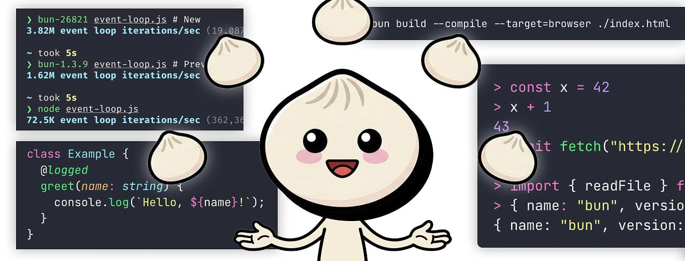
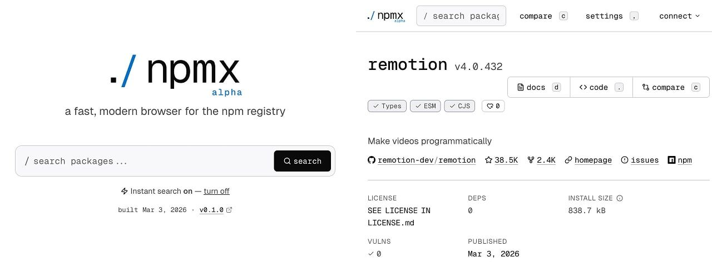

# External import maps, a big Bun release, and Node.js schedule changes

  
- [Bun v1.3.10 Released: A Surprisingly Big Update](https://javascriptweekly.com/link/181455/web "bun.com") — Bun’s REPL has been completely rewritten with many improvements (both practical and cosmetic), there's a `--compile --target=browser` option for building self-contained HTML files with all JS, CSS, and assets included (ideal for simple JS-powered single page apps), full support for TC39 stage 3 [ES decorators](https://javascriptweekly.com/link/181456/web), a faster event loop, barrel import optimization, and more. **_\--- Jarred Sumner_**
  
- [Still Writing Tests Manually? Meticulous AI Is Here](https://javascriptweekly.com/link/181403/web) — Notion, Dropbox, Wiz and LaunchDarkly now use a testing paradigm they can’t work without. Built by former Palantir engineers, Meticulous automatically creates an evolving suite of E2E UI tests, delivering exhaustive coverage with no developer effort. **_\--- Meticulous sponsor_**
  
- [External Import Maps, Today!](https://javascriptweekly.com/link/181457/web "lea.verou.me") — Several weeks ago Lea posted about [web dependencies being broken](https://javascriptweekly.com/link/181458/web), but now she has a solution. The core technique employed to emulate support for external import maps isn't obvious, despite being simple, but is already [offered by JSPM 4.0.](https://javascriptweekly.com/link/181459/web) **_\--- Lea Verou_**

**IN BRIEF:**

- [_The React Foundation_ has officially launched](https://javascriptweekly.com/link/181404/web) taking over ownership of React, React Native and JSX. It has a board of eight founding members (including Meta) with Seth Webster, former head of React at Meta, as exec director.
- It's not formal yet, but [this preview post reveals how Node.js's release schedule is changing](https://javascriptweekly.com/link/181405/web) later this year (one major release per year, every release to be LTS, with no more odd/even distinction).
- 📢 Monthly roundups have landed from [Svelte](https://javascriptweekly.com/link/181406/web), [ViteLand / VoidZero](https://javascriptweekly.com/link/181407/web), and [Astro.](https://javascriptweekly.com/link/181408/web)
- 🔒 The Angular team [explains two recently patched vulnerabilities in Angular.](https://javascriptweekly.com/link/181409/web)
- [The Navigation API is now Baseline Newly Available](https://javascriptweekly.com/link/181410/web) across all major browsers.

**RELEASES:**

- [Deno 2.7](https://javascriptweekly.com/link/181460/web) – The alternative runtime stabilizes Temporal API support, supports Windows on ARM, adds `package.json` `overrides` support, and more.
- [Expo SDK 55](https://javascriptweekly.com/link/181411/web) – The popular React Native framework/toolchain.
- [Shiki 4.0](https://javascriptweekly.com/link/181412/web) – TextMate grammar powered, VS Code-like syntax highlighter.
- [Angular 21.2](https://javascriptweekly.com/link/181413/web), [Mediabunny 1.35](https://javascriptweekly.com/link/181414/web), [Neo.mjs 12.0](https://javascriptweekly.com/link/181415/web)

## 📖  Articles and Videos

  
- [Making WebAssembly a First-Class Citizen on the Web](https://javascriptweekly.com/link/181416/web "hacks.mozilla.org") — WASM has come a long way but remains tricky to work with on the Web, with even performing a `console.log` requiring a lot of glue code. Ryan makes the case that the [WebAssembly Component Model](https://javascriptweekly.com/link/181480/web) could change this by letting modules bind directly to browser APIs, load directly from `script` tags, and more. **_\--- Ryan Hunt_**
  
- [We Deserve a Better Streams API for JavaScript](https://javascriptweekly.com/link/181479/web "blog.cloudflare.com") — _“I’m publishing this to start a conversation,”_ says James who shows off an alternative approach to Web streams that works around the current standard’s _“fundamental usability and performance issues.”_ The end results and James' extensive experience in this area make for a compelling argument. **_\--- James M Snell_**
  
- [`npx workos:` An AI Agent That Writes Auth Directly Into Your Codebase](https://javascriptweekly.com/link/181419/web "workos.com") — Reads your project, detects your framework, writes the integration, then typechecks and fixes its own build errors. **_\--- WorkOS sponsor_**
  
- [The Illusion of JavaScript-Powered 'DRM'](https://javascriptweekly.com/link/181423/web "www.therantydev.com") — An explanation of why building a DRM/copy protection system purely in JavaScript (rather than [EME](https://javascriptweekly.com/link/181424/web)\-based approaches) is ultimately just _“sophisticated friction”_, at best, and uses a tale of breaking a (NSFW) platform’s protection to make the point. **_\--- Ahmed Arat_**
  
- [How Cloudflare Rebuilt Next.js with AI in a Week](https://javascriptweekly.com/link/181420/web "blog.cloudflare.com") — [vinext](https://javascriptweekly.com/link/181421/web) is an experimental, Vite-based reimplementation of Next.js’s API surface, letting existing apps run in more environments, though with [some tradeoffs.](https://javascriptweekly.com/link/181422/web) **_\--- Steve Faulkner (Cloudflare)_**
  
- [Using Val Town to Get Me to the Movies](https://javascriptweekly.com/link/181417/web "www.raymondcamden.com") — [Val Town](https://javascriptweekly.com/link/181418/web) is a fantastic platform for quickly writing and deploying JavaScript-powered services. Like this one! **_\--- Raymond Camden_**
  

- 📄 [Sticky Grid Scroll: Building a Scroll-Driven Animated Grid](https://javascriptweekly.com/link/181428/web) – I’m not a huge fan of scroll-driven effects, but this one [does look neat.](https://javascriptweekly.com/link/181429/web) **_\--- Theo Plawinski_**
- 📄 [From `instanceof` to `Error.isError` for Safer Error Checking](https://javascriptweekly.com/link/181461/web) **_\--- Matt Smith_**
- 📄 [Proxying Fetch Requests in Server-Side JavaScript](https://javascriptweekly.com/link/181462/web) **_\--- Nicholas C. Zakas_**
- ▶️ [Why I Chose Electron Over Native (And I’d Do It Again)](https://javascriptweekly.com/link/181430/web) **_\--- Syntax Podcast_**
- 📄 [Using React Native to Create Meta Quest VR Apps](https://javascriptweekly.com/link/181425/web) **_\--- Chludziński, Jaworski, and Leyendecker_**

## 🛠 Code & Tools

  
- [txiki.js: A Small, Powerful JavaScript Runtime](https://javascriptweekly.com/link/181441/web "txikijs.org") — Stands on the shoulders of QuickJS-ng and libuv and aims to support the latest ECMAScript features while being [WinterTC](https://javascriptweekly.com/link/181478/web) compliant. [GitHub repo.](https://javascriptweekly.com/link/181442/web) **_\--- Saúl Ibarra Corretgé_**
  
- [numpy-ts: A NumPy Implementation for TypeScript](https://javascriptweekly.com/link/181431/web "numpyts.dev") — A recreation of [NumPy](https://javascriptweekly.com/link/181432/web), a fundamental piece of the Python scientific computing ecosystem, that works in the browser, Node, Bun, and Deno. 94% of NumPy’s API is covered so far and there’s [an online playground](https://javascriptweekly.com/link/181433/web) to give it a try. **_\--- Nicolas Dupont_**
  
- [Ship Real-Time Features Without Real-Time Complexity](https://javascriptweekly.com/link/181434/web "www.tigerdata.com") — TimescaleDB extends Postgres: hypertables, 95% compression, continuous aggregates. Run analytics on live data. [Try free](https://javascriptweekly.com/link/181434/web). **_\--- Tiger Data (creators of TimescaleDB) sponsor_**
  
- [Yoopta Editor 6.0: A Headless Rich Text Editor for React](https://javascriptweekly.com/link/181435/web "yoopta.dev") — MIT-licensed library for creating block-based, Notion-style rich text editing experiences. It’s headless at heart, but comes with a variety of UI components to get started fast. [The playground](https://javascriptweekly.com/link/181436/web) offers a live example. **_\--- Akhmed Ibragimov_**
  
- [AdonisJS v7 Released: 'Batteries-Included' Node.js Framework](https://javascriptweekly.com/link/181437/web "adonisjs.com") — A popular framework that includes auth, ORM, queues, testing, etc. With v7 comes [an all new web site](https://javascriptweekly.com/link/181438/web), OpenTelemetry integration, new starter kits to rapidly build new apps, and more. **_\--- Harminder Virk_**
  
- 🎨 [Color Thief 3.0: Grab Color Palettes from Images](https://javascriptweekly.com/link/181439/web "lokeshdhakar.com") — Given an image, this uses `canvas` to return a list of the dominant colors. Works in browsers or Node. Now with OKLCH support, Web Worker offloading, ‘live extraction’ for video, canvas and image elements, and more. [GitHub repo.](https://javascriptweekly.com/link/181440/web) **_\--- Lokesh Dhakar_**
  
- 📊 [ng2-charts: Chart.js-Based Charting Library for Angular](https://javascriptweekly.com/link/181443/web "valor-software.com") — Now with Angular 20 support. **_\--- Valor Labs_**
  
- [vue-superselect: A Headless Select/Combobox for Vue 3](https://javascriptweekly.com/link/181444/web "github.com") **_\--- Nemanja Malesija_**
- 📄 [React PDF 10.4](https://javascriptweekly.com/link/181445/web) – Display PDFs in React apps. [v10.4](https://javascriptweekly.com/link/181446/web) adds the ability to override colors used in rendering.
- 🕹️ [JSNES 2.0](https://javascriptweekly.com/link/181447/web) – JavaScript NES emulator for browsers and Node. ([Demo.](https://javascriptweekly.com/link/181448/web))
- [Milkdown 7.19](https://javascriptweekly.com/link/181449/web) – Plugin-driven WYSIWYG markdown editor framework.
- [Peggy 5.1](https://javascriptweekly.com/link/181450/web) – Simple parser generator.

## 📢  Elsewhere in the ecosystem

- 🎉 Three weeks ago we featured [npmx.dev](https://javascriptweekly.com/link/181464/web), a new, fast way to browse and search the official npm registry. Things have got more serious this week with [a full announcement post about the site's alpha release](https://javascriptweekly.com/link/181463/web), coupled with a [flurry](https://javascriptweekly.com/link/181465/web) of [enthusiastic](https://javascriptweekly.com/link/181466/web) [blog](https://javascriptweekly.com/link/181467/web) [posts](https://javascriptweekly.com/link/181468/web) from around [the community](https://javascriptweekly.com/link/181469/web) celebrating the project. I can't remember the last time a JavaScript project attracted so many blog posts at the same time.
- [Locutus](https://javascriptweekly.com/link/181451/web) is a curious project that offers TypeScript ports of standard libraries from fifteen other programming languages (e.g. PHP, Go, Python, Ruby).
- [The results of the _State of React Native 2025_ survey](https://javascriptweekly.com/link/181452/web) have been released by Software Mansion and Devographics.
- [Detailed notes for performing a TypeScript 5.x to 6.0 migration.](https://javascriptweekly.com/link/181453/web) The author suggests it might be handy to feed to an AI agent of your choice.
- [An interactive version](https://javascriptweekly.com/link/181470/web) of the [famous xkcd comic](https://javascriptweekly.com/link/181471/web) about single-person dependencies, courtesy of [p5.js.](https://javascriptweekly.com/link/181472/web)
- The [Drizzle ORM](https://javascriptweekly.com/link/181473/web) team has [joined PlanetScale.](https://javascriptweekly.com/link/181474/web)
- [A list of little, fun programming languages.](https://javascriptweekly.com/link/181454/web)
